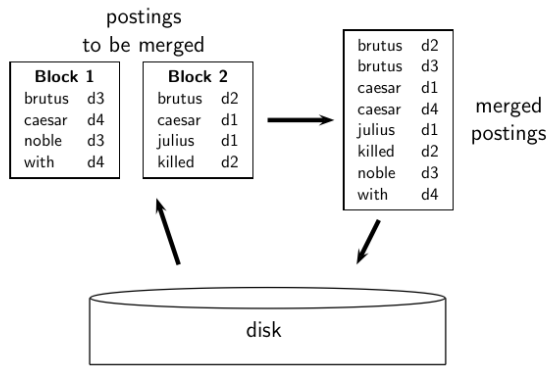

- mnoho designovych rozhodnutich ve vyhledavani informaci je zalozeno na HW omezenich

- zakladni poznatky o HW
    - pristup k datum je mnohem rychlejsi kdyz jsou ulozena v RAM nez kdyz jsou na disku (z duvodu rotace hlavy atd)
    - kdyz se nataci hlava disku => disk je IDLE
    - optimalnejsi presun dat mezi diskem a RAM => mene presunu po vetsich kusech (proto blokove zarizeni)
        - I/O operace se dela nad celymi bloky (8KB - 256KB)
    - tolerance chyby je draha -> je lepsi pouzit vice obycejnych stroju nez jedno fault tolerant machine

- RCV1 kolekce
    - kolekce shakespearovych her neni dostatecne velka co se tyce demonstrace
    - => Reuters RCV1 kolekce = anglicke zpravy (newswire) posilane kabelem

         

- cilem je sestavit invertovany index

     

- sort-based index construction
    - tak jak stavime index tak parsujeme dokumenty jeden za druhym
    - finalni posting list je nedokonceny dokud nezpracujeme vsechny dokumenty
    - muzeme si posting listy drzet v pameti a pak je seradit?
        - ne pro velke kolekce
        - pri 10-12 B pro kazdy zaznam v posting listu => potrebovali bychom hodne mista pro velke kolekce
        - muzeme pouzit jen pro male jednorazove kolekce
    - tim padem musime pomocne vysledky ulozit na disk!!
        - muzeme pouzit stejny algoritmus ale data budou na disku misto v RAM?
            - ne protoze razeni dat na disku je POMALE (mockrat se otaci hlava = disk seeks)
            - => potrebujeme externi algoritmus razeni

- externi algoritmus razeni (pouziti pouze par disk seeks)
    - musime seradit T = 100,000,000 non-positional posting listu
        - kazdy zaznam (polozka) ma 12B (4+4+4 : termID, docID, document frequency)
    - definujeme blok ktery bude obsahovat 10,000,000 takvovych posting listu
        - muzeme je ulozit do RAM (celkem v pohode)
    - zakladni myslenka algoritmu:
        - pro kazdy blok posting listu:
            - uchovame je v RAM a seradime je tam; pote je zapiseme na disk
            - pote je spojime (mergnem) do vetsiho (delsiho) celku serazenych posting listu

         

- Blocked Sort-Based Indexing (BSBI)
    
    

    - klicove rozhodnuti: Jaka je velikost jednoho bloku?
    - problemy tohoto pristupu
        - nas predpoklad: drzime si slovnik v pameti
        - potrebujeme slovnik ktery roste dynamicky (abychom mohli implementovat term to termID mapovani)
            - vlastne bychom mohli pracovat s `term, docID` posting listem misto `termID, docID` posting listem
            - ale pak by byly mezisoubory velmi velke (meli bychom skalovatelnou ale velice pomalou metodu konstrukce indexu)

- Single-pass in-memory indexing (SPIMI)
    - hlavni myslenka (1): vygenerovat oddelene slovniky pro kazdy blok (nemusime udrzovat term-termID mapovani pres vsechny bloky)
    - hlavni myslenka (2): Don't sort. Ukladame postingy v posting listech tak jak prichazeji
    - na zaklade techto dvou myslenek muzeme sestavit invertovany index pro kazdy blok
    - tyto oddelene indexe (podindexy) se pote mohou spojit do jednoho velkeho indexu

    

    - SPIMI komprese
        - komrese nam cely proces jeste vice zefektivni (viz dalsi prednaska)

- distribuovane indexovani
    - pro indexovani na urovni webu musime pouzit distribuovany pocitacovy cluster
    - jednotlive stroje se muzou nepredvidatelne zpomalit nebo selhat
    - Google data centra
        - distribuovane po celem svete
        - 1 milion serveru, 3 miliony procesoru/jader
        - Google instaluje 100,000 kazde ctvrtleti
        - PRIKLAD: mame 1000 uzlu (PCs), kazdy ma uptime 99.9%, jaky je uptime celeho systemu?
            - 0.99^1000 = 37%
        - predpokladejme ze server selze po 3 letech. Pri instalaci 1 milionu serveru jaky je casovy interval mezi poruchami?
            - mene nez 2 minuty
            - proc? jak? :(

    - udrzovani si mastra (centralni stroj) ktery rozdeluje (distribuje) praci
    - rozdelit proces inexovani do serie paralelich tasku
        - muzeme definovat 2 typy paralelnich tasku a tim padem mit dva typy stroju ktere je budou resit (slaves)
            - parsers
            - inverters
        - rozdelime vstupni kolekci dokumentu do `splits` ktere odpovidaji blokum v BSBI/SPIMI
            - kazdy split je podmnozina dokumentu
        - parsers
            - master priradi split nejakemu idle parseru (stroji)
            - parser precte dokument a produkuje dvojici `(term, docID)`
            - parser zapisuje dvojice do j term-partitions
                - kazdy pro radu prvnich pismen termu (napr a-f, g-p, q-z)
        - inverters
            - sbira vsechny `(term, docID)` (zaznamy v do posting listu) pro jednu term-partition napr pro a-f
            - serazuje a zapisuje je do odpovidajicich posting listu
        
        

- MapReduce
    - algoritmus konstrukce indexu ktery jsme zrovna popsali je priklad MapReduce
    - MapReduce = robustni a konceptualne jednoduchy framework pro distribuovane vypocty

    

- Priklady
    - Jake informace obsahuje popis tasku ktery master priradi parseru?
        - split (podmnozinu dokumentu pro zpracovani)
    - Jake informace reportuje parser zpatky mastru pote co ukol dokonci
        - asi jen info o tom ze dany task dokoncil?
        - dvojice (term, docID) se uklada do "segmentovych souboru" -> vstup pro invertory
    - Jake informace obsahuje popis tasku ktery master priradi invertru?
        - skupinu (napr a-g)
    - Jake informace reportuje inverter zpatky mastru pote co ukol dokonci
        - asi jen to ze naparsoval dalsi dokument (ze neni IDLE), ze porad ma co delat?

- dynamicke indexovani
    - doted jsem uvazovali pouze staticke kolekce
    - skoro vzdycky jsou kolekce dynamicke
        - soubory se modifikuje, mazou, pridavaji, ...
    - => slovnik a posting listy musi byt dynamicky modifikovany
    - jednoduchy pristup:
        - drzet si velky hlavni index na disku
        - nove dokumenty se ulozi do mensich pomocnych indexu v pameti (RAM)
        - vyhledavani napric obema, spojeni vysledku
        - periodicky: spojeni (merge) pomocneho indexu do vetsiho indexu
        - mazani:
            - invalidation bit-vector pro smazane dokumenty
            - filtrovani dokumentu
        - problemy
            - caste mergovani
            - maly vykon vyhledavani behem merovani indexu
                - vlastne mergovani pomocneho indexu do hlavniho by nebylo tak slozite, kdybychom pouzili oddeleny soubor pro kazdy posting list => potrebovali bychom hodne souboru => neefektivni
    - logaritmicke mergovani
        - vylepsuje (amortizuje) casovou slozitost mergovani indexu
            - uzivatel vidi zlepseni co se tyce response time
        - udrzovat serii indexu, kazdy je 2x tak velky jako ten predchozi
        - nejmenzi (`z0`) se bude drzet v pameti
        - vetsi (`l0`, `l1`, ...) budou na disku
        - pokud `z0` naroste co se tyce velikosti (`|z0| > n`) zapisem ho na disk jako `l0`
            - nebo ho mergnem s `l0` pokud `l0` uz existuje a zapiseme slouceni do `l1` atd.

        

- dynamicke indexovani ve velkem meritku
    - caste inkrementalni zmeny
    - rotace velkych casti indexu ktere se muzou prohazovat
    - obsasny celkovy rebuild (tezsi s rostouci velikosti)

- vytvareni positional indexu
    - v podstate se jedna o stejny problem akorat se jednao vetsi datovou strukturu (u kazdeho zaznamu si drzime jeste seznam pozic kde se dany term nachazi - v danem dokumentu)    
