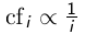
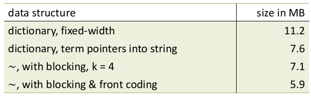

- proc komprese (obecne)?
    - zabrat mensi prostor na disku (saves money)
    - ulozit vic veci na disk
    - urychlit prenos dat mezi diskem a pameti
    - prepoklad: dekompresni algoritmy jsou rychle

- proc komprese (ve vyhledavani informaci)
    - misto pro slovnik
        - hlavni motivace (ucel) je udelat kompresi slovniku tak aby se vedel do hlavni pameti
    - misto pro soubor posting listy
        - chceme redukovat prostor potrebny pro ulozeni posting listu => redukce poctu cteni dat z disku

- ztratova vs bezztratova komprese
    - ztratova
        - dochazi ke ztrate informace
        - pouziti napr u obrazku (lidske oko si zmeny nevsimne)
        - nekolik algoritmu muze byt povazovano jako ztratova komprese
            - vynechani stop words, lowercasing, porter stemmer, atd.

    - bezztratova komprese
        - vsechna data (informace) jsou zachovana
        - tento typ komprese pouzivame pro slovnik

- jak velky je slovik termu?
    - = pocet ruznych slov ktere se ve slovniku nachazeji
    - muzeme predpokladat ze existuje horni hranice?
        - ne protoze existuje 10^37 ruznych slov delky 20
    - Heap's law: M = KT^b
        - empiricky vztah
        - M = velikost slovniku
        - T = pocet tokenu v kolekci dokumentu
        - 30 <= k <= 100
        - b je cca 0.5
        - linearni v log-log space (obe osy jsou zlogaritmovane)
            - nejjednodussi vztah mezi velikosti kolekce a velikosti slovniku

             
    
        - priklad:
            - Jaky je efekt zahrnuti chyb preklepu vs autokorekce na heap's law?
            - Spocitejde velikost slovniku M
                - mame kolekci webovych stranek, zjistili jsme ze v prvnich 10,000 tokenech je 3,000 ruznych termu a ze v prvnich 1,000,000 tokenech je 30,000 ruznych termu
                - predpokladejme search engine ktery indexuje 20,000,000,000 (2 x 10^10) stranek obsahujici v prumeru 200 tokenu
                - jaka je velikost slovniku zaindexovane kolekce? (podle Heap's law)
    - Zipf's law
        - chceme take vedet kolik frekventovanych a menefrekventovanych termu bychom meli ocekavat v kolekci
        - i-ty nejvic frekventovany term ma frekvenci proporcionalni k 1/i
        
             

        - cfi je frekvence v kolekci: pocet vyskytu termi ti v dane kolekci
        - priklad:
            - pokud nejvic frekventovany term 'the' ma pocet vyskytu cf1, potom druhy nejvice frekventovany term 'of' ma polovinu poctu vyskutu termu 'the'

                

                  
        
        

        - klicova informace:
            - malo frekventovanych slov, hodne neobvyklych slov
            - "In natural language, there are a few very frequent terms and very many very rare terms."

- komrese slovniku
    - slovnik je pomerne maly v porovnaki s posting listy
    - drzime ho v RAM
    - komrese je taktez dulezita

    - slovnik jako pole zaznamu fixni delky
        
        

        - term: 20B, doc frequency: 4B, pointer: 4B
        - co se tyce kolekce Reuters: (20+4+4)*400,000 = 11.2MB
        - spatny napad:
            - vetsina bytu ve sloupci term je nepouzita (kratka slova - pro slovo delky 1 alokujeme 20B)
            - nejsme schopni zaindexovat napr slova jako HYDROCHLOROFLUOROCARBONS nebo SUPERCALIFRAGILISTICEXPIALIDOCIOUS
            - prumerna dela termu (EN) je 8 znaku
            - jak pouzit v prumeru 8B pro jeden term?

    - slovnik jako string
    
        

        - 4B pro term frequency
        - 4B pro pointer na posting list
        - 3B pro pointer do stringu (slovniku)
        - velikost slovniku (stringu) odpovida v prumeru 8B na jeden term
        - => (4+4+3+8) x 400,000 = 7.6MB (puvodne 11.2 MB)

    - slovnik jako string s blocking

        

        - priklad velikost bloku k = 4
        - pouzivali jsme 4 x 3 = 12B pro pointer na string (slovnik) bez blokovani
        - usetrime 12 - (3 + 4) = 5B pro kazdy blok
        - celkova uspora: 400,000/ 4 * 5 = 0.5MB
            - tim padem ze 7.6MB nam slovnik zabere pouze 7.1MB

    - vyhledani termu bez blokovani

        

    - vyhledani termu s blokovanim (mirne pomalejsi)

        

    - Front coding

          

    - komrese slovniku (shrnuti)

           

- priklad:
    - jaky prefixy by meli byt pouzite pro front coding? Jake jsou potencionalni nedostatky (veci vzit k uvahu)
        - takove ktere se opakuji alespon 1?
    - vstup: seznam termu (slovnik)
    - vystup: seznam prefixu ktere se pouziji pro front codovani

- komprese posting listu
    - soubor s pousting listem je mnohem vetsi nez slovnik (alespon faktor 10)
    - cilem je ulozit kazdy posting list kompaktne (v nasem pripade jeden zaznam v posting listu = docID)
    - pro Reuters (800,000 dokumentu), 32b pro jeden zaznam
    - alernativne muzeme pouzit log2(800,000) -> 20b pro jedno docID
    - cilem je pouzit mene nez 20b
    - Gap encoding
        - hlavni myslenka: ulozit rozdily misto samotnych docID -> nemusime se vyporadavat s velkymi cisly
            - docID jsou ulozene vzestupne
            - napr: `COMPUTER: 283154, 283159, 283202`
            - s mezery: `COMPUTER: 283154, 5, 43`
            - => muzeme pouzit mene nez 20b

            
    
    - Variable length encoding
        - cil:
            - pro archaicne a jine ne tak caste termy musime pouzit cca 20b na mezeru
            - pro `the` a jine velmi caste termy pouzijeme pouze par bitu pro mezeru
        - abychom toto implementovali potrebujeme vymyslet nejakou formu kodovani delkou behu
        - Variable byte (VB) code
            - citlivy na zarovnani
            - nejvyssi bit = continuation bit c 
            - pokud se mezera G vejde na 7 bitu, binarne ji zakoduj do 7 bitu a nastav c = 1
            - jinak zakoduj spodnich 7 bitu a pouzij dalsi byte na zakodovani zbytku (vyssich) bitu s pouzitim stejneho algoritmu
            - pro posledni byte nastavime c=1 a pro zbytek c=0

            

            

            - jine promenne kody
                - misto bytu muzeme pouzit jine jednoty napr 32b, 16b, 4b, ...
                - napr pokud mame male mezery -> nibbles (4b) se hodi nejvic => neplytvaji mezery

        - Gamma kody pro kodovani mezer
            - nejlepsi znama metoda na kodovani mezer
            - nejdirv potrebujeme unarni kod abychom mohli zavest gamma code
            - unarni kod
                - reprezentuje cislo n jako n jedicen nasledovane jednou 0
                - 3 = 1110
                - 10 = 11111111110
            - gamma kod
                - reprezentuje mezeru G jako dvojice `length, offset`
                - offset = mezera binarne s odstrizenym prvnim bitem
                    - 13 = 1101 -> 101 = offset
                - length = delka offsetu
                    - pro cislo 13 je length 3 => zakodujeme v unarnim kodu jako 1110
                - gamma code cisla 13 je spojeni length a offset => 1110101
                - priklad: vypoctete gamma kod cisla 130
                    - offset = 0000010
                    - length = |offset| = 7 -> 11111110
                    - gamma(130) = 111111100000010
                - delka gamma kodu
                    - delka offsetu je floor(log2(G))
                    - delka length = floor(log2(G)) + 1
                    - => delka gamma kodu = 2 x floor(log2(G)) + 1
                    - gamma kody maji pokazde lichou delku
                - vlastnosti gamma kodu
                    - prefix-free: jeden neni prefixem zadneho jineho
                    - vysledek je nezacisly na distribuci mezer => univerzalni
                    - parameter-free
                - alignment
                    - stroje maji zarovnani slov 8, 16 nebo 32b
                    - komprese na bitove urovni muze byt pomala
                    - VB encoding je zarovnany a tim padem potencionalne vice efektivni
                    - VB je obecne jednodussi za cenu trochu vetsiho mista (poctu bitu)
                