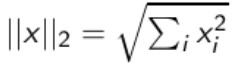

## IR 07 - RANKING

### Ranked retrieval
- Doteď boolean vracel čistě výsledky co vyhovovaly, nehodnotil jejich relevanci
  - dobré pro expert uses (jako např. ti prvníci)
  - nevýhodné pro běžné uživatele (neumí třeba napsat boolean query, chtějí jenom tři nejlepší výsledky)
  - Feast or Famine: boolean vrátí buď málo výsledků, nebo mnoho výsledků, je obtížné zadat query co vrátí rozumný počet výsledků
- Ranking retrieval řeší Feast or Famine problém
- Zavedeme určité hodnocení relevantnosti dokumentu vůči zadanému dotazu

#### Jaccard coefficient
- běžně užívaná technika pro překrytí dvou množin

- Jaccard nepočítá s term frequency
  - termy které se v dokumentu vyskytují méněkrát mají větší informační hodnotu
  - později použijeme spíše cosinoe podobnost než Jaccard coeficient

#### Term frequency
- do již známé incidenční matice se místi jedniček a nul zapíše počet výskytů slova v daném dokumentu

- takovýto model se nazývá \bf{bag of words} model
- nepočítá se zde s pořadím slov
- káva je lepší než čaj x čaj je lepší než káva
  - z pohledu bag of words jsu tyto dotazy stejné (reprezentovány stejně)

- term frequency tf(t,d) 
  - počet výskytů termu t v dokumentu d
- jak reprezentovat relevanci? (tf=10 nemusí nutně znamenat že je dokument 10x relevantnější než dokument s tf=1)
- místo pouhé term frequency se použije logaritmus:

- výsledná hodnota je pak součet nad termy jak v dotazu tak dokmentu

Jaccard pro první - 1/8 | tf matching score - 1
Jaccard pro druhý - 1/6 | tf matching score - 2.95
Jaccard pro třetí - 2/9 | tf matching score - 2

- nechceme uchovávat pouze počet výskytů termu v jednotlivých dokumentech, ale i počet výskytů napříč kolekcí
- vzácnější termy jsou více informativní než často se vyskytující termy
- pro termy které se v dokumentu vyskytují  a zároveň nejsou vzácné chceme pozitivní skóre, ale menší než pro termy které jsou vzácné a v dokumentu se také vyskytují
- používána document frequency - df
  - počet dokumentů v kolekci ve kterých se term objevuje

- kde N je celkový počet dokumentů v kolekci
- df je tedy inverzní hodnocení informativnosti termu a idf je pak už hodnocení informativnosti termu
- logaritmus zde má "tlumit" efekt idf
- idf ovlivňuje pouze dotazy s alespoň dvěmi termy
- například pro "biovaskulární onemocnění"
  - idf zvýhodní term biovaskulární a utlumí váhu termu onemocnění

- Tento příklad naznačuje, že idf je pro hodnocení lepší než cf

- takto vytvořená hodnota se přiřazuje každému termu t v každém dokumentu d

### Vektor Space Model

- Z původně binární incidenční matice si spočítáme tf a dále tfidf a vznikne nám tfidf incidenční matice mezi termy a dokumenty
- Každý dokument je teď reprezentován jako vektor reálných hodnot (čísel) tfidf vah
- Tím vzniká vysokodimenzionální prostor s dokumenty reprezentovanými těmito vektory
- Myšlenka pro vyhledávání následující:
  - stejný převod do vektoru provedeme i pro dotaz
  - následně pak ohodnotíme podobnost vektorů v prostoru - jejich vzdálenost (euklidovská vzdálenost)
    - špatný nápad, neboť Euklidovská vzdálenost je velká, pokud jsou vektory různé délky
    
  - budeme používat úhel, raději než vzdálenost
    - úvaha: pokud bychom přidali do kolekce dokument se stejným obsahem, pouze svakrát zkopírovaným, byla by Euklidovská vzdálenost velká, ale úhel nulový

  - dokumenty se pak ohodnotí:
    - vzeszupně podle úhlu mezi dokumentem a dotazem
    - sestupně podle cosine funkce úhlu mezi dokumentem a dotazem

- Postup výpočtu:
  - vektory nejprve normalizujeme, neboli vydělíme jednotlivé členy délkou vektoru
  - 
  - tím budou mít kratší dokumenty váhy stejného řádu jako delší dokumenty

- Pro normalizované vektory

#### Příklad

- v závislosti na konkrétním problému se dají používat různé modifikace hodnocení dokumentů
 ### Závěr
 - Ranking: důlěžité, neboť eliminuje nevýhody booleand retrieval (Feast or Famine)
 - Term frequency: počet výskytů daného termu v dokumentu
 - Tf-idf ranking: nejlepší známý tradiční ranking systém
 - Vektor space model - Jeden z nejdůležitějších formálních modelů pro information retrieval
