# IR 08 - scores

## Proč používat ranking?
- uživatel chce jen pár relevantních výsledků
- těžké vrátit rozumný počet výsledků pro boolean queries (i pro experta)

### Důležitost rankingu
- uživatel čte abstarkt pouze prvních pár výsledků
- uživatel klikne na ještě méně výsledků (první tři)
-  v 50% uživatel klikne na top výsledek
-  ve 30% uživatel klikne na top výsledek ikdyž není relevantní
-  ranking je důležitá disciplína

## Více o Cosine
- Euklidovská vzdálenost je špatná míra podobnosti (viz. dlouhé vs krátké dokumenty)
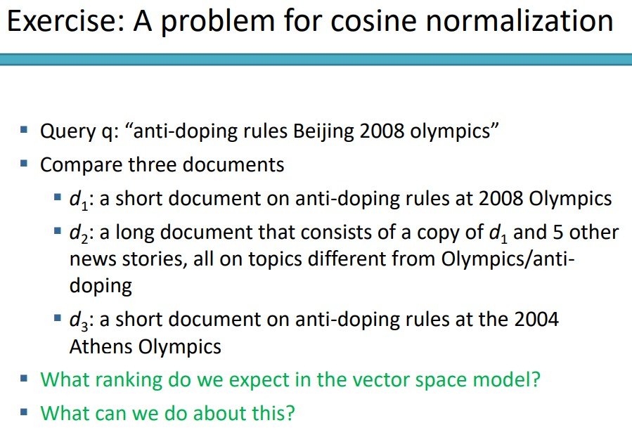

### Pivot normalizace
- Cosine normalizace
  - v průměru dává krátkým dokumentům příliš vysoké váhy a dlouhým dokumentům příliš malé váhy

- Lineárně upravíme cosine normalizaci zvoleným pivotem
- Dosáhneme utlumení přehanané bonifikace krátkch dokumentů
- Utlumí přehnanou penalizaci dlouhých dokumentů
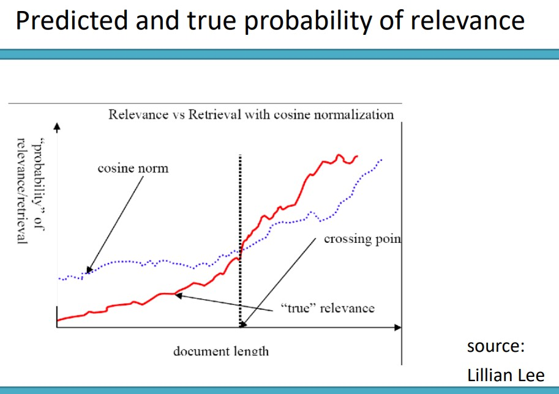

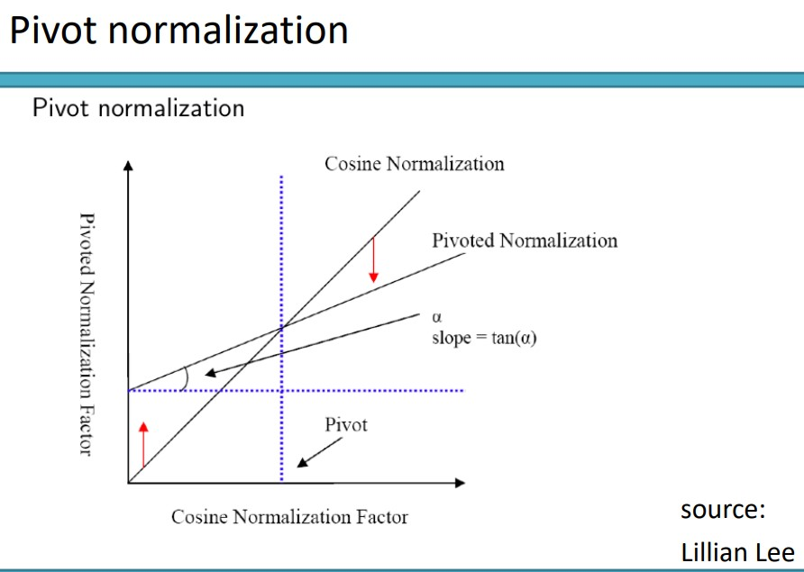
- Pivot je volen na základě nějakého předchozího trénování na jiné kolekci dokumentů a je následně použit pro všechny kolekce
- zničuje penalizaci dlouhých dokumentů a zvyšuje penalizaci krátkých dokumentů přes průsečík pivota a cosine normalizace

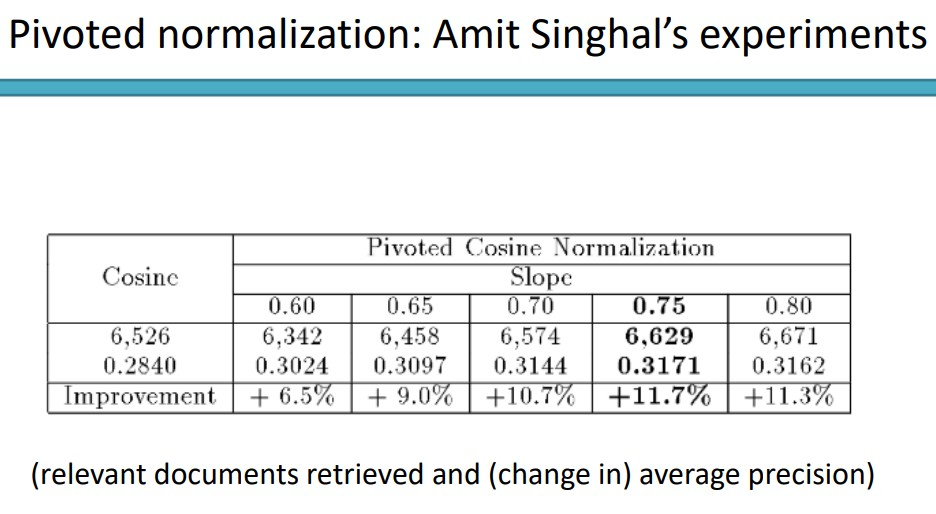

### Implementace rankingu
- V indexu potřebujeme krom document id i term frequency
- také potřebujeme pozici
- ukládáme integer frequency a ne logaritmicky ohodnocenou tf
  - reálná čísla se těžko komprimují
  - unární kód komprimuje term frekvence snadno
- celková potřeba paměti navíc je malá
  - méně než byte na každý postings bitwise kompresí
  - nebo byte při VBC (variable byte code)

- Ve většině případů nepotřebujeme kompletní ohodnocení kolekce
- stačí malá množina nejvíce relevantních
- Existuje způsob jak získat pouze top k dokumentů?
- Naivně:
  - ohodnotit kolekci, sort, vrátit top k
  - Co je na tom špatně? - asi výpočetní složitost
  - Alternativa?

- Použijeme binary min heap
- binátní min heap je binární strom kde hodnota každého uzlu je nižší než hosnota potomků
- Konstukce je O(Nlogk) operací, kde N je počet dokumentů
- získání top k výsledků v O(k log k) krocích

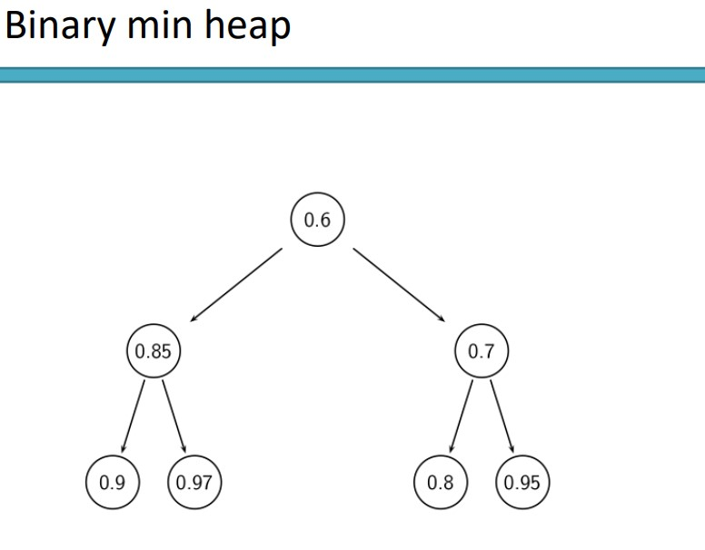

#### Získání top k výsledků
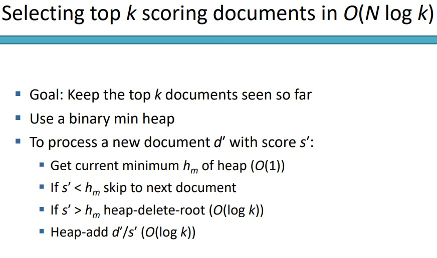
- držíme si top k
- když přijde nový ohodnocený dokument co má nižší ohodnocení než kořen
  - zahodíme ho
- když přijde nový ohodnocený dokument co má vyšší ohodnocení než kořen
  - smažem kořen a nahradíme novým dokumentem

- Ranking jako takový má komplexitu O(N) kde N je počet dokumentů
- optimalizace sníží tento konstantní faktor, ale složitsot zůstane stejná
- existuje lepší (sub lineární) řešení?
- Defakto hledáne k nejbližších sousedů k vektoru dotazu
  - vede na knn klasifikaci
- Není žádné všeobecné sub lineární řešení

#### Efektivnější top k - heuristiky
- Myšlenka 1: Přerovnat posting listy
  - nemít rozděleno podle docID, ale podle "předpokládané relevance"
- Myšlenka 2: Heuristika pro prořezávání search prostoru
  - není garantována správnost, ale mýlí se málokdy
  - v praxi blízko ke konstantní složitosti
  - Potřebujem znát koncept: document-ata-time zpracovávání a term-at-a-time zpracovávání

#### Non-docID ordering
- posing listy jsou srovnány podle docID
- alternativně by bylo žádoucí srovnávat podle "goodness" daného dokumentu (stránky)
- Např. PageRank (g(d))- kolik "dobrých" stránek má hyperlink k této stránce
- seřazení posting listu podle PageRank
- K PageRank se přidá ještě cosine similarity a vytvoří se net-score:
  - 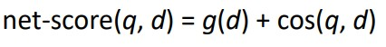
- Tento přístup umožňuje nezpracovávat celý posting list, ale pouze top k (supports early termination)
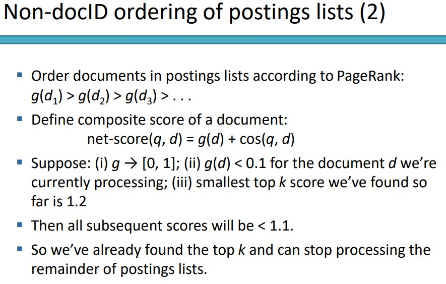

#### Document-at-a-time zpracovávání
- Jak doc-ID, tak PageRank řazení vynucují důsledné řazení (consistent ordering?) dokumentů v posting listech
- document-at-a-time: dokončíme celý výpočet query-doc podobnosti dokumentu d, než přejdeme k výpočtu pro d+1
- alternativa: term-at-a-time

#### Weight-sorted posting listy
- Myšlenka: Nechceme zpracovávat postingy, které přidávají pouze malou hodnotu do celkového skóre
- Seřadit dokumenty v posting listech podle vah
- Nejjednodušší: TfIdf - moc se nepoužívá (těžká komprese)
- Dokumenty v top k se pravděpodobněji objeví dříve v posting listech
- Early termination pravděpodobně nezmění top k výsledků
- Ale:
  - Nyní již nemáme důsledné/konzistentní (consistent ordering?) řazení v posting listech
  - Nelze použít document-at-a-time zpracovávání

#### Term-at-a-time zpracovávání
- Jednoduše:
  - kompletně zpracovat posting list prvního termu dotazu
  - vytvořit akumulátory pro každý docId na které sme narazili
  - kompletně zpracovat posting list druhého termu dotazu
  - atd.

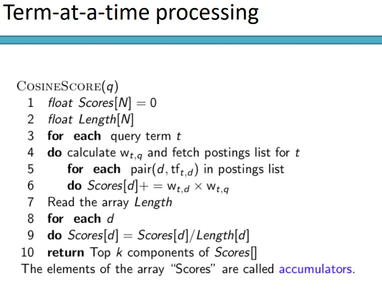
- Pro web není možné držet si array akumulátorů A (při 20 biliónehc dokuemntech)
- Tudíž budeme vytvářet pouze akumulátory pro dokumenty vyskytující se v posting listech
- Defakto vynecháme dokumenty, které neobsahují žádný term z dotazu (??)

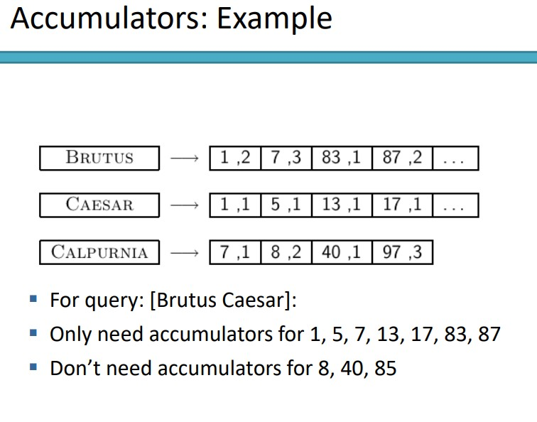

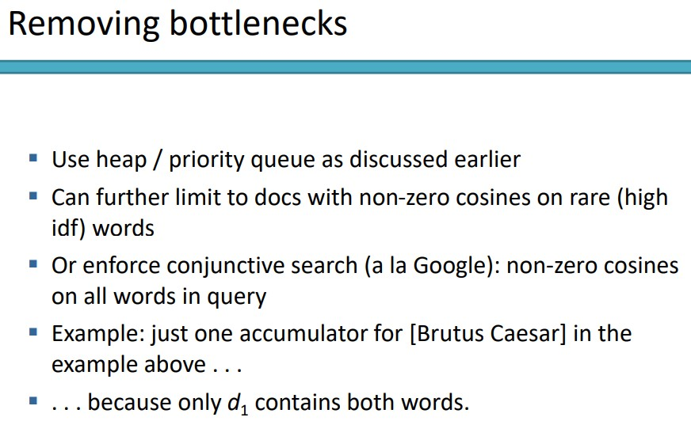

### Kompletní Search systém
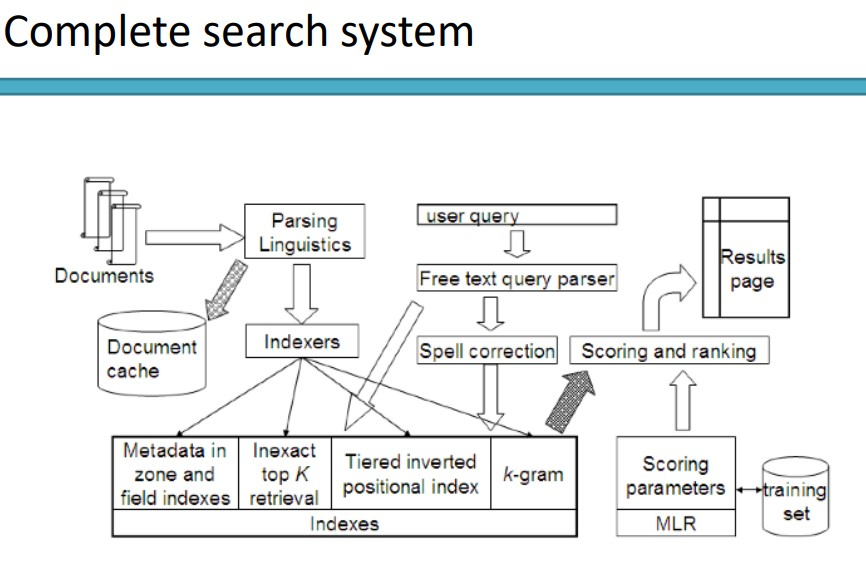
- Komponenty kompletního systému již probrány:
- Předzpracovávání dokumentů
- poziční indexy
- tier indexy
- opravování chyb
- k-gram indexy pro wildcard dotazy a opravování chyb
- zpracovávání dotazů
- ohodnocování dokumentů
- term-at-a-time zpracovávání

#### Tiered indexery
- Vytvořit více tierů indexerů podle důležitosti indexovaných termů
  - dotaz pak zadáme top tier indexeru a pokud vrátí požadovaných k dokumentů, nepropisuje se dotaz níže
  - pokud vrátí < k výsledků, předá se dotaz dalšímu indexeru v nižší vrstvě
- Např:
  - Tier1: Index názvů dokumentů
  - Tier2: Index abstraktů dokumentů
  - Tier3: Index obsahu dokumentů
- Výsledky které termy dotazu obsahují hned v názvu jsou lepší

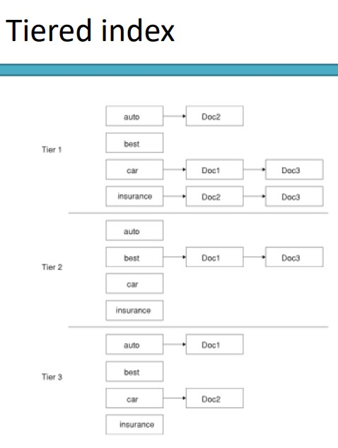
- Předpokládá se že užití tier indexů je důvod proč Google předběhl konkurenci
- Spolu s PageRankem, anchor texty a omezením blízkosti

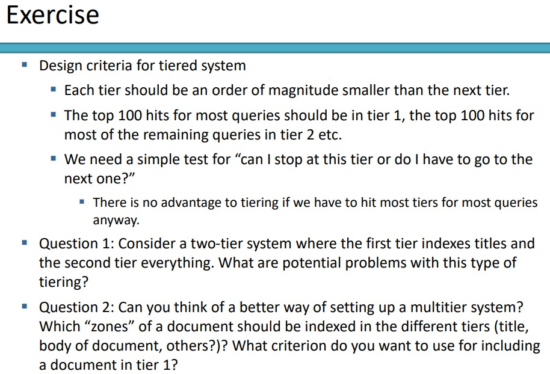

#### Neprobrané komponenty kompletního search systému
- Document cache: potřebujeme pro zobrazování úryvků
- Zone indexy: Rozděluje index do různých zón
  - tělo dokumentu
  - zvýrazněný text
  - anchor text
  - metadata
  - ...
- ML ranking
- Vzdálenostní ranking
- Parser dotazu

### Závěr
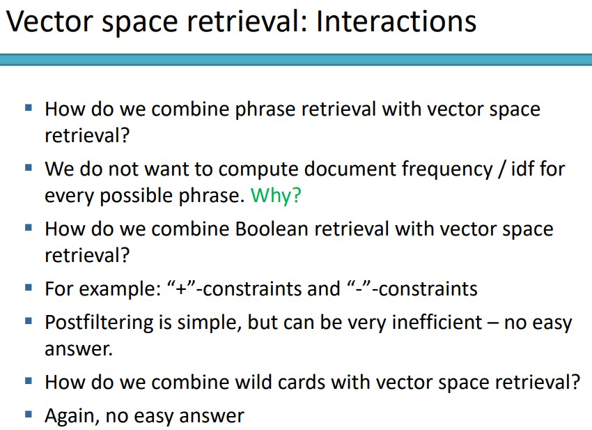
