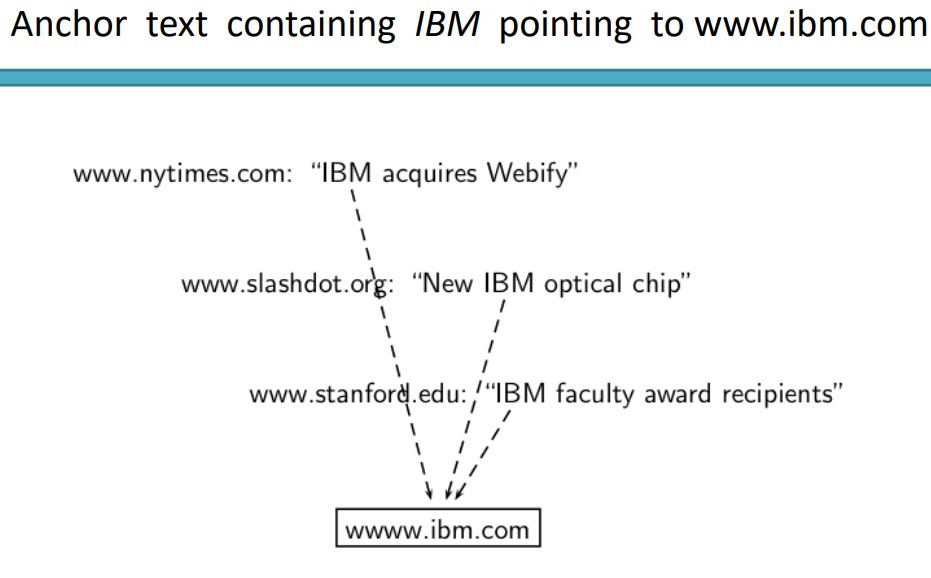
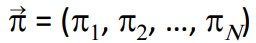

# IR 09 - LinkAnalysis

- Předpoklad1: hyperlink je ukazatelem kvality
  - hyperlink z d1 do d2 indikuje že autor d1 považuje dokument d2 za kvalitní

- Předpoklad2: Anchor text popisuje obsah dokumentu d2
  - příklad:
    - nejlepší kolotoče <a href="http...">zde</a>
    - anchor text: nejlepší kolotoče

- Hledat text dokuemntu + anchor text je často efektivnější než hledat pouze text dokumentu
- Například dotaz: IBM
  - najde ibm's copyright stránku
  - najde mnoho spam stránek
  - najde ibm wiki stránku
  - nemusí najít ibm home stránku, pokud je na home stránce hlavně grafika
- Z toho důvodu by pro IBM bylo lepší behledávání s přidaným anchor textem

- anchor text může tedy být lepším popisem dokumentu než obsah dokumentu
- anchor text může mít v indexu větší váhu (Za předpokladu že platí Předpoklad1 a 2)
- Předpoklad1: hyperlink je ukazatelem kvality
- Předpoklad2: Anchor text popisuje obsah dokumentu d2

- Google bomb:
  - dotaz se špatnými výsledky kvůli zlomyslně navrženým anchor textům
  - v lednu 2007 googlem vyřešen

## Citation analysis:
- analýza citací v vědecké literatuře
- např.: Franta (2002) ověřil chuť gambáče
  - Franta (2002): můžeme brát jako hyperlink k danému článku
- Využití:
  - Změření podobnosti dvou článků na základě obsahu článků které na ně odkazují
  - kocitační podobnost
  - na webu: "find pages like this" nebo "Podobné"

- Další využití:
  - citační frekvence může měřit dopad článku
    - nejjednodušší - každý článek dostance jeden hlas
  - na webu: inlink count
    - vysoký inlink count nemusí nutně znamena vysokou kvalitu
  - lepší: vážená citační frekvence a citační rank

- Vážená citační frekvence a citační rank:
  - defakto PageRank
  - citační analýza je důležitá (výplata profesorů se odvýjí od kvality jejich článků)

- shrnutí:
  - stejnou formální reprezentaci lze použít:
    - jak pro citace vědeckých článků
    - tak pro web
  - Správně vážené citační frekvence jsou skvělým ukazatelem kvality

## PageRank
- Mějme web surfer náhodně prochází web, je na náhodné stránce a na další se přesune náhodným výběrem hyperlinku
- ve stabilní pozici bude mít každá stránka long-term visit rate
  - že web surfer se na dané stránce nachází v daný čas
- long-term visit rate je PageRank stránky
- PageRank = long-term visit rate = pravděpodobnost stabilní pozice (steady state probability)
- Formalizace náhodného průchodu:
  - Markov chain:
    - Markov chain se skládá z N stavů a NxN matice pravděpodobností přechodu
    - stav = stránka webu
    - při každém kroku jsem na pouze jedné stránce
    - Pro 1 <= i a j >= N, prvek matice na [ij] udává pravděpodobnost že přejdeme v dalším kroku ze stránky i na stránku j
    - sum přes všechna i je pak 1

- 
- 
- 

### Long-term visit rate
- PageRank = long-term visit rate
- long-term visit rate = pravděpodobnost, že web surfer je na stránce v daný bod v čase
- dále: jaké vlastnosti musí mít web graf, aby byl long-term visit rate dobře definován
  - web graf musí korespondovat s ergodic markov chainem
    - ergodický signál je takový kterého charakteristiky lze stanovit z jedné jeho realizace (jednoho měření)
  - nesmí obsahovat dead ends
#### Dead ends

- web je plný slepých uliček
- náhodné průchody v nich snando skončí
- pokud existují slepé uličky, není long-term visit rate well defined, nedává smysl
- řešení:
- přemístění se ze slepých uliček:
  - ze slepé uličky web surfer skočí na náhodnou jinou stránku z pravděpodobností 1/N
  - z ne slepé uličky skočí web surfer na jinou random stránku s pravděpodobností 0.1/N
    - pokud bychom například měli stránku se 4-mi odkazy, pravděpodobnost že web surfer skočí na jednu z nich je 22,5%
    - (1 - 0.1)/4 = 0.225
  - 10% je zde teleportation rate
  - skok ze slepých uliček je na teleportation rate nezávyslí
- výsledek:
  - nelze uvýznout ve slepé uličce
  - i bez slepých uliček, graf nemusí mít well-defined long-term visit rate
  - obecněji: potřebujeme aby byl markov chain ergodický

### Ergodic Markov Chain
- markov chain je ergodický, pokud je neredukovatelný a aperiodický
- neredukovatelný: je zde cesta z každé jiné stránky
- aperiodický: stránky nelze rozdělit tak, aby random walker mohl navštívit oddíly postupně
- 

- Teorém: Pro každý ergodický markov chain existuje unikátní long-term visit rate pro každý stav
- to je steady-state probability distribution
- přes dlouhé časové období navštívíme každý stav v poměru k této míře
- nezáleží na tom kde začínáme
- teleportování udělá web graf ergodický
  - web graf + teleporting má steady-state probability distribution
  - každá stránka v ve web grafu + teleporting má PageRank

### Formalizace pojmu "visit"
- pravděpodobnost (řádkového) vektoru x = (x1, ..., xn) nám říká kde se náhodný průchod nachází v jakémkoliv bodu
- obecněji: náhodný průchod (random walk) je na stránce i s pravděpodobností xi

- pokud je pravděpodobnostní vektor x = (x1, ...., xn) v tomto kroku, jaký je další krok
- řádek i přechodové pravděpodobnostní matice P říká kam jít ze stavu i
- Tudíž z x, je další stav distribuován(distributed) jako xP.
- Steady state ve vektorové notaci je jednoduše vektor 
  - 
    pravděpodobností
- pí je pak long-term visit rate (PageRank) stránky i
- PageRank je tedy defakto hodně dlouhý vektor s jedním záznamem pro každou stránku
- 
- 
- Jak vypočteme steady state vector?
  - jak vypočteme PageRank
  - Vzpoenout si na PageRank vektor a postup z jednoho stavu na další
  - PageRank vektor je steafdy state!
  - Tudíž:
    - 
  - tato maticová rovnice nám dá pí.
  - PageRank vektor je levý vlastní vektor pro P
    - PageRank je levý vlastní vektor s největším vlastním číslem
  - Všechny transition probability matice mají největší vlastní číslo 1.

- Jedna metoda pro výpočet PageRank vektoru:
  - začneme s jakýmkolic rozdělením vektoru x, například rovnoměrné rozdělení
  - po prvním kroku jsme na xP
  - po druhém na xP^2
  - po k korích jsme na xP^k
  - algoritmus:
    - násob vektor x mocninami matice P dokud nedojde ke konvergenci
    - to se nazývá power metoda
    - nezáleží kde začnem, nakonec se dostanem do steady state PageRank vektoru.

- steady state distribution (=PageRanks) je zde 0.25 pro d1 a 0.75 pro d2
- Další příklad:

### PageRank shrnutí:
- Preprocessing:
  - dán graf linků - postavit matici P
  - aplikovat teleporting
  - z modifikované matice vypočítat PageRank vektor:
    - 
  - PageRank stránky i je:
    - 

### PageRank problémy:
- Reální uživatelé se nechovají jako random surfer (zpětná tlačítka, bookmarky, slovníky a vyhledávání)
- Markov model není dobrý pro reálné surfování na internetu
- Je ale dost dobrý pro naše účely
- Simple PageRank hodnocení produkuje špatné výsledky pro mnoho stránek
  - například query: video service
  - Yahoo home stránka má vysoký PageRank a obsahuje jak video, tak service
  - Pokud bychom všechny Boolean výsledky hodnotili podle PageRank hodnocení, vrátila by se domovská stránka Yahoo jako nejlepší
- V praxi se celkový výsledek skládá z více faktorů
  - raw text match, anchor text match, PageRank a další faktory
### PageRank důležitost:
- častý omyl: PageRank je nejdůležitější komponenta ve webovém vyhledávání
- Realita:
  - je hodně komponent co jsou přinejmenším stejně důležité:
    - anchor text, fráze, tiered indexy atd.
  - někteří tvrdí že originální verze page ranku je obsolentní

## HITS: Hubs and Authorities

- Předpoklad: Na webu jsou dva základní tipy relevancí:
  - Hubs: hub stránka je dobrý list odkazů na stránky s hledanou informací
    - např. pepovo tier list se stránkama o gambáči
  - Authorities: přímá odpověď na hledanou informaci
    - např. oficiální stránka gambáče
    - logicky v hub stránkách bude hodně odkazů na authorities stránky

- Většina způsobů vyhledávání s těmito tipy relevancí nepočítá 
- Z definice vyplývá, že:
  - dobrá hub stránka odkazuje na mnoho authority stránek s daným tématem
  - dobrá authority stránka je odkazována v mnoho hub stránkách

- Jak vypočítat hub a authority skóre?
  - nejprve provézt normální web search
  - tím získáme root set
  - najít všechny stránky které odkazují nebo jsou odkazováný z našeho root setu
  - tím získáme base set
  - Samotný výpočet

### Výpočet
- pro každou stránku v base setu vypočítat hub skóre h(d) a authority skóre a(d)
- počáteční hodnoty: h(d) =1 , a(d) = 1
- dále iterativně přepočítávat skóre
- při konvergenci
  - vrátit top k hubů a authorit
  - vrátíme defakto dva ranked listy

- po každé iteraci lze také výsledky škálovat aby nebyly příliš velké, ale velký efekt to na výsledek nemá
- zajímá nás relativní hodnota spíše než absolutní

### HITS poznámky
- HITS může vrátit dobré stránky nehledě na obsah
- jakmile sestavíme base set jde již jen o link analysis
- stránky v base setu dost často neobsahují žádné termy z dotazu
- teoreticky může vrátit i stránky jiného jazyka
- topic drift: stránky v base setu se mohou týkat jiného tématu než požadováno
- Důkaz konvergence:
- 
- Zápis update podmínek jako maticové operace:
- 
- HITS jako problém vlastních vektorů:
- 
## Příklad technik

- Stránky s nejvíc hranami do stránky: d2, d3, d6
- Stránky s nejvíc hranama ven: d2, d6
- Stránky s největším PageRank: d6
- Stránky s největším hub skóre: d6, d2
- Stránky s největším authority skóre: d3

## HITS vs PageRank
- Pagerank jde předpočítat, HITS se počítá až po získání výsledků vzhledem k dotazu
- PageRank a HITS jsou dva rozdílné designy:
  - podle eigenproblem formalizace
  - podle setu stránek na které formalizaci použít
- Jsou ortogonální
  - mohli bchom vzít HITS pro celý web a nad ním pak PageRank
- Tvrzení: Na webu, dobrý hub je skoro vždy zároveň dobrým authority
- rozdíl mezi HITS a PageRank je tedy ve výsledku nepříliš markantní
