- mereni search enginu
    - jak rychle indexuje (pocet bytu za hodinu)
    - jak rychle vyhledava (zpozdeni jako funkce dotazu za sekundu)
    - cena dotazovani (v dolarech)
    - vsechny kriteria jsou meritelna (penize, cas i velikost muzeme kvantifikovat)
    - hlavni meritko: TO ZE JE UZIVATEL SPOKOJENY
        - co to je ze je uzivatel stastny?
        - zahrnute faktory: rychlost odezvy, prehledne UI, RELEVANCE!!

- kdo je uzivatel?
    - uzivatel najde to co hleda -> muzeme merit pomer vraceni se toho sameho uzivatele na nasi stranku (search engine)
    - advertiser: muzeme merit pocet kliknuti na reklami
    - buyer: muzeme merit cas za jak dlouho koupi item (rychle => nas search engine vyhledal pravdepodobne dobre vysledky)
    - seller: muzeme merit profit za jeden item

- nejbeznejsi definice toho ze je uzivatel spokojen: relevance
    - jak ji zmerime?
    - standardni metodyka obsahuje
        - benchmark document collection
        - benchmark suite of queries 
        - assessment of the relevance of each query-document pair
    
- relevance: dotaz vs zadane (chtene) informace
    - zadana informace: "I am looking for information on whether drinking red wine is more effective at reducing your risk of heart attacks than white wine"
    - dotaz: [red wine white wine heart attack]
    - dokument: "At heart of his speech was an attack on the wine industry lobby for downplaying the role of red and white wine in drunk driving"
        - vyborna shoda pro dany dotaz
        - neni relevantni vzhledem k tomu co uzivatel hleda
    - => spokojenost uzivatele se muze merit pouze na zaklade relevance k hledane informaci a ne na zaklade relevance k dotazu

- Precision and recall
    - precision P = pomer nalezlych dokumentu ktere jsou relevantni

        

    - recall R = pomer relevantnich dokumentu ktere jsou nalezeny

        

    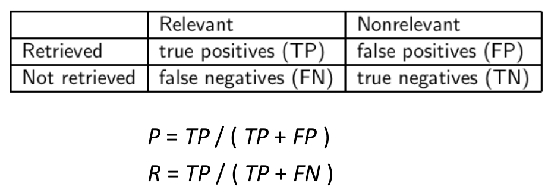

    - recall se da zlepsit tim ze vratime vic dokumentu
    - recall je neklesajici funkce poctu dokumentu ktere byly nalazeny
    - system ktery vrati vsechno dokumenty ma recall R = 100%
    - opak je take pravda -> je jednoduche zistkat velkou presnost pri malem recallu

        

- kombinovane mereni F:
    - umoznuje nam "vyvazit" precision a recall (v uvahu bere obe dve)
    
        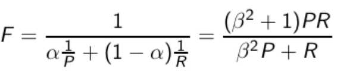
    
    - alfa ϵ [0, 1] => beta^2 ϵ [0,∞]
    - nejcasteji se pouziva alfa = 0.5 (nebo beta = 1)

        

        - hodnty beta < 1?

    priklad:
        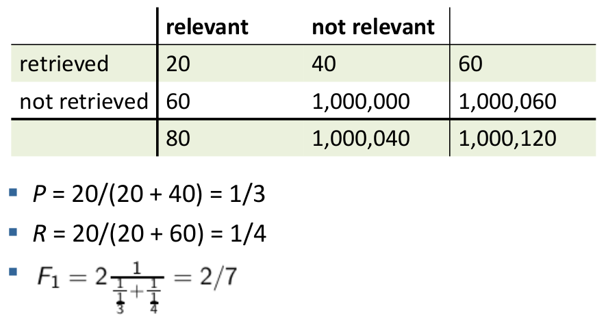

- Accuracy
    - proc pouzivat komplexni metriky jako precision, recall a F?
    - = pomer relavntnich a nerelevantnich dokumentu ktere jsou spravne
    - v pripade kontingencni tabulky to pote vypada takto

    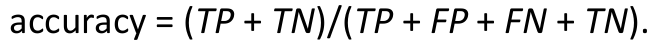

    - proc neni accuracy uzitecna pro mereni weboveho vyhledavani informaci?

    - priklad:

        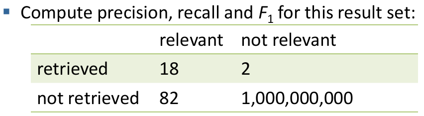

        - Acc = 0.9999999160000086
            - hodne nerelevantnich dokumentu ktery vysledek nevraci nam prevazi celkovou Acc
        - => jednoduchy trik na maximalizovani Acc je rict "ne" a vrati 0 dokumentu
        - webove search enginy chteji pokazde neco vratit (tolerance i pro "blbosti" - dokumenty co tam nepatri)
            - je lepsi vrati nejake spatne dokumenty nez vubec nic
        - ZAVER - pro evaulaci pouizivame precision, recall a F (NE ACCURACY)

- F: proc pouzivame harmonicky prumer?
    - proc nepouzijeme jiny prumer pri pouziti P (precision) a R (recall)?
    - aritmeticky prumez je 50% pro search engine ktery vraci vsechny -> coz je prilis hodne
    - chceme potrestat spatny vykon na obe strany (precision i recall)

- problemy pri pouziti precision, recall a F
    - potrebujeme nekoho kdo nam posoudi jake dokumenty jsou relevantni a ktere ne

- precision/recall/F jsou metriky pro unranked (neohodnocene) mnoziny dokumentu    
    - muzeme jednoduse preklop tyto metriky na metriky mereni ohodnocenych dokumentu
    - pouze tyto metriky spocitame pro top 1, top 2, top 3, top 4 atd vysledku
    - tento postup nam da tzv precision-recall krivku

        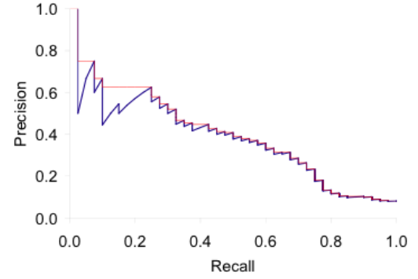

        - kazdy bod odpovida vysledku pro top k ohodnocenych (ranked) hitu (k = 1, 2, 3, 4, ...)
        - cervene je zvyraznena interpolace (maximum vsech bodu)
            - proc interpolace? => uzivatele zaujme to kdy obe (precison a recall) jsou lepsi

        - Averaged 11-point precision/recall graph

            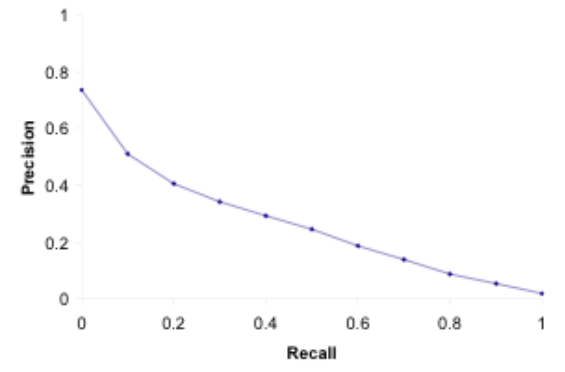

        - ROC krivka
            - podobny jako precision-recall graf
            - zajima nas pouze nejmensi oblast v levem dolnim rohu
                - precision-recall graf "blows up"v teto oblasti

            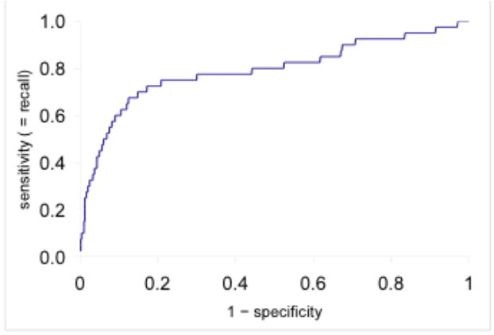

        - variance stejneho systemu pres vsechny dotazy je mnohem vetsi nez variance ruznych systemu pres jeden a ten samy dotaz

- co potrebujeme pro banchmark?
    - kolekci dokumentu (musi reprezentovat to jako dokumenty ve skutecnosti ocekavame)
    - kolekci chtenych informaci
        - obvykle jim SPATNE rikame dotazy (ale nejsou to dotazy)
    - posouzeni relevance clovekem
        - drahe a casove narozcne, casto vyzaduje odborniky

    - standardne se pouziva napr
        - Cranfield (1398 abstraktu clanku o aerodynamice)
        - TREC (Text Retrieval Conference) - mnozina ruznych sad dokumentu pro banchmark
        - dalsi: GOV2, NTCIR, CLEF

    - validita relevance zavisi na konzistentnosti
        - jak zmerime konzistentnost odpovedi napric nazory vsech judges? -> kappa metrika

- kappa metrika
    - = metrika toho jak moc judges souhlasi nebo nesouhlasi
        - napriklad nad tim jestli dany dokument je relevantni nebo ne
    - P(A) = proporce toho kolikrat judges souhlasi
        - "proportion of time judges agree"
    - P(E) = jaka shodnuti by mohlo nastat nahodou
        - "what agreement would we get by chance"

        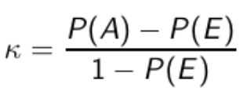

    - k =? for (i) chance agreement (ii) total agreement 
        - hodnoty k v intervalu <2/3; 1.0> jsou povazovany za akceptovatelne
        - pri mensich hodnotach je nutne posouzeni zopakovat (treba s jinou metodikou)

    - priklad

        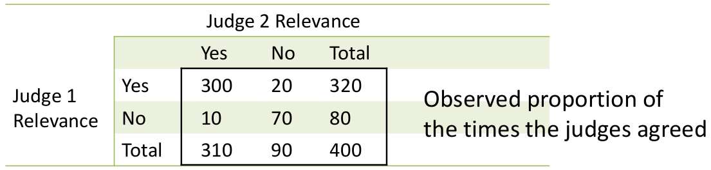

        ```
        - P(A) = (300+70)/400 = 0.925
        - P(nerelevantni) = (80+90)/(400+400) = 0.2125
        - P(relevantni) = (320+310)/(400+400) = 0.7878
        - pravdepodobnost toho ze se judges shodli nahodou P(E) = P(nerelevantni)^2 + P(relevantni)^2 =  0.2125^2 + 0.7878^2 = 0.665
        - kappa statistika = k = (P(A) - P(E)) / (1 - P(E)) = (0.925 - 0.665) / (1 - 0.665) = 0.776 (akceptovatelne)
        ```

    - pri hodnoceni velkych search enginu se mohou pouzivat i jine metriky
        - kliknuti na 1. odkaz
        - A/b testovani
            - ucel: odestovat jednu inovaci
            - predpoklad: mame velky operujici search engine
            - zajistit aby vetsina uzivatelu pouzivala stary system
            - odvratit cca 1% trafficu na novy system (ktery obsahuje onu inovaci)
            - pouzijeme automaticke mereni (jako napr # kliknuti na 1. odkaz)
                - hned uvidime jestli inovace vylepsila spokojenost uzivatele
        - MAP (Mean average precision)
        - DCG (Discounted cumulative gain)

- kritika ciste relevance
    - definovali jsme relevanci pro izolovany par dotaz-dokument
    - alternaticni definice: marginalni relevance
        - marginalni relevance dokumentu na pozici k v seznamu vysledku je pridavna informace kterou dokument prispiva k informacim ktere poskytuji dokumenty zarzene pred nim (pozice < k)
    - priklad

        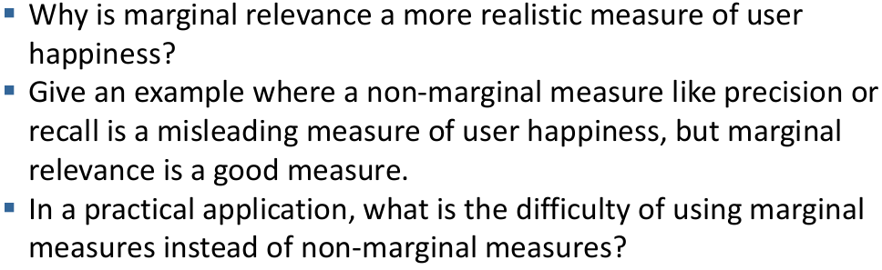

- jak budeme prezentovat vysledky uzivateli?
    - nejcasteji jako list (odkazy)
    - jak by mel byt kazdy dokument popsan?
    - popis je kriticky!!
        - pomaha uzivateli identifikovat dobre/spatne vysledky (na zaklade popisu)
        - nejcasteji: titul, url, metadata a summary
        - jak vypocitame (zjistime) summary daneho dokumentu?
    - neni treba sekvence klikat a otvirat jednotlive dokumenty

- shurnuti (summaries)
    - dva typy
        - stacke = porad stejne nehlede na to jaky dotaz uzivatel napsal
            - typicky podmnozina daneho dokumentu
            - jednoducha hauristika: prvni 50 slov
            - vice sofistikovanejsi metoda: extrahovat z daneho dokumentu klicove vety (ML, NLP, ...)
        - dynamicke = zavisle na dotazu (ovlivnene dotazem) -> snazi se popsat to proc byl dany dokument vyhledan
            - jedno nebo vice "oken" nebo snippetu ktere obsahuje termy daneho dotazu vyskytujici se v danem dokumentu
            - preferuje snippety ktere se termy dotazy objevuji jako fraze
            - kde je tyhle snippety vezmem?
                - nemozne zjistit z positional invertovaneho indexu (alespon ne efektivni)
                - musime si cachovat dokumenty (bacha na velke dokumenty)