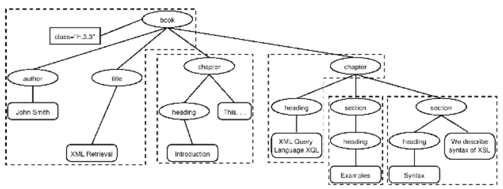

- IR relacni databaze 
    - obecne jsou systemu vyhledavani informaci opakem relacnich databazi
        - RDB dotazy jsou nad relacnimi daty
    - tradicke se vyhladavaji informace v nestrukturovanem textu

- zakladni nastaveni: dotazy jsou strukturovane nebo nestrukturovani (stejne tak jsou i dokumenty)
- aplikace strukturalniho vyhledavani
    - digitalni knihovna
        - "vrat mi vsechny clanky ktere se tykaji rychle furierovi transformace"
    - databaze patentu
        - "vrat mi vsechny patenty ktere zminuji RSA public key encryption a ktere cituji US patent 4,405,829"
    - otagovany text s nazvy
        - "vrat mi clanky ohledne pamatek (zajimavych mist) o Vatikanu a Koloselu"

- pro v tomto pripade neni RDB vhodna?
    - kdyby clanky nebyly ohodnocene (ranked) -> pravdepodobne bychom dostali hrozne moc vysledky ktere zminuji Vatikan, Koloselum a pamatky (zajimava mista); chybi relevance
    - tezsi pro uzivatele vytvorit strukturalni dotaz (nevi ktere strukturalni elementy system poskytuje)
    - uzivatele si nemusi byt vedomi ze neco jako strukturalni vyhledavani existuje
    - reseni: adaptovate ranked retrieval do strukturovanych dokumentu
        - strukturovane IR -> XML IR
        - take se da aplikovat na HTML, JSON, atd.

- XML dokument
    - serazeny strom labelu
    - kazdy uzel stromu = XML element s oteviracim a uzaviracim XML tagem (napr `<title></title>`)
    - element muze mit jeden nebo vice XML atributu (napriklad cislo)
    - atributy mohou mit hodnoty
    - elementy mohou mit potomky

    

    

    - XML Documents Object Model (XML DOM): standard pro pristup a zpracovani XML dokumentu
        - DOM reprezentuje elementy, atributy a text vramci elementu jako uzly stromu
        - zpracovani XML dokumenu -> postup od korene stromu az k listum
    - XPATH: standard pro popis cesty v XML stromu (dokumentu)
    - Schema: definuje omezeni XML dokumentu (jak vypada)

- prvni problem
    - uzivatele cheji vratit castu dokumentu (napr XML elementy) a ne cele dokumenty jako je tomu u nestrukturovanych IR
        - napr pokud se dotazujeme na Shakespearovou hru, chceme vratit scenu? akt? nebo celou hru?
    - reseni: structured document retrieval principle

- Structured document retrieval principle
    - system by mel pokazde vrati nejvic specifickou cast dokumentu ktery odpovida na dany dotaz
    - motivuje vyhledavaci strategii, ktera vraci nejmensi jednotku ktera obsahuje hledanou informaci (pod tuto uroven uz dal nejde)
    - tezke implementovat algoritmicky (tezke rozhodnout jaky level ve strome uspokojuje dany dotaz)

- druhy problem
    - co je indexovatelna jednotka?
        - v nestrukturovanem vyhledavani je to "jasne" -> soubor, email, clanek, ...
        - ve strukturovanem vyhledavani existuji 4 ruzne pristupy
            - 1) neprekryvajici se pseudodokumenty
            - 2) top down
            - 3) bottom up
            - 4) all

    - XML indexovani (pristup 1)
        - seskupit uzle do neprekryvajicich se psesudo dokumentu
        - indexovatelnej ednotky
            - books, chapters, section - ale nesmi se prekryvat
            - nevyhoda: pseudodokumenty nemusi davat penize

        

    - XML indexovani (pristup 2)
        - top down (dvoufazovy proces)
            - zacist s jednim z poslednich bloku jako indexoci jednotkou (napr element kniha v kolekci knih)
            - pote nasldne vysledky vyhledavani zpracujeme tak abychom pro kazdou knihu nasli dilci prvek ktery ji nejvic vystihuje
        - tento proces case selze co se tyce vraceni nejlepsi shody
            - relevance cele knihy neni dobry predikator relevance nejmensi subelementu ktery se v ni nachazi

    - XML indexovani (pristup 3)
        - bottom up
        - misto vyhledavani velkych celku a identifikovani subelementu (top down pristup) muzeme prohledav sechny listy, vybrat nejrelevantnejsi a pote je rozsirit do vetsich jednotek (postprocessing)
        - stejny problem jako pri top down pristupu (relevance listu neni dobry predikator relevance elementu ve kterych se list nachazi)

    - XML indexovani (pristup 4)
        - zaindexovat vsechny elementy
        - nejmene restriktivni pristup
        - taktez problematicky:
            - vetsina XML elementu neni moc vyznamova jako vysledek vyhledavani (napr ISBN cislo)
            - => vysledky vyhledavani budou velice redundantni

- treti problem
    - zanorene elementy
    - vhledem k redundanci zpusobene zanorenim elementu je nutne omezit mnozinu prvku ktere lze vyhledavat
        - zahod vsechny male elementy
        - zahod vsechny elementy na ktere uzivatel nebude koukat (logy, ...)
        - zahod vsechny prvky ktere nejsou pouzity pro vyhodnoceni relevance
        - zachovej pouze prvky ktere byly designerem systemu vyhodnocene uzitecne pro vysledky vyhledavani
    - dalsi problem spojeny se zanorenim
        - muzeme potrebovat rozlisit ruzne kontexty terminu kdyz pocitame statistiku pro jeho ohodnoceni (konkretne IDF)

- vector space model pro XML IR
    - hlavni myslenka: lexikalizovane podstromy
    - cilem je aby kazda dimenze vektoroveho prostoru kodovalo slovo spolu s jeho pozicemi v XML strome

    

    - 1) vezmem kazdy list XML stromu a rozdelime ho do vice uzlu (jeden pro kazde slovo)
        - napr Bill Gates rozdelime na Bill a Gates
    - 2) definujeme dimenze vektoroveho prostoru jako lexikalizovane podstromy dokumentu - podstromy, ktere obsahuji alespon jedno slovo (vocabulary term)

    - nyni muzeme reprezentovat dotazy a dokumenty jako vektory v tomto vektorovem prostoru lexikalizovanych podstromu a spocitat shody mezi mimi

    - v nestrukturovanem vyhledaveni predstavuji dimenze vektoroveho prostoru termy
    - ve strukturovanem vyhledavani predstavuji dimeznce vektoroveho prostoru lexikalizovane podstromy 

- strukturovany term
    - existuje kompromis mezi dimenzionalitou prostoru a presnosti vysledku daneho dotazu
        - dimezne = termy => vrati se hodne vysledku ktere neodpovidaji stukture dotaazu
        - dimezne = lexikalizovane podstromy => vektorovy prostor je velmi velky
    - kompromis: "index all paths that end in a single vocabulary term, in other words all XML-context term pairs"

- podoba kontexu
    - jednoducha metrika pro zjisteni podobnosti cesty `cq` v dotazu a cesty `cd` v dokumentu

    

    - `|cq|` a `|cd|` je pocet uzlu v ceste dotazu a pocet uzlu v ceste dokumentu
    - `cq` odpovida `cd` pokud muzeme `cq` pretransformovat do `cd` pridanim dalsich uzlu

    

    - `CR(cq4, cd3) = 3/5 = 0.6`

- SimNoMege(q,d)
    - finalni skore pro dokument je spocitan jak varianta kosinove podobnosti = SinNoMerge

    

    - V je slovnik (vseny non-structural termy)
    - B je mnozina csech XML kontextu
    - `weight(q, t, c)` a `weight(d, t, c)` jsou vahy termu `t` v XML kontextu `c` v dotazu `q` a dokumentu `d` 
    - neni to opravdova kosinova metrika protoze jeji hodnoty mohou byt vetsi nez 1