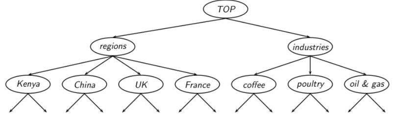
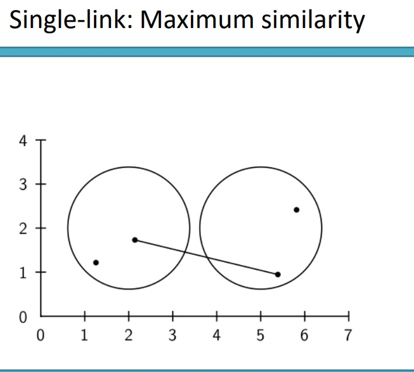
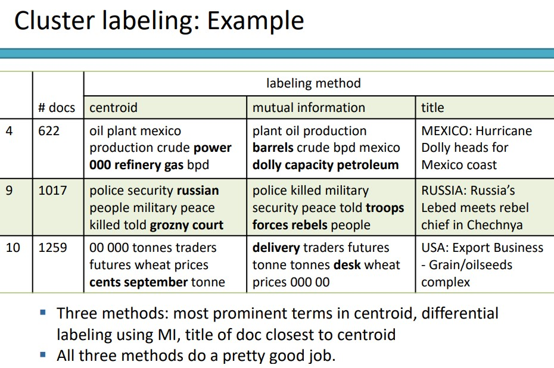

# IR 13 - ML in IR

## Formální definice problému
- Máme prostor dokumentů X
  - dokumenty jsou reprezentovány v tomto prostoru
    - typicky nějakým vysoko dimenzionálním vektorem

- Máme fixní počet tříd
  - třídy jsou člověkem vytvořené skupiny
    - např: relevant x non-relevant

- Máme trénovací set dokumentů, u kterých někdo rozhodl do jaké konkrétní třídy patří
- Cílem je naučit nějaký klasifikátor na trénovacích datech tak, aby byl schopen klasifikovat dokumenty i mimo trénovací sadu

- Definice:
  - 

- 

- Vyhledávací enginy používají klasifikaci pro:
  - detekci jazyka
  - detekci spamových stránek
  - detekci sexuálního contentu
  - topic specific
  - sentiment detekce (pozitivní x negativní)
  - ...

## Klasifikační metody
- 1:
  - ruční klasifikace
  - používána z počátku
  - přesná, pokud je klasifikátor expertem
  - konzistentní pokud je problém malý
  - postupným rozrůstáním potřebné anotace používány spíše automatické klasifikace

- 2:
  - Rule-based
  - Google alerts byl ruled-based klasifikace
  - existují IDE-type prostředí pro vývoj těchto pravidel
  - často se jedná o boolean kombinace
  - vysoká accuracy pokud se pravidla vyvíjela expertem
  - vyvíjení a udržování těchto pravidel je drahé
  - 

- 3:
  - Statical / Probabilistic
  - klasická klasifikace
    - supervised učení klasifikační funkce a její aplikace při klasifikaci dokumentů
  - Naivní Bayes, Rocchio, kNN, SVMs
  - potřebujeme hand-classified trénovací data
  - tato klasifikace může být udělána i "lajky" / non-experty

### Naivní Bayes
- jedná se o pravděpodobnostní klasifikátor
- počítáme pravděpodobnost toho že dokument d patří do třídy c
- 
- nd - délka dokumentu
- P(tk|c) - podmíněná pravděpodobnost výskytu termu tk v dokumetu třídy c
- P(tk|c) - míra toho jak moc důkazů přidává tk o tom že c je správná třída
- P(c) - prior pravděpobnost třídy c
- Pokud termy dokumentu nedají jasný důkaz do které třídy má dokument patřit, vybereme třídy s největší P(c)
- Snažíme se najít nejlepší třídu
- 
- násobení mnoha malých čísel může vézt k floating point undeflow
- řešením je sčítání logaritmů těchto pravděpodobností
- log(xy) = log(x) + log(y)
- klasifikační pravidlo:
- 
- každý conditional parametr log  je váha ukazující jak dobrým indikátorem je tk pro c
- Prior log  je váha ukazující realtivní frekvenci třídy c
- Součet log prioru a term vah je pak míra kolik evidence je pro to, že dokument d patří do třídy c
- Vyberem třídy s největší váhou/důkazy/pravděpodobností

- jak dostat parametry rovnice?
  - z trénovacích dar
  - Prior:
  - 
  - Nc je počet dokumentů třídy c a N je celkový počet dokumentů
  - Podmíněná pravděpodobnost:
  - 
  - Tct je počet tokenů t v trénovacích dokumentech třídy c včetně duplicit
  - Naive Bayes independence assumption:
  - 
  - 
  - B je v našem případě velikost slovníku

- Příklad:
- 
- 
- 

### Feature selection
- v textové klasifikaci většinou dokumenty reprezentujeme ve vysokodimenzionálním prostoru
- každá dimenze pak patří jednomu termu
- v této přednášce: axis=dimenze=slova=termy=feature
- mnoho z těchto dimenzí patří vzácným slovům
- vzácná slova snižují úspěšnost klasifikátoru a říká se jim noise features
- vymazáním noise features zvýšíme efektivitu text klasifikátoru (feature selection)
- vzácná slova vedou k overfittingu
- když budem mít vzácné slovo které náhodou bude vždy v dokumentu o čině, tak se toto slovo bude brát jako důlaz příslušnosti textu k číně (?)

- počítá se s frekvencí
- společnou informací - vyber termy s nejvěrší společnou informací
- společná informace se zde nazývá information gain
- chi-square (prej v nějaký knižce)
- MI (mutual information
  - říká nám kolik informace term dává o třídě a naopak
  - 
  - 
  - plus další šílený slidy se vzorečkama (13, slidy 28,29,30)

### Vektor space klasifikace
- reprezentace stejná, máme vektorový prostor document vektorů, která jsou teď klasifikované (training set)
- Předpoklad 1: dokumenty stejné třídy jsou blízko u sebe
- Předpoklad 2: Dokumenty různých tříd se nepřekrývají
- Definujeme přímky, plochy, hyperplochy které rozdělí prostor
- 
- Relevance feedback:
  - uživatel označí dokumenty jako relevantní nebo nerelevantní
  - můžeme považovat za třídy
  - na tom postavíme query model
  - jedná se částečně o textovou klasifikaci

### Rocchio ve vektor space modelu
- rozdíl relevance feedbacku a text klasifikace je v tom že na začátku učení textové klasifikace máme hned tréninkovou množinu
- relevance feedback se učí iterativně (trénovací množina je vyvářená iterativně)
### Rochio
- vypočítaT centroid pro každou třídu
- testovací dokument patří do třídy k němu nejbližšímu centroidu
- 
- 
- rochio vytvoří pro každou třídu centroid 
- klasifikace probíhá na základě podobnosti / vzdálenosti od centroidu

### Rochio vs Bayes
- V mnoha případech je rochio horší než bayes
- rochio moc nezvládá nonconvex nebo multimodal třídy
- 

### kNN klasifikace
- knn bývá přesnější než byes a rochio
- pokud potřebujeme relativně přesný klasifikátor rychle a nezáleží nám tolik na efektivitě
  - vezmem kNN

- kNN: k nearest neighbours
- kam patří dokument rozhodneme na základě k nejbližších sousedů (která třída je v sousedech největší vyhraje)
- varianta:
  - pravděpodobnostní kNN
    - kNN: P(c|d) = část k sousedů dokumentu d, které patří do c
    - přiřaď d do třídy c s největší P(c|d)

- 
- 

- nepotřebujeme trénování
  - defakto lineární předzpracovávání dokumentů při každém dotazu je v podstatě trénování
- kNN umí být velmi přesný pokud máme hodně trénovacích dat
- zároveň velmi nepřesný když máme málo trénovacích dat

### Learning algoritmy pro vektor space klasifikaci
- dva hlavní tipy:
- 1:
  - jednoduché learning algoritmy které vezmou parametry klasifikátoru z trénovacích dat jedním lineárním průchodem
    - Naivní bayes, Rochio, kNN
- 2:
  - iterativní algoritmy
    - SVMs, perceptron
- nejlépe learning algortimy většinou vyžadují právě iterativní přístup

- Která klasifikátor použít?
  - záleží no
  - neexistuje jeden obecný nejlepší
  - záleží na mnoho faktorech:
    - kolik máme trénovacích dat?
    - jak moc je problém komplexní?
    - jak moc šumu máme?
    - jak moc je problém stabilní?

### One of problem vs Any-of problem
- stejné jako v SU one vs all
- když máme rozřadit do více tříd, tak vezmeme více klasifikátorů pro jednu třídu a vrátíme nejpravděpodobnější

- následujíc slidy o Reuter datasetu (slidy 55,56,57)

- Ohodnocení klasifikace
  - na testovacích datech co nebyli v trénovací množině
  - Precision, Recall, F1, accuracy

- 

- 
- Micro vs Macro
  - chceme celkovou F pro celou kolekci
  - macroaveraging:
    - spočítat F1 pro každou třídu
    - zprůměrovat tato čísla
  - microaveraging:
    - spočítat TP a FP separátně

- 

## Learning to rank
- hlavní myšlenkou je váhy termů nepočítat ale naučit se pomocí learning algoritmů
- dostaneme trénovací množinu
  - dotaz q, document d a k nim rozhodnutí o d ke q
    - nejjednodušší: relevant x nonrelevant
    - složitější: graded relevance judgements
  - z těchto příkladů se naučíme váhy termů 
  - např. Weighted zone scoring

### Weighted zone scoring
- používá různé váhy pro každou zónu dokumentu (author, title, body)
- 
- 

- weighted zone scoring můžeme vnímat jako učení se lineární funkce booleam match skóre, které přizpívají tůzným zónám
- mínusy : potřebujeme celkem komplexní trénovací set
- plusy : snižuje problém učení se vah na jednoduchý optimatizační problém
- dále doporučuju si projít slidy 69 až 74
- shrnutí:
  - v podstatě každé zóně přiřadíme váhu g buď 0 nebo 1
  - trénovací množina se pak skládá dokumentů, dotazu, váhy zón dokumentu a označení do jaké třídy dokument czhledem k dotazu patří
  - podle vzorečku (3) vypočteme skóre
  - porovnáme vypočítané skóre s odpovědí učitele
  - error funkce podle vtorečku (5)
  - postupnou iterací se vybere g konstanta tak aby byl co nejmenší error
   - postupně vybírám z 0.1 - 0.9 a vezmu tu hodnotu kde error byl nejmenší

- další příklad machine learned scoringu:
  - mějme scoring funkci jako lineární kombinaci dvou faktorů
    - vektor space cosine podobnost
    - minimální window width ve kterých leží query terms
  - tudíž máme faktor související se statistikou query termu v dokumentu jako bag of words a druhý související se vzdálenostním váhováním (proximity weighting)
  - 
  - 

- další příklad je velmi podobný lineárnímu klasifikátoru z SU (slidy 79 až 82)

#### Shrnutí
- zmiňované myšlenky mohou být aplikováný pro mnohem víc než 2/3 parametry
- existuje PageRank-style meření, document age, zone contribution atd.
- Pokud je možné tyto parametry napočítat pro trénovací dokumenty s relevance judgement, je možné použít pro klasifikaci machine learning klasifikátory

## Clustering
- seskupování dokumentů do setů které se něčím podobají
- dokumenty v clusteru by měly být nějakým způsobem podobné
- dokumenty v různých clusterech zas různé
- nejběžnější forma unsupervised učení
- klasifikace vs clustering?
- Pro IR:
  - dokumenty stejného clusteru se chovají podobně s ohledem k informaci kterou mají poskytovat
  - aka: dokumenty stejného clusteru by měly odpovídat stejným dotazům

- příklady na slidech 91, 92, 93, 94, 95

- Yahoo/MESH nejsou příklady clusteringu
  - jsou ovšem globálně známými příklady užívání hiearchie pro navigaci
- příklady blobal navigation/exploration na clustering základu:
  - Cartia
  - Themescapes
  - Google News

- dokumanty rozclusterovat předem
- když zadám dotaz odpovídající určitému dokumentu, vrátím i okolní dokumenty
- doufáme, že pokud bude dotaz "auto" vrátí se nám i dokumenty obsahující "automobil"

### Data pro clustering
- předpokladem je že podobné dokumenty budou v clusteru a naopak
- počet clusterů silně souvisí s konkrétními případy
- snažíme se vyhnout velmi malým a naopak velmi velkým clusterům (nevyvážený dataset)
- definovat clustery kterou jsou snadno vysvětlitelné uživateli

### Flat vs Hierarchical clustering
- Flat algorithm:
  - random rozdělení do skupin
  - upravuje se iterativně
  - k-means
- Hierarchival algorithm:
  - Zavádíme hierarchii
  - bottom-up - aglomerativní
  - top-down - divise (rozdělující?)

### Hard vs Soft clustering
- Hard: každý dokument patří do právě jednoho clusteru
- Soft: dokumenty mohou patřit do více clusterů

### Flat algoritmy:
- flat algoritmy rozdělí N dokumentů do K clusterů
- musíme mít set dokumentů a pevně stanovéný počet K clusterů
- K-means

#### K-means
- nejspíše nejlepší známý clustering algoritmus
- 
- každý cluster je definován jako centroid
- cílem je minimalizovat průměrnou squared difference od centroidu
- 
- každá iterace má dvě fáze:
  - reassignment: přiřadíme vektor nejbližsímu centroidu
  - recomputation: přepočítání pozice centoridu

- 
- 
- 
- 
- 
- 
- 
- 

- důkaz konvergence na slidech 114, 115 a 116

- konvergence zde nemusí nutně znamenat globální optimum
- podle zvoleného začátku můžeme skončit ve špatném optimu
- Zvolení počátečních pozic clusterů je důležité
  - random zvolení není moc robustní
  - lepší:
    - použít nějakou heutistiku (vymazání outlierů, nalezení nějakých dobrých začátků co dobře pokrývají prostor)
    - použít hierarchical clustering na nalezení dobrých začátků
    - provedení K-means vícekrát s random začátky a zvolení nejlepšího výsledku (jak?)

- tím že je to bez učitele, nevíme zda-li se jedná o dobré rozdělení
- alternativa:
  - externí kritéria:
    - hodnotit v závislosti na human-defined klasifikaci

#### Externí kritéria
- základ na gold standard data setech (např. Reuter)
- clustering by pak měl vyprodukovat podobné výsledky jako gold standard
- První míra toho jak dobře jsme schopni reprodukovat třídy (z gold standartu)
  - purity
  - 
  - 

- 
- 
- 

### Hierarchical clustering
- naším cílem je rozdělit prostor hierarchicky jako v Reuter datasetu
- 
- toho můžeme docílit buď top-down, nebo bottom-up strategií
- nejlepší bottom-up metoda: hierarchální aglomerativní clustering (HAC)

### HAC
- HAC vytvoří stromovou hierarchii
- začneme s každým dokumentem v separátním clusteru
- postupně merugjem clustery, které jsou si nejvíc podobné
- dokud není pouze jeden cluster
- historie mergování nám pak dá hierarchii ve formě binárního stromu
- standartní metodika zovrazování historie: dendogram
- 

### Divisive clustering
- top-down přístup
- přesný opak
  - začneme s jedním clusterem a rozdělujeme

### Naivní HAC algoritmus
- 
- máme O(N) iterací kde se v každé počítá O(N x N) podobností a vybere se maximální
- složitost tedy O(N^3)
- jak definujeme cluster similarity?
  - single-link: maximální similarita dovu dokumentů
  - complete-link: minimální similarita dvou dokumentů
  - centroid: average "intersimilarity": průměrná podobnost všech dokumentových dvojic, ale vynechání dvojic dokumentů ve stejném clusteru
  - group-average: average "intrasimilarity": průměrná podobnost všech dokumentových dvojic, včetně dvojic dokumentů ve stejném clusteru
- 
- 
- 
- 

- příklady na slidech 140 až 148

### Group Average Agglomerative Clustering (GAAC)
- GAAC má také average-similarity, ale ne inverze
- podobnost dbou clusterů je průměrná intrasimilarity:
  - průměrná podobnost všech dokumentových dvojic, včetně těch ze stejného clusteru

- Jaký HAC použít?
  - nepoužívat centroid HAC kvůli inverzím(?)
  - GAAC bývá nejlepší protože například není citilivá na outliery
  - ale pro GAAC můžeme použít pouze vektorovou reprezentaci
  - pro jiné než vektorové reprezentace:
    - complete-link
  - v některých případech jde použít i single-link

- Flat nebo Hiearchální clustering?
  - pro vysokou efektivnost: flat clustering
  - pro deterministický výsledek: HAC
  - když potřebujeme hierarhiccké rozdělení: HAC
  - HAC můžeme použít když přředem neznáme počet clusterů
 
 - co s hierarchií?
  - jako například Yahoo hierarchie (pro vyhledávání)
  - lze zastavit a mít aktuálních k clusterů

### Bisecting K-means: top-down algoritmus
- všechyn dokumentsy v jednom clusteru
- rozděl do dvou podle k-means
- z nově vzniklých vyber největší a znovu rozděl dokud nebudeš mít tolik clusterů kolik potřebuješ

- pokud negenerujeme celou hierarchii, tak je top-down jako bisecting k-means mnohem efektivnější než HAC algoritmus
- Bisecting k-means ovšem není deterministický
- jsou i deterministické verze, ale neefektivní

### Velký problém clusteringu - labeling

#### Diskriminativní labeling
- snažíme se pro každý cluster přijít s názvem, který ho odliší od ostatním a nějak ho vystihuje

#### Non-discriminative labeling
- cluster popíšeme frázemi nebo pojmy které popisují daný cluster, nezajímají nás ostatní
- použijeme například názvy dokumentů pro snadný výběr popisu clusteru

