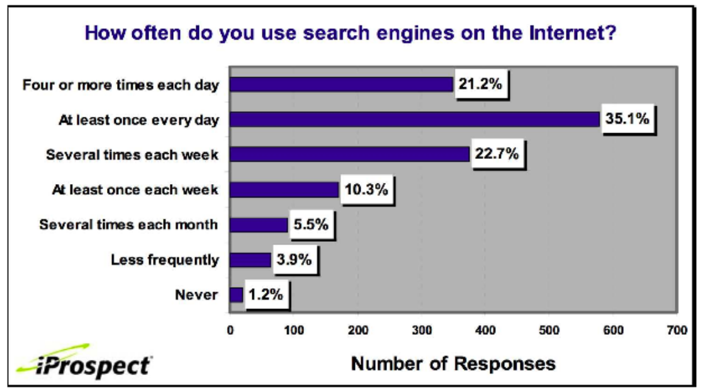
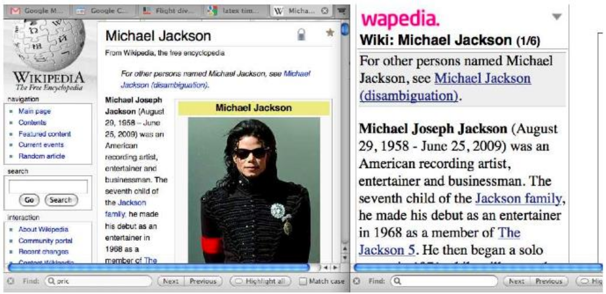

- web search overview

    

    

- bez vyhledavacu by web nefungoval
- nekdo musi za web platit 
    - servery, webova infrastruktura, vytvareni obsahu
    - velka cast je dneska placena reklamami ve vyhledavani
    - vyhledavani plati za web

- zajimave agregace
    - unikatni vlastnost webu: mala skupina geograficky rozptylenych lidi se stejnymi zajmy se mohou spojit (byt v kontaktu)
        - deti na zakladni skole s hemophilii
        - lidi co se zajimaji o preklad R5R5 schmeatu do prenosneho C (open source project)
    -  vyhledavace jsou klicovym zprostredkovatelem pro agregaci zajmu

- vyhledavani na webu vs obecne vyhledavani informaci
    - na webu to neni jen "nice to have feature" ale KLICOVA vec
    - web je chatoticky
        - hodne duplicit (potreba detekce duplicit)
        - hodne spamu (potreba detekce spamu)
        - je obrovsky

- reklamy
    - 1. generace reklam

            

        - zadne oddeleni vysledku hledani a reklam (vsechno v jednom seznamu)

    - 2. generace reklam

            

        - striktni oddeleni vysledku hledani a reklam
        - hodnoti (rankuji) search enginy inzerenty vyse nez neinzerenty (vsechny search engyny tvrdi ze ne)
    
    - jak jsou reklamy na pravo serazeny?
        - inzerti prihazuji na klicove slova (forma aukce)
        - inzertum se uctuje poplatky poze kdyz nekdo na danou reklamu
        - zakladem je druha cena aukce
        - v konecnem dusledku je to mozne nejdulezitejsi vyzkumna oblast search enginu - computational advertising
        - rank zalozen na cenove nabidce a relevance
            - klicova metrika mereni relevance = CTR (click through rate)
            - vysledek: nerelevantni reklamy budou mit malou hodnotu (rank)
        - dalsi faktory zapocitane do vysledneho hodnoceni
            - lokace, time of day, kvalita, rychlost nacitani stranky (reklamy)
        - hlavni ranking faktor = dotaz

    - Google’s second price auction
            
        

        - `bid`: maxmulani nabidka za kliknuti podle inzerenta
        - `CRT (click-through rate)`: procento kolikrat na ni uzivatel klikne kdyz je reklama zobrazena; urcuje relevanci
        - `ad rank`: bid x CRT - pomer (vyvazeni) kolik penez je izerent ochotny zaplatit vs jak relevantni je dana reklama
        - `rank`: poradi v aukci
        - `paid`: druha aukcni cena zaplacena izerentem
            - inzerent zaplati minimalni castku nutnou k udrzeni sve pozice v aukci

        

    - Search ads: A win-win-win?
        - 1) search engine dostane nejaky prijem pokazde kdyz nekdo klikne na nejaky link
        - 2) uzivatel klikne na link pouze pokud ho to zajima
        - 3) inerent najde naveho zakaznika

    - Not a win-win-win
        - arbitraz
            - koupe klicoveho slova na google
            - redirect na treti stranu ktera plati mnohem vice nez google
                - napriklad na stranku plnou reklam
            - nedava moc smysl pro uzivatele (spise otravne)
            - ad spammers porad vymysleji nove a nove triky
        - porusovani ochrannych znamek

- detekce duplicit
    - web je plny duplicit (vice nez jakekoli jine kolekce)
    - uplne duplicity (jednoduche na eliminaci -> pouziti hash)
    - castecne diplicity (tezsi na eliminaci)
    - pro uzivatele je otravne dostat vysledek vyhledavani ktery obsahuje stejne dokumenty
        - !! MARZINALNI RELEVANCE = 0!!

    - skoro stejna duplicita:

        

        - pocitani podobnosti pomoci edit-distance
        - chceme synaktickou (ne semantickou) podobnost
        - dokumenty nepovazujeme za temer duplicitni pokud maji stejny obsah ale vyjadruji je ruznymi slovy
        - pouzijeme threshold θ pro urceji jestli dva dokumenty jsou skoro duplicitni nebo ne (napr θ > 80%)

        - reprezentace kazdeho dokumentu jako shingles (pasovy opar?)
            - slovni n-gram
            - shingles jsou pouzity jako meritko pro mereni syntakticke podobnosti
            - napriklad pro n = 3 "a rose is a rose is a rose" by bylo {a-rose-is, rose-is-a, is-a-rose}
            - shingles muzeme namapovat na 1..2^m (napr m = 64) pomoci fingerprintingu (hash?)
            - definujeme podobnost dvou dokumentu jako Jaccardovo koeficient jejich shingle mnozin
            - Jaccard coefficient
                - obecne technika pro mereni toho jak se dve mnoziny prekryvaji

                    

                - mnoziny A a B nemusi mit stejnou velikost
                - vzdy se jedna o cislo mezi <0,1>

                    

                    -
                    ```
                    D1 = Jack London traveled to Oakland
                    D2 = Jack London traveled to the city of Oakland
                    D3 = Jack traveled from Oakland to London

                    S1 = {Jack-London, London-traveled, traveled-to, to-Oakland}
                    S2 = {Jack-London, London-traveled, traveled-to, to-the, the-city, city-of, of-Oakland}
                    S3 = {Jack-traveled, traveled-from, from-Oakland, Oakland-to, to-London}

                    J(d1,d2) = 3/8
                    J(d1,d3) = 0/9 = 0
                    ```