## Elementary design principles

- Separation of Concerns
    - kod ktery delat neco jinyho (jinou praci) by mel byt oddeleny (lepsi testovani, znovupouzitelnost, prehlednost)
        - napr registrace uzivatele a validate stupnich dat by mely byt oddelene

- Single Responsibility Principle
    - kazda trida by mela zajistovat prave jednu cinnost
    - mixovani funkcionalit vede ke spatnemu testovani, neprehlednosti, atd.
    
    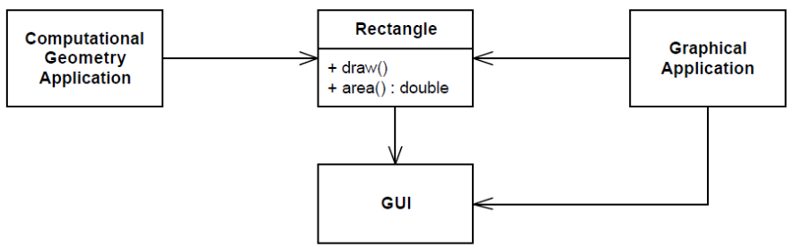
    - trida Rectangle ma vice responsibilities - pocitani obsahu (matika) a vykreslovani => Computational Geometry Application ma zavisnost na Rectangle a Rectangle ma zavislost na graficke knihovne -> CGA ma zavislost na graficke knihovne
    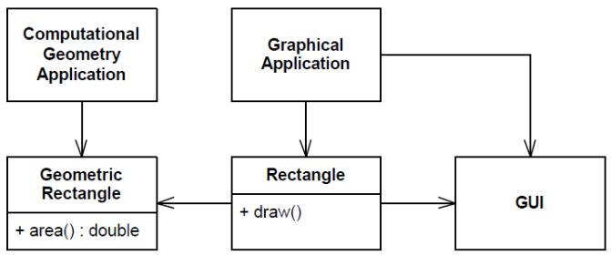

- zapouzderni
    - kazda instance ma svuj stav (dano hodnotamy atributu)
    - zabranit prime zmene stavu instance tridy
    - hodnoty atributu se maji menit vnitrne prostrednictvim definovaneho API
    ```
    void activateUser() {
        state = State.ACTIVE;
        timeStamp = datetime.now();
    }
    ```
    - automaticke generovani getteru/setteru porusuje princip zapouzdreni 
    - ve webovych applikacich komunikujeme pres rozhrani - nemusime znat implementaci

- Don´t Repeat Yourself (DRY)
    - kopirovani kodu
    - neustale prepisovani dokumentace
    - prekreslovani schemat
    - testovaci pripady
    - po case nejsou synchronizovane s aktualnim stavem projektu
    - -> lepsi je puzit nastroj pro automaticke generovani

- Dependency Inversion – Direct Dependencies (inverze zavislosti)
    - trida A ma tesnou zavislost na tridu B
        - tezke nahradit tridu B za jinou
        - lepsi mit zavislost pouze na rozhrani
            - imlementaci pak muzeme zmenit
        - velke urovne abstrakce by nemely zaviset na implementacnich detailech

        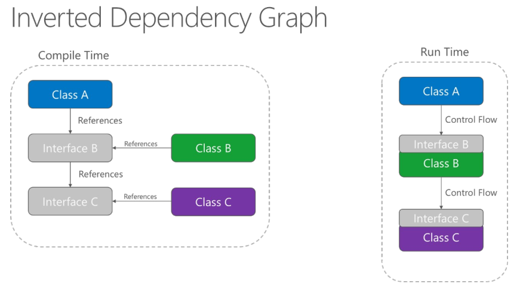

- Explicit Dependencies (explicitni zavilosti)
    - aplikace/moduly/tridy by mely specifikovat jake zavislosti potrebuji pro svuj beh
        - napr Linux - balickovaci system, pip - requirements.txt, maven, ...
        - v pripade kodu je to konstruktor, parametry funkce
        - funkce by mely mit jako parametr vsechny potrebne zavislosti pro sve vykonani
        - tridy maji vsechny potrebne zavislosti definovane v konstruktoru - po jeji inicializaci je trida plne funkci - ma vsechny zavislosti; nepovinne zavislosti -> pres settery

- Inversion of Control
    - obecne nas kod neridi tok (beh) programu ale dela to napriklad nejaky framework
    - dependency injection
    - window GUI
    - inversion of control != dependency injection
        - dependency injection reprezentuje princip IoC a ne naopak
    - priklad NEvyuziti IoC - platebni brana pozaduje unikatni ID kazde transakce - klient jej musi vygenerovat. Jak ma ale vedet ktere uz jsou zabrazene? -> generovani by mela dalat sama platebni brana
        - bylo by to v pohode v pripade jednoho zakaznika
        - mozne reseni: alokovat mnozinu ID pro daneho zakaznika ze kterych on bude nahodne generovat unikatni ID

- Dependency Injection
    - hlavni myslenka: oddeleni kodu pro vytvareni objektu a jejich nastavovani zavislosti od zbytku 
        - v kodu jsou nadefinovane zavislosti pomoci kontruktoru
        - pak mame separatni konfiguracni tridu nebo soubor (napr xml nebo json) kde definujeme "naskladani" zavislosti jakych budeme potrebovat
        - snadne nahraznovani zavislosti za jine (vime presne kam jit a kde to zmenit)
        - napriklad pri testovani nahradime DB nejakou in-memory DB
        - povinne zavilosti - pres konstruktor (@RequiredArgsContructor)
        - dobrovolne zavislosti - settery (@Autowired)
        - injectovani primo do atributu (nemusime vytvaret ani konstruktor ani setter) - ani-pattern (ve Springu @Autowired); spise nepouzivat

- Service Lookup
    - alternativa k DI
    - existuje objekt ktery zna vsechny instance v danem projektu
    - dao = applicationContext.getBean("dao") - vraci instance daneho rozhrani podle jmena ktery pak muzeme priradit jako hodnotu atributu v dane tride

- Dependency Injection vs Service Lookup
    - DI vyuziva princip IoC
    - DI muze byt tezsi na debuggovani
    - Service Lookup neni tak flexibilni ale je jednodussi na pouziti
        - kdybychom to implementovali sami - pouze mapa instanci
    - Service Lookup vyzaduje mit instanci na globalni objekt ktery drzi vsechny instance
        - v pripade knihoven vynutime uzivatele aby taky pouzival Service Locator

## Web Application Architectures

- dva pohledy
    - jak je aplikace nasazena - jeji repliky, skalovatelnost, atpd.
        - nasazeni + udrzba
    - jak je aplikace uvnitr organizovana - monolit, micro-services, ...

- technologie se casto vybira podle toho co ten dany tym programatoru umi nejlip (pod se nejedna o nejakou specifickou aplikaci)

- horizontalni skalovani - mame vice replik dane aplikace
- vertikalni skalovani - tunime dany server - vic ram, vic CPU atd

- Monoliticka aplikace
    - aplikace je jeden funkci celeke ktery se sklada z vice modulu
    - dela vice cinnosti napr registraci uzivatele, ucetnictvi, tisknuti dokumentu atd
    - jednodussi na testovani, debuggovani, vyvoj - mame jen jedno IDE (repozitar), nasazeni
    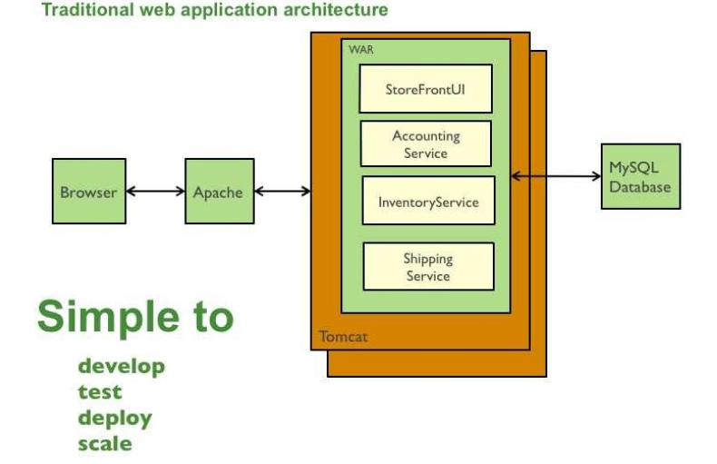
    - v pripade skalovani musime skalovat celou aplikaci i kdyz jsou vytizenne napr jen nektere jeji casti
    - horsi to zacne byt az se aplikace zacne zvetsovat - neprehlednost kodu, prace vice programatoru - vyzauje dobrou vnitrni architekturu a rozlozeni trid
    - aplikace dlouho startuje
    - cela aplikace musi byt napsana s pouzitim stejne technologie
    - pri zmene frameworku musime celou app prepsat

- Service-Oriented Architecture (SOA)
    - pokus o vyreseni problemu s monolitickou aplikaci
    - kazda service je black box - komunikujeme pouze pres rozhrani
    - u monolitu pri volani funkce se nemuze defakto nic pokazit
        - v pripade SOA komunikujeme pres sit - musime mit v pameti transakce (kdyz spadne pripojeni napr), bezpecnost (HTTPS)
    - kazda service by mela byt bezstavova - bud vratime error nebo odpoved
    - komunikace
        - na primo
        - pres frontu zprav - odpoved je jen "jo dobry prijal jsem zpravu - nekdy ji zpracuju"
    - existuji ruzne komunikacni protokoly - HTTP, WebSocket, SOAP, AMQP, MQTT, Stomp
    - tezsi debuggovani - danou sluzbu nemusime spravovat my
    - casto jedna aplikace = vice repozitaru, nestaci jedno IDE (ruzne technologie)
    - integracni testy jsou slozitejsi
    - pri nastartovani muze zalezet na poradi stupusteni jednotlivych sluzeb
    - NEJHORSI PRIPAD JE KDYZ DO TOHO INTEGRUJEME MONOLITICKOU APLIKACI - prinasi nevyhody obou reseni

- Microservices
    - jedna aplikace rozdelena do vice malych sluzeb
    - kazda sluzba je separatni proces ktery muze/nemusi bezet na stejnem stroji
    - zalozeno na Unixove filozofii - deleje jednu vec a delej ji poradne
    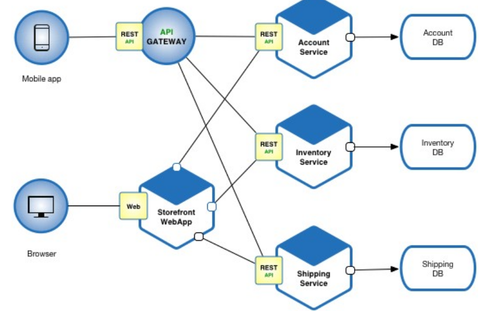
    - hlavni vyhody:
        - jednotlive mikro sluzby jsou jednoduche na vyvoj a udrzbu
        - mikro sluzby nemusi byt napsane ve stejne technologii
        - jednotlive mikrosluzby mohou spravovat jine tymy lidi
        - nemusime skalovat celou aplikaci ale jen dane vytizene mikro sluzby
        - pri aktualizaci nemusime vypinat celou aplikaci
    - hlavni nevyhody:
        - tezsi na nasezeni kvuli tomu jak je aplikace distribuovana
        - vyzaduje intenzivni integracni testy
        - diky Dockeru mame testovaci prostredi
        - potencialne muze byt vice nakladna - vice serveru, pripojeni, kazda mikro sluzba by mela mit sve uloziste
        - use-casy mohou pokryvat vice mikrosluzeb -> nutna dobra komunikace jednotlivych tymu

- Monolith vs Microservices
    - zalezi jaky mame use-case
    - monolit je lehci na vyvoj, nasazeni a udrzbu - dokud aplikace prilis nenaroste
    - pro male aplikace se nevyplati komplexita mikro sluzeb
        - pro velke aplikace uz ano

## Common Web Application Design Principles

- kod aplikace je rozdelen do vrstev
- jednotlive vrstvy implementuje a zapouzdruji danou funkcionalitu
- komunikace mezi vrstvami probiha pres rozhrani -> jednodussi nahrazeni za jine implementace (napr jiny typ DB) a testovani

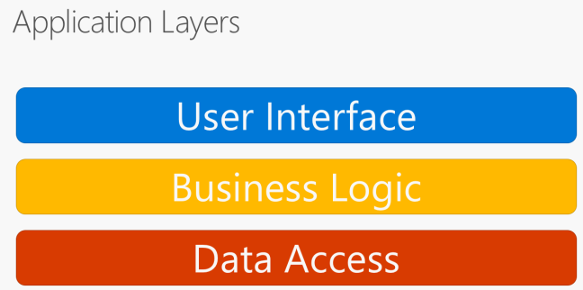

- Application Layers – Clean Architecture
    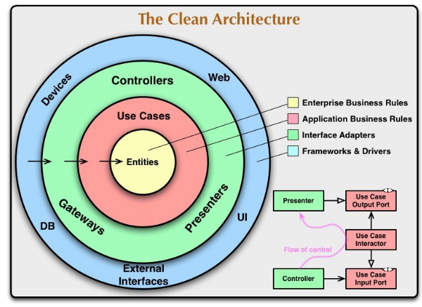

    - hlavni pavidlo: zavislosti jdou vzdy ze shora dolu - apliakce inverznich zavilosti
        - aplikaci logika nemuze zaviset napr na JDBC konektroru!!
    - entities: data (objekty - napr objednavky) sdilene napric systemem
    - Use Cases: co se da delat nad danyma objektama - aplikacni logika
    - Controllers: pristup ven/dovnitr; rozhrani pro pristup k databazi; vytvareni DAO
    - posledni vrstva: externi frameworky, drivery
    - priklady spatneho navrhy clean architecture
        - entity a use-cases jsou v jednom modulu
            - lepsi: rozdeli modul pro entity a use-cases (separation of concerns)
        - UI a WebServices maji PRIMOU zavislost na vnitrne pouzitych technologich
            - tezko se da vyresit kvuli tomu jak byly frameworky navrzeny
    - aplikacni logiku muzeme volat z Web UI, Smartphone app, jinych frameworku napr pri testovani

- bezne pouzite vrstvy
    - prezentacni vrstva
    - aplikacni vrstva (aplikacni logika)
    - datova vrstva

- dulezite mit na pameti
    - bezpecnost
    - transakce
    - logovani

- datova vrstva resi:
    - format ukladani dat
        - relacni schema v pripade relacnich DB, format v pripade souboru, ...
    - mapovani na aplikacni objekty (tridy - DTO, entity)
    - cteni/zapis

- business logika resi:
    - implementace aplikacni funkcionality
    - zmena stavu entiti
    - volani funkci datoveho uloziste (nizsi vrstvy)

- prezentacni vrstva resi:
    - vstup od uzivatele
    - vola nizsi vrstvu (aplikacni logiku)
    - prezentuje vysledky uzivateli

## Common Web Application Design Patterns

- Model-View-Controller (MVC)
    - Model - data a aplikacni logika
    - View - zobrazuje data z modulu
    - Controller - zpracovava vstupy od uzivatele

        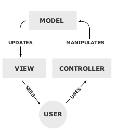

    - priklad "MVC" kde HTML generuje server
    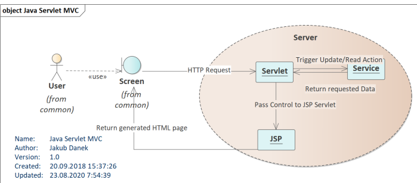

    - toto schema ani tak neni MVC protoze kontroler (servlet) meni View (JSP - sablony HTML) ale spise Presenter
    - AJAX = technologie co dovoluje aktualizaci pouze casti webove stranky (nemusime ji natahnout znova celou)
    - SPA = single page application 
        - aplikace bezi cela v prohlizeni (probihaji tam veskere zmeny - zmena pres DOM)
        - data posila server ale HTML je generovane v prohlizeci
    - priklad MVC aplikace s pouzitim Angularu

        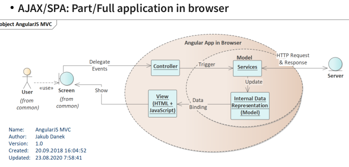

        - Controller zachytava vstupy od uzivatele (napr stisk tlacitka) a posila pozadavky na zmenu modelu
        - data modelu jsou nabindovany na view -> automaticka zmena

- Model-View-Presenter
    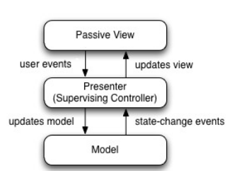
    - odebrani propojeni view a modelu
    - Presenter je Controller ktery slouzi jako prostrednik mezi View a Modelem
    - View predstavuje jednotlive Widgety (tlacitka, input field, ...)
        - kazdy widget ma vlastni presenter ktery obslouzi danou udalost a nastavi nova data na zobrazeni
    - napriklad kazdy formular mas svoji obsuznou funkce - Presenter, ktera se zavola pri odesilani formulare, data se odeslou na server a po prijeti odpovedi se zobrazi vysledek uzivateli

- Model – View - ViewModel
    - dalsi zpusob oddeleni vazby mezi modelem a view (ASP.NET/WPF)
    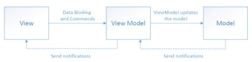
    - ViewMode poskytuje:
        - data pro view
            - formatuje data z interniho modelu na nejakou zobrazitelnou podobu
        - Prikazy
            - reakce na vstup od uzivatele (prikazy jsou namapovane na tlacitka, input fieldy atd.)
    - komunikace s View
        - zmena view funguje pres DataBinding a Notifikace
    - komunikace s Modelem
        - ViewModel vola funkce module (aplikacni logika)
    - ViewModel je zpusob implementace Clean Architecture na prezentacni vrstve

- Porovnani MVC, MVP, MVVM

    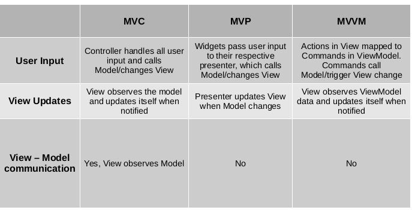

## Cross-Cutting Concerns
- jista funkcionalita je vyzadovana na vsech vrstvach

- Bezpecnost - user authentication
    - nutnost implementovat jak na severu (operace nad daty)!! tak i na strane klienta (co vidi/nevidi)

- Logovani
    - vsude abychom vedeli co uzivatel a aplikace delaji

- Transakce
    - aplikacni a datova vrstva musi zajistit atomicnost operaci

- Naivni implementace techto veci ma za nasledek tezsi testovani, drahe zmeny, ...
- Pristup 1)
    - zavislost na rozhrani (API) + konfigurace
        - aplikace je zavisla pouze na rozhrani loggeru a konkretni implementace je pote definovana v konfiguraci -> jednodussi testovani a vymena
    - problem je napriklad kdybychom vyvijeli knihovnu -> nutili bychom uzivatele pouzivat konretni implementaci napr loggeru
- Pristup 2) - Aspect-Oriented Programming (AOP)
    - Co je to aspekt?
        - module (typicky trida) co obsahuje kod ktery bychom museli rozkopirovavat do vsech trid (vsude kde ho chceme pouzit)
    - Frameworky zajustuji ze ten kod napiseme na jednom misto a on se pote dostane na vsechna mista kde ho chceme mit
    - neco jako makra v C
    - napriklad kdyz budeme logovat - cheme zalogovat casove razitko, nazev metody a logovaci zpravu => tenhle kod chceme napsat jenom jednou
    - nebo napriklad bezpecnost - uzivatel musi mit urcitou roli kdyz chce volat konretni metodu - v jave se pouzivaji anotace
        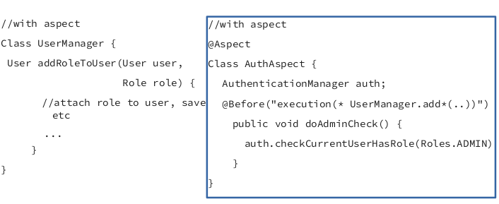
    - autentizace uzivatele probehne pred libovolnou metodou ktera zacina add*
        - framework pri volani userAdd zavola nejdiv doAdminCheck
    - terminologie:
        - Join Point: misto vykonani aspektu (typicky volani metody); misto napojeni
        - Pointcut: predikat ktery vyjadruje to kdy se ma ten aspekt provest - ktery vsechny metody to ma postihovat
        - Advice: kdy se ma provest aspekt v ramci volani - before, after, around, ..
            - around: napri pri logovani - metoda bere objekt jako parametr - zalogujeme (before), na konci zalogujeme i navratovou hodnotu (after)
    - Jakym zpusobem se ten kod zavola kdyz chceme? = Weaving
        - pri kompulaci
            - kompilator to musi dovolovat (napr kompilator javy to neumi)
            - defakto jako makra v C
            - problem pri debuggovani
            - je rychlejsi nez ostatni zpusoby
        - pri nacitani
            - zajistuje class loader (analyzuje binarky a hleda aspekty pro pointcut)
            - nacte modivikovanou verzi class souboru
            - vyzauje specialni class loader
            - problem pri debuggovani
        - za runtimu
            - bez modifikace kodu
            - casto pouzivano v Jave
            - dela se to pres volani proxy trid (namisto puvodnich objektu), ktere obsahuji kod aspektu + zavolaji puvodni metodu
            - vyhoda: puvodni trida je nezmenena
            - nevyhody:
                - vice pameti (vytvareni proxy trid)
                - volane metody musi byt public -> nemozne vytvorit pointcut pro private metody
                - nelze pouzit pokud volame metody v ramci jedne tridy (uvnitr) -> vzdycky musi volani probehnout z vnejsku
        
            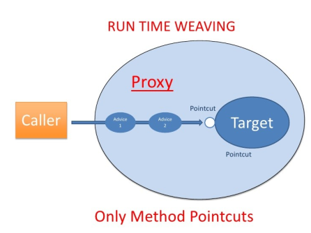