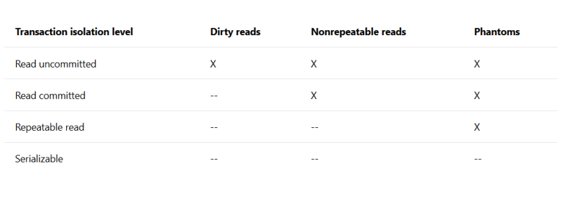
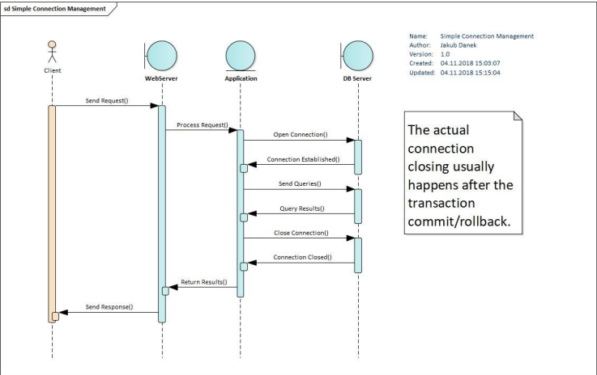

Vrstva persistence dat
- Vrstva perzistence dat je v architektuře vícevrstvých aplikací zodpovědná za poskytování dat aplikační vrstvě a zajištění jejich perzistence. Nejčastěji bývá realizována pomocí relační databáze, může jít však i o jiný zdroj dat (např. CRM nebo ERP systém, či jiný informační systém).

- Implementace má dopad na mnoho nefunkčních požadavků
  - výkon (performance)
  - bezpečnost (security)
    - nachází se vetšinou na jiném místě než aplikace
    - nechceme aby je někdo získal (velká hodnota dat)
  - Trvanlivost
    - nutnost se zotavit i z HW nehod

Možnosti uložení dat
- Relační databáze
  - MariaDB, MySQL, PostgreSQL, OracleSQL, Derby, H2, Microsoft SQL Server
  - pro ukládání dat u kterých existuje vazba (tabulky - relace)
  - Relace potřebujeme protože v aplikacích potřebujeme znát vazby mezi nimi
- NoSQL
  - databázové enginy se specifickým použitím:
    - Document-based: MongoDB, CouchDD
      - struktura podobná JSON
      - pro data s fixní nebo stromovou strukturou
      - nehodí se pokud je potřeba znát vazba mezi daty
      - naopak se hodí pokud jednotlivé záznamy nepotřebují odkazovat na jiný
    - Key-Value: Redis
      - pro Cache
      - rychlý (klíč - indexy)
    - Wide-Column: Cassandra, DynamoDb
      - organizují data podle sloupců namísto řádků
      - použití pro případy kde je více zápisu než čtení a nedělají se aktulizace
    - Grahp: Neo4J, Giraph
      - pro grafy (mapy, ontologie)
      - rozpoznávání obrazu, medicínské softy (zadají se příznaky a výsledek je např. styl léčba)
    - Shared features
      - lépe škálují než relační DB, dobře replikují
      - špatná podpora transakcí
- Souborový systém
  - tam kde běží aplikace
  - při více instancí je problém se sdílení dat
  - těžké škálování, přístup, zvětšení GB při runtime
  - omezené indexování, cachování, dotazování
- Další možnosti
  - Alfresco - souborové úložiště
    - metadata k souborům, dotazování, škálování
  - Elastic Search - storage engine pro vyhledávání dat, analýzy, skvělý pro indexaci logů nebo big dat
  - Amazon S3 - objektové úložiště, dobrý pro data ke kterým se moc často nepřistupuje (backupy)
  - Object databases - ObjectDB, pro ukládání objektů, dědičnost, metody pro práci s objekty

Práce s uloženými daty
- důležité body: datový model, bezpečnost, výkon
- Datový model
  - Ovlivňuje výkon (rychlé čtení/zápis)
  - požadavky na konzistenci a prostorové nároky
  - návrh podle toho co budou běžné dotazy
  - Normalizovaný model
    - žádné duplicity informace (méně místa na uložení, rychlejší aktualizace)
    - čtení více dat vyžaduje JOIN nebo více dotazů (horší výkon)
  - Jedna tabulka navržena write-once, čti a analyzuj později (př. Warehouses)
    - předem vypočítává data, duplikace
    - pomalé aktualizace, těžké udržet konzistenci
    - rychlé čtení
- Bezpečnost
  - Problémy:
    - může někdo zachytit komunikaci s úložištěm?
    - může někdo obelhat aplikaci aby vykonala nechtěný dotaz/zápis?
      - SQL injection - dotaz rozdělí pomocí řetězce na dva
      - ochrana - validace parametrů, nastavení přístupových práv, neopouštět složky s daty a neumožnit neprocházet filesystem
- Výkon
  - jak dlouho zabere jeden dotaz?
    - nepoznám pokud mám málo dat a uživatelů
    - nastane pokud mám složité dotazy
    - NoSQL DBs rychlejší kvůli jednoduchým dotazům
    - závisí na datovém modelu
    - Indexy
      - rychlejší vyhledávání
      - kolik? které položky budou indexy?
        - naopak ještě zpomalím zápis
    - Důležitá optimalizace - změřit a zjistit kde je pomalá část aplikace a pokusit se zrychlit
  - kolik dotazů posílám?
    - problém SELECT N+1 - jeden dotaz získá N záznamů a pro N záznamů získám dalších N pro detaily
    - Počet dotazů by měl být konstantní nehledě na to jak velký seznam zobrazujeme (pro 1 objednávku nebo 100)
  - Konzistence
    - Při více akcí v úložišti nemusí všechny skončit úspěšně
      - pokud nějaká akce selže musím provést rollback změn
  - Transakce
    - sekvence akcí která proběhne celá nebo vůbec
    - !!!Každá funkce aplikační logity by měla běžet jako samostatná transakce!!!
    - ACID
      - Atomicity - atomická operace - celá nebo vůbec
      - Consistency - změny transakce neporuší integritu
      - Isolation - Více paralelních transakcí se nemohou ovlivňovat souběžně
      - Durability - po (úspěšných) transakcích pád systému neovlivní změny způsobené transakcemi
  - Isolation (Izolace)
    - Dirty Reads
      - T1 transakce může přečíst změny T2 transakce která ještě není commitnutá
    - Nonrepeatable Reads (U druhého dotazu můžeme vidět změny v řádkách)
      - T1 čte data
      - T2 commitne aktualizaci/odstranění těchto dat
      - T1 zopakuje dotaz a získá jiná data
    - Phantoms (oproti nonrepeatable reads mohou při druhém dotazu přibýt i nové řádky)
      - T1 čte data
      - T2 commitne vložení/aktualizaci která modifikuje atributy pro vyhledávání
      - T1 zopakuje dotaz a získá odlišné výsledky
    - Zámky
      - Čtení
        - více transakcí může číst paralelně stejná data
        - při zápisu musí transakce počkat až se záznam uvolní od všech čtenářů
      - Zápis
        - Při zápisu se záznam zamkne pro čtení i zápis ostatním dokud neskončí
    - Úrovně
    
      
  
    - Read uncommitted
      - ruší izolaci, umožňuje paralelizaci
      - jen pokud budou jen paralelně čte
      - 
    - Read committed (většinou výchozí nastavení - kompromis)
      - čtení jen committed dat
      - transakce drží čtecí zámek pokud pracuje se záznamy
      - transakce drží zápisový zámek dokud neudělá commit nebo rollback
      - méně paralelizace
   
    - Repeatable read
      - transakce drží čtecí i zápis. zámky drží dokud nenastane commit nebo rollback
      - update není možný dokud ho jiná transakce nepustí zámek
    - Serializable
      - transakce zamkne záznamy které spadají do rozsahu dotazu
      - nelze upravovat existující záznamy ale ani je přidávat
      
- Správa spojení s databází

  
  
  - Zabraňuje otevření vždy nového spojení do db pro každý požadavek
    - snižuje režii pro připojení
  - Vhodné pokud se atributy připojení nemění
  - Connection pool - aplikace při startu otevře několik spojení
  - Při připojení uživatele si vyžádá spojení z connection poolu přes který posílá dotazy
  - Minimální počet: zaručený počet připojení
  - Maximální počet: kolik připojení je max povoleno, pokud je aplikace zatížená
  - Timeout: při nečinnosti je to doba po kterém se uvolní
  - Check query: kontrola zda je je spojení otevřený