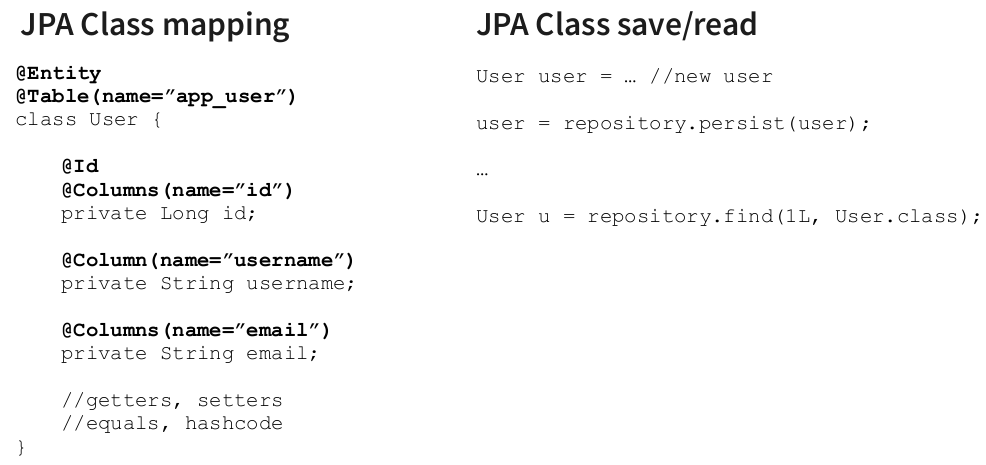
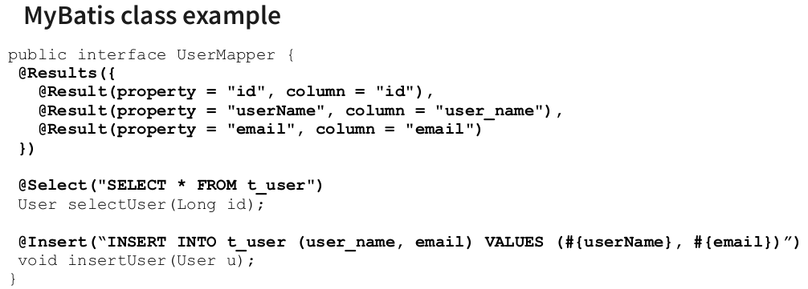

- ORM vs SQL
    - JDBC priklad
        ```
        Statement psmt = new PreparedStatement(“SELECT * FROM Users”);

        ResultSet set = psmt.execute();
        List<User> users = new ArrayList();

        while(set.next()) {
            String name = set.get(“name”);
            String email = set.get(“email”);
            User u = new User(name, email);
            users.add(u);
        }
        ```
    - ORM priklad napr JPA = javovska specifikace pro ORM
        ```
        List<User> users = repository.findAll(User.class);
        ```
- ORM (object-relational mapping):
    - premosteni mezi objektovym a relacnim svetem
        - tridy = tabulky
        - atributy = sloupce
        - nejsou stejny! (dedicnost, public/private)
    - zjednodusseni - vyvojari se nemusi starat o to jak vypada SQL
    - jednoduche na pouziti
    - past pokud nerozumime relacnim databazim nebo frameworkum - proste tomu jak to vnitrne funguje
    - ma to smysl?
    - pokud je aplikace mala - je pomalu i lepsi si SQL + mapovani psat sam
    - typy:
        - plne automatizovane - dela uplne vsechno
            - jednoduche na pouziti
            - slozite na SPRAVNE pouziti
            
            - Linux neni case-sensitive -> je lepsi presne specifikovat nazav tabulky a nenechat ORM si to odvodit z nazvu tridy
        - manualni ORM
            - programator si musi psat SQL
            - ORM pomaha s mapovanim objektu
            
        - vykonost
            - ORM je obecne pomalejsi
            - programator by mel vedet jaky SQL se generuje
            - asociativni nacitani (napr Post ma Liky) -> pres ORM jeduche, defakto automaticke, ale na pozadi vyzaduje vice SQL dotazu -> jeste vetsi problem je to pri direarchii trid -> nehoraznej pocet pristupu do DB
            - reseni problemu SELECT N+1
                - LAZY loading = nacti mi jen zakladni atributy a nenacitej asociativni objekty (vzdy kdyz mame relaci *-to-many)
                    - nevyhoda: kdyz pote zavolame getter -> vyusti v dodatecne SQL (donacteni)
                    - v pripade relace *-to-one je lepsi pouzit LEFT JOIN nez vice selectu
                        ```
                        SELECT * FROM user WHERE;
                        //for all users
                        SELECT * FROM address a WHERE = a.user_id = :userId
                        ```
                        ```
                        SELECT u.username, a.city FROM user u LEFT JOIN address a ON u.id = a.user_id;
                        ```
                    - mame pouze jeden SQL dotaz ale zas muzeme prenaset duplicitni data v pripade ze jeden uzivatel ma vice adres (obecne u *to-many)

- problem mezi relacnim a objektovym svetem
    - v relacni DB neexistuje koncept private atributu -> vsechno je public -> kdokoliv se k DB pripoji si muze precist jaky sloupecky chce
    - abychom mohli tridu ulozit do DB pouzijem gettery/settery -> poruseni OOP navrhu
        - dalsi moznosti je napr pouzit DTO (data transfer object) -> ulozime jen cast tridy do DB, po nacteni namapujeme DTO na reaalny objekt -> casove pomalejsi
    - dedicnost
        - realcni DB neumi vyjadrit dedicnost
        - moznosti reseni:
            - kazda trida v dane hirearchii = 1 tabulka
                - duplicitni atributy
                - pri prochazeni hierarchii musime volat vice dotazu nad danou DB
            - jedna tabulka ktera obsahuje vsechny tridy z dane hirearchie
                - hodne "blank" policek
                - neefektivni zpusob uchovavani dat
                - jednoduchy SQL query
            - jedna tabulka pro rodicovskou tridu
                - samostatne tabulky pro potomky
                - propojeni pres cizi klice
                - nejsou duplicitni sloupce
                - pri vyhledavani musime delat join
                - efektivni ulozeni
    - prijdeme o typ vztahu (pompozice? agregace?)
        - v pripade tridy je prochazeni jeho komponent jednodussi nez kdyz musime v DB "skakat" pres vice tabulek
    - -> vsechny tyto nedostatky = leaky abstraction