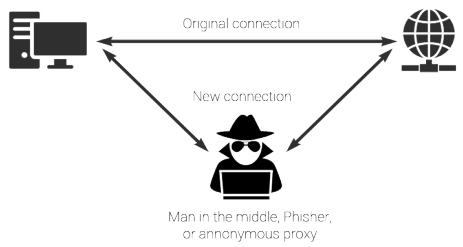
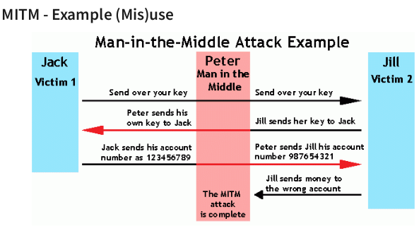
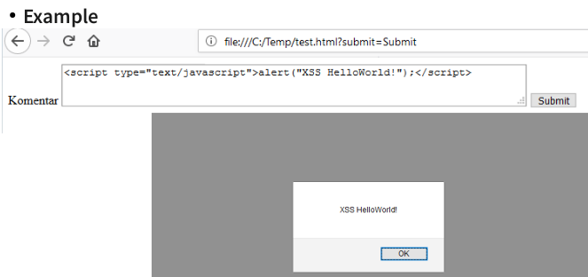

- proc resit bezpecnost z pohledu webovych stranek?
    - muzem byt pravne stihani
    - vede ke ztrate duvody
    - vede ke ztrate financi

- pokud manipulujeme se super-citlivyma datama -> lepsi si najmout security experta co tomu fakt rozumi 

- zakladni koncepty
    - sifrovani/hashovani dat
    - omezit pocet zpusobu interakce s danou aplikaci
    - pouzivat dobre otestovane a zname knihovny
        - lepsi nez se neco pokouset psat sam
    - cist bezpecnostni novinky ohledne danych knihoven
    - bezpecnost v podobe nahodne cesty kterou by utocnik musel uhodnout neni bezpecnost!

- oblasti bezpecnosti
    - prihlaseni uzivatele
    - ochrana citlivych dat
    - bezpecnost kodu (XSS)
    - prenos dat

- prihlaseni uzivatele
    - muze byt clovek/SW
    - muze byt implementovani napr pomoci Aspektu
    - ruzne stupne overeni ze se jedna o daneho uzivatele (level of assurance = LOA)
        - high-level assurance
            - banky napr vyzaduji prihlaseni uzivatele + kdyz chce uzivatel provest transakci -> jeste jednou zadat heslo; pri registraci musime do banky s obcankou, pasem atd.
        - low-level assurance
            - e-shopy, blogy, ...
            - prihlaseni pomoci Google, GitHub, ...
    - zpusoby autentikace
        - jmeno & heslo
        - certifikat
        - HW klicenka (telefon, USB)
        - pomoci tokenu (SMS, email)
        - vice-faktorova autentizace = kombinace predchozich
    - zajisteni ze uzivatel ma vymezena prava na zaklade jeho role
    - mozne problemy:
        - uzivatel se muze prihlasis s nevadidnimi udaji (napr SQL injection = "password = '; OR 1 = 1")
        - uzivatel muze delat nepovolenou operaci nad datty
        - uzivatel vidi neco co by videt nemel (ma pristup na urcitou stranku)
        - ukradeni totoznosti (CSRF)
    - uzivatel muze volat funkci pro kterou nema opravneni - musime zabezpecit jak v UI tak na strane serveru
        - kdo rika ze uzivatel musi pouzivat nase GUI a ne treba jen curl nebo postman
        - na strane server se to da implementovat napr pomoci askeptu - kontrola prav pred volanim dane metody
    - zabezpeceni na aplikacni vrstve: restrikce uzivatele na to jake operace muze nad daty provadet
    - zabezpecni na View/Controlleru: uzivatel nemuze videt neco na co nema dostatecne opravneni -> napr /admin
    - ukradeni identity
        - utocnik zistka pristup k prihlasene session daneho uzivatele: Cross-site-request-forgery (CSRF); po vyprseni timeoutu -> odhlaseni session (viz portal)
    - utocnik muze fyzicky ziskat pristup k pracovni stanici uzivatele
        - zamykani PC kdyz jdu na zachod

- Cross-Site Request Forgery (CSRF)
    - utocny kod ktery donuti prohlizet vykonat operaci (poslat pozadavek) na stranku, kde ma uzivatel otevrenou a prihlasenou session
    - autentizace je sdilena pro jeden proces daneho prohlizece
        - kdyz se prihlasim na portal a otevru 3 dalsi taby v prohlizeci -> ve vsech budu uz prihlaseny
    - terminologie:
        - same-origin policy = frontent muze poslat pozadavky pouze na tu stranku odkud jsme si stahli JS, CSS, HTML -> jeho puvod
        - cross-origin request = server muze dovolovat pristup (posilani pozadavku) i z jinych zdroju
            - vycet toho odkud muze server prijmat pozadavky je definovan v hlavicce HTTP kterou prohlizec nedovoluje nijak zmenit
                ```
                Access-Control-Allow-Origin: http://www.example.com
                Access-Control-Allow-Methods: PUT, DELETE
                ```
            - soucasti muze byt i sezman povolenych operaci (metod)
    - zpusoby zabezpecni:
        1) overeni ze source origin odpovida target origin
            - jine stranky nemohou na dany server pristupovat
            - overeni pres HTTP hlavicky  
            - origin = kombinace protokolu, hostname a portu
                - napr https://mypage.com/index.html neni to same jako https://mypage.com:8080/index.html
            - target - zalezi jestli je cilovy server za nejakoy proxy
            - kdyz neni proxy -> funguje jednoduse, neni s tim problem
            - pokud je proxy
                - vyzaduje nastaveni serveru (aplikace)
                - hlavicka host bude obsahovat URL serveru, ktery tam vlozi proxy, puvodni URL bude v X-Forwarder-Host
            - funguje v pohode pokud mam omezenou domenu, co kdyz ale mame verne API a chceme povolit pristup komukoliv -> potrebujeme jiny zpusob zabezpeceni
            - zpolehame se na prohlizec ze same-origin policy implementuje bez chyby
        2) posilani synchronizacniho tokenu (CSRF tokens)
            - nahodne vygenerovany token pro kazdy request/pri prihlaseni uzivatele
                - musi byt dostatecne slozity aby ho nikdo nemohl uhodnout
                - ulozen v session na strane serveru
                - vlozen do HTML stranky ktera se posila uzivateli, HTTP hlavicek
                - kazdy request musi obsahovat dany token
                    - viz semestralka reset hesla
                - potencialne nebezpecne v pripade GET, DELETE pozadavku
                    - token musi byt soucasti URL -> je viditelny, prohlizec si ho uklada do historie, uklada se do logu, ...
        3) Double Submit Cookie
            - nahodne vygenerovani token (dostatecne nahodny) pri prvni requestu
            - ulozen prostrednictvim cookie na strane klienta 
            - vlozeny do HTTP hlavicek/HTML s kazdym odeslanym dotazem
            - hodnoty v parametrech a odeslana cookie se musi shodovat (server tyto hodnoty pouze overuje -> nemusi si hodnotu tokenu ukladat do session)
            - jina stranka nemuze prepsat cookie jine stranky
            - musime mit dobre nakonfigurovany cely system
            - v pripade vice aplikaci v jedne domene si cookie muzou menit navzahem (je sdilena) -> podvrzeni jedne stranky muze zpusobit potencialni CSRF utok
        4) dlasi moznosti je nepouzivat ani session ani cookie
            - token se vytvori pri prihlaseni uzivatele
            - kazdy request obahuje zasifrovany token a server jej rozsifruje a zkontroluje validitu
    - zabezpeceni WS endpointu
        - pokud to je mozne tak pomoci AJAXu pridame X-Requested-With: XMLHttpRequest
        - zalozeno na tom ze browser vynucuje same-origin policy
            - nedovoli nam tuto hlavicku pridat pokud jsme mimo vlastni domenu
        - server overi jestli hlavicka obsahuje ocekavanou hodnotu
        - pro verejne API same-origin policy nefunguje
        - uzivatel by musel pri registraci poskytnout seznam domen odpud by chtel k aplikaci prihlasovat

- nezabezpecena komunikaci
    - vetsina aplikace vyzaduje posilani citlivych udaju mezi klientem a serverem (heslo, token, ...)
    - pokud mame nezabezpecnenou komunikaci, kokoliv na ceste od klienta k serveru si ji muze odposlechnout
    - -> komunikace musi byt zasifrovana

- Man in the middle attack

    
    

- sifrovani komunikace pomoci SSL/TLS
    - asymetricka sifra se pouziva pro vymenu symtreckeho klice
    - po vymene spolecneho klice chceme pouzivat symetricke sifrovani -> rychlejsi
    - protokoly vyssich vrstev zustavaji nezmenene
    - kazdy server muze pouzivat SSL/TLS -> to ale nenzamene ze je bezpecny -> potrebujeme overit jeho certifikat
    - CA (certifikacni autorita) je zodpovedna za vydavani certifikatu
        - musi zjistit ze skutecne jsme to my vlastni ten server -> rekne neco jako "vystav mi tenhle soubor na tuhle adresu" -> tim dokazeme ze mame kontrolu nad danym serverem
    - sluzby si mohou vytvorit vlastni certifikat pro interni testovani v ramci vyvoje
    - knihovny kolikrat odmitaji pripojeni kdyz neni verohodny certifikat -> da se to vypnout -> ale je to silne nedoporucovany

- nevalidace uzivatelskeho vstupu
    - kazdy zpusob interakce s nasi aplikaci je potencialni bezpecnostni riziko
    - injection utoku (napr SQL)
        - vetsina frameworku poskytuje funkce na validaci vstupu od uzvatele pred tim nez jsou poslany do SQL dotazy
    - Cross-Site Scripting (XSS)
        - Client-side script injection attack
        - neosetreni vstupu od uzivatele
        - viz posty v semestralce -> po vlozeni kusu kodu ho prohlicec vykonna - utocnik muze tak nasi aplikaci donutit komunikovat se serverm jinak nez chceme
            - ochrany proti CSRF utokum nebudou funguovat protoze jsme donutili tu samotnou aplikaci vykonavat utocny kod

        

- konfigurace primo na danem serveru
    - nedovolat SSH pripojeni pro uzivatele root
    - otevrit pouze nutne porty
    - smazat nepotrebne veci
    - omezit uzivatele co se tyce souboroveho systemu