Webová služba
- Motivace:
  - Jak propojit různé aplikace?
    - Napsanou různými programovacími jazyky
    - Nasazenými na různé platformy
    - Vytvořena různými lidmi
- SW navržený pro komunikaci mezi stroji po síti
- Je to rozhraní popsané ve strojově zpracovatelném formátem 
- Systém komunikuje s web. službou 
- Možnosti připojení aplikace na web:
  - Standartizované otevřené protokoly (HTTP, SOAP)
  - Standartizované otevřené datové formáty (JSON, XML)
  - výhody
    - Nestarám se o to v jak a v jaké technologii jsou ostatní applikace napsané

  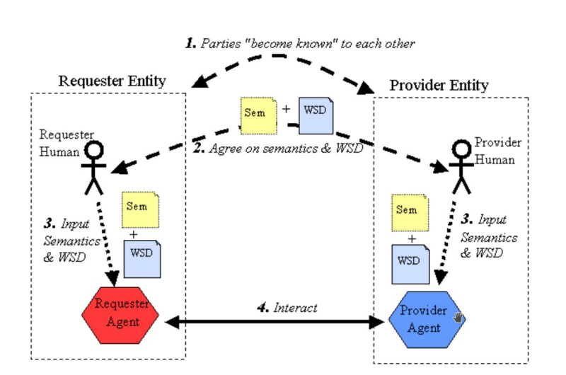
  
  - Obě strany se musí domluvit:
    - kontrakt (formát, struktura zpráv, protokol, význam posílaných dat)
  - Agent
    - konkrétní implementace pro posílání a římání zpráv
    - Stejná web. služba může být realizována více agenty (v různých prog. jazycích)
    - realizace web. služby/klienta
    
    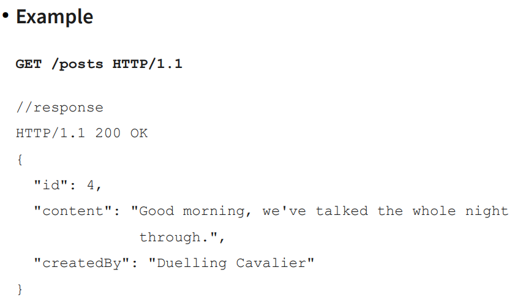
  
  - Black box pro klienty
  - Bezstavová - lehčí design a škálovatelnost
  - Užití:
    - znovupoužití komponent (autentizace, počasí)
    - propojení s jiným SW 
      - nezávislý na programovacím jazyce (web. standardy)
      - nezávislý na platformě (Raspberry PI, Win, Linux)
    - Implementace WS API
      - V MVC
        - Controller definuje endpoint a zpracovává požadavky
        - View je format který posílá data např. soubor JSON
- SOAP
  - komunikační protokol
  - definuje formát kterým posílá data - XML-based
  - definuje kodování pro datové typy
  - Složení:
    - Envelope (Obálka) obaluje SOAP zprávu
    - Header (hlavička) poskytují další funkce pro zprávu
      - zabezpečení (podpisový certifikát)
      - metadata (jazyk zprávy)
    - Body (tělo) zprávy
    - Fault chybové hlášky pokud nastala chyba
  - výhody:
    - flexibilní
    - rozšiřitelný
    - XML - definuje jak má vypadat takže definuje fixni strukturu, namespace, XSD
  - Nevýhody:
    - nestandardizovaný API design (pro každá služba může mít jiné API - jmenné konvence)
    - XML
      - velikost zprávy a složitost roste rychleji s počtem dat
      - nepřehledný pro mnoho dat a mnoho zanoření
      - Výkonostní issue - parsování
    
    Požadavek
  
    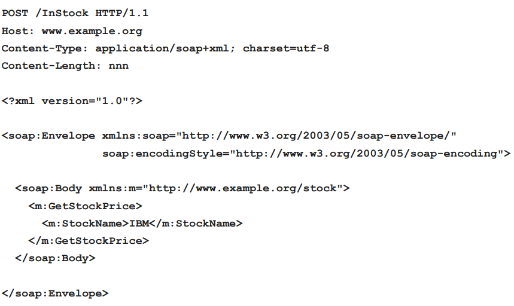
    
    Odpověď

    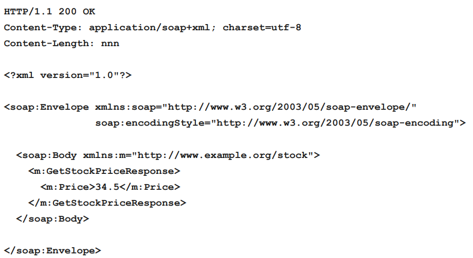
  
  - WDSL (webservice description language)
    - xml schéma popisující web. služby
    - Neomezuje se na SOAP ale běžně se s ním používá
    - umožňuje generování kódu
    - Elementy:
      - \<types\> 
        - (xml schéma) definuje datové typy používané web. službou

        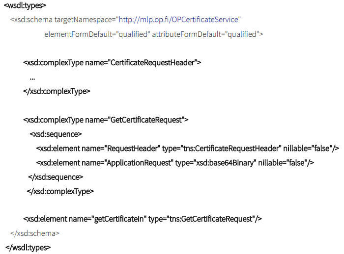

      - \<message\>
        - obálka okolo dat. typů, definuje datové operaci
          
        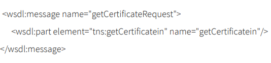

      - \<portType\> možné operace, zprávy zahrnuté jako vstup, výstup a při chybě

        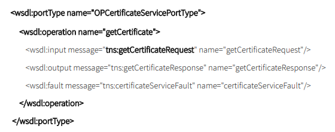

      - \<binding\> vazba na protokol (SOAP)

        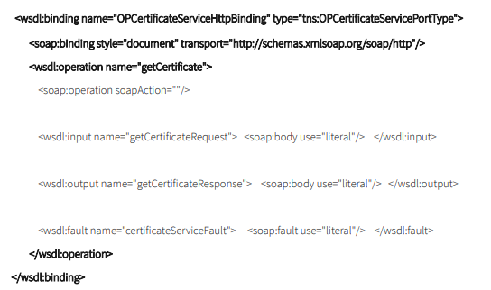

- REST (Representional State Transfer)
  - architektonický vzor pro návrh web. služeb
  - nejedná se o protokol
  - sada pokynů pro návrh API rozhraní
  - cíl: vytvořit API s jednoduchým použitím
  - zdrojově-orientovaný
    - endpoint pro Like: /posts, /users, /categories
  - použití HTTP metod (GET, PUT, DELETE, ...)
  - Bezstavový
  - Podobný adresářové struktuře
  - Nevýhody:
    - není to silver bullet
    - potřeba znát user-casy před návrhem API
    - Potencionálně nadměrné/nedostatečné načítání (fetching)

  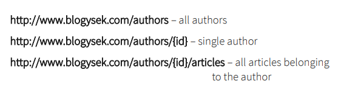

  - Identifikován pomocí URI např. http://www.blogysek.com/authors (zdroj "authors")
  - HTTP Metody
    - GET
    
    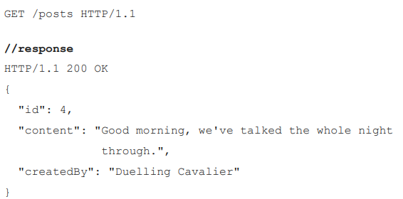
    
    - GET - query data
      - filtrování pomocí parametrů

    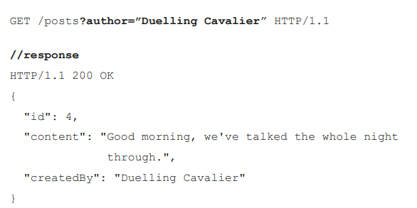
    
    - DELETE
      - nemusí mazat data ze serveru např. jen se nastaví parametr aby se nevracela

    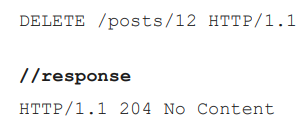
    
    - POST
      - vytváření, aktualizace dat

    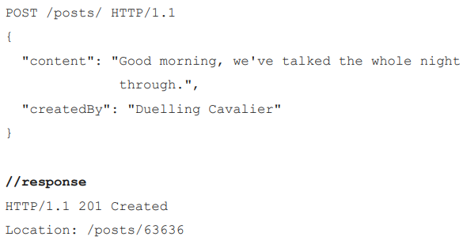
    
    - PUT
      - vytváření, aktualizace dat

    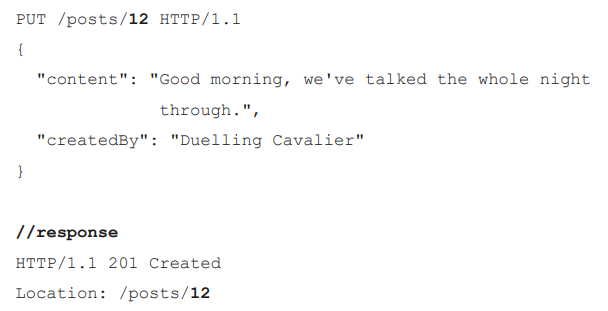
    
    - OPTIONS
      - vrací list povolených HTTP metod

    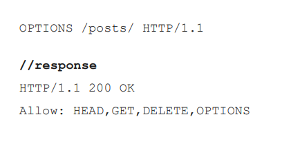

    - PATCH
      - pro částečnou modifikaci

      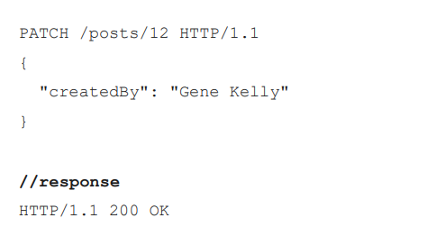

  - PUT vs POST
    - POST
      - známe přesné umístění resource: POST /posts/ HTTP/1.1 (generování id pro zdroj)
      - při opakovaném volání POST server negarantuje že proběhne vždy stejně pro stejný požadavek
    
    - PUT pokud nevíme kde přesně se nachází resource: PUT /posts/12 HTTP/1.1
      - garance že probehně více požadavků stejným způsobem
      - je indempotentní operace
  
  - Design
    - není potřeba implementovat všechny metody na všechny zdroje (entity)
    - co když potřebuju název akce v URI? např. pokročilé vyhledávání (bude obsahovat mnoho parametrů)
      - POST /posts/queries HTTP/1.1 nebo POST /posts/forms/search HTTP/1.1
  - Formát
    - XML
    - JSON (úspornější než XML)
    - YAML
  - HATEOAS (Hypertext As The Engine Of Application State)
    - možnost užití hypertext napříč API
    - Dobré API definuje entry-pointy a množinu zdrojů (entit)
    - Init volání entry-pointu vrátí seznam odkazů na zdroje (klienti nemusí znát strukturu předem)
  
    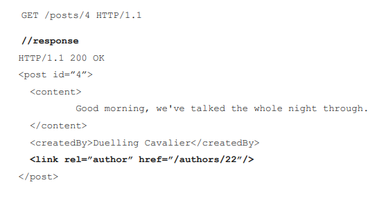
  
GraphQL
- API query language (i runtime)
- pokus vyřešit problémy RESTful API
  - Silný typový systém
  - over/under fetching

  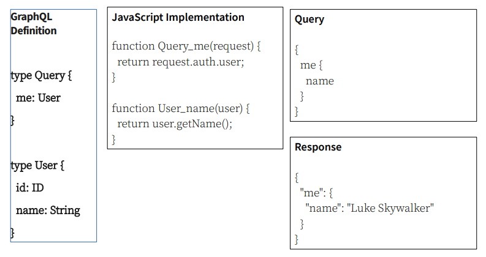

  - type - definice objektu, kterou je možné načtení ze služby
  - arguments - každé pole může mít argumenty

  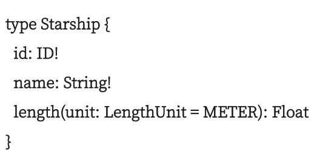

  - guery type - entry point pro načtení dat
  
  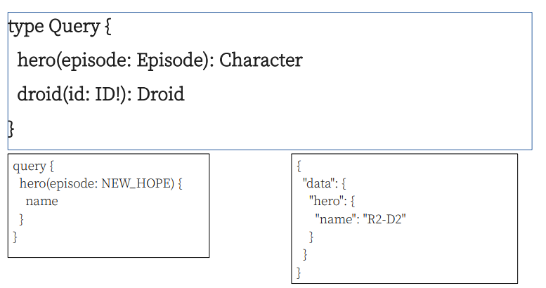

- ukázka endpointu

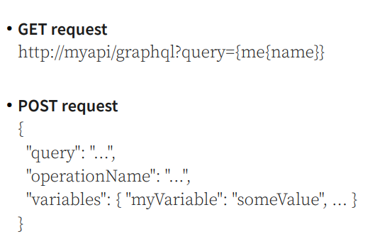

- odpověď

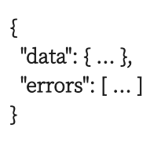

- výhody:
  - netřeba znát všechny use-case při návrhu
  - není over/under fetching
- nevýhody:
  - špatné škálování
  - formát jen JSON
  - složité ukládání do cache - každé API se chová jinak
  - těsná vazba mezi klientem a serverem
  
- GraphQL vs REST
  - GrapgQL je obvykle lepší než REST
  - GraphQL:
    - rychlý vývoj aplikací bez server-driven state
  - REST
    - distribuovaný systém
    - Se silnou potřebou řídit stav na serveru
    - Vysoké požadavky na škálovatelnost a výkon
  
Webové sockety
- je potřeba často si posílat zprávy s klientem nebo je nutné notifikovat klienta o nové události
- server jinak posíla zprávu klientovi jen pokud od něj dostane požadavek
- klient se jinak musí periodicky ptát  na nové info - při více uživatelů se může zahltit server

Polling
- klient často posílá požadavek na data a server hned odpoví zda má nebo ne

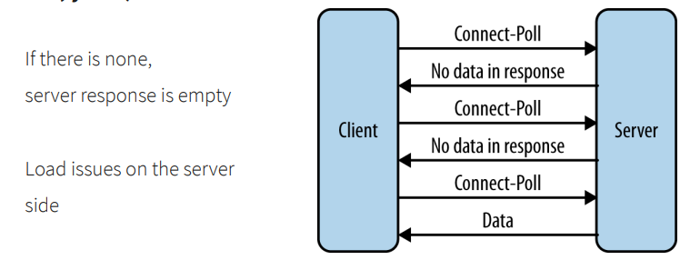

Long-Polling
- odpoví pokd bude mít co poslat klientovi nebo vyprší timeout a pošle že nic nemá co by poslal
- neýhoda že spojení drží než odpoví klientovi

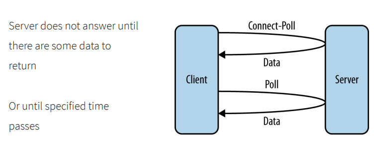

Web. Sockety
- zprávy se posílají v rámcích (obálkách)
- oboustranný komunikační protokol (založený na TCP)
- navázání spojení pomocí HTTP protokolu (ws:// nebo wss:// (secure))
- používá stejný port jako HTTP 80 a 443

Client

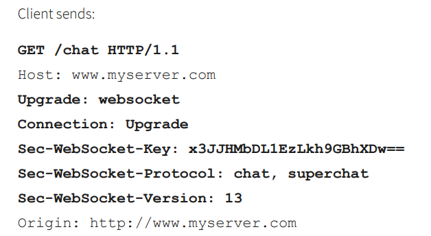

Server

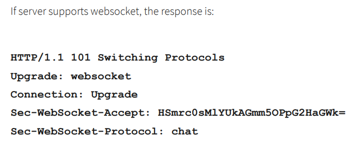

- HTTP handshake successfull - změní se spojení z HTTP na WebSocket (na stejném TCP spojení)

Ukázka zprávy

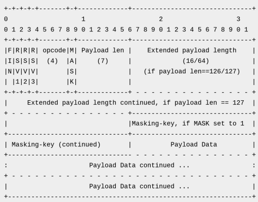

- FIN (1 bit) - indikuje zda je to poslední zpráva a může celou zprávu zpracovat nebo čeká až dojde celá
- RSVx (1 bit) - rezerovaný pro rozšíření protokolu (defaultně nastavený na 0)
- opcode (4 bity) - typ framu 
  - 0x01 – UTF-8 data
  - 0x02 – binary data
  - 0x00 – continued payload
- mask (1 bit) - zpráva může být zamaskovaná
- Payload length 
  - 0 - 125 indikuje délku payloadu
  - 126 - hodnota ukazuje zda následujcí 2 byte indikují délku (při posílaní více dat)
  - 123 - hodnota ukazuje zda následujcí 8 byte indikují délku (při posílaní ještě více dat)
- Payload data - skutečná poslaná data

Průběh komunikace
- první rámec pošle typ dat (binárka, text) obsah v opcode
- dále přijmá rámce a ukládá do cache dokud nepřijde poslední (FIN == 1) a celou zprávu zpracuje

Heartbeat
- kontrola zda pořád jeden druhého naslouchá
  - pošle ping - opcode: 0x9 a čeká až přijde pong - opcode 0xA
  - ping i pong mohou obsahovat aplikační data
  - pokud nedostane zprávu pong většinou spojení ukončí
- posílají se periodicky nebo před odesláním zprávy

Ukončení spojení
- při ukončení spojení je dobré informovat druhou stranu že ukončuji spojení
- obě strany mohou ukončit spojení (opcode 0x08)
  - může obsahovat i důvod 

Ukázka

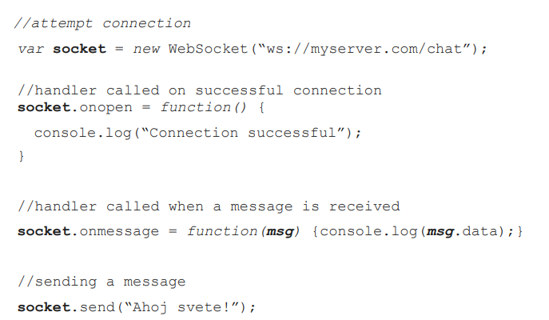
