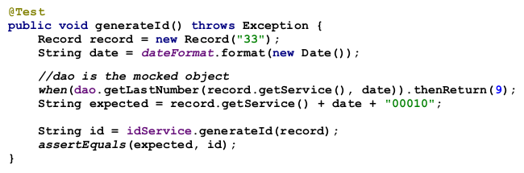
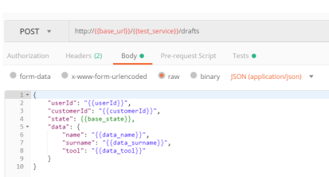
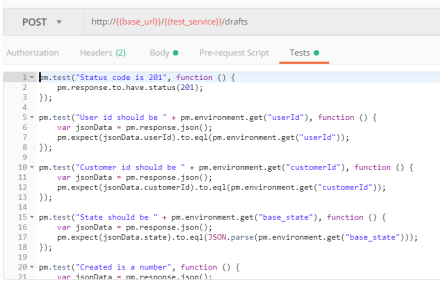
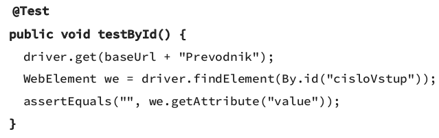
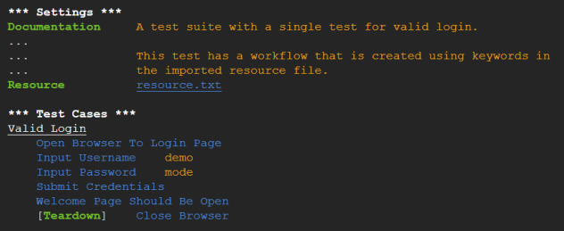
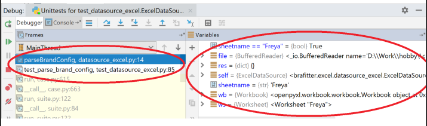
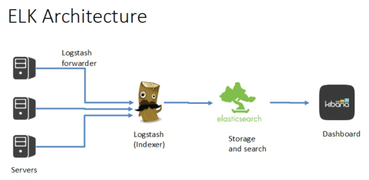

- kvalita SW se da merit:
    - pocet stiznosti od uzivatelu
    - pocet chyb nalezenych v produkci
    - cena za udrzbu
    - naklady na dalsi vyvoj

- validace = aplikace dela to co si zakaznik preje
    - dosazeno pomoci komunikace se zakaznikem

- verifikace = overeni ze aplikace dela co rika specifikace
    - dosazeno pomoci testovani
    - je dulezity s tim jak aplikace roste
    - je nutne mit dobry vyvojovy cyklus a automatizaci

- testovani
    - cil: nalezt chyby, rozbit aplikaci

- debuggovani
    - cil: nalezt priciny chyb
    - jednoduche pri vyvoji
    - tezke na produkci
        - nemuzeme si jen tak pripojit debugger
        - aplikace uz obsahuje realna data

- vlastnosti webove aplikace:
    - muze se rychle menit (HTML, ...)
    - prirozene je to vicevlaknova aplikace
    - potencialni muze celit vyssi zatezi nez je ocekavano (DoS utok)
        - nutne zotaveni

- Unit Testy
    - testuji malou cast kodu (vetsinou funkci nebo metodu)
    - vytvareny programatory
    - mely by byt na sobe nezavisly
    - idealne jedna mnozina unit testu testuje jednu tridu/modul
    - testujeme
        - korektni vstup
        - krajni hodnoty
        - nekorektni vstup (vyhozeni vyjimek, ...)
    - jedna metoda vetsinou vyzaduje vice testu
    - pokryti testama > 90% aplikacni logiky
    - pomahaji pri refaktoringu, pridavani funkcionalit, ...
    - specialni pripad je kdyz se testy pisou jeste pred zacatkem programovani - kriticke systemy, nuti nas premyslet o navrhu aplikace
    - pri zajisteni nezavislosti testu mame dva pristupy
        - stubs
        - mocks
    - stubs 
        - specialni implementace zavislosti, ktere metoda vyzaduje
        - napriklad vlastni implementace DAO rozhrani -> ulozeni dat do pameti
        - nevyhoda je kdyz mame velkou aplikaci -> muze se stat ze budeme mit velky pocet stubu (musime se snazit je napsat co nejvic genericke)
    - mocks
        - frameworky dynamicky za behu vytvari obrazy rozhrani (ktere potrebujeme) s dynamicky definovanym chovanim

            

        - generateId() vnitne vola metodu dao -> getLastNumber()
    - musime mit dobrou architekturu (SoC)
    - je jednodussi vytvaret objektu nez volat primo HTTP pozadavky -> nemusime mit aktivni HTTP server
    - levne
    - netestuji funkcionalitu celeho systemu

- funkci testy
    - testovani funkcionality aplikace jako celku
    - typicky se definuji use-casy, scenare
    - testovani proti bezici aplikaci
    - v jednodussich pripadech plni funkci i integtacniho testu -> pri testovani testujeme i komunikaci s DB atd
    - testovaci scenare
        - krok po kroku co ma uzivatel delat
        - kam ma kliknout, jaky data kam zadat, jaky vystup ma ocekavat
    - vyvojari by nemeli psat funkci testy protoze vi jak se aplikace ma chovat a za jakych okolnosti pada
    - mely by je psat lidi co nejsou seznameni s tim jak aplikace vnitrne funguje
    - automatizovane funkci testy
        - scripty
        - levne pri dlouhodobem pouzivani (SW nedela chyby)
        - nakladnejsi na napsani a udrzbu (ID v HTML, XPATH, atd se meni pomerne casto)
        - jednodusi pro testovani API webove sluzby
            - postman, insomnia

                

                

        - vyzva pri testovani Weboveho rozhrani
        - moderni frameworky umi simulovat browser (i headless mode - nemusi se vytvaret okno)
    - Selenium
        - sada nastroju pro testovani aplikace s pouzitim prohlizece
        - muzeme je but nahrat (manualne naklikat) nebo napsat pomoci IDE
        - musime pri navrhu stranek mit v pameti ze se budou testovat -> napr definovat ID

            
    
    - Robot framework
        - dovoluje definovat tetovaci scenare bez programovani

            
        
        - "vygeneruje" kod (pomoci klicovych slov)
        - naprvni pohled je videt co ten test dela

- integracni testy
    - testovani ze pripojeni a posilani zprav mezi dvouma systemama funguje tak jak ma

- vykonostni testy
    - mely by se pouste proti production-like prostredi
    - overeni ze aplikace zvladne zatez jako pri realnem provozu
    - overeni ze nove verze aplikaci nemaji vykonostni dopad
    - overeni jak se aplikace chova pri velke zatezi

- smoke testy
    - podmnozina nasi testovaci sady
    - jejich ukolem je overi ze nasazeni aplikace probehlo v poradku, aplikace odpovida (zda se ze funguje)
    - nesnazime se aplikaci zatizit
    - nechceme po sobe nechat data v DB
    - pouziva se na produkci (nechceme poustet celou testovaci sadu)

- testy "nepouzitelnosti"
    - testovani jak jednoduche je pouziti daneho UI - user experience
    - zeptame se nekolik uzivatelu jak se jim aplikace pouziva
    - zjistime jak uzivatele pouzivaji nasi aplikaci (nemusi byt tak jak jsme ocekavali)
    - nedaji se automatizovat

- debuggovani
    - hledani chyby v aplikaci
    - nepouzivat pomocne vypisy
        - muzeme je zapomenout smazat
    - podpora IDE (brakpointy)
    - aplikacni logy
        - velice dulezite po nasazeni aplikace
        - defakto predstavuji debuggovani v produkci
        - do produkce si nemuzeme jen tak pripojit debugger -> bezpecnostni riziko

- debuggovani v IDE
    - breakpoint = misto v kodu kde se exekuce programu zastavi
    - umoznuje sledovat hodnoty promennych, vyrazu, ...
    - od breakpointu dal mame kontrolu nad behem programu - step over, step into, step out, continue execution

        
    
    - temer vsechny prohlizece maji v sobe javascript debugger
    - uzasny nastroj pri vyvoji
    - bezpecnostni riziko pri debuggovani jiz nasazenych systemu
    - debuggovani server v produkci
        - nesmime sluzbu rozbit
        - nesmime poskodit data
        - nesmime si pripojit debugger
        - -> potrebujeme mit dobre navrzene logy

- typy logu
    - aplikacni logy - zpravy popisujici co se v aplikaci deje (jaka trida, jaka metoda, ...)
    - pristupovy logy - vsechny volani funkci aplikace z vnejsi site (ip, date, response, POST, GET, ...)
        - neobsahuje data (mohou byt citlive)
    - auditacni logy - sledovani co dany uzivatel dela
        - mohou obsahovat i citlive udaje
        - nejsou pristupne vsem lidem ve firme

- aplikacni logy
    - ruzne urovne
        - info: uspesne dokoncena akce
        - warning: nenastala chyba ale neco neni jak ma
        - error
        - debug: muze obsahovat datove struktury
        - trace: popisuje kazdy krok v aplikaci - zacatky, konce volani funkci

- access logy
    - vsechny HTTP pozadavky
    - request ID, session ID
    - parametry volani + hlavicky
    - cookies

- auditacni logy = kdyz uzivatel udela nejakou akci
    - kdo, kdy, co za akci, kontext (muze obsahovat data/udaji)

- Implementace (resp konfigurace pri pouziti)
    - formatovani
    - logove zpravy 
    - filtrovani typu logu
    - logovani do souboru, DB, konzole

- Moderni logovani
    - logy se neukladaji primo na aplikacni server
    - logy ukladame do cloud storage
    - ma smysl napriklad pri skalovani aplikace
    - mame jedno misto kam ukladat logy
    - audit logy NESMIME ztratit (aplikacni logy ani tolik nevadi)

        