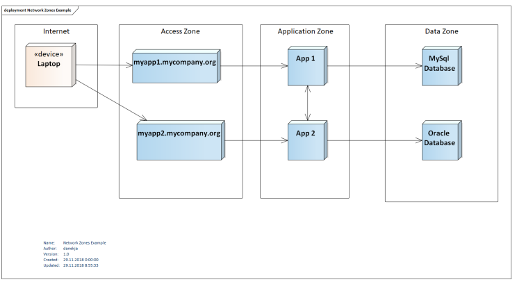
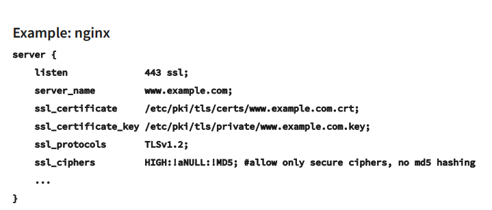
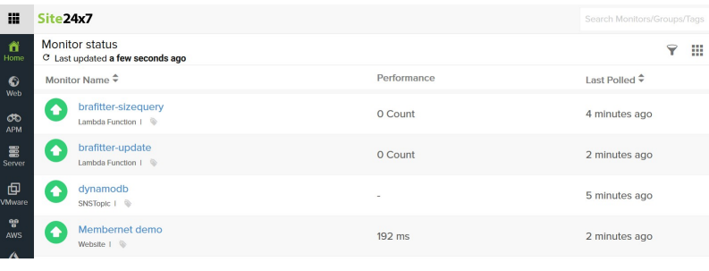
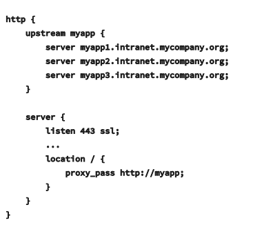
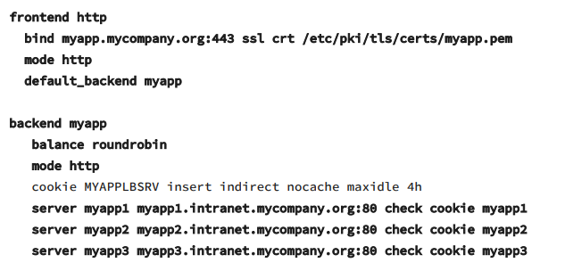

Deployments, operations

- ovlivňuje
  - bezpečnost
  - výkon
  - downtime během aktualizace
- prostředí
  - různá prostředí mohou mít různý vývojový cyklus
    - HW (výkon)
    - bezpečnost
    - stabilita
  - každý může mít různý účel:
    - Development
      - používají developeři k testování na svém počítači
      - požadavek na výkon: nízký
      - požadavek na stabilitu: nízký (vývojáři si mohou kdykoliv aktualizovat)
      - požadavek na bezpečnost: nízký (nereálná data)
    - Testing
      - používají testeři, vlastníci produktu k validaci a verifikaci implementace
      - požadavek na výkon: nízký-střední (potřeba odpověď v přiměřeném čase, málo uživatelů)
      - požadavek na stabilitu: střední (potřeba čas na testování)
      - požadavek na bezpečnost: střední (nereálná data, natavení podobné produkčnímu)
    - Před-produkční
      - používají testeři, operátoři k testovacímu nasazení v prostředí podobném produkčnímu, testování výkonu a bezpočnosti
      - požadavek na výkon: vysoké (prostředí co nejvíce podobné produkčnímu)
      - požadavek na stabilitu: střední-vysoké (downtime issue je považován za hrozbu, nasazení podle nějakého plánu)
      - požadavek na bezpečnost: vysoké (nereálná data, požadavky jako by bylo produkční prostředí)
    - Produkční
      - nasadím novou instanci s novou verzí a začnu přesměrovávat uživatele x nějaký čas odstavení třeba brzo ráno, půlnoc
      - používají zákazním
      - požadavek na výkon: vysoké (problém způsobí naštvaného zákazníka)
      - požadavek na stabilitu: vysoké (nasazení v předem definovaném čase)
      - požadavek na bezpečnost: vysoké (reálná data, zranitelnosti v zabezpečení je vážný problém)
    - Ostatní
      - Speciální testovací prostředí
        - testování výkonu
        - údržba produkčního nastavení je nákladná - zde se může otestovat
        - testování pro velké funkce
        - dlouho vyvýjené featury
- Přístup k vývoji (čím více automatizovaný tím lehčí vytvořit nové prostředí)
  - Naivní vývoj
    - všechno manuálně - sestavení, vývoj, configurace, nasazení
    - není potřeba extra infrastruktura
    - sklon k lidských chybám
    - pomalý
  - Skriptový
    - pokus co nejvíce automatizovat pomocí skriptů
    - Postup
      - nasazení na server
      - použití konfigurace
      - restart služby
      - testování
      - potřeba spuštění těchto skriptů na serveru
  - Automatický
    - Všechno plně automatizované od sestavení po testování
    - navržený sestavovací server
    - minimum lidské činnosti např. jedním tlačítkem 
    - celý nasazení vždy projde stejným procesem
  - CI (Continous Integration)
    - trénink co nejrychlejší integrace nových změn do kódové základny (master)
    - potřeba vysoce kvalitního testovacího procesu pro zajištění stability kódu
      - build server - nakonfigurován tak aby mergoval nové commity co nejrychleji do masteru
      - chyby nalezeny velmi rychle
      - vývojáři mohou dál pracovat než to server dokončí a otestuje
  - CI (Continous Integration)
    - trénink zaměřený na nasazení změn v malých cyklech
      - změny by měli být menší
      - flexibilní přístup pro poskytování nových funkcí, opravu kritických chyb
    - celý tým potřebuje znát jak dopadl build, testy, reporty - snazší na reakce
    - kvůli automatizaci je možné nasadit kteroukoliv verzi na jakékoliv prostředí kdykoliv
- Sestavovací server
  - Jenkins
    - open-source, široce používaný, mnoho pluginů
  - Gitlab Pipeline
    - pro projekty na gitlabu
  - TeamCity
  - Travis CI
    - CI server pro github projekty
- Kdo je zodpovědný?
  - Operátorský tým (systémový administrátoři)
    - rozumí serverům a konfiguraci
    - Chybí detailní znalost aplikace
  - Vývojáři
    - Mají detailní znalost aplikace
    - Často se nechtějí zabývat správou systému

DevOps
- přístup zužující propast mezi vývojem a provozem
- vývojáři a správci systému musí spolupracovat
- týmy sestaveny tak aby každý mohl:
  - dodávat funkčnost
  - testovat
  - nasazovat
  - udržovat
- Automatizace je kritická
  - omezení manuální práce
  - méně chyb (někdo zapomene něco nakonfigurovat, přepíše se)
  - rychlé doručení
- Sestavení a nasazení je automatické
- Automatizace infrastruktury
  - DevOps používá stejné principy pro instrastrukturu jako pro vývoj
  - popis infrastruktury v konfiguračním souboru
    - verzuje se
    - konfigurační nástroje pro správu (Ansible, Puppet, Chef)
- Virtualizace
  - Cloud dovoluje dobře škálovat
  - virtualizační nástroje jednoduše vytvoří identickou instanci serveru (AWS, OpenStack, vagrant)
- Kontejnery (Docker, Kubernetes)
  - jiná úroveň virtualizace
  - dovoluje dodat aplikaci společně s runtime prostředí
  - Build once, run anywhere
- Další operační tasky
  - Bezpečnostní konfigurace
  - Monitorování + škálování
  - Backupy
Bezpečnost
- firewall konfigurace
  - komunikace např přes HTTP (80, 443), DB (3306), oba potřebují SSH (22)
  - připojit se k aplikaci jen kdo smí a kam smí
  - rozdělení na síťové zóny
    - např db servery není možné přistoupit z internetu
    - při útoku kdy se dostane útočník do aplikace bude jen v jedné zóně
    - 
  - X.509 Správa certifikátů
    - každý certifikát má public a private část
      - public má omezenou platnost
      - po expiraci je potřeba nový
    - privátní klíč je generován jako náhodná data
    - CSR - žádost o certifikát
      - důvod proč ho chcete
      - jméno (domain name serveru př. myapp1.mycompany.org)
        - musí se shodovat při připojení jinak ho server odmítne
    - 
Monitoring
- Sběr infa
  - dashboard a vidíme data na jednom místě 
  - Kolik RAM používám, místa na disku, odpovídá a jak rychle
  - při problému dostat notifikaci (SMS, email, chat)
  - External
    - nemusí být na serveru
    - monitoring odpovědí na požadavky
    - response time
    - validace HTTPS cetifikátů
  - In-place
    - musí být nainstalován na server
    - monitoruje CPU, volné místo na disku, operační paměť RAM
  - 
Zálohy
- data jsou nejcennější věc
- V případě chyby lze obnovit data bez příliš velkých ztrát:
  - útok
  - neúspěšný upgrade s nefunkční migrací dat
  - SW/HW chyba
  - chyba uživatele
- Záloha nesmí trvat dlouho a nesmí sebrat moc prostředků (runtimu)
- uložena na odděleném místě
- Full x Incremental
- Kontrola záloh zda existují a jsou funkční
Load-Balancer
- řeší:
  - výkon
    - uživatelé distribuuje mezi více aplikačních uzlů
  - stabilita
    - pokud jeden aplikační uzel selže (umře) uživatelé automaticky přijme jiný (stejná URL)
- Pokud load-balancer umře?
  - Virtual Router Redundancy Protocol (VRRP)
- Příklady load-balance prostředí
  - Nginx
    - 
  - HA Proxy
    - 
- Příklad high-availability prostředí
  - VRRP
  - skupina více skutečných routerů, kteří komunikují
    - jeden umře, nový aktivní se navrácen pomocí backupů
  - Keepalived
    - potřeba nakonfigurovat každý uzel
      - virtuální IP
      - virtuální Router ID
      - Zkontrolovat script/command které volá jestli běží služba
      - priorita
      - heslo