UX

- Při příchodu uživatele na web je otázka pár vteřin jeslti se na ní rozhodne zůstat
- příklad dobrého UX je Alza
- nejen weby ale např mobilní aplikace, bankovní automat, automat na jízdenky v MHD, navigace
- UX designer
  - ptá se
  - zjíšťuje
  - analyzuje
  - konzultuje
  - přemýšlí
  - navrhuje
  - oponuje
  - testuje
  - spolupracuje s
    - klient (majitel/ředitel/marketing)
    - obchodník
    - výzkumník
    - analytik
    - copywriter
    - grafik
    - kóder
    - tester
    - programátor!!!
    - projekťák
  - základní vybavení
    - tuška, papír
      - každý to umí použít
      - hmatatelný
      - okamžitá zpětná vazba
      - tenká/tlustá fixa - důležitost

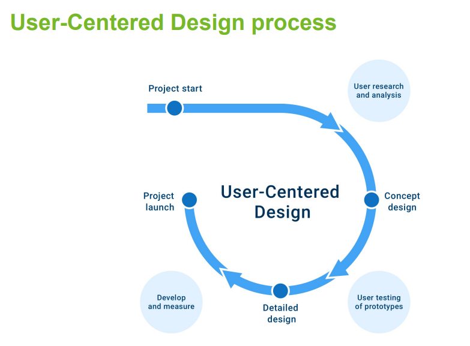

Pohled na projekt
- svůj pohled odborníka na weby
- klienta a jeho typ podnikání
- cílová skupina pro klienta
- zobrazovací zařízení výsledného projektu

Ptát se klienta
  - wireframy (návrh definující funkci a obsah stránek webu)
  - finální model
  
  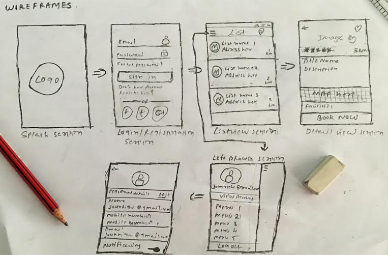

Uživatelský průzkum
- scénář rozhovoru ()
- ukázka scénáře pro průzkum cílové skupiny

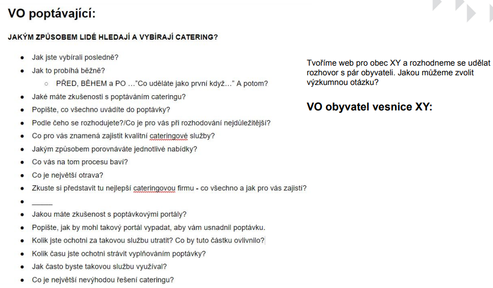

Návrh struktury
- skicování
- wireframe
- prototypování
- rozdělení do sekcí
- vazby a propojení
- pojmenování
- filtrování
- třídění

Návrh struktury

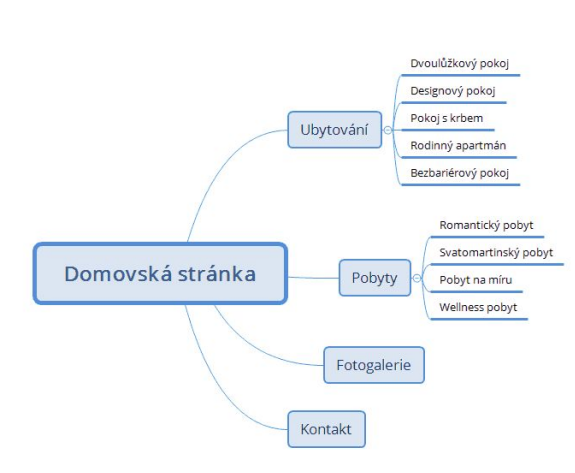

Návrh uživatelského rozhraní

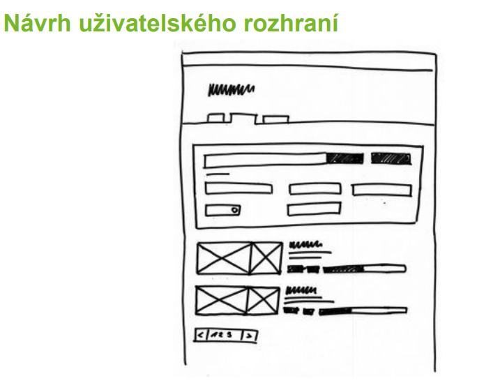

Wireframe

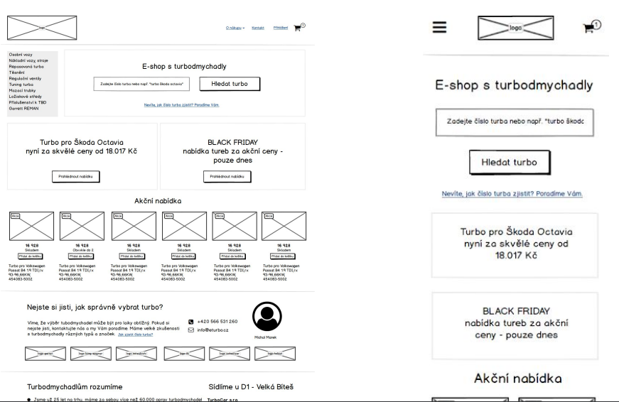

Prototyp
- návrh ve skutečném rozměru (grid)
- používat odstíny sedi pro zobrazení priorit
- nepoužívat černé pozadí
- jasné nadpisy
- reálná data, obrázky
- popisné placeholdery
- srozumitelné popisky
- propojení prototypu s poznámkami

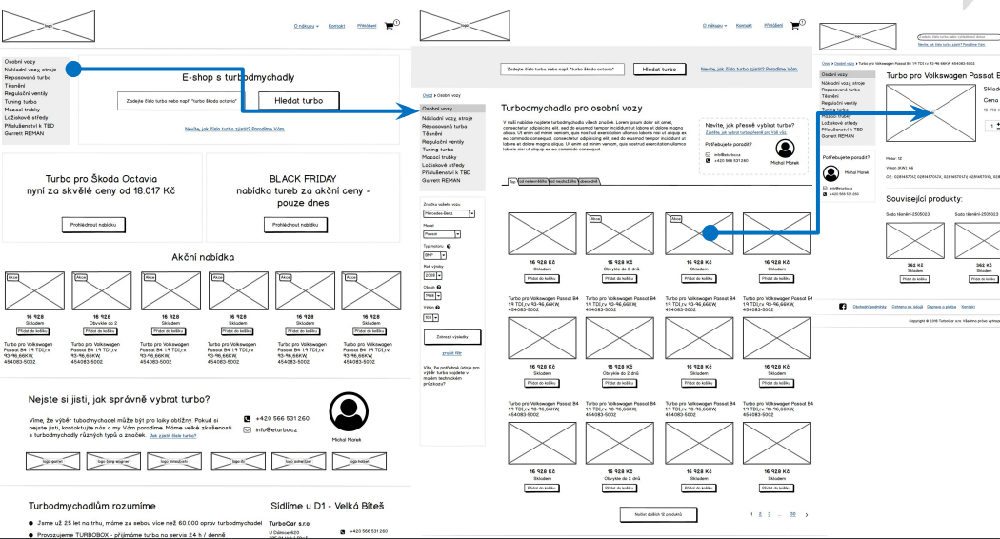

Top 10 pro návrh
- Projít starý web (pokud existuje)
- Seznámení s tématem a oborem
- Projít konkurenční weby
- Získání dat o návštěvnících
  - 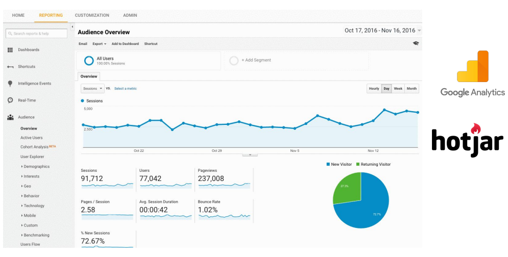
  - 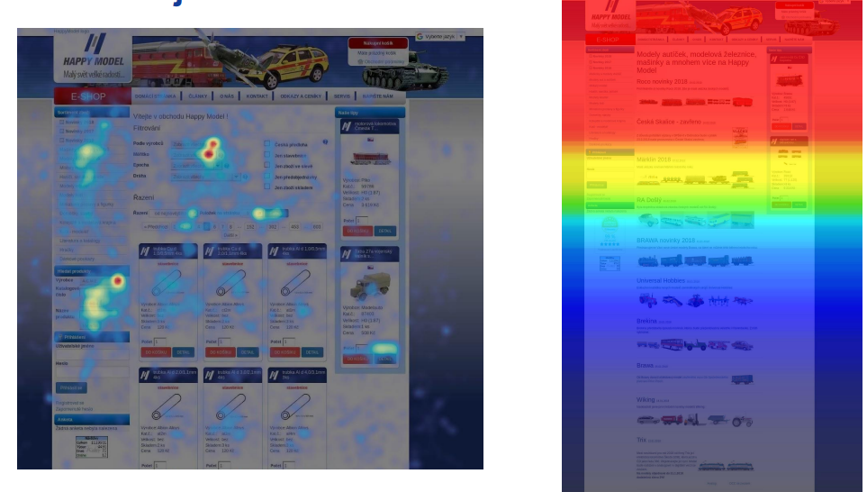 
- Konzultace s klientem (zjištění cílových skupin)
- Vyhodnocení konzultací a vytvoření závěrů
  - 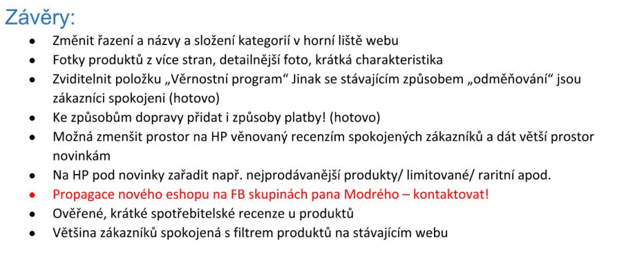
- Vytvoření designu
  - 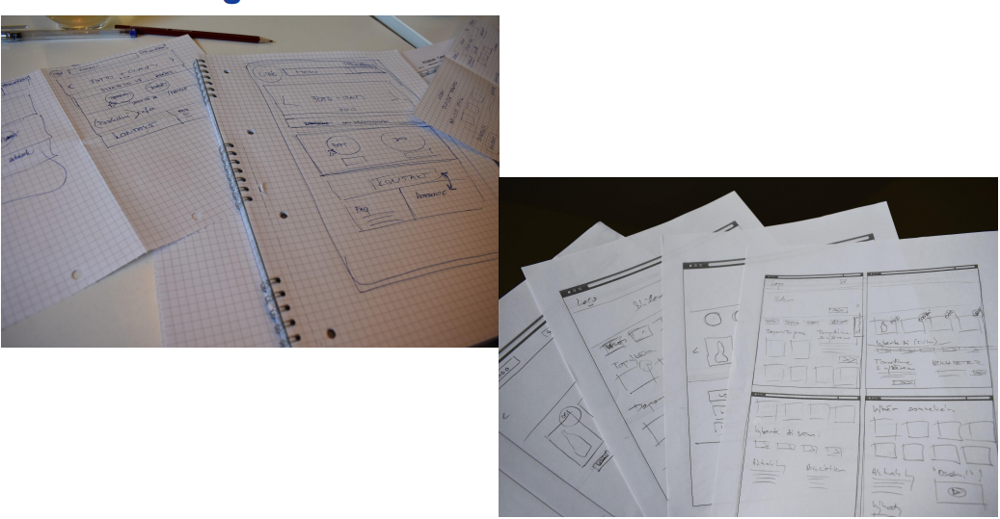
- Úprava návrhu (např. Balsamiq)
- Zkusit udělat i verzi pro mobil
- Otestování

SEO (Search engine optimazation)
- časté chyby
  - duplicity
    - www a bez www
    - koncovka
    - tiskové stránky
    - hash
    - parametry
    - produkt ve více kategoriích
  - řešenín
    - přesměrování (301, 302)
    - kanonizace
    - zákaz indexace
- Stránkování
  - 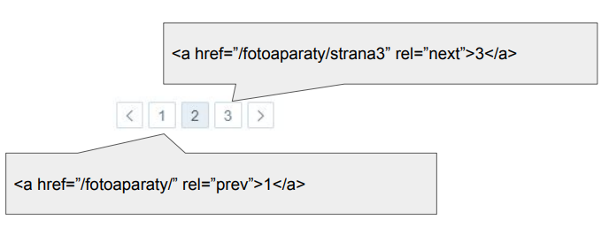
  - 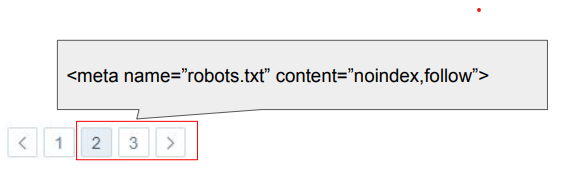
- Filtry
  - př. barva, velikost, cena, typ
  - Po odfiltrování změnit např. titulku, url, meta popisu, text
  - př. Barva + značka + velikost -> /adidas/black/L (může vést k duplicitě)
- Klíčová slova (titulek, meta popis)
  - duplicitní
  - nerelevantní
  - dlouhé
- Redesign
  - neměnit URL nebo přesměrovat přes 301
  - indexovat/neindexovat
  - důležitost titulků a popisů
  - obrázky
- SEO + UX
  - společně řěšit problém - orientace na business
  - přesahy do druhé role
  - předávání zkušeností
  - ověřovat a testovat
  - trpělivost
  - !!!Nenutit uživatele přemýšlet!!!