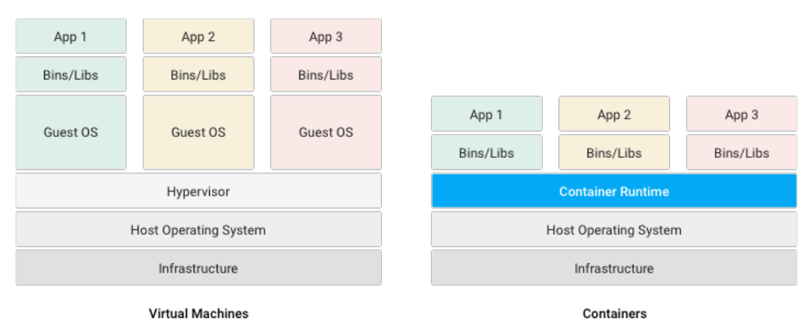
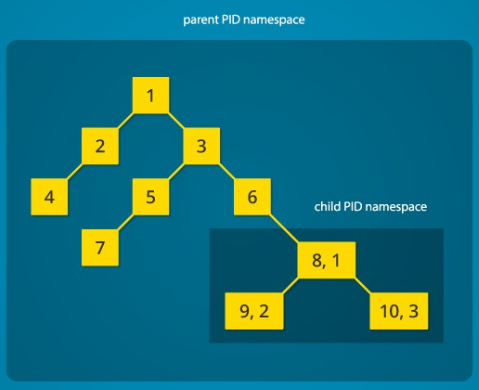
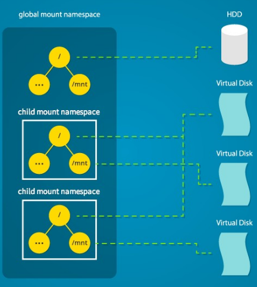
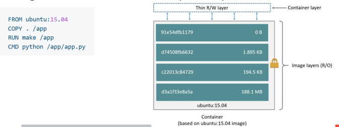
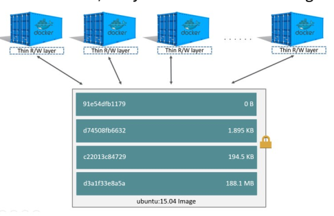
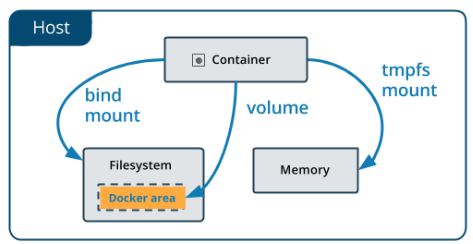
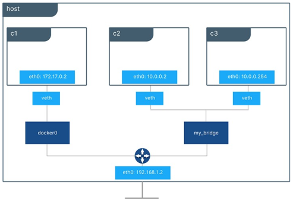
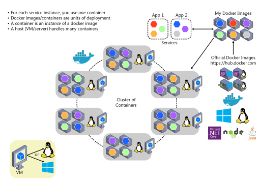
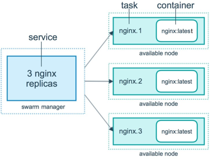

- abstrakce aplikace z produkcniho prostredi
- dovoluje vyvojarum si vytvorit testovaci prostredi, ktere odpovida realnemu nasazeni
    - v cloudu
    - na notebooku
    - na vlastnich serverech

- relativne jednoduche na pouziti temer na jakekoliv plaforme (ale Linux je lepsi)
- pripominaji hodne virtualni stroje ale jsou jinak implementovany



- VM maji vetsi rezii nez konterjnery
- kontejnery rychleji startuji
- kontejnery virtualizuji SW ne HW
- kontejner = mnozina bezicich procesu
    - navzajem se neovlivnuji - izolace procesu
        - stromova struktura -> proces pouze vidi PID 
        childu a ne nadrazeneho namespacu

            

    - kazdy kontejner = "jedna slozka" -> maji vlastni FS

        

    - funkce Linuxoveho jadra dovoluji limitovat zdroje pro skupiny vlaken

       
- Namespaces - types
    - cgroup
    - UID
    - sit
    - mount pointy
    - IPC
    - PID
    - hostname
    - Seccomp - zakazuje urcite syscally
    - Capabilities - prava dane skupiny procesu

- kontejnery
    - image = binarni obraz behoveho prostredi
    - kontejner = instance ibrazu (neco jako trida a instance)
    - images jsou ulozeny v repozitari (lokalni, verjny) napr https://hub.docker.com/

- LXC (implementace kontejneru - starsi nez Docker)
    - vyuziva funkce Linuxoveho jadra
    - API pro vytareni Linuxovych kontejneru
    - kontejnery = plne bezici OS
    - stejny vysledek jako VM ale implementovano pomoci kontejneru
    - ma flexibilitu jako VM
    - ma rychlost startovani jako kontejner (min narocne na zdroje)

- LXD
    - image manager zalozen na LXC
    - poskytuje image ve vzdalenem repozitari
    - jednoduche, bezpecne

- Docker
    - mladsi nez LXC
    - jiny pristup: jedna aplikace = jeden kontejner
    - docker neobsahuje kompltni OS
    - poskytuje izolovane prostredi

    - vytvareni docker image
        - textova specifikace = Dockerfile
        - s kazdym prikazem se prida nova vrstva (kopie FS) -> navysuje se celkova velikost image
            - povazovano za hlavni nevyhodu Dockeru
        - vsechny jsou read only
        - na konci je vytvorena jedna se knerou

            

            

        - po sestaveni ma image pouze jednu RW vrstvu (ta posledni) -> muze slouzit k vytvoreni dalsiho image
    - FS v Dockeru se nema povazovat za permanentni
        - v pripade updatu kompltne zrusime dany kontejner a spustime jiny -> jak uchovat data permanentne? 
    
    - moznosti ulozist
        - Bind mounts
            - namountovani slozky hostitelskeho OS do slozky v Docker konejneru

                ```
                C:\\Users\danekja\mysql -> /var/lib/mysql
                ```
            
            - musime vedet do ktere slozky chceme mountovat
        
        - Volumes
            - jsou vytvoreny ve FS hostitelskeho OS a namountovany do kontejneru
            - rozdil oproti bind mounts: volumes jsou vytvoreny Dockerem v miste ktere spravuje Docker (typicky napr /var/lib/docker)
            - volumes muzou byt vytvoreny nezavisle na kontejnerech
            - mohou byt sdilene mezi vice kontejnery

        
    
    - sitovani
        - Docker poskytuje vice moznosti toho jak resit sitovani
            - vytvareni vnitrnich siti
            - pripojovani kontejneru k internetu
        - Bridge networks
            - vytvoreny v ramci dockerovskyho demona
            - izolace kontejneru je realizovana na IP vrstve
            - kontejnery ve stejne siti s polu mohou komunikovat
            - defaultni bridge je vytvoren pri spusteni Dockeru
                - jsou tam prirazeny vsechny kontejnery, pokud to neni specifiky jinak definovano

            

            - ve vychozim stavu vsechny kontejnery vystavuji vsechny jejich porty (ale jen mezi sebou, ne do vnejsi site - host)
            - abychom k nim mohli prisoupit musime explicitne specifikovat jake porty chceme nabindovat - 80:8080

- Dockerizing Application
    - aplikace se musi nakonfigurovat pres environment variables

    

    - sila Dockeru se projevi pri nasazovani (testovani) aplikaci ktere vyuzivaji vice sluzeb
    - moznosti konfiguraci:
        - Docker Compose
        - Kubernetes, Docker Swarm
        - AWS, Google Cloud, Azure...

    - Docker Compose
        - obsahuje konfigurace jednotlivych kontejneru
            - vysveni portu
            - image
            - sit
            - volumes
            - poradi v jakem skuzby spoustet
        - velice jednoduche
        - nehodi se na nasazeni dal nez jen ve vyvoji
            - neresi load balancing
            - neresi automaticke nastartovani aplikaci kdyz spadnou

    - Docker Swarm
        - nasazovani kontejneru v klastru
        - jeden klast se navenek tvari jako jeden spusteny proces
        - propojeni vice Docker uzlu do jednoho klastru - manipulace pres jedno API
        - uzivatel porad vyuziva Docker-compose konfiguraci
        - Swarn se pote postara o nasazeni jednotlivych kontejneru 

        

        - Swarm obsahuje interni DNS server
        - kazda sluzba obsahuje zaznam v DNS
        - Swarm rese load balancing 
    
    - Kubernetes
        - zalozeny na internich projektech Google
        - poskytuje lepsi funkcionalitu nez Docker Swarm
            - automaticke skalovani
            - "health-check" on containers
        - nevyhody:

    - Kubernetes vs Dokcer Swarm
        - nevyhody Kubernetes:
            - "do-it-yourself" je sloziy
                - potreba dalsiho nastroje
            - vyhody Docker Swarm
                - jednodussi, stejne API jako Docker
            - Kubernetes je pouzivany a podporovany hlavnima cloudovyma providerama
    
    - Kde hostovat Docker klastry?
        - vlastni VM/servery
            - tezsi a slozitejsi pokud to myslime vazne s daty a dostupnosti
        - Openshift (RedHat)
            - cela platforma postavena na Kubernetes
            - velmi dobra vizualizace
        - Google Cloud, AWS, Azure
            - bud si muzeme spusit vlastni Docker image nebo take poskytuji Kubernetes cluster ktery pak muzeme vyuzivat
        - nevyhody vsech techto reseni je jejich cena