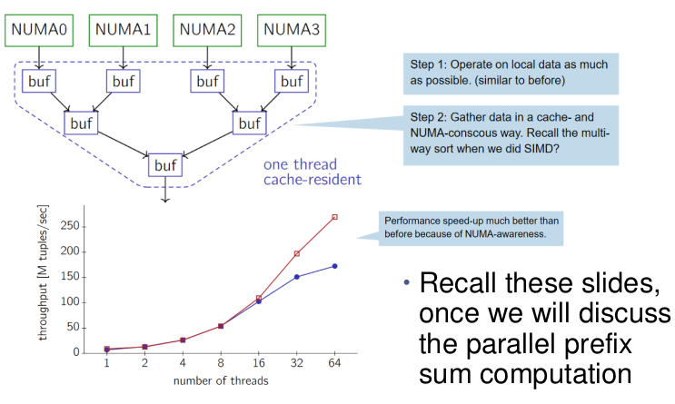
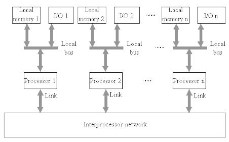

- program = staticky popis vypoctu (co bude pocitac delat)
- assembler = kompiluje assembly jazyk (instrukce, kterym rozumi clovek) do strojoveho kodu ciloveho procesoru
    - pokazde budeme mit nejakou uroven overheadu (pokud primo nenutime delat CPU co chceme)

- definice (fiber, thread, task)
    - exekuce programu
        - stavova aktivita
            - `CS:RIP` (program counter), registry, data ktera se zpracovavaji, ...
    - v jeden casovy okamzik se vlakno vykonava na jednom fyzickem CPU jadre

    - process
        - dynamicka kolekce vlaken (fiber, tasks)
            - stav procesu je dan stavem jeho vlaken
        - proces je spusten s jednim vlaknem (vytvori OS - main)
        - vlastni zdroje alokovane jednotlivymi vlakny
        - vlakna se mohou vykonavat paralelne (pokud existuje vice nez jedno fyzicke CPU jadro)
    - distribuovana aplikace
        - mnozina spolupracujicich procesu
        - vetsinou distribuovane po sitovych uzlech
            - jeden uzel ma `n` procesorovych jader
            - distrubuce je mozna dynamicky nebo na pevno
        - v extremnich pripadech se mohou vsechny procesy vykonavat na jednom uzlu
            - zastarale
            - z dob kdy 1 process = 1 vlakno
            - exekuce vice instanci stejneho programu
    
- Symetricky multiprocessor (SMP)
    - napriklad x86-64

      

    - vsechna jadra procesru jsou identicka
    - vlakno se muze vykonat na jakemkoli jadre
    - jednodussi pro planovac OS (proc?)
    - Front-Side Bus
        - processory (jadra) sdileji jednu sbernici pro IO a pamet (bottleneck)

              

    - Point-To-Point
        -  vsechna jadra jsou pripojena naprimo
        - eliminuje Front-Side bottleneck
        - Hyper Transport Consortium (AMD)
        - Intel Quick Path => UltraPath Interconnect

            

    - NUMA (Non-Uniform Memory Access)

         

        - DSM = Distributed Shared Memory
        - dalsi zpusob jak vylepsit skalovatelnost (predejit single SMP bus bottlenecku) 
        - definuje lokalni a vzdalenou pamet
        - kazdy processor ma vlastno lokalni pametovou oblast      
            - pristup do pameti se prodluzuje pri pristupu do vzdalene pametove oblasti => non-uniform
            - snizeni vykonu pri migraci procesu na jiny CPU
        - NUMA v modernim OS
            - moderni OS berou NUMU v potaz
                - rozdeleni pameti na NUMA oblasti
                - oddelena sprava pro kazdou oblast
                    - neznamena to ze se postara o vsechno
                    - napriklad VfA muze vyzadovat dalsi modifikace
            - snizeni vykonu u modernich SMP
                - presouvani vlakna na jine jadro s odelenou L1/2 cache
                - presouvani vlakna do jine patice proceseru => vynuceni pristupu ke vzdalene pameti a tedy i jine L3 cache

                

                
        
- Hybrid Processor Architecture
    - ruzna jadra v jednom processoru
    - stejna ISA (Instruction Set Architecture)
    - vysoce optimalizovana jadra pro nizke a normalni zatizeni pro usporu energie
    - komplikovane planovani
        - muze vyzadovat HW podporu planovani

        

    - napriklad Intel AlderLake, AMD StrixPoint, Apple M1, ...
    - muze kombinovat CPU a FPGA
    - ruzne instrukcni sady

        

- Asymetricky multiprocesor (ASMP)
    - napriklad SMP v kombinaci s GPGPU

        
    
    - spolu s globalni pameti ma kazdy procesor vlastni lokalni pamet a I/O pripojeni
        - sdilena pamet muze obsahovat poze minimum data ktere jsou vyzadovany
        - GPGPU muze mit jednoutnou pamet
    - jine ISA
        - OS nemuze akolovat proces na jakykoliv procesor
        - CPU/GPU/neural processor, ...
    - specializovane procesory pro specializovane tasky

- Multiprocessor s distribuovanou pameti
    - zadna globalni ci sdilena pamet
    - kazdy procesor ma vlastni lokalni pamet + I/O a rizeni komunikace se sousedy
    - typicky 2D mrizka, toroid (kruh), N-dimenzionalni krychle
    - preposilani zprav
    - vykon zavisi na
        - prirazovani ukolu uzlum
        - velikosti zprav
        - cestach kudy zpravy jdou (routovani)
    - hodi se pro pipeliny

        

- Granularita

    

    - cena synchronizace s lokalni pameti
    - cena posilani zprav v distribuovanem prostredi
        - male bloky dat = caste posilani zprav
        - velke bloky dat = dlouha doba doruceni
    - nazacatku je lepsi velikost bloku dat zvolit nahodne
        - velikost by mela byt tak velka aby byl uzel vytizeni i kdyz komunikuje s ostatnimy uzly

- HW a sitova topologie
    - obecne
        - regularni grafova struktura
        - kruh, mrizka, krychle
    - nepravidela: napriklad internet
    - routovani
        - fixni tpologie - muze dorucit pouze sousedum
        - adresou prijemce (klasicka IP)
        - adresou odesilatele (desilatel urcuje cestu)

        - 2D mrizka
    
            

        - toroid

            

    - parametry
        - N - celkovy pocet uzlu
        - Dij - vzdalenost mezi dvema uzly (sousedi maji 1)
        - dmax - nejdelsi cesta (nejhorsi pripad)
        - pocet sousedu (kolik uzlu je pripojeno naprimo k jednomu uzlu) 
        - bandwidth
            - agregovana - kolik nodu muze poslat zpracu paralelne
            - fault tolerant - kolik linek musi selhat aby cely system selhal
        - chceme:
            - maximalni pocet uzlu
            - malou dmax (skalovatelnost)
            - snizeni komunikacniho zpozdeni
                - mensi pocet sousedu (sitove karty a linky stoji penize)
            - maximalni bendwidth

- Sum in 2D grid
    - vezmeme vysledek z vrchodu (uzlu)
    - radky se secou paralelne

        

    - mezivysledky jsou secteny ve 3 krocich
    - celkove je potreba 6 kroku
        - `O(2x(m-1)) => O(m) => O(m^0.5)`

    - lepsi je agregovat vysledek uprostred
        - secteni radku muze probihat take paralelne (leva vs prava strana)
        - `m/2` operaci na secteni radku/sloupcu

- Systolic Array
    - tesne spojene jednotky pro zpracovani dat
        - synchronizovane, simplexni komunikace
    - zadny program counter, rizeno hodinami
    - masivne paralelizovano
    - specialni ulohy
    - data jsou ve vlnach

    

    

    - no need for
        - externi sbernici
        - hlavni/sdilenou pameti
        - interni cache
    - implicitne paralelni
    - zadne sekvencni kroky
        - sekvenci Amdahlovi zakony zde neplati