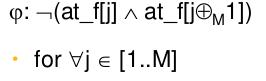

- temporalni logika
    - dokazuje spravnost programu
    - promenne popisuje stav programu a jeho vlastnosti
        - x ∈ V, kde V je slovnik (mnozina vsech promennych)
    - aplikovanim oparatoru na promenne a konstranty vytvorime vyrazy ktere popisuji vlastnosti programu
        - =, >, &, not, ∀, ∃, ...
    - rozsireni opratoru casovymi operatory
        - p `w` q (p waits (until) q)
    - automat s mnozinou promennych, pocatenim stavem, a konecnym poctem prechodu mezi stavy
    - hledame invarianci
        - vyraz ktery je pokazde `true`
            - napriklad pouze jedno vlakno muze drzet zamek
        - overeni podminky prechodu ze stavu `a` do stavu `b`
            - `{a} t {b}`

         

    - vecerici filozofove
        - 4 talire, 4 vydlicky, 4 filozofove
        - kazdy bud premysli nebo ji spagety
        - aby se mohl najit potrebuje 2 nejblizsi vydlicky
        - kdyz si kazdy vezme levou vidlicku => deadlock
            - jak dokazat, invariantne, ze se vsichni najedi a preziji?

        

        - M filozofu, M vidlicek
            - symetricke reseni prvni vezmu levou vidlicku a pak pravou

        

        - identicke komponenty - jednodussi na dokazovani
        - nicmene muze dojit k deadlocku

        - prave jeden filozof bude mit jinou interni logiku
            - vezme si pravou vidlicku prvni
            - uz nemame identicke komponenty

        - strasce jidelny
            - budeme mit semafor inicializovani na <1, M-1>
            - identicke komponenty
            - ale jedna navic co se bude muset dokazovat
    - priority
        - prirazeni cisla kazde vydlicce
        - filozof nejdrive bere vidlicku s vyssi prioritou
        - vsechno komponenty jsou identicke, zadna komponentace navic

    - Aloha, CSMA/CD, ..
        - filozof se pokusi vzit vydlicky sekvence
        - pokud selze, uvolni obe vidlicky a pockat nahodne dlouho dobu nez to zase zkusi
        - tezsi na dokazovani (nahoda) ale funguje je to
            - napriklad ethernet (do dosazeni prahove hodnoty aktivity odesilatele)

- Watchdog
    - potrebujeme sledovat chovani programu abychom detekovali zavady ci chyby
    - defaultne se jedna o paralelni ulohu
    - system se "zastavi" napr deadlock
        - spatny design, bug, koraptnute data, selhani HW, ...
    - idealne HW count-down casovac ktery bezi celou dobu
    - SW ktery sledujeme periodicky resetuje counter
    - Kdyz counter dojde k 0, watchdog zasahne (napr resetuje system)
    - System dava spatne vysledky (jedoduche na povsimnuti napr rozsah)
    - vysup systemu musi byt pretrnasformovany na monolitickou sekvenci
        - napr zbyvajici pocet hodnot na zpracovani
    - SW watchog muze mit SW chybu
    - HW watchog muze byt vyroben spolehlive
        - opravdu nezavisla na vsem ostatnim

- paralelni detekce chyb
    - hash, CRC, parita
    - duplicita kodu (stejny kod bezi nekde jinde -> kontrulujeme zdali davaji stejne vysledky)
    - kod napsany v ruznych jazycich

    

- vystupni charakteristika (output characteristic)
    - HW: duplikace, paria, CRC, ...
    - SW: 
        - duplikovane instrukce
        - vice vsupnich data streamu
        - N verzi daneho programu
        - asserce
        - fault-tolerance algoritmy

    - detekce chyby pomoci vice instrukci
        - automaticke zhorseni vykonu
        - mixovani master a shadow kodu pomoci prokladani

        

        - nakonec se porovnaji vysledky master a shadow 

        

- kontroly
    - konzistence
        - rozsahy adress a datovych typu, validni OP code jednotlivych instrukci
        - data audit - detekce korupce dat (napr CRC)

    - schopnosti
        - jestli je system vubec schopny vykonat pozadovanou operaci (permisson vs activity)

    - assertion
        - provadena pri kompilaci
        - spravne definovane reakce behem runtimu

- Zabraneni nehodam
    - kocovaci standardy + best practicies
    - eleminace hazardu pomoci designu
        - fail-safe - system se bezpecne vypne (aka passive safeground)
        - fault-tolerant - system pokracuje v cinnosti i kdyz s moznym omezenim (aka active safeguard)

- priklad Diabetes
    - skupina heterogenich nemozi
    - spolecny rys zvysene hladiny glukozy v krvi
    - nemuze se vylecit ale lecit
        - zmena zivotniho stylu
        - leky
        - transplantace organu
        - inzulinova pumpa (viz fail-save a fault-tolerant)
    - uzavrena smycka (mereni)
        - meri se hladina glukozy v krvi
        - pacient se snazi udrzet tuto hladinu v pozadovanem rozsahu

        

- Fail-safe - porucha senzoru
    - CGMS sensor cte hladinu glukozy v krvi
    - na zaklade namereneho signalu vypocte insulinova pumpa mnozstvi insulinu, ktery doruzi pacientovi
    - co kdyz selze senzor?
        - pupma prestane dorucovat insulin
        - spadne do dobre definovaneho stavu (zabraneni smrti pacienta predavkovanim)

- Fault-tolerant (hypo shock)
    - zda se ze senzor i pumpa pracuji jak maji ale z nejakeho duvodu padne hladina glukozy akutnimu hypoglykemickemu soku
    - kontroler musi tento stav detekovat
        - alespon prerusit dalsi dodavani insulinu a alarmovat pacienta
    - pumpa jako takova je bez poruchy (co skutecne vedlo k poruse?)
    - pacient si vyzada davku insulinu k zabraneni padu do hypoglykemickemu soku
        - pumpa nemuze dorucit velkou davku insulinu (predavkovani)
        - ikrementalni rizeni (vykonavani kritickych kroku)
            - dodavani malych davek insulinu inkrementalne

- insulinova pumpa (porucha kontroleru)
    - oba pripady poruchy (hopo- i hyper- sok) mohli byt zpusobeny udelostmi ktery jsou mimo rizeni insulinove pumpy
    - nebo mohl selhat samotny kontroler
        - nedetekovani vadne signalu ze senzoru
        - korupce pameti
        - selhani algoritmu

- engineer vs lekar
    - lekar muze povazovat uzavrenou smycku za validni pokud se lekarske ukazatele zlepsily
    - engineer si musi byt vedom ze pacient mohl mit pouze stesti ze nezemrel (pokud tedy nebyla provedena formalni verifikace systemu)

- staticka analyza => Runtime
    - 1) vymyslet system ktery ma byt robustni a fai-safe/tolerant z principu designu
    - 2) identifikovat hazardy a pokusit se je eliminovat
    - 3) impementovat system s runtime checky ktere povedou s dobre definovanym stavum kdyz nastane problem (chyba)

- obecny byzansky problem
    - system se sklada z nekolika soucasti
    - co kdyz nejaka selze?
        - duplikace komponent
    - co kdyz nejaka komponenta poslala vystyp do jine jednotlive komponenty v systemu
    - jak takoveto komponenty najit a isolovat v runtimu? => obecny byzansky problem
    - kazdy musi znat stejnou informaci X
    - kazdy musi vedet ze vsichni znaji danou informaci X
        - tento predpoklad musi byt validni pro vsechny
    - defakto to vsechno spociva v tom ze vetsina oddelenych (distribuovanych) komponent se shodnout (idealni vsichni) predtim nez se provede akce
    - priklad
        - dejme tomu, ze mame skupinu armad a kazda je rizena svym generalem
        - hlavni general dava rozkazy jednotlivym generalum
            - co kdyz jeden nebo vice generalu byli zdradci?
            - co kdyz by messenger ktery predava rozkazy byl zradce?
            - co kdyz by vlavni velitel byl zradce?

        - messenger je zradce
            - digitalni podpis potvrdi zdali je zprava autentizovana
            - kontrolni kod (CRC, parita) muze detekovat zdali zprava byla koraptnuta
            - absence zpravy by mela byt detekovana => implikuje synchronizaci
        
        - general/commander jsou zradci
            - pote co general prijme zpravu ji rozesle vsem ostatnim generalum
            - zachyceni nekonzistence a napraseni zradce

                
        
        - kolik zprav?
            - komunikace musi byt alespon castecni synchronni (casove razitka, logicky cas)
            - fail-stop by se mohl vyvolat uz s jednou nekonzistenci
            - fault-tolerant vyzacuje shodu alespon 2/3 generalu
                - => tolarance az 1 ze 3 chyb
        
        - kolik komponent muze selhat?
            - `n` = celkovy pocet komponent
            - `f` = pocet selhavajicich komponent
            - chceme aby v systemu bylo spravne pracujicich komponent > `f`
            - Nicmene `f` komponent muze byt v poradku (jen neodpovedeli)
                - z toho plyne ze `f` odpovidajicich kompoment muze byt poruchovych
            - Tim padem pozadujeme aby `(n-f)-f > f => n > 3f`