- GPGPU, OpenCL - vícejadrová architektura
  - Mapa procesoru
      
    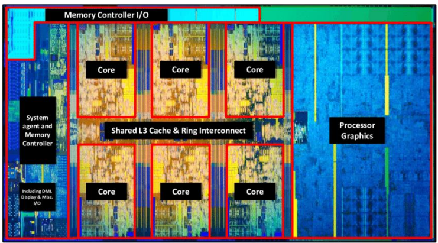
    
      - kolik křemíku je možné využít souběžně a efektivně
  - Jedno jádro procesoru a žádné SIMD

    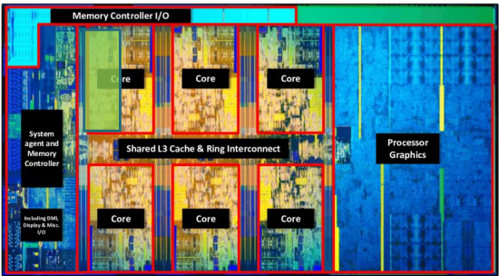
    
    - Jádro procesoru vykonává těžkou, univerzální práci.
      - efektivní predikce větví
    - využívá se jen zlomek tranzistorů
  - Jedno jádro procesoru a SIMD 

    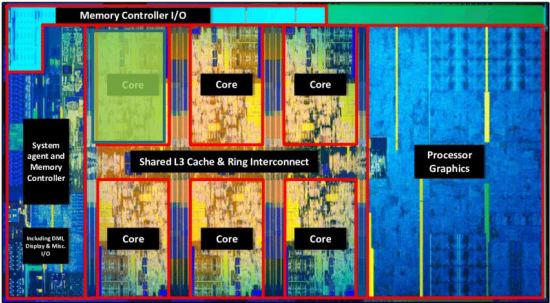

    - Instrukce SIMD zpracovává více datových toků najednou najednou
    - jádro se používá celé 
    - přesto je využit pouze zlomek všech tranzistorů
  - SMP a SIMD

    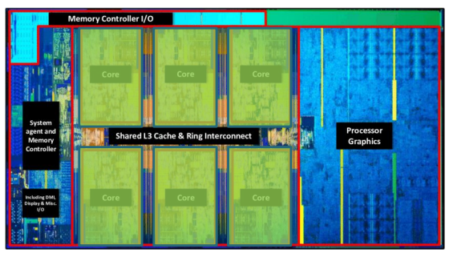

    - Značná část použitého křemíku
    - Přesto stále významná část (GPGPU) nevyužitá
  - GPGPU (vicevláknový)

    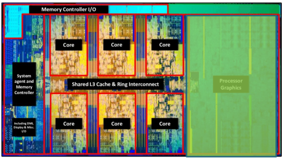

    - GPGU má mnoho jednoduchých procesorových jader
    - Vyniká při zpracování nezávislých datových toků
    - Řízení procesorem
  - SMP & SIMD & GPGPU
    - veškerý křemík je využit
    - efektivní programování a plánování?
- Obecný účel CPU vs GPU
  - GPU již není určena pro pouze počítačovou grafiku
  - Lze použít k urychlení matematických výpočtů
  - A=B+C paralelně s D=E+F je v pořádku
  - A=B+C; pokud platí A<C, pak D=E+F vede k podmíněnému skoku
    -V rozporu s filozofií návrhu GPGPU
  - Zpracovávané data musí být co nejvíce nezávislé.
  - CPU řídí DMA, které přenáší data z/do externí GPGU
- Task vs Data Paralelismus

    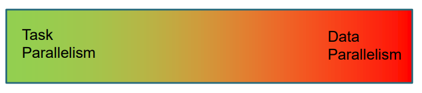

  - Task paralelismus (CPU)
    - Několik složitých úloh s větvením na několika datových tocích
    - Optimalizováno pro latenci (čas do dokončení)
  - Data paralelismus (GPU)
    - Mnoho jednoduchých úloh na mnoha datových tocích
    - Optimalizováno pro propustnost (počet dokončených úloh) 
- SIMD vs SIMT
  - SIMD - vektorové instrukce
    - datový paralelismus
  - SIMT (Thread)
    - několik jednoduchých procesorů GPU, které jsou uzamčeny při provádění stejného programu na více datových tocích.
      - Chová se jako SIMD 
- Slučování paměti
  - Prakticky všechny procesory přistupují paměti způsobem SIMD
  - CPU načítá paměť po cache-line blocích
  - Nezarovnané (Unaligned access), nemonotónně rostoucí adresy a volné (spare) přístupy plýtvají šířkou pásma paměti.

  - Nezarovnaný přístup (Unaligned access)

    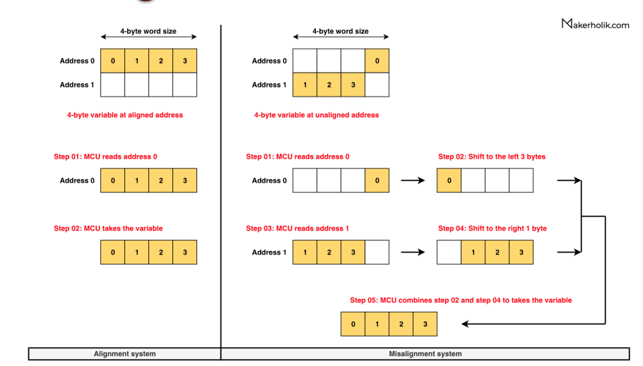

  - Přednačítání paměti
    - Sekvenční přístup podporuje prokládání výpočtu s předběžným načítáním dat
    - Náhodný přístup tuto výhodu kazí

    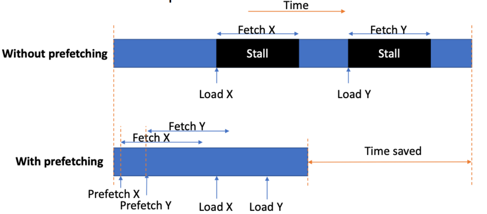
  
  - Volný přístup do paměti (spare memory access)
    - Čtení jednoho prvku bloku řádků mezipaměti plýtvá šířkou pásma

    
  
    - Uvažujme velikost bloku 4
    - ¼ využité šířky pásma, ¾ promarněné šířky pásma
- SMP & SIMD & GPGPU
  - SIMD - manuální a auto vektorizace
  - SMD - C++ PSTL (Paralelní standardní knihovna), Intel TBB
  - GPGPU - zahrnuto v další hodině
  - Pro výpočetně náročné úlohy jsme
    - Prověřené techonologie
      - moderní C++ s použitím SMP a SIMD
    - Jednotný programovací model nezávislý na dodavateli
      - OpenCl a CUDA
    - Jeden programovací jazyk C++ & SYCL, DPC++
- OpenCL
  - Zařízení (Device) - vykonává kód GPU, může se vrátit k CPU
    - Serverový procesor může využívat SIMD
    - Jedno zařízení má několik výpočetních jednotek
      - Jedna výpočetní jednotka zahrnuje několik výpočetních prvků a lokální pamětí
  - Kernel - funkce GPU, která se vykonává v zařízení
    - Jeden systém (host) může mít několik platforem
      - Jedna platforma může mít více zařízení př.:
        - CPU, CPU s integrovanou GPU
        - Externí GPU
  - Součet vetorů na CPU

    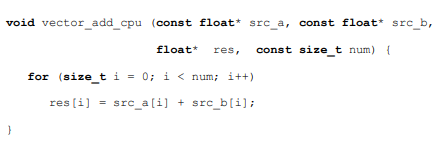

  - Součet vekrotů na GPGPU
    - OpenCL
      - kernel musí vracet void a být deklarováno jako __kernel
      - ukazatel do paměti musí být deklarován jako __global
    - Vektorový prvek se nazývá work-item
      - work-group obsahuje work-itemy
      - ND-range obsahuje work-groupy
    - Kernel spustí jednou pro každý work-item
  - Součet vektorů na OpenCL zařízení

      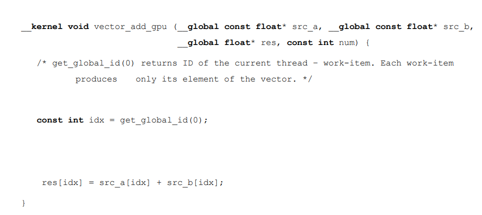

  - ND-Range
    - Work-group mapa na výpočetní jednotce
    - Work-item se mapuje na zpracovávaný prvek (element)
      
    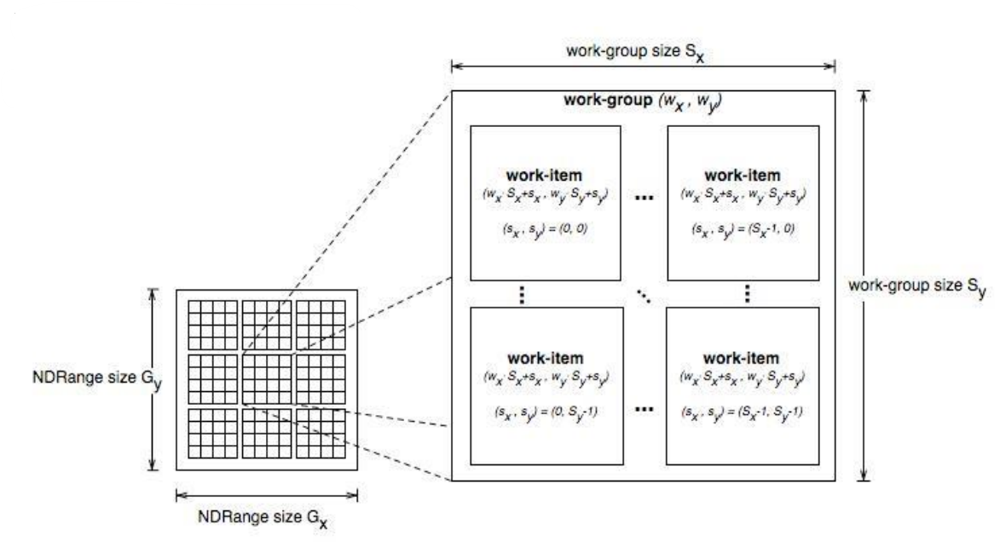

  - Wavefront
    - zahrnuje řadu work-itemů
    - menší než work-group
    - spouští se na jedné výpočetní jednotce odkud work-itemy 
      - odkud work-itemy provádí na prvcích zpracovávání paralelním způsobem s uzamčeným krokem (lock-stepped parallel fashion)

    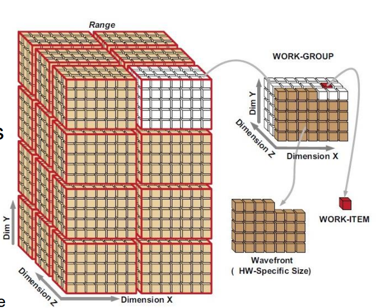

    - Programátor nemá kontrolu nad wavefront
      - Runtime OpenCL postupně posílá práci výpočetním jednotkám v blocích jednotlivých Wavefront
  - GPGPU subsystém

    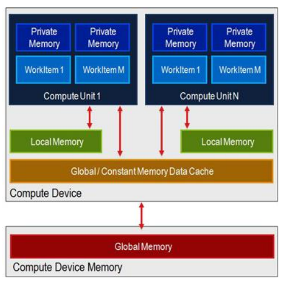

  - Globální paměť
    - nepomalejší ze všech
    - výkon závisí na přístupu do paměti podle patternu
    - Snažit se omezit souběžný přístup z více work-itemů do jedné globální adresy
      - mohlo by vést k tzv. bankovnímu konfliktu (bank-conflict)
      - přístup pouze pro čtení se používájí paměťové konstanty
  - Privátní paměť
    - rychlá pro jeden work-item
    - Žádná norma nedefinuje velikost paměti
    - Nadměrný objem privátně deklarované paměti bude namapována na lokální (a následně globální) paměť
      - významné snížení výkonu
      - používat co nejméně
  - Lokální paměť a konstanty
    - Lokální paměť
      - rychlejší než globální
      - Work-groupy sdílí data
    - konstanty
      - pouze pro čtení
      - optimalizované pro souběžný přístup do paměti (vyhýbá se bankovnímu konfliktu)
  - OpenCL Program
    - zkompilován ze .cl zdrojového kódu v hostu fro dané zařízení
      - Online kompilace
    - nebo ze SPIR-V (Standard Portable Intermediate Representation)
    - V obou případech se výsledná binárka optimalizuje pro konkrétní zařízení

    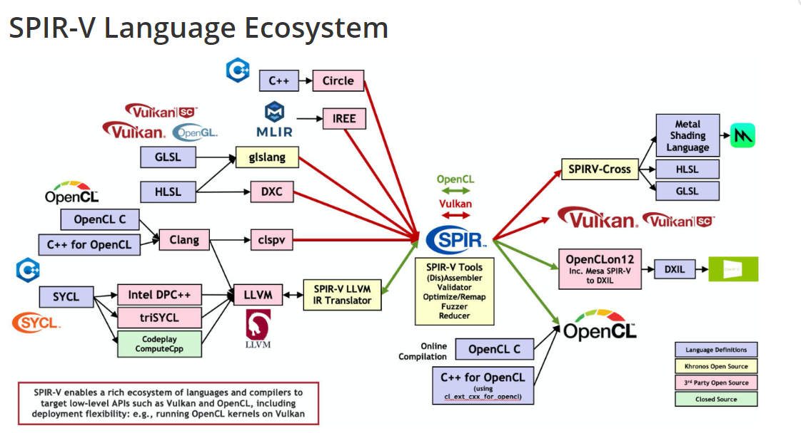

  - OpenCL fronta

    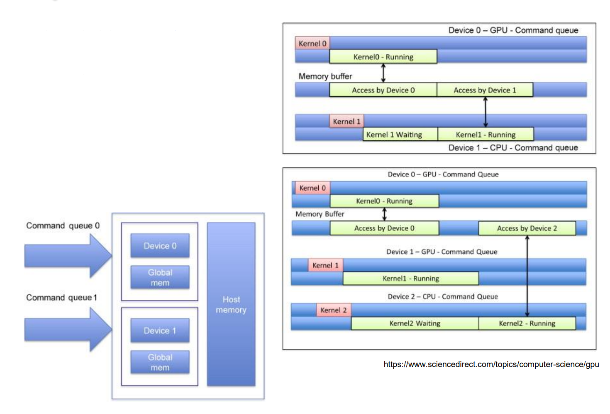

  - OpenCL program

    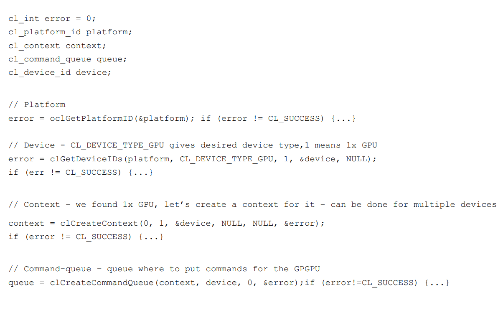

    - Než začneme cokoli počítat, musíme alokovat paměť, která bude pro zařízení přístupná pro čtení a zápis.

      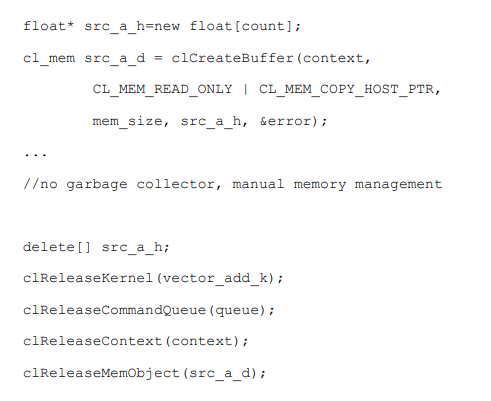

    - Program -> kompilace -> kernel -> výpočet 
      - Kompilovat jen jednou na každém zařízení aby se snížila řežie

      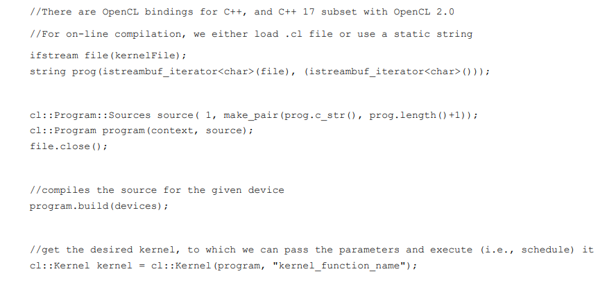

    - výpis chyb při buildu a warningů

      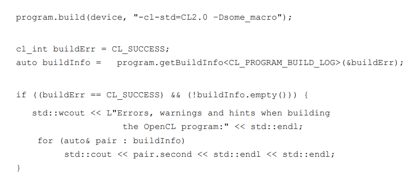
    
    - Předání parametrů
      - globální work-size je počet všech work-itemů
      - local size je počet pracovních položek v jedné work-groupě

      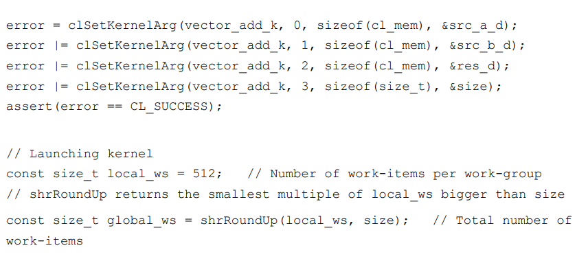
  
    - Pro spuštění kernelu předáme požadavek do fronty
      - tedy jej naplánjeme reps. požádáme OpenCL aby jej naplánoval

      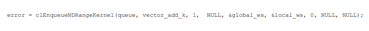
   
    - Dokud neskončí kernel mohou se dělat další věci
      - posledním parametrem je "clEnqueueNDRangeKernel", který je signalizován při dokončení jádra
      - Analogicky dva předchozí parametry dávají pole událostí, které musí být všechny signalizovány, aby se jádro mohlo vykonat
      - => může vytvořit výpočetní graf
    - Rekurze
      - Omezená dostupnost na omezeném souboru hw
        - Velké registry GPU, příliš malý zásobník
        - Předpokládejme, že funkce se inlinuje (inline), nikoli volá na GPU
          - simple hw => many ALUs
      - Zdržet se rekurze, upřednostnit iterativní přístup
        - rozdělit dílčí úlohy na vyhrazená jádra, která využívají paměť, která je již přítomna v paměti GPU
    - Incoherent Branching
      - nejlepší případ - plně paralelní if-else
      - nejhorší případ - plně sériový if-else
      - work-itemy vykonávají lock-stepped - SIMT
      - pokud některé work-itemy mají podmínku true a některé false musí je work-groupa provést dvakrát
        - nebo použít trik vynechání bloku else, pokud je prázdný
      - Navzdory pokrokům GPGPU zůstává větvení výkonnostním problémem
    - Typedef struktury
      - Je možné použít struct, ale musí být definován jak v kódu .c/.cpp, tak v kódu .cl

      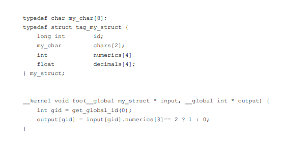
   
    - Redukční operace
      - násobení vektorů - vektor*vektor = skalár
      - nejprve necháme provést kernel násobení jednolivých prvků
      
      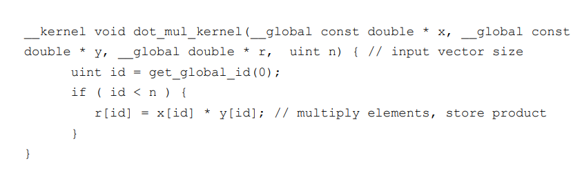
   
      - poté necháme spustíme kernel aby spočítal součet
        - Efektivní provoz GPGPGU není triviální
        - Ve skutečnosti by to mohlo být provedeno v jediném jádře
    - Násobení vektorů příklad

        
  
    - Barrier vs Fence
      - Fence
        - zaručuje, že všechny instrukce pro načítání/ukládání budou dokončeny před fence
        - Tj. dokončí se před jakoukoli jinou instrukcí load/store v daném pracovním prvku.
      - Barrier
        - synchronizuje pracovní položky v jedné work-groupě
        - je pomalá kvůli wavefrontám 
        - důležitý postih -> nepoužívat bariéry pokud není jiná možnost
        - bariéra nemůže synchronizovat work-groupy 
      - Pracovní skupiny lze synchronizovat pouze rozdělením jader
        - tj. spuštěním samostatných jader
        - Ztrácejí se registry, lokální a soukromé paměti
        - přetrvává pouze globální paměť
  - Cuda
    - Proprietární, nVidia vendor lock-in
    - OpenCL původně od společnosti Apple, nyní otevřený standard
    - Provádí se na hw různých výrobců (včetně nvidie)
    - CPU fallback
      
    
  
  - C++ AMP
    - OpenCL a CUDA jsou jazyky podobné jazyku C, ale stále se liší od C++
      - Nelze udržovat jednotnou code base
    - C++ AMP rozšiřuje jazyk C++ o klíčové slovo restrict
      - restrict(cpu)
        - Omezený kód se spustí na CPU
        - Stále můžeme využívat všechny syntaktické cukry jako OOP
      - restrict(amp)
        - Restricted se spustí na GPU, bez syntaktického cukru
      - restrict(cpu, amp)
        - Sjednocení restrict(cpu) a restrict(amp) => bez syntaktického cukru