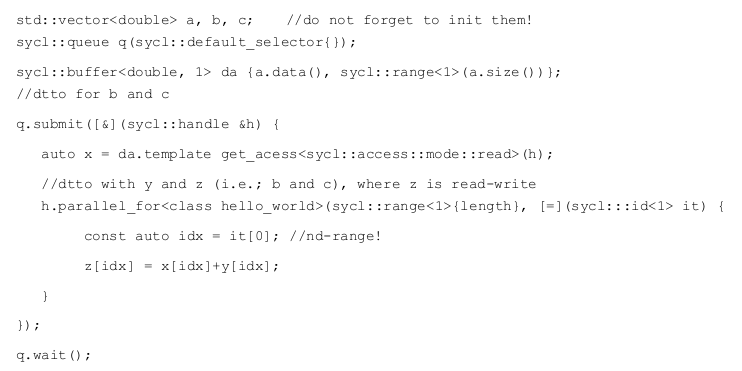
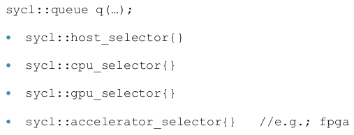

- SMP & SIMD & GPGPU
    - SIMD - manualni a autovektorizace
    - SMP - C++ Parallel STL, Intel One TBB
    - pro vypocetne narocne ulohy vyzadujeme:
        - prokazanou technologii
            - moderni C++ s SMP a SIMD
        - jednotne programovani, model nezavisly na dodavateli (vyrobci)
            - OpenCL, CUDA
        - jednotly programovaci jazyk
            - C++ & SYCL, DPC++
    
- SYCL pro OpenCL
    - pouzijeme standard, moderni C++
    - jednotna source code base
    - prelozeni pro odlisne ISA v jednom executable
        - heterogenni zarizeni (CPU, GPU, FPGA)
        - komplexni paralelni abstrakce
        - poskytuje planovani tasku a synchronizaci
        
     

    - soucet dvou vektoru
        
        - GPU

         

        - CPU

         

        - SYCL

         

    - SYCL buffers
        - obaluje bud read nebo read-write pristup k pameti pristupne zarizenim
        - explicitni pristup jako OpenCL (CUDA...)
            - kopirovani dat do/z daneho zarizeni pomoci volani OpenCL API
        - pristup podobny SYCL (C++ AMP = C++ Accelerated Massive Parallelism) implikuje presouvani dat do/z zarizeni kdyz je potreba
        - implicitni pristup
            - programator sestavi data-dependency graf
            - zadne explicitni volani OpenCL queue API
            - zadna explicitni obsluha udalosti
            - jen predavani lambda funkci
        - SYCL runtime dela optimalizace presunu dat
            - chceme se vyhnout zbytecnym kopiim

        - SYCL Hello world (vector sum)

            

        - SYCL Terse Syntax

            ```
            q.parallel_for (sycl::range<1>{length}, [=](sycl:::id<1> idx) {
                z[idx] = x[idx]+y[idx];
            });
            q.wait();
            ```

            - ne pokazde to muze byt takhle jednoduche

        - SYCL Device Selector
            
            

- OpenCL, C++ AMP, PSTL
    - kvuli tesnemu spojeni s OpenCL, mechanismy na pozadi budou nasledovat stejny vzor
    - navic mame jeden zdrojovy kod ktery se blizi C++
    - C++ Parallel STL (PSTL)

        

        - standardni algoritmy maji jako prvni parameter execution policy 
            - `std::accumulate, std::reduce, std::ex/inclusive_scan`
            - 69 algoritmy pretizenych v C++17

            

- DPC++
    - = Data Parallel C++
    - zalozeno na standardnim C++ a SYCL
    - Intovska implementace SYCL
        - s inovacemi SYCL navrzenymi spolecnosti Intel
        - soucast oneAPI toolkitu ktere zahrnuje i TBB

    

- Thread building blocks
    -  pred SYCL/oneAPI a PSTL
    - poskytuje efektivni SMP algoritmy
        - muze byt kombinovan s OpenCL/SYCL
    - poskytuje dekompozici tasku
        - programator uz nepracuje s vlakny naprimo
        - Task-stealing planovac snizuje cache-cooling efekt

- Cache Cooling
    - Dejme tomu ze mame `m` kernelovskych vlaken a `n` procesorovych jader, `m > n`
    - Jak se vlakno vykonava tak se jeho kod a data ukladaji do cache
        - take se jim rika hot data (hot in the cache)
    - Jak se prepinaji vlakne, tak vice vlaken zaplni cahce svymi daty
    - chache ma omezenout pamet => data ktera byla nejdele nepouzita se prepisi
        - kdyz se drivejsi vlakno zacne zas vykonavat, jeho data uz nemusi byt v cache a tim se zdri na stovky cyklu aby data nacetly z RAM zpatky do cache
        - detekovano s cache-miss HW citacem
    - TBB programtor se presouva od vlaken k taskum
    - TBB provides threads to justify `m <= n`
    - TBB podporuje rozklad na tasky (grafova struktura)
        - TBB chce aby jedno vlakno pracovalo na jedninem tasku dokud se task nedokonci
        - pote TBB pokracuje s dalsim taskem ktery nasleduje a idealne pouziva vysledky z predchoziho tasku
        - timto zpusobem se snizuje cache-cooling efekt
    - klasicke thread / thread-pool / farmer-worker takhle nefunguje (ty se hodi napr na GUI a IO)
        - ale v pripade vypocetne narocnych uloh jsou horsi nez tasky a TBB

- Task Stealing Scheduler

    

    - tasky A, B a C vytvorily podtasky, na ktere nasledne cekaji
    - vykonava se task D, tasky E, F, F se jeste nevykonavaji
        - potrebuji se vyresit zavislosti
    
    

    - rekurzivni deleni rozsahu na generovani tasku
    - kazdy blok predstavuje task, ktery provede vypocet nad danym rozsahem
    - listy redstavuji tasky ktere se jeste nevykonaly
    - interni uzly predstavuji tasky, ktere se jiz vykonaly ale rozhodly se dale rozsah rozdelit
    - nejvice zanorene tasky jsou nejvice chache-hot
        - funkce breadth-first rozsiruje strom taku tak aby se maximalizovala paralelizace
        - funkce depth-first udrzuje pocet tasku (nodu) omezeny
        - v praxi musime kompromisovat (HW zdroje - pocet jader)
    - kazde jadrno ma vlasky zasobnik stasku
        - tim padem nejnovejsi task je nejvice cache-hot
        - implementovano pomoci double-ended queue
    - kdyz se fronta cela zpracuje, pokusi se jadro "ukrast" cool data jineho jadra
        - krade z vrcholku fronty (kde jsou nejstarsi (cool) tasky)
    - TBB je optimalizovan pro zname procesory a jejich HW subsystemy

    

- tbb::task
    - zakladni pracovni jednotka (pro TBB planovac)
    - tbb::task muze
        - vytvorit podtasky
        - pockat na jine tasky az se dokonci
        - deinovat, ktery konkretni task se spusti az se task dokonci
    - runtime vytvoreni precedencniho grafu paralelniho vypoctu

    

- tbb::parallel_for
    - nakazdy prvek pole vola paralelne stejnou funkci
        - bud pres lambda funci (objekt s function operator)
        - nebo programator vytovri vlastni objekt s pretizenym funkcnim operatorem (`std::size_t operator()() const { ... }`)
        - v obou pripadech musi byt operator `const`
        - viz temporalni logiky a overovani spravnosti programu

    

    

- tbb::parallel_reduce
    - pracuje podobne jako `tbb::parallel_for`, ale funkci operator uz neni `const` protoze updatuje mezivysledky
    - TBB si instancuje tridru tak jak uzna za vhnodne

    - sekvencni pristup pro hledani minima

        

    - paralelni pristup pro hledani minima

        

         

    - trida musi implementovat 2 konstruktory
        - defaultni konstruktor ktery vytvori primarni instanci, kterou poslem do `tbb::parallel_reduce`
        - split konstruktor, ktery je volan z TBB, ktery prebirada data od existujici instance       
    - funkcni operator musi updatovat mezivysledky dane instance
    - metoda join produkuje jeden mezivysledek z dvou mezivysledku

    

    

    - parallel_* muze projit element kontejneru (pole) v jakemkoliv poradi
        - tak jak to planovac vidi nejlepe (stealing)
    - napr pri hledani minima v poli
        - pri kazdem runu muzme obdrzet jine indexy v poli
        - alternativne muzeme pouzit `prallel_deterministic_reduce`
            - prochazeni pole pokazde ve stejnem poradi
            - zpomaleni (limituje planovac)

         

- tbb::parallel_do
    - parallel_for a parallel_reduce se daji pouzit na kontejnery s pevnou velikosti
    - parallel_do umi zpracovat dynamicky se menici pocet elementu
        - muzeme pridat dalsi prvky v prubehu zpracovani
        - napriklad pri prochazeni grafu (e.g. hledani cyklu)
    - parallel_do by vyzadoval
        - vstupni proud s iteratory s nahodnym pristupem
        - nebo pridavani vice prvku najednou

    - paralelni vs seriovy `Foo`

        

    - tbb::parallel_do_feeder
        - pridani dalsich prvku do seznamu ve funkcnim operator (feed)

        

- tbb::parallel_do lambda
    
    

- tbb::parallel_pipeline
    - filter implementuje jednu fazi pipeliny
    - typ filtru
        - `serial_in_order`: filter probehne pouze nad jednim elementem v poradi v jakem byly vlozeny do pipeliny (FIFO)
        - `serial_out_of_order`
        - `parallel`: zpracuje nekolik elementu paralelne v libovolnem poradi

    

    - parallel_pipeline instancuje `n` stejnych pipeline aby se vykonaly paralelne
        - `n` je pocet tokenu (povoleni k exekuci), pocet vstupnich hodnot je neznamy
        - logicky bychom tento pocet chteli mit nekonecny, ale jsme porad omezeni poctem jader `cores >= n`

    

    

- Concurrent Container
    - TBB poskutuje paralelni obdobu STL kontejneru
    - TBB uzamkne pouze cast daneho kontejneru
        - snazi se vyhnout zamykani uplne ale ne vzdy je to mozne
        - konjerner uz nemusi byt v pameti kontunualne -> ovlivni iteratory

- Flow graf
    - `tbb::task::execute()` vytvori precedencni graf za runtimu
    - tento graf nemusi byt pri dalsim spustenim stejny
        - zpusobeno cekanim na navratove hodnoty funkci a tbb::task_group::run/wait
    - oproti tomu, flow graf popisuje vsechny uzle a hrany pred spustenim (priste zustanou stejne)
        - umoznuje aplikaci pouzit bufferovani, agregaci a pomocne uzle

    

    

    

    - uzel (node) predstavuje vypocet, ktery se spusti jakmile dany uzel prijme po hrane `continue_msg` 
    - specialni uzle duplikuji zpravu
        - 1 zprava jde nekolika sousedum daneho uzlu
    - nekolik uzlu muze cekat na zpravu od nekolika bezprostrednich uzlu (sousedu) aby odeslali jednu zpravu

- open_cl Node
    - primarne se kazdy uzel vykonava na CPU
        - nicmene, CPU muze ridit periferni zarizeni napr GPGPU
    - TBB implementuje flow graph async_node
        - umoznuje provest exekuci jinde nez na CPU (CPU jen ceka na vysledek)
    - TBB poskytuje opencl_node pro OpenCL
        - nemusi to by naprimo `.cl` source code, muze to byt napriklad SYCL
    - CPU ridi GPGPU pomoci DMA

    

- Load-Balancing on CPU & GPU

    