- Pipeline - Paralelismus na úrovni instrukcí
  - Efektivní kód
    - když všechna jádra běží na 100% neznamená že spuštěný kód je efektivní
    - Plat není důkazem toho, že produkujete efektivní kód
    - Efektivní paralelizace začíná s efektivním sekvenčním kódem
    - Moderní jádro procesoru má mnoho funkcí, které umožní, aby efektivní sekvenční kód překonal naivní paralelizovaný výpočet (kód)
    - Urychlení kódu neroste lineárně s počtem jader
      - proto je potřeba zkušeného a inteligentního programátora
        - navíc dokáže manuálně spravovat paměť
          - ruční správa paměti vyřazuje horší programátory
      - Každý kdo nakupuje více HW aby zlepšil výkon je buď zoufalý
      - nebo  se mýlí aniž by si to uvědomoval, pokud jde o výpočetně nenáročný projekt
    - Jazyky a jak ovlivňují výkon
      - Assembler
        - Vůz Formule 1. Velmi rychlý ale těžký na řízení a údržbu
      - C++
        - černý Firebird, macho car. Ve zkratce jediná volba, obsahuje lint
      - Pascal
        - VW brouk, malý, robustní, oblíbený u intelektuálními typy
      - Java
        - velmi pomalá
    - C++ je nejlepíš volba
      - pro výpočetně náročné kódování
      - obsahuje šablony, jejichž specializace vytváří nejvíce efektivní kód
      - Žádný jazyk bez šablon nemůže překonat výkon C++ při zachování přiměřené jednoduchosti kódu 
        - čitelnost a udržovatelnost
      - Moderní správa paměti v jazyce C++ nepotřebuje garbage collector
      - Ruční správa paměti vám umožní porozumět jí a využít ji na maximum
      - Assembler
        - příliš náročný na údržbu
        - používá se pro kritické díly, včetně memcpy
      - C
        - výhoda jednoduchosti, ale chybí šablony
        - horší typové řízení oproti C++
    - Out-of-Order Execution
      - jádro předem načte instrukce a detekuje závislosti
      - Jádro se pokusí změnit pořadí instrukcí, které se mají provést
        nezávislé instrukce paralelně
          
        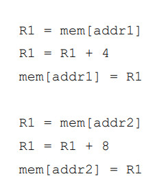
      
        - oba bloky používají stejný registr
        - přejeme si používat různé registry aby se vykonávalo paralelně
    - Přejmenování registu

      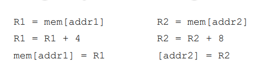
   
      - ISA (Instruction set architecture) 
        - definuje délku slova, módy adres paměti, procesorové registry, datové typy
      - Procesorová ISA pojmenovává konečnou sadu registrů, které jsou dostupné programátorovi
      - Uvnitř procesoru má každé jádro více vnitřních registrů, než kolik jich může programátor přímo použít.
        - Když kompilátor vyčerpá volné registry, jádro procesoru může stále spouštět instrukce paralelně, přestože to může vypadat nemožně.
      - Nicméně počet nepojmenovaných registrů je také omezen (pomalejší přístup do paměti)
        - u registrů je důležitá rychlost
          - složitější ale rychlejší než architektura zásobníku jako u Java bytecode
      - Omezení počtu proměnných v programovém bloku/funkci
        - rozdělit složitý cyklus do více menších
        - nepsát kilometrový kód s málo proměnnými, které mají nicneříkající názvy
    - Pipeline
      - ISA daného procesoru určuje dostupné tj. s čím programátoři pracují
      - Jádro provádí instrukci v následných fázích, jako je načítání, dekódování, spuštění a zpětný zápis výsledků
        - Instukce zahrnuje řadu mikroinstrukcí
        - přesný počet závisí na aktuální mikroarchitektuře procesoru
          - jsou skryté pokud nepřejde na assembly úroveň
      - Dokončení jedné instrukce trvá několik cyklů
        - Na 386 (3-fázová pipeline) procesor nedokončil více než instrukci za jeden cyklus
        - 486 pipeline prováděla mikroinstrukce paralelně (pipelined), čímž se zvýšil počet mikroinstrukcí počet dokončených instrukcí
        - Špičkový výkon znamená jednu dokončenou instrukci za cyklus

      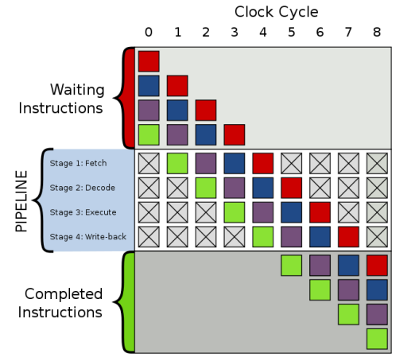
   
      - počet fází se liší podle CPU
        - Velký počet zvyšuje paralelizaci, ale prodlužuje dobu návratu při chybě

      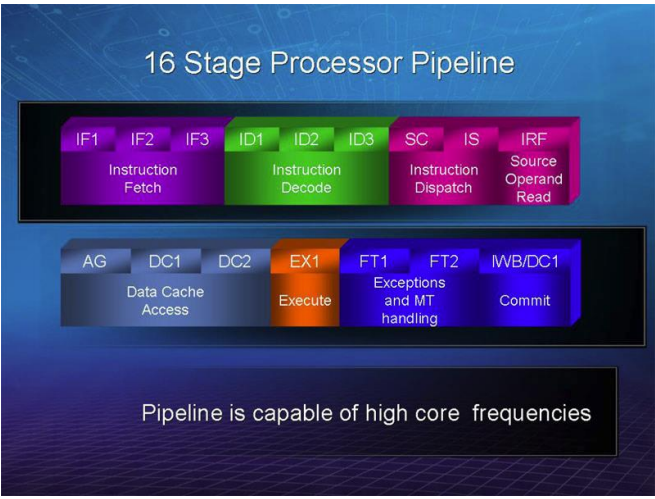
   
      -Spekulativní (Speculative) vykonávání  
      - Jádro načte další instrukci, zatímco se již provádí předchozí
      - Max výkon dokud nenastane nějaká podmínka
      - Když narazí na podmínku může
        - zastavit a čekat - pomalé
        - odhadnout (spekulace) výsledek podmínky
          - podmíněný tah (move) nebo podmíněné větvení (branching)
      - Pokud byl odhad podmínky v pořádku (jádro se ho učí několik cyklů později, nedochází ke ztrátě výkonu
      - Pokud jádro chybně odhadlo podmínku, musí vyprázdnit pipeline a provést rollback, protože nyní je hodnota podmínky správná
        - veliké zpomalení
      - Predikce větvení (saturating counter)
        - BTB (Branch Target Buffer) uchovává statistiky n-násobně opakujících se větví podmínek (které se vyskytly)
        - každá BTB položka má 2 bity
          - zvýší se o 1 pokud je podmínka splněna (nikdy nepřeteče)
          - sníží se o 1 pokud není podm. splněna (nikdy nepodteče)
          - predikce: < 2 podm. bude false, > 1 podm. bude true
        - neexistuje-li žádná BTB položka (nově se vyskytla) => statické větvení -> predikuje že podm. je true

        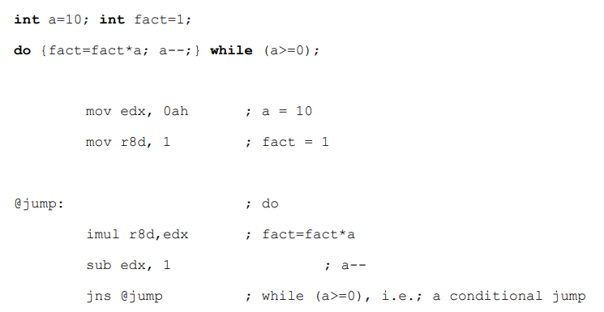
   
        - Jedna proměnná pro řízení cyklu, jedna chybná předpověď (mispredikce) na konci cyklu

        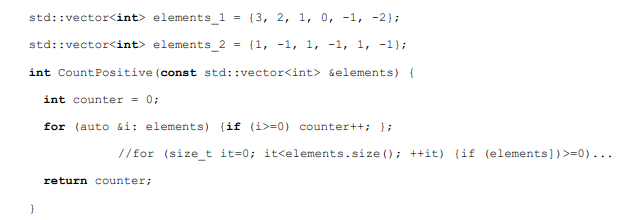
   
        - jedna chybná predikce "iterátoru i" na konci cyklu for
        - Pouze se saturating counterem
          - jedna mispredikce pro element_1 a 1-bit counter
          - dvě mispredikce pro elementy 1 a 2-bit saturating counter na iterátoru it se musí snížit 2x
          - element_2 způsobí že saturating counter bude vždy mispredikce (potřeba použí jinou predikci)
      - Predikce větví (Branche prediction) - dvouúrovňová adaptece

        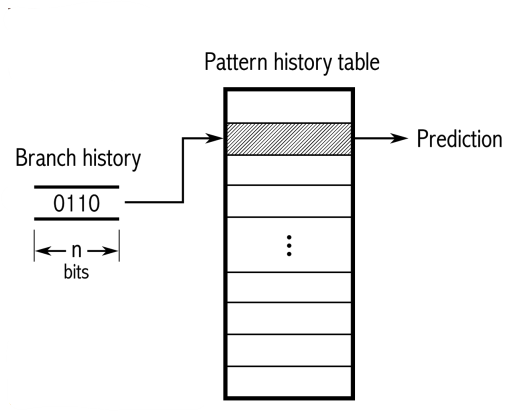

        - Historie n-nových výskytů podmínky
        - Tabulka historie obsahuje saturating counter
        - Zpracovává patterny s pravidelností, kde saturating countery selhávají
        - Pokročilejší přístup může kompinovat predikce i countery a použít regresi
      - Predikce větví vs JVM-like
        - Možnost uspořádat větve tak, aby odpovídaly algoritmu statické predikci větví (Static branch prediction alg.)
        - Profile-guided optimalizace - větve uspořádané tak, aby odpovídali známým vstupním datům
        - je možné změnit uspořádání větví během běhu
          - milná doměnka že se JIT činnost amortizuje
          - nenastane - predikce větví je příliš inteligentní a rychlá aby mohla být amortizována
        - JVM-like jen plýtvá procesorovým časem a pamětí
      - Podmíněné větvení
        - Podmínka if je posloupnost cmp & jne/je
        - následující kód zpracovává pole parametrů

          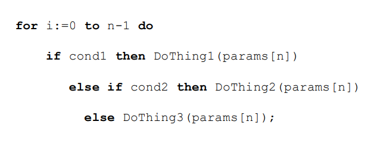
  
        - snížíme počet přístupných BTB tím, že snížíme počet vyhodnocení condX podmínky
  
          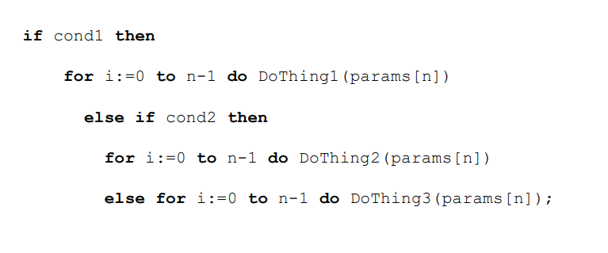

        - Použitím ukazatelů/referencí zmenšíme velikost kódu (takže se lépe vejde do L1) o vyhodnocením condX pouze jednou, čímž zakódujeme pouze jeden for-cyklus
        - Pokud by se condX mohl v cyklu for změnit, jen bychom aktualizovali obsah doThing
          - obtížnější dokazování správnosti programu

          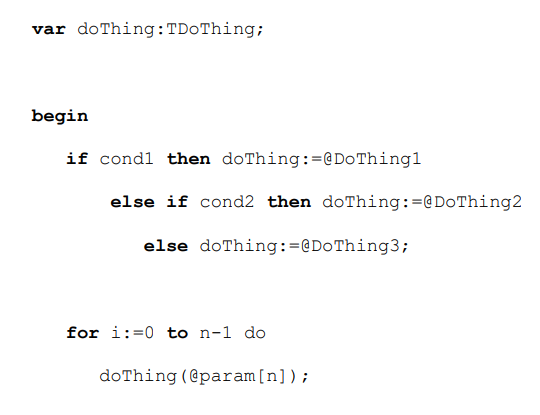
        
          - Ve vysoce výkonných výpočtech nechcete plýtvat procesorovým časem a pamětí na tuto činnost
      - Eliminace podmínek

          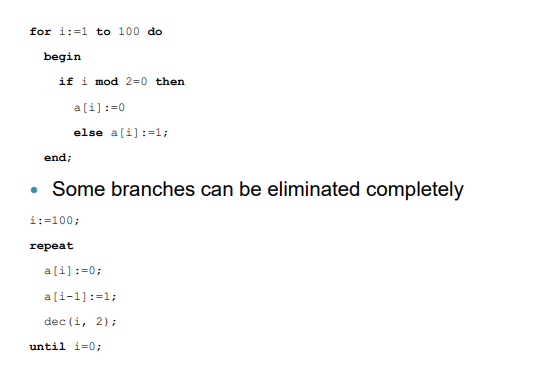
  
          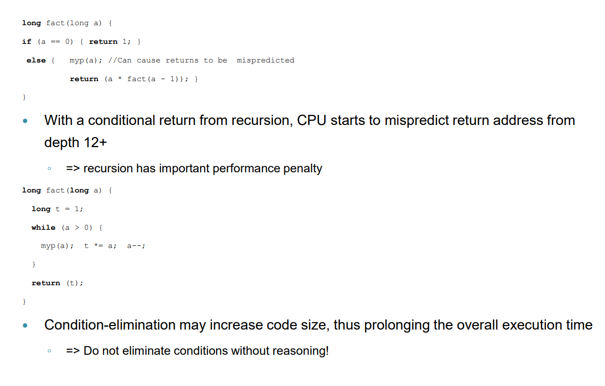
      
      - Ternální operátor
        - x86 má podmínkovou instrukci move - cmov
          - přesune jen pokud platí podmínka (nastaven flag-bit v e/rflags)
          - při použití sníží velikost kódu, když eliminuje podmíněný skok
        - podmíněný skok (if, for, while..) lepší volba pokud lze podm. jednoduše predikovat
        - v opačném případě použít cmov
          - ternární operátor se přímo překládá na cmov v C++ (v Java bytecodů není ekvivalent)
      - Datová závislost
        - x <- cmov(x, y)
          - vytvoří datovou závislost a vede ke zpoždění
        - nahradit podmínkou
          - if
          - z <- cmov(x, y)
      - Paměťová závislost
        - Instrukce Load čeká na instrukci Store -> bottleneck (omezit tyto instrukce)
        
          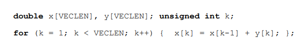

        - Fix přidáním pomocné proměnné t uložené v registru
  
          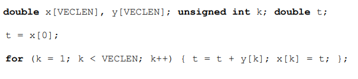
  
      - Falešná závislost
        - registry r/e/ax jsou často používané pro uložení návratové hodnoty
        - jak jej nastavit na 0?

        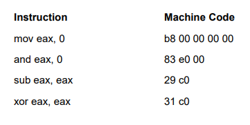
  
        - krátký kód je dobrý pro L1I - sub & xor
          - ale je datově závislý
          - S xor CPU ví že jde o false one a nastaví registr r/e/ax na 0 (kompilátor to ví)
      - Falešné sdílení (Cache line)
        - každý procesor má cache
          - paměťový subsystém musí garantovat cache-cohorency (konzistentní data)
        - K falešnému sdílení dochází
          - jádro modifikuje proměnnou, která sdílí stejnou cache line s jinou proměnnou, k níž přistupuje jiné jádro
          - označí celou cache line jako neplatnou
          - jadro jí musí znovu načíst -> zhoršení výkonu
          - v sériovém programu nenastane
          - proto špatně napsaný paralelní program může být pomalejší kvůli opakovanému načítání cache paměti

          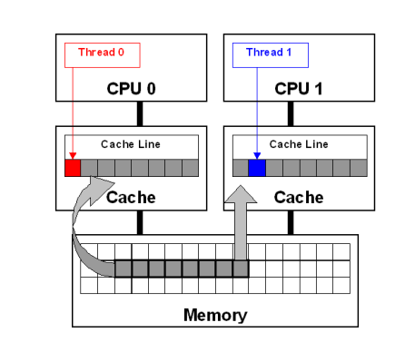
  
          - Ukázka kódu:

          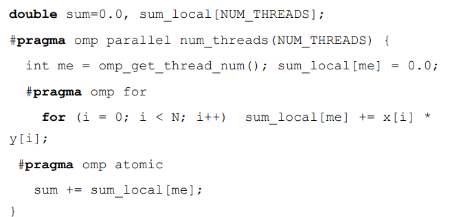
  
          - sum_local je náchylný k falešnému sdílení, protože může být menší než velikost cache line
            - možnost zvětšit na velikost cache line aby zabíral celý řádek - v podstatě špatné řešení
            - nejlepší řešení je vytvořit kopii uloženou v registru lokálního vlákna

            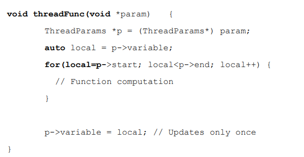
  
      - Code profilling
        - zjistit které části kódu se vykonávají nejčastěji a zde optimalizovat
        - použití sw a hw counterů
          - sw - countery lze ošálit, odstranit nebo špatně implementovat (použití constexpr)
          - hw - překladač jej nemůže eliminovat nebo přepočítat (CPI - cykles per instruction)
            - bez pipeline nemůže být počet cyklů pro dokončení instrukce menší než počet pipeline fází
            - Pokud by se všechny mikroinstrukce prováděly paralelně (nebude tomu tak vždy), CPI by mohlo být 1
            - instrukce stále musí projít všemi fázemi, a proto vyžaduje více než 1 cyklus k dokončení
            - Superskalární procesor dokáže dokončit dvě instrukce v jednom cyklu
              - mohou začít v jiných cyklech proto CPI = 0,5
            - LLC miss (Last level cache miss)
              - poměr všech LLC Misses ve všech cyklech
            - Instruction starvation (Rollback při misspredikci)
              - Jádro čeká na provedení instrukce
              - poměr čekajících cyklu ke všem cyklům
              - důvody:
                - práce s velkými bloky paměti
                - častá mispredikce větve
                - nadměrné používání virtuálních funkcí
            - Mispredikce větve
              - poměr mispredikovaných větví ke všem větvím
              - podmínky tranformovat nebo eliminovat
              - občas zvýšením velikosti kódu zapříčíní složitost tranformace -> výkonnostní postih