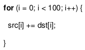
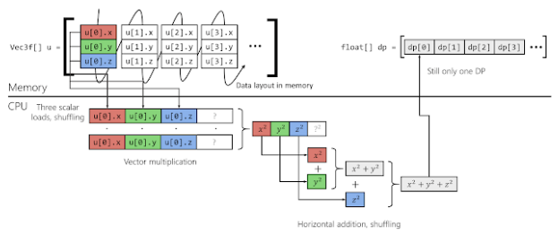

- Vector Instructions (SIMD)
    - jadro CPU zpracuje n elementu v ramci jedne instrukce
    - dosahneme linearniho zrychleni (n krat rychlejsi program)
    - AVX-512 je defaultne vypnuty (zere hodne energie)
    - zkraceni kodu (pouziti mene instrukci)
    - moderni prekladac dela auto-vektorizaci a reportuje co sem u povedlo/nepovedlo vektorizovat

- automaticka vs. manualni (explicitni) SIMD
    - automaticka (dela prekladac)

    

    - manualni (dela programator - pouziva SIMD instrukce naprimo)

    

- SIMD

    

    - SIMD operandy maji fixni delku
    - kompilator potrebuje vedet kolik mozna vektorizovatelnych instrukci nasleduje
        - aby dedukoval jestli je vektorizace mozna nebo ne

    - nasledujici kod se muze vektorizovat (zname pocet opakovani smyccky)

        

    - pokud nezname pocet iteraci, kompilator neumi vektorizaci udelat
        - mozna bychom mohli pouzit manualni vektorizaci (musime znat memory layout aby nedoslo k prepsani jine pameti)
    
        

- loop unrolling
    - pomaha kompilatoru porozumet co se snazima udelat
        - v urcitych pripadech je loop unrolling lepsi nez vektorizace
        - ale ne v nasledujicim pripade

    

- jeden vstupni a vystupni bod
    
    

    - zavislost na datech (`a[i]`)
    - na zaklade hodoty se bud smyccka ukonci nebo ne => nelze vektorizovat

- maskovani a podmineni nacitani/ukladani
    - zadna ukoncovaci podminka co by byla zavisla na datech
    - muze byt vektorizovani pomoci maskovani a podmineho nacitani/ukladani

    

    - vektorova logika (napr SIMD instrukce) porovna 2 vektory obsahujici pouze 0 nebo 1 => produkuje masku

    

    - `simd_if (mask, true_vector, false_vector)`
    - ve skutecnosti vybira prvek urciteho vektooru (true/false) na zaklade prislusneho prvku maskovaneho vektoru
    - there is no branching
    - muze vest k velkemu overheadu

- Array of Structures (AoS)
    - 
    ```
    struct TVector {double x, y, z };
    std::array<TVector, n> u;`
    ```

    

    - Scalar-code thinking
        - nevede na optimalni vykon SIMD


    - naivni AoS vektorizace

        

        - pouziva 4 lementovy SIMD registr (jeden element je padding - viz SP)
            - tak jako napul optimalni vykon (potrebuje vice instrukci nez je nutne)
    
    - Scattered Load and Shuffling

       

        - pouzivame extra nacitaci a prehazovani instrukce pro nacteni a preorganizovani vstupnich dat
            - chceme se vyhnout zytecnemu paddingu 

- Structure of Arrays (SoA)
    - 

    ```
    struct TVector { std::array<double, n> x, y, y };
    TVector u;
    ```

    

    - zadne zbytecne instrukce, zadny padding => optimalni vykon
    - sirka registru (4 s AoS) neni omezena velikosti vektoru
        - muzeme vyuzit i napr AVX-512

    

    - rozdelme obraz kodovany v RGB do tri samostatnych palet

- Expression Templates -> FMA
    
    

    - kompilator vygeneruje efektivni kod pro soucet dvou vektoru
    - co kdyz ale budeme chtit secist 3 vektory? nebo linearni regrese?
        - pretizeni operator by alokoval extra vektor => neefektivni, pametove narocne, pomale

    

    - lepsi zpusob: VecExpression template reprezentuje mezivysledky
    - pote Vec-template vytvori a vyhodnoty vypocetni strom takovychto mezivysledku
    - pro keter implementujeme VecSum a VecMultiple templaty

    

    

    - pro `a+b+c` vytvori kompilator `VecSum<VecSum<Vec, Vec>, Vec>>`
    - s pouzitim template se vsechno rozbali tak ze kompilator dostane
        - `elems[i] = a.elems[i] + b.elems[i] + c.elems[i];`
    - zadne extra alkovace, zadne mrhani procesorovym casem
    - kod pujde krasne zvektorizovat
        - => this makes C++ superior
    - linearni regrese (`a+b*c`) se da dokonce zkompilovat do jedine SIMD instrukce - Fused Multiply Add
    - bez sablon C++ bychom budto
        - skoncili s extra overheadem
        - nebo bychom museli vytvorit mnoho specializovanych routine -> dlouhy kod, hard to maintan

- Transactional Memory
    - dejme tomu, ze mame datovou struktury s 1024 elementy
    - mame take paralelni prisup z vice vlaken
    - jeden zamek je nejjednodussi protoze je kod citelny a snizuje moznost vzniku chyby pri synchronizaci
    - nicmene pokud jedeno vlakno modifikuje 10. element a druhe 600. element, jedno z nich musi pockat => snizeni vykonu
    - SW reseni
        - rozdeleni pole do vice segmentu, kde kazdy segment bude mit vlastni zamek
        - zvyseni komplexnosti kodu
        - snizeni ztraty vykonu ale neni uplne odstraneno
    - HW reseni
        - procesor (zatim jen Intel) poskuje specializovani instrukce
        - programator bud pouziju knihovnu ktera je pouziva (gnu libc, Intel one TBB)
        - nebo je pouzije naprimo (v jazycich jako je C++)

        
    
    - cilem je poskytnout vyhodu jednoho zamku spolu s benefitem pri pouziti vicero zamku (ruzne segmenty)
    - x86-64 (TSX extension) poskytuje dva mody
        - HLE (HW lock ellision) - kompatibilita se starsim konec, reusing instruction prefixes 
        - RTM (restricted transaction mode) - nove isntrukce
    - v kodu potom programator oznaci prvni instrukci kriticke sekce
        - pokud se transkace nepovede, jadro skoci zpet na tuto instrukci (Fallback Path)
    - Pote co jadro detekuje zacatek kriticke sekce, vsechny zapisy do pameti jsou lokalni dokud:
        - se transkace uspesne nedokonci s commitem
        - nebo paralelni pokus o ulozeni aborts transakci
            - pote jadro skoci zpet na Fallback Path a vykona se stare zname SW zamykani
        - velikost pameti ktera ja chranena transakcemi zavisi na konkretnim CPU

    - HLE spinlock modification

        

        - Fallback Path zacina s `cmpxchg` kvuli `xacquires` protoze se pri prvnim spustenim provede jako kdyby byla kriticka sekce odemcena

    - RTM spinlock modification

        

        - instrukce `xbegin` oznacuje zacatek Fallback Path
        - narozdil od HLE ulozili jsme zamek cmpxchg8b
        - xabort je dostupny
        - s `jnz spin` obsahuje `eax` errorovou hlasku s popisem toho proc transakce selhala

    
