- Ada, WinAPI
  - Ada
    - objektově orientované 
    - silná verifikace typu - prevence pro snížení chyb programátora
    - pro vojenské a kritické systémy
    - synchronizace na vysoké úrovni (rendez-vous)
    - překladač se musí testovat na shodu/kompatibilitu s jazykem
    - syntaxe silně ovlivněna Pascalem -> čitelnost kódu
    - původ: Pentagon/DARPA
  - Ada - Rendez Vous
    - Task synchronizace (ne vláken ale tásků)
    - dva tasky komunikují/synchronizují se pomocí rendez vous
      - bod setkání, vstupní bod (volání)
      - Task čeká na přijetí, dokud jiné vlákno nezavolá její vstupní bod
          
        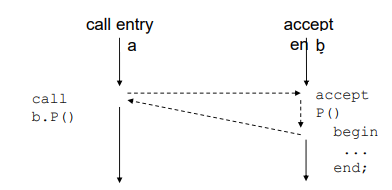

  - Ada - Task

    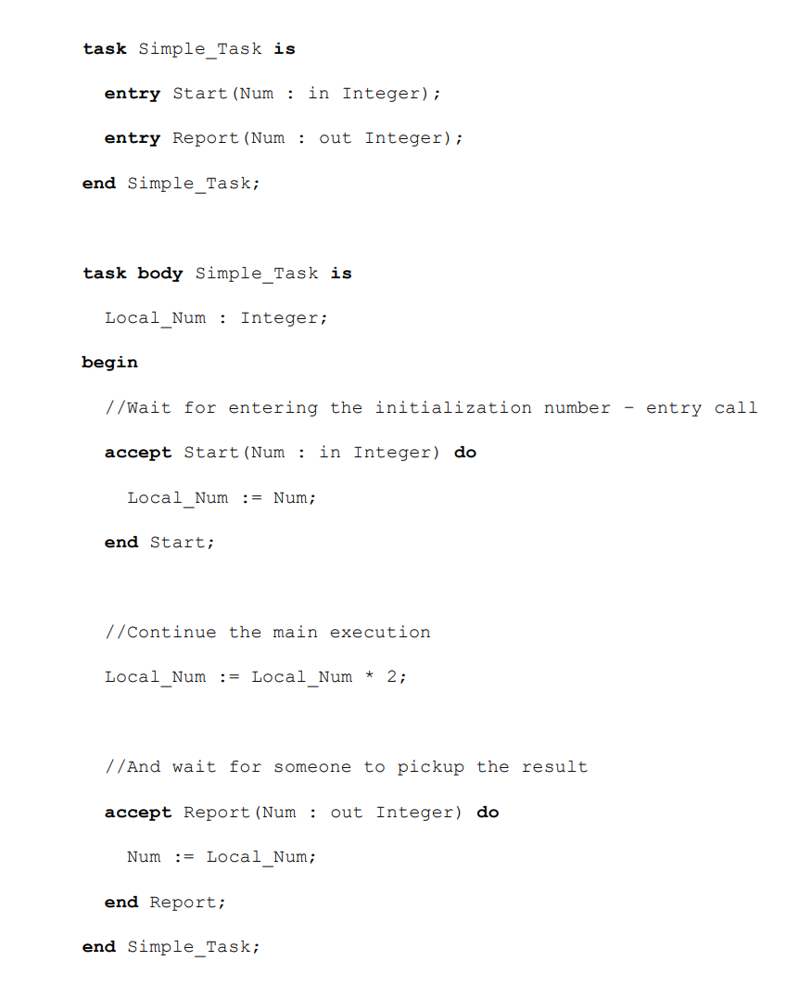

    - Při sekvenčním přijetí může task vynutit pořadí akcí - vstupních bodů
      - nicméně task povede do deadlocku pokud nikdo nezavolá vstupní bod
    - Přijetí:
      - Klient zavolá server
      - server přijme parametr
      - server počítá, klient čeká - (blocked)
      - server předá výsledky klientovi
      - narozdíl od monitoru, server je samostatné vlákno, které soupeří s ostatními vláky (které spouští tasky) o strojový čas
        - vlákno může mít jinou úrověň oprávnění(privilege level/access permissions)
  - Ada - Select
    - nechá server reagovat na více vstupních bodů(volání) mimo pořadí
      - nicméně každé vstupní volání může být povoleno/zakázáno dalšími podmínkami
    - př. Server může vynutit inicializační vstupní volání a obsluhovat další vstupní volání mimo pořadí

      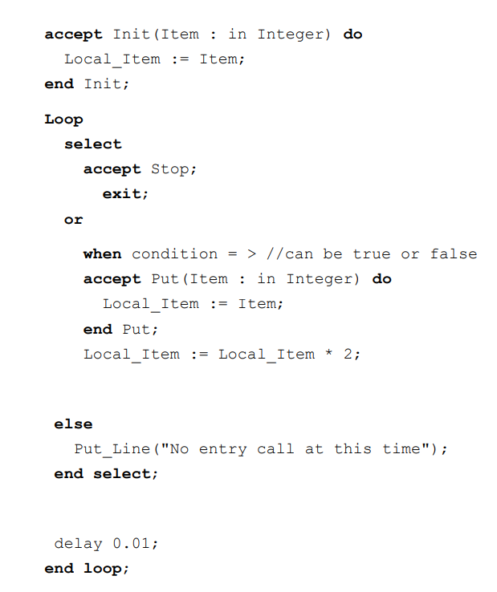

  - Ada - Protected
    - Objekty a Typy
      - Tasky mohou sdílet objekty
      - objekt je instancí typu (klíčové slovo - type)
      - klíčové slovo protected poskytuje výhradní přístup k protected objektu
      - s protected objektem můžeme volat:
        - Proceduru - mění stav objektu (není potřeba k tomu podmínka)
        - Vstupní volání - jako procedura ale podmínka musí být true
        - Funkci - read-only stav objektu, exkluzivní přistup není vyžadován
  - Ada - Semafor

      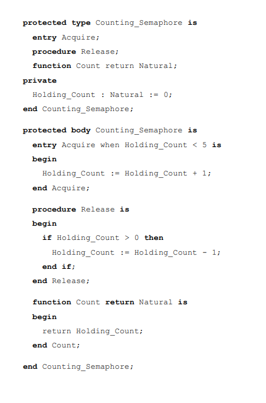

    - pokud podmínka nemůže být splněna (nastaveno na true) možné provést jinou akci (vyhodit výjimku) namísto zablokování volajícího tasku

      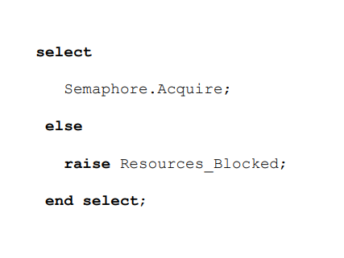
  
  - Rendez-Vous
    - C++, C apod
      - lze použít pro implementaci rendez-vous, včetne select protože je možné od/blokovat vlákna v požadovaném pořadí
      - použitím API operačního systému
    - Win API
      - komplexní API
      - POSIX mapa k API pomocí jednoho header souboru
    - Java-like
      - Rendes-vous nemůže být naimplementovaná jen pomocí monitoru
        - problém notifikovat vlákna v přesném pořadí
        - musí se použít OS-API
  - Win API proces
    - viruální adresní prostor
    - Vlastní systémové prostředky
    - Bezpečnostní kontext
      - Žádné vlákno nemůže dělat nic
    - jedinečný ID
    - spustitelný kód
    - Prioritní třída - priorita vlákna omezená v rámci této třídy
    - Alespoň jedno, obvykle primární (první vytvořené) vlákno může vytvářet další vlákna a vlákna
  - Job objekt
    - sdružuje více procesů do skupiny
    - Jedna skupina, jeden spravovaný objekt
      - Jedna operace se vztahuje na všechny obsažené procesy
    - Někdy potřeba vytvořit úlohu s jediným procesem pro nastavení a vynucení paměťových limitů
  - Win API Thread
    - jedinečné ID
    - planovací jednotka Operačního systému (entita vlastněna procesem
    - Všechna vlákna sdílejí adresový prostor a prostředky svého procesu
    - vyhrazený exception handler
    - Priority:
      - OS poskytuje: inverzi priorit, dynamický boost, foreground/input
      - obsahuje real-time
    - Kontex
    - Zásobník
    - může vlastnit security kontext
    - Impersonating - spuštění pod jiným userem/s jinými oprávněními než ostatní vlákla téže procesu
    - může být specificky omezen na dostupná jádra procesoru
  - TLS (Thread Local Storage)
    - Data specifická pro místní vlákno
      - __declspec(thread) int number;
    - Vlákno ji může použít k izolaci svých dat
      - použití pro exception handling
    - Proces má několik slotů TLS (minimálně 64), které může využívat jeho vlákna

      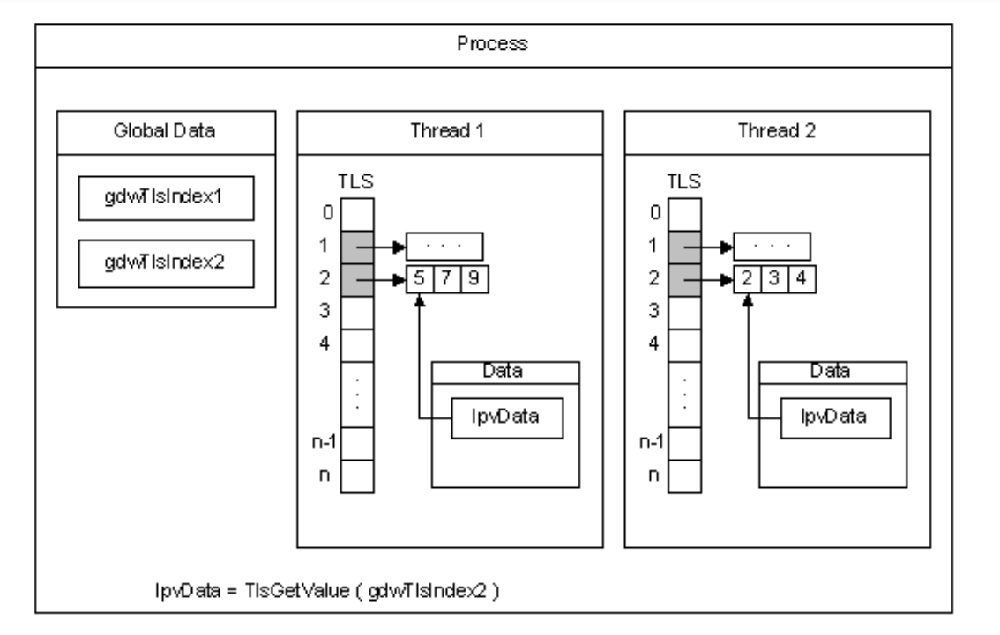
  
    - global - jedna proměnná sdílená všemi vlákny
    - lokální - každá proměnná má svou vlastní kopii, implementováno pomocí TLS
    - zásobník - každé volání rutiny má svou vlastní kopii proměnné

      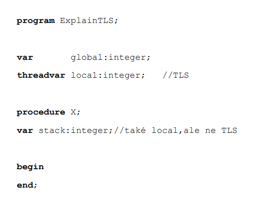
  
  - Win API ThreadPool
    - pool vláken pro zpracování asynchronních událostí procesu
    - Souvisí s:
      - Fronta událostí ke zpracování
      - waiting handles
      - timer
    - I/O
    - farmer/worker model
    - použití:
      - Distribuované zpracovávání/sítě
    - Vyhýbá se režii nákladu při tvorbě/zničení krátkodobých vláken
  - Win API - Fiber
    - Fiber je vlákno naplánované v uživatelském adresním prostoru, aby se výrazně omezilo přepínání kontextu.
    - spouští se v thread kontextu, vytvoří se převedením thread na fiber
    - Naplánováno vláknem(thread) jádra v uživatelském prostoru (user space)
    - jedno vlákno může plánovat více fiberů
    - FLS - Firbe Local Storage
      - analogie TLS
      - souvisí s vláknem, lazy initem
    - Fiber má "malý" kontext
      - ve srovnání s vláknem, jehož kontext sdílí řada fiberů
      - zásobník, registry a inicializační data
    - Může přistupovat k TLS, v jehož kontextu se provádí
    - nemá prioritu
  - WinAPI - User Mode Scheduling (UMS)
    - ligh-weight jako fiber nebo "next-gen fiber"
    - Narozdíl od fibre, každá UMS vlákno má vlastní kontext vlákna
    - Unlike fibre, each UMS thread has its own thread context
    - Vyhrazený plánovač UMS
      - jeden pro každý procesor
        - ten plánuje UMS
      - Převádí "normal, kernel" vlákna na vlákna UMS
      - Udržuje frontu vláken UMS, která dokončila exukuci kernelu
      - OS notifikuje up-call vlákna plánovači
      - Aby je bylo možné efektivně naplánovat, nikoliv proti kernel plánovači
      - Uklízí po vláknech UMS
      - Vlákno UMS by nemělo vytvářet žádné předpoklady o svém plánovači
  - Synchronizace
    - Implementováno pomocí synchronizačních objektů
      - Event
        - může být puls např.: switch na nesignalizovaný ihned po přihlášení do čekající funkce
      - Mutex
      - semafor
      - Waitable timer, 
      - Change notification
      - standartní vstup
      - Job
      - Memory resource notification - zápisy do fyzické paměti
      - Process
      - Thread
      - File, pipe, komunikační handle
    - Objekt je jen ne/signalizovaný
    - čtení stavu objektu pomocí wait function
    - Single object
      - SignalObjectAndWait
      - WaitForSingleObject/Ex
    - Multiple object
      - WaitForMultipleObjects/Ex
      - MsgWaitForMultipleObjects/Ex
    - Alertable Wait
      - SignalObjectAndWait and *Ex končí pokud
        - I/O operace je dokončena
        - Nebo existuje APC (asynchronous procedure call) náplánované pro aktuální vlákno
    - Registered Wait
      - RegisterWaitForSingleObject
      - UnregisterWaitEx
      - navržen pro thread pool
    - Wait funkce
      - Vrátí se okamžitě
        - přečetla si pouze stav objektu a nečekala na něj
        - funkce čekala, až bude objekt signalizován
      - Nebylo třeba na nic čekat (mohlo být již signalizováno)
      - timeout (může být předán parametr pro čekání do nekonečna)

      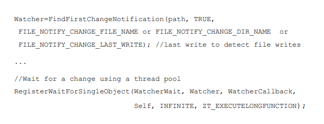
  
  - Synchronizace a I/O
    - Volání jako ReadFile buď blokuje nebo je asynchronní, ReadFileEx, pokud I/O trvá příliš dlouho.
    - Kontrola průběhu I/O
      - použití pro zjištění dokončení alertable wait function
      - Nebo proveďte periodické dotazování na stav pomocí příkazu:
        - GetOverlappedResult
        - HasOverlappedIoCompleted
      - V případě potřeby lze operaci zrušit:
        - CancelIO
  - APC - Asynchronous Procedure Call
    - Rutina prováděna v kontextu aktuálního vlákna
    - každě vlákno má vlastní APC frontu
      - není prázdná -> operační systém spustí APC místo naplánování user thread code
    - Typy
      - User APC
        - QueueUserAPC
        - Vlákno musí být ve stavu alertable
          - SleepEx, SignalObjectAndWait, MsgWaitForMultipleObjectsEx, WaitForMultipleObjectsEx or WaitForSingleObjectEx
        - Nelze přejít do stavu alertable, když je v APC
      - Kernel APC
        - Například dokončení ReadFileEx, SetWaitableTimer a WriteFileEx
  - Další synchronizační možností
    - Kritická sekce
      - Enter, TryEnter, Leave
    - Podmíněná proměnná
      - Nelze sdílet přes hranice procesů
      - Je však možné vytvořit pojmenované synchronizační primitivum (pojmenovaná podmíněná proměnná)
        - Pak je možné ji otevřít pod speciální cestou k souboru v jiném procesu
        - Získáme tedy dva synchronizační objekty, které sdílejí stejný stav (IPC)
      - spojený s kritickou sekcí nebo se slim lockem
    - Slim lock
      - Slim Reader/Writer (SRW) Locks
      - Optimalizováno pro případy, kdy kritická sekce, mutex, vyvolávají příliš velkou režii
      - Při vstupu do běžné kritické sekce je k dispozici informace, proč do ní vstupujeme
      - 2 metody Acquire - čtení a čtení-zápis (OS může optimalizovat)
      - Výhodné při častějším čtení dat než při jejich zápisu
      - Shared - read-only, AcquireSRWLockShared
      - Exclusive - pouze 1 vlákno může vstoupit, a tedy i zapisovat; AcquireSRWLockExclusive
      - SRW Lock má velikost ukazatele (pointeru)
        - nenese další informace, a proto jej nelze získat rekurzivně
    - One-Ttime inicializace
      - O inicializaci struktury se může pokusit více vláken
      - nicméně jen jedno vlákno může inicializovat strukturu právě jednou
      - Synchroně: InitOnceBeginInitialize, InitOnceComplete, InitOnceExecuteOnce, InitOnceCallback
      - Asynchroně: INIT_ONCE_ASYNC
    - Blokovaný variabilní přístup (Interlocked Variable Access)
      - Atomické operace - velikost proměnné musí být menší nebo rovna velikosti slova procesoru (stavové slovo) jinak nebude atomická
      - Increment, Decrement, Exchange, ExchangeAdd, CompareExchange

        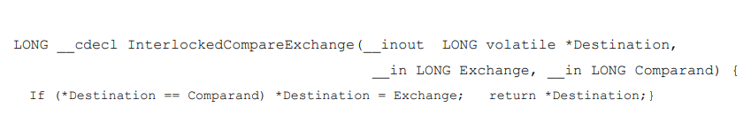

      - AND, OR, XOR
  
        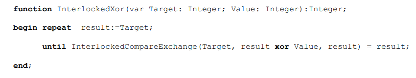
  
    - Interlocked Single Linked List
    - Timer Queue
      - Time vyvolá zpětné volání v daném čase (callback)
      - CreateTimerQueue
  - SMP Fencing
    - Cache zvyšuje výkon při načítání/ukládání do paměti
    - Na CPU
      - acquire - načtení/vykonání/uložení dokončeno před fetch následujících údajů instrukce z paměti
      - release - jako acquire, ale po dokončení následující instrukce
      - fence - data jsou připravena při exekuci instrukce
    - Fencing má dopad na výkon
    - jednodušší nechat to na OS/RTL
  - Zprávy
    - Posting zpráv příjemci asynchroně - PostMessage (neblokující)
    - Sending zprávy příjemci, synchronní - SendMessage, (blokující)
      - Poskytuje synchronizaci (InSendMessage, SendMessageTimeout)
    - Get/PeekMessage - nahlédne a získá zprávu z fronty
    - WaitMessage  - vlákno se zablokuje, dokud nepřijde zpráva
    - PostThreadMessage - doručí zprávu konkrétnímu vláknu
  - IPC - Inter-Process Communication
    - Synchronizace vláken v různých uživatelských prostorech (včetně 32bitové a 64bitové architektury)
    - DuplicateHandle
      - duplikuje object handle jinému procesu (OpenSemaphore)
      - potřeba něco z dědičnosti
        - pojmenované objekty (Named objects)
        - pipes
        - Shared memory – CreateFileMapping
      - Vytvoří Name object a předání cesty k jeho souboru jinému procesu tam otevřete pojmenovaný soubor a vytvoření dvou objektů se sdíleným stavem
    - Sending messages
      - WM_COPYDATA - je omezeno na parametry, ale mohlo by odeslat větší blok paměti
    - Inheritance (dědičnost)
      - CreateProcess - může dědit handle rodičovských procesů
      - Pomocí příkazového řádku lze předat více parametrů
  - DDL Shared section
    - stejnou knihovnu DLL může načíst více procesů
    - Definujme v této knihovně DLL speciální sekci
      - vedle .text, .bss. atd.
    - Na základě příznaků flags OS pozná, že má vytvořit sdílený segment
    - Tento segment pak sdílejí všechny procesy => sdílený segment paměť (Za synchronizaci odpovídá programátor)

      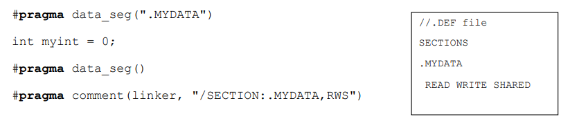
  
  - POSIX (Portable Operating System Interface)
    - API kompatibilní s operačními systémy podobnými systému UNIX
      - možné implementovat v jakémkoli OS
    - 3 části:
      - rozhraní API pro operační systém a jádro (reálný čas, vlákna, zabezpečení, IPC)
      - příkazový řádek a utilities
      - Validace
    - Certifikát je k dispozici pro POSIX-compatible OS (HP-UX, OpenSolaris, Windows NT/2003/Vista Enterprise)

      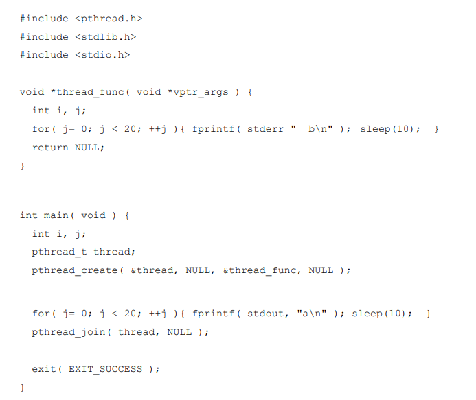

    - Obvyklý název pro knihovnu, která implementuje vlákna podle standardu POSIX
    - Obsahuje:
      - Definice datových typů
      - funkce pro řízení vláken
      - synchronizační funkce
    - Objekty POSIX
      - Ne objekty OOP, neprůhledné(opaque) struktury identifikované pomocí handlerů
        - pthread_t, pthread_mutex_t, pthread_cond_t
      - Jeden objekt má více atributů, které lze měnit
        - pthread_attr_t, pthread_mutexattr_t, pthread_condattr_t
        - Při změně vrací manipulační funkce buď 0 při úspěchu, nebo kód chyby
  - POSIX VS WinAPI
    - POSIX definuje prototypy funkcí
    - Jediný soubor .h může mapovat POSIX na WinAPI 