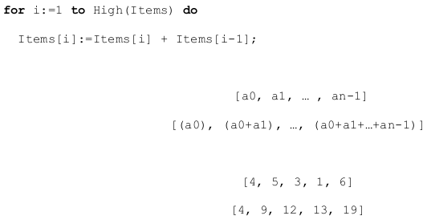
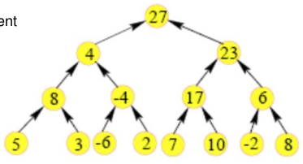
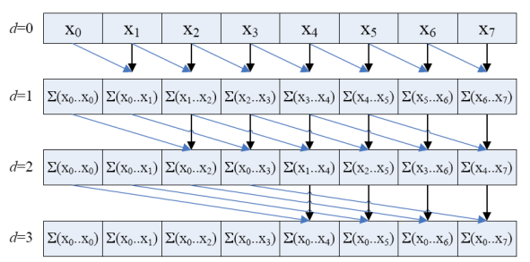
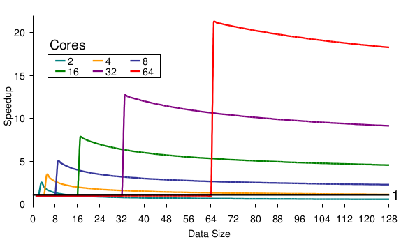
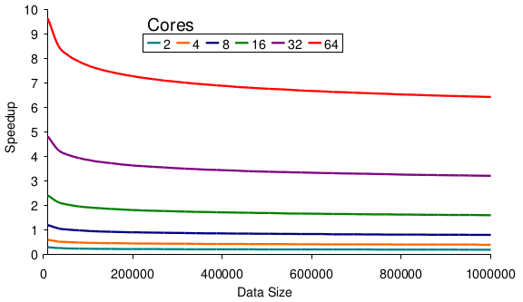
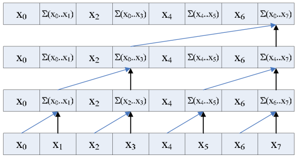
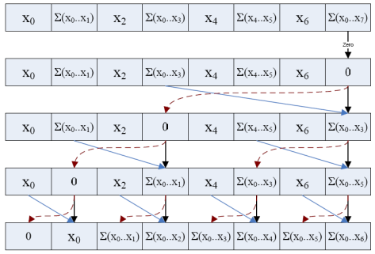
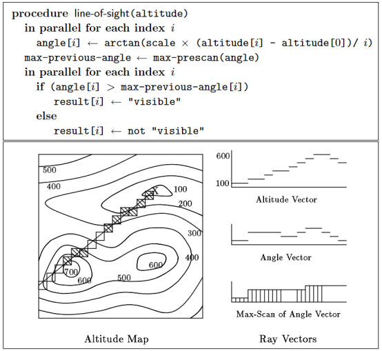
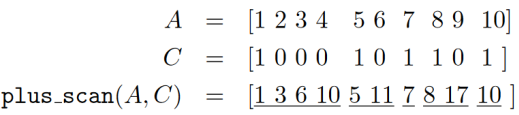
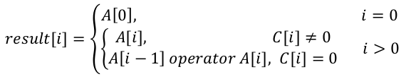

- Parallel Prefix Sum (Scan)


    

    - resi problem usporadane promenne
    - da se aplikovat napriklad na:
        - razeni, lexikalni analyzu, histogramy, teorii grafu, stringy, ...

    - usporadana promenna (poradi) zabranije neusporadane paralelizaci (nezavislost na datech)
        - `items[i] = items[i]+items[i-1];`
    - v sekvencnim pristupu kazda suma produkuje jeden prefix
    - pocitani `n` prefixu vyzaduje `n` sum
    - abychom toto mohli paralelizovat potrebujeme problem refolmulovat
        - pote muzeme zminit pozadavek na usporadani
    - strom
        - itemy jsou listy stromu
        - nody jsou mezivysledky
            - lze je spocitat paralelne 

        

        - dekompozice stromu na paralelni nody (vypocet po vrstvach /v krocich)

    

    ```
    #include <vector>
    #include <iostream>

    int main()
    {
        std::vector<int> data = { 0, 1, 2, 3, 4, 5, 6 };

        for (std::size_t d = 1; d < data.size(); d *= 2)
        {
            std::vector<int> tmp = data;

            for (std::size_t i = 0; i < data.size(); ++i)
            {
                if (i >= d)
                {
                    tmp[i] = data[i] + data[i - d];
                }
                std::cout << tmp[i] << " ";
            }
            std::cout << std::endl;
            data = tmp;
        }
    }
    ```

    - naivni pristup
    - jadra budou postupne nevyuzivana

    

    - kopije itemu = items
    - stride = `d`
    - tim padem se `d` stalo novou usporadanou promennou
    - transformovani jednoho cyklu do dvou cyklu kde ten vnitrni muze byt paralelizovan

    - urychleni
        - sekvencni `O(n)`
        - paralellni, jedn vlakno `O(0.5 * n * log2(n))`
    - pri pouzitni `m` procesoru (jader)
        - porad neefektivni kvuli tomu jak se postupne jadra prestanou vyuzivat
        - efektivni algoritmus by vyzdoval jeste jiny pristup

    

    

    - efektivita silne zavisi na velikosti vstupnich dat a na poctu jader
    - takovyto naivni pristup by byl OK pro GPGPU s omezenout velikost vstupnich dat
    - jak se to da resit jinak?
    
    - optimalizace
        - `O(n)` stejne jako sekvencni pristup
            - `O(n/m)` s pouzitim `m` jader
        - in-plce transformation
    - first stop
        - redukovani od spoda nahoru

        

    - ulozime si celkovou sumu (posledni prefix), pokud ji potrebujem
    - nakonec nastavime posledni sumu na 0 a projedem cisla smerem dolu

        

    - 2 varianty
        - inkluzivni - tystupy jako pri naivnim resenim (vsechny sumy)
        - exkluzivni - zacina s 0, posledni suma tam neni (elementy jsou posunuty o 1 pozici)
    - podora v mnoha frameworcich
        - MPI, OpenCL, oneTBB, STL
        - da se aplikovat na mnoho algoritmu (ne jen soucet)
    - to ze algoritmus ma usporadanou promennou neznamena ze nelze paralelizovat
        - musime jen jinak premyslet (nemyslet v tom nasem seriovem svete)

- Line of Sight
    - dejme tomu ze programujeme 3D pocitacovou hru
    - grid ruznych vysek
    - celem je se vyhnout rendrovani objektu, ktere nejsou hraci viditelne
    - looking vektor (trasovani paprsku) se sklada z vertikalich uhlu
        - `arctan` nadmorske vysky prvku mrizky deleny vzdaleností od hrace
    - objekt je viditelny pouze pokud neexistuje objekt ktery je v kratsi vzdalenosti k hraci (kamere)
        - a zaroven ma vetsi vertikalni uhel => muzeme pouzit max-scan (misto sumy pouzijeme operator `+`)

    

- Segmented Scan
    - dejme tomu ze chceme aplikovat prefix sum na vicero sekvenci (vektoru)
        - pri sekvencnim spousteni paralelnich algoritmu nedochazi k amortizaci
        - je mnohem lepsi spustit jeden paralelni scan na konkatovane pole
    - budeme mit prizak (flag)
        - 1 = restartuj scan
        - 0 = pokracuj v cinnosti

    
    
    - paralelismus se nijak nemeni, jen potrebujeme jiny oprator
        - max, addition

    