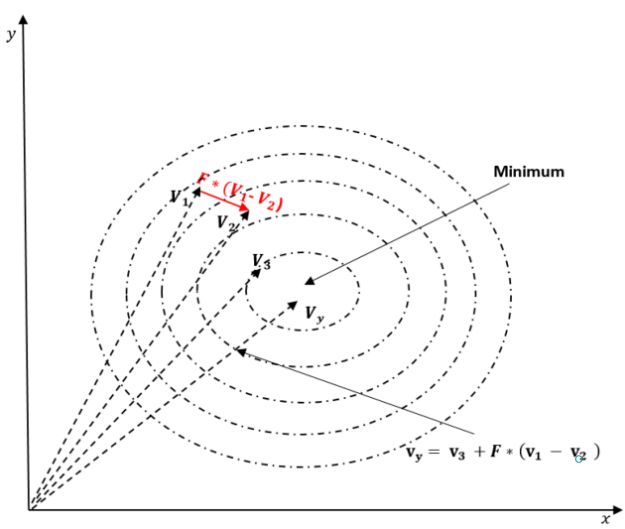
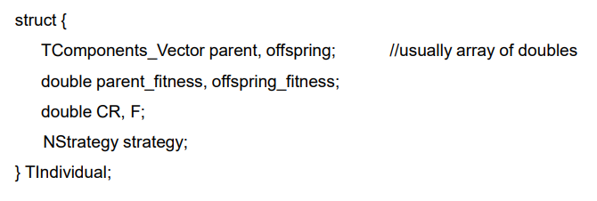

- Paralelní evoluce
  - podobný evoluci (O původu druhů, 1859)
  - známe problém
  - řešení popsané vectorem čísel 
    - lineární regrese, parametry fyzikálního/fyziologického/biologického modelu atd.
      - double hodnoty
    - programový kód
      - instrukční prefix a parametry jsou celá čísla
  - můžeme kvantifikovat vhodnost řešení
    - skalární - jednoúčelová optimalizace
    - vektorový - víceúčelová optimalizace
  - neznáme analytickou metodu pro nalezení řešení s nejlepší vhodností
  - porovnání s analytickou metodou:
    - evoluce - pomalejší a paměťově náročnější
      - pokud známe vhodnou analytickou metodu
    - analytická metoda
      - může být neznámá a příliš výpočetně náročná
  - Neuronové síte NN
    - požaduje více výpočtů
    - těžké až nemožné interpretovat (totéž pro bezpečnost a správnost)
    - nepočítáme specifické parametry modelu
    - nahrazujeme specifický model pomocí NN
      - NN je komplexní i pro jednoduchý problém
    - nelze použít pro zpracování řeči zvuku a obrazu atd.
  - Obecný princip

    

    - vyvíjí populaci pro počet generací
    - pravidla pro tvorbu potomků
    - možnost parametrizace
      - počáteční populace
        - pokročilé know-how
      - produkce potomstva
    - pro amortizaci nákladů je třeba kombinovat s výpočtem fitness funkce jedinců v populaci
    - Populace
      - soubor kanditativních jedinců (řešení)
      - každý jedinec má jinou fitness
        - mělo by platit při tvorbě nového potomka
      - Dva nepříznivé jevy:
        - Předčasná konvergence
          - Evoluce se zasekne v lokálním extrému
          - Nelze se zotavit
        - Stagnace
          - Populace se nevyvíjí - neprodukuje žádné potomstvo se zlepšenou fitness
          - Nelze se zotavit
    - Diferenciální evoluce (DE)
      - při produkci potomků
      - v zásadě přidává náhodně škálovaný rozdílový vektor dvou jedinců k existujícímu jedinci
      - naivní myšlenka
        - počáteční populace by měla být rovnoměrně rozložena v prostoru hledání
      - lepší
        - rozdílový vektor udává směr
        - měřítko(scale) udává konkrétní vzdálenost
        - při přidání všech možných rozdílů se všemi možnými měřítky ke každému jedinci
        - nejlepší populace co nejvíce zaplní hledaný prostor

        

      - Počáteční populace
        - uvažujme lineální regresi (LR) s vlastní metrikou
        - Jednoduchá LR měří chybu jako součet chybových čtverců
        - př. U diabetu nás zajímá spíše průměrná relativní chyba
          - relativní_chyba = abs(naměřená-vypočtená)/naměřená
        - evoluce nezaručuje minimální přesnost
          - může být zcela chybná
        - abychom zaručili minimální přesnost, přidáme do počáteční populace předem určené řešení - jedince
          - metoda nejmenších čtverců by takové řešení vypočítala
          - Evoluce by jej mohla dále vylepšovat, a to zkoumáním jeho okolí (uvádí se start point)
        - polovina populace by však měla být určena jinak
      - Generování populace
        - Počáteční populace se generuje pomocí generátoru (pseudo)náhodných čísel
          - MersenneTwister - rychlý
          - Haltonova posloupnost - pomalejší než MersenneTwister, ale trochu lepší výsledky
          - Kryptograficky bezpečný RNG - pomalý ale nejlepší výsledky
          - generování náhodných čísel paralelně se neamortizuje
            - výpočet jejich fitness hodnot ano
        - sofistikovaný algoritmus pro generování počáteční populace by mohl stát za paralelizaci
          - open research problem
        - Pseudonáhodné posloupnosti by mohly být předem vypočteny
          - Pokud to není příliš triviální
      - Velikost populace
        - větší populace -> více generací je potřeba ke konvergenci
        - 40 funguje -> neposkytuje nejlepší výsledky (potřebný počet generací je malý)
        - 100, empiricky funguje nejlépe (výhodný poměr výsledků kvality k počtu generací)
          - potřeba zvýšit při větší dimenzi problému
      - Minimální životaschopná populace
        - záleží na velkosti problému
        - nebude menší než 40 nehledě na velikost problému
          - In nature: 50/500 (neuniverzální) pravidlo
            - 50 jedinců zabraňuje příbuzenské krizi
            - 500 zabraňuje genetickému driftu ve velkém
          - Skutečné počty se liší podle délky života druhu
          - U PC nás zajímá nejvhodnější řešení
            - rozmanitost abychom se vyhnuli stagnaci a předčasné konvergenci
              - oboje ovlivňuje generátorem náhodných čísel
                - otevřený analytickým/deterministickým generátorům
      - Tvorba potomka
        - Mutace
          - Strategie:
            - Current to pbest1
            - best 2 bin
            - current to rand 1
            - tournament
              - F-parametr ovlivňuje míru mutace
            - použití více strategií by měly být různorodé
              - Meta-Differential evoluce
        - křížení/rekombinace
          - mutace vytváří přechodné(intermediate) potomstvo
          - kombinuje mutantního a současného jedince
            - CR-parametry řídí míru křížení
              - ovlivňuje, kolik rodičovských složek si potomek zachová
      - Rekombinace
        - někdy je lepší neměnit některé prvky rodičovského jedince/řešení
        - tato strategie vybírá které komponenty zachovat
          - neví se jak DE (diferenciální evoluce) dělá žádný předpoklad o optimalizačním problému
          - rozhodnutí může být složité jako jednodý hod kostkou
            - zachová komponentu, pokud je náhodné číslo menší než daná prahová hodnota
            - napodobuje genetický drift a tlak prostředí jako u biologické evoluce

        
  
      - Prokázání konvergence
        - vysvětlení konvergence DE (diferenciální evoluce)
          - menší rozdíly jak se populace přibližuje k optimu
          - na počátku „hodně štěstí“ trefit správný rozdíl s dobrou pozicí (v prohledávaném prostoru)
          - není důkaž že DE bude konvergovat ke (globálnímu) optimu
        - Rovnoměrné rozdělení náhodných čísel
          - je možné prokázat že DE bude konvergovat
          - nedokazuje, že bude konvergovat ke globálnímu optimu
      - Paralelizace potomků
        - Mutace, křížení a výpočet fitness nového potomka by se měly provádět v jednom individuálním bloku a paralelně

        
  
        - vzpomeňte na paralelní prefixový součet
          - zavedena mezilehlá kopie pole, která se prefixově sečte
        - více rodičů produkuje 1 potomka (uloženy do TIndividual::offspring)
          - můžeme zpracovávat jedince mimo pořadí (vyhne se konfliktu při zápisu)
            - potomstvo se nepoužívá k produkci žádného nového potomka
            - Proto můžeme vypočítat fitness potomků mimo pořadí
        - výběr rodičů vs. potomků je příliš triviální na paralelizaci (sekvenční for_each, který funguje jako bariéra)
      - Distribuovaná evoluce
        - Jemně členěné - jeden jedinec na vlákno/
        - Hrubě člěněné - více jedinců na vlákno/jádro
        - Island model - řeší stále stejný problém
          - Více populací se vyvíjí současně v distribuovaných uzlech
          - občas vymění nejlepší jedince
            - pro velké problémy kvůli výkonnostním důvodům
          - stagnaci a předčasnou konvergenci řešit odlišně
        - Archipelago model (souostrovní model)
          - specifická topologie spojuje ostrovy
      - Zarovnání velikosti populace
        - jednoduchý neparalelní výpočet fitness hodnoty populace by měla být velikost přizpůsobena počtu jader procesoru
        - paralelní výpočtet fitness hodnoty to není nutné, pokud paralelizace využívá všechna jádra
        - Složitý výpočet fitness hodnoty může být na GPGPU neproveditelný
        - př. nalezení optima - parametry inzulínového regulátoru pomocí realistické diabetického pacienta v simulaci
      - Meta-diferenciální evoluce

        
        
        - rodič nezplodí potomky s lepší fitness -> vygeneruje nové hodnoty CR, F a strategie pro každého jedince
          - (pseudo)RNG
      - Víceúčelová optimalizace (multikritériální)
        - fitness hodnota -> fitness vector
        - potomci mohou být:
          - Dominantně lepší - všechny vektorové prvky jsou lepší
          - Slabě lepší - většina prvků je lepší
          - Nerozhodnutelné - nelze rozhodnout, který vektor je lepší
            - stejně dobré, jen se liší
            - tvoří takzvanou Paretovu frontu
          - Dominantně/slabě horší - dtto, prostě horší
      - Paretova Fronta

        

        - "a" a "b" převažují "c"
        - a je jiné než b, ale jsou stejně dobré
        - Pareto optimal set
          - množina jedinců, kterou nemůžeme dále zlepšovat
        - True Pareto front
          - lepší řešení může stále existovat

        
      
      - Biology Inspired
        - Genetický algoritmus (GA) - inspirovaný přírodním výběrem
          - obvykle integery
          - grey encoding jako malá změna bitů způsobuje velkou změnu celých čísel
        - Evoluční algoritmus (EA) - inspirovaný evolucí
          - obvykle číslo v plovoucí čárce
        - GA patří do větší třídy EA
        - Existuje mnoho dalších algoritmů inspirovaných biologií
          - např PSO, honey bee, ant and wolfpack behavior, Improved Harmony Search
            - mají společné rysy - populaci a kombinování jedinců

          

      - EA vs GA
        - EA mutuje jako první a používá více rodičů, pak provede křížení

          

      - Gramatická evoluce Generické programování
        - Instrukce opcode(instruction opcode) je integer
        - Typ parametru instrukce (Instruction’s parameter-type) je celé číslo
        - Double/float mohou být převedeny na integer
          - instrukce je jen subvektor
          - Program je vektor zřetězených instrukcí subvektorů
          - fitness je goodness čehokoliv co regulujeme pomocí programu
            - nebo popište, viz Kolmogorovova složitost