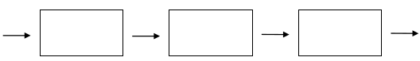

- Distributed-Memory system
    - sklada se z uzlu a komunikacnich kanalu (viz 1. prednaska - topologie)
    - uzel
        - aktivni element (provadi vypocet)
    - komunikacni kanal
        - prenasi data mezi uzly
        - napriklad switch na linkove vrstve (router na 3. vrstve)
    - Univerzalni pocitacova sit
        - specialni SW dovolujuje vyuziti pocitacove site za ucelem provedeni distribuovaneho vypoctu
        - ostatni sitove funkce jsou zachovany
            - napriklad skolni laborator
            - SETI@Home, Folding@Home (Covid-19), ...

- Seti@Home
    - patrani po mimozemske inteligenci
    - radio teleskop prijme data
        - signal je kvantifikovani do nul a jednicek
    - server distribuje bloky dat jednotlivym klientum
        - take je poznost poslat stejna data vicero klientum -> fault tolerant
        - kdyz klient pri vypoctu selze, vrati se do posledniho znameho stavu
    - Farmer-Worker pristup
    - bezi na beznych domacich i kancelarskych pocitacich
    - hodne low-power zarizeni da dohromady distribuovany high-power pocitac

     

    - Univerzalni paralelni pocitac
        - urceny pro parelelni, distribuovane vypocty (jeho primarni funkce)
        - sitova funkcionality slouzi k distribuovanemu vypoctu (poskytuje rozhrani)
    - napriklad MPI klastr
        - MPI = Message Passing Interface - definuje API pro preposilani zprav
        - predpoklada stejny HW (je jedno kdo vypocet provede => vsichni maji stjeny vypocetni vykon)

    - Single-Purpose Computer
        - postaven pro specifickou ulohu (ucel)
        - obetovava univerzalni za maximmalni urychleni
        - napriklad TWINKLE
            - vicero LED diod, mereni jake je vysledene osviceni v bode kam jsou LED namireny (alnalogove scinani pomoci mereni svetla)
            - problem faktorizace velkych cisel je mene narocny
            - pouziti v kryptografii (napr prolomovani RSA klice) 

- Distributed-Memory System
    - dovoluje vetsi urcyhle nez SMP diky
        - paralelni komunikaci (musi byt dobre navrzena tak aby se prekryvala komunikace a vypocet)
            - provadanim vypocet, kdyz prijdou data, poslu je dal (100% vyuziti procesoroveho casu)
        - zvyseni poctu CPU a pameti
    - efektivni urychleni zavisi na
        - granulite dat
        - celkovym poctu dat, ktera se zpracovavaji
        - alokace dat a tasku jednotlivym nodum
        - vyuziti HW
        - kvalite SW

- Network Node Address
    - sekvence bytu kterou muzeme priradit dle topologie
    - mela by v sobe nest informaci o tom kdo jsou sousedi daneho uzlu (napr mrizka)
    - pote muzeme odvodit sousedy a optimalizovat posilani zprav
    - napriklad 2x integer (grid, toroid)
        - `struct addr { int x, y;};`
    - komunikace
        - preferovani simplexni komunikace mezi sousedy (data se posilaji pouze v jednom smeru)
            - mensi overhead viz linkova vrstva
        - jinak musime Store & Forward - forwardovani packetu

- Wormhole Switching
    - cas Store & Forward paketu zavisi na velikosti daneho paketu
    - uz v ramci designu rozdelime packet na mensi jednotky
        - flit (flow unit), fixni delka
    - prvni flit zakoduje cilovou adresu a flit-sequence tag (ze se bude jedna o flit sekvenci)
    - flitj je mensi
        - muzeme zpracovat vice paketu soucasne
        - zvysuje rychlost dane site
        - snizuje latenci
        - real-time komunikace

    

- Cut-Through Switching
    - minimalizuje latenci
    - zacne preposilat pakety hned jak prijme alespon cast paketu
        - z principu designu dorucuje rozbite packetu
        - problem kdyz chceme  danem uzlu pocitat napriklad CRC protoze potrebujeme mit vsechna data (ne jen zacatek)
    
    - Adaptive switching
        - prepinae mezi Store & Forward a cut-through na zaklade aktulaniho vytizeni site

    

- SPMD 
    - exekuce stejneho programu na kazdem uzlu
    - uzel prijma specificke data streamy
    - kazdy proces ma vlastni id
        - muze se id naucit
        - muze dedukovat sve sousedy
        - take je mozne dedukovat bloky dat pro zparacovani (z id)
    - prvni proces ma id 0 (napriklad MPI rank)
        - ridi vypocet
        - muze agregovat mezivysledky
    - homogeni distribuovane prostedi
        - napriklad MPI klastr vyrobeny z identickych uzlu
        - prvni proces urci celkovou velikost dat a rozvnomerne je na zacatku rozdistribuje ostatnim procesum
    - heterogeni distribuovane prostredi
        - uzly mohou mit rucny vypocetni vykon
        - lepsi je pouzit dynamicke rozdelovani prace (za runtimu)
    - technick vsechny programy muzou spustit stejny kod (jen ten prvni bude mit navic procediru distrubuce praci - na zacaku)
    
- MOV vs ADD Cycles’ Impact
    - farmer-wordker speedup
        - kdyz uvazime nevyzname zpozdeni pri odesilani a prijimani zprav, pak ma linearni urcychleni
    - ocenne kdyz
        - mala granularita
        - vypocet trva mnoho dele nez proposilani zprav (bloku dat)
    - moderni CPU maji stejny vykon pri pouziti MOV nebo ADD instrukce (jsou si rovnocene z hlediska vykonu)

    

    - step-locked pipelina analogie vyrobni linky
    - bloky dat by mely byt stejne pro kazdy uzel (urceno na zaklade vypocetnich pozadavku - ne velikosti!)
    - rychlost vypoctu vs velikost dat
        - data by mela byt presunuta drive nez jsou zpracovana taky aby se mohla v case prekryvat s vypoctem (napr jejich zpracovani)
        - idelani na i-tem uzlu, paralelne
            - zpracovani dat
            - prijeti jiz zpraxovanych dat predchozim uzlem
            - odeslani zpracovanych dat na i-tem uzlu dalsimu uzlu
        - celkove zpracovani dat je rozdeleno to N tasku zpracovavanych na N uzlech => urcyhleni N

- Lampartovo hodiny
    - casova razitka dovoluji castecne usporadani udalosti
        - nezachycuji zavislosti
    - casove razitko je monoliticky se zvysujici integer pro kazdy node / proces / vlakno
        - vlakno inkrementuje citac pred kazdou udalosti
        - pri interakci (napr posilani zpravy) jej vlakno spoji s danym citacem
        - pri prijeti zpravy aktualizuje vlakno hodiny na maximum svych vlsanich hodit a hodin druhe strany (uzlu)
            - => synchronizace
    - Necht `a` a `b` jsou udalosti a `C(x)` je cas udalosti `x`
        - pokud je udalost `b` zpusobena udalosti `a`, potom `C(a) < C(b)`
        - pokud je `C(a) < C(b)` nemuzeme dedukovat ze `a` zposobilo udalost `b`

- vektorove hodiny
    - detekce poruseni kauzality udalosti v distribuovanem systemu
    - necht existuje Lamport-clock vector
        - kodovani hodin interagujicich vlaken (muzeme preposlat cely vektor nebo jen tu cast ktera se zmenila)
        - kazda vypocetni jednotka (proces/vlakno) si drzi kopii tohoto vektoru
    - matice hodin generalizuje vektorove hodiny

        

    - jak to udelat?
        - resetovat vsechna casova razitka na 0
        - proces/vlakno inkrementuje sve hodiny pri jakekoli udalosti
            - odelslani / prijem dat, interni udalost jako je stav prechodu (viz temporalni logika)
        - pri prijeti zpravy
            - zprava muze obsahovat libovolny pocet casovych razitek od jinych procesu
            - pro kazdy prvek vektoru hodin nastavi maximum ze zname a prijate hodnoty (B:2 -> B:3)
        - `VC(x)` jso vektorove hodiny udalosti `x`
        - pro udalosti `a` a `b` plati ze `VC(a) < VC(b)` pokud 
            - `for i:=0 to clockvector.size()-1: VC(a)[i]<=VC(b)[i]`
            - a alespon jeden `VC(a)[i]<VC(b)[i]`
        - pote plati ze `VC(a) < VC(b)` pokud `a` je zpusobilo `b`

- Komunikacni schema
    - Necht je virtualni topologie komunikacnim schematem distribuovaneho systemu
        - v nejlepsim pripade se 1:1 mapuje na fyzickou (snazime se docilit napriklad s pouzitim hvezdicove topologie)
    - komunikace dobre navrzenych distirbuovanych systemu
        - kazdy proces komunikuje pouze s podmnozinou vsech procesu
        - komunikacni klastr
        - kazdy proces ma svuj vlastni unikatni klastr
    - virtualni topologie definuje klastr
    - klicova vlastnost: proces nepotrebuje komunikovat se vsemi procesy v nedavnem casovem kvantu
    - efekt: muzeme namapovat procesy na topologii site tak aby procesy spolu komunikuji byly od sebe v kratke vzdalenosti => snizaeni latence
    - nekdy muze proces komunikovat vne sveho klastru (napr na zacatku pri prijmani inicializactnich dat)
    - poskytnutim send/receive funkce muzeme sledovat a odhalit klastry
        - nemusime odhalit celou virtualni topologii (muze zaviset na datech)
        
    

- BigData
    - vetsinou je zpracovani spolejene s distribuovanou zalezitosti ale co to vlastne je?
    - nikdo nevi presnou definici
    - "Big data is where parallel computing tools are needed to handle data"?
        - vagni definice
        - nezohlednuje neefektivni dattove struktury, neefektivni program a shopnosti daneho programator
        - neexistuje zadne ospravedlni toho ze mnozstvi obrovskeho objemu dat je rozumne
        - "The computing scientist’s main challenge is not to get confused by the complexities of his own making."
    - historie
        - na starych PC (diskety 1.44 MB) 
        - dnesni image OS by tehda predstavovali "BigData"
        - jak se to dnes lisi?
    - Internet of Things (IoT)
        - hodne malych zarizeni produkuje ohromne mnozsvi dat
        - kam je ulozit?
        - jak je zpracovat?
        - je to skutecny "BigData" problem? nebo jen preagregovany problem zpusobeny nadprodukci dat?
        - Kilometer Square Array
            - skutecny BigData problem
            - IoT zarizeni na rozloze 1km ctverecni
        
- distribuovany MapReduce
    - v SMP prostredi 
        - `map` koresponduje planovaci a `reduce` funkci redukce (zpracovani dat)
            - bez uvazeni task-stealing planovace
            - mapovani s pouziti afinity
    
    - v distribuovanem systemu
        - `map` rozdeluje data jednotlivym uzlum
            - kazdy uzel je muze preposlat dal
        - `reduce` je zpracovani dat na danem uzlu (pripadna agregace dat z jineho uzlu)

    

    

    - musi byt robustni, selhani jednoho nodu nesmi sundat cely system
    - HDFS - distribuovany souborovy system
    - map-reduce framework
        - uzivatel jen naprogramuje map a reduce funkci
