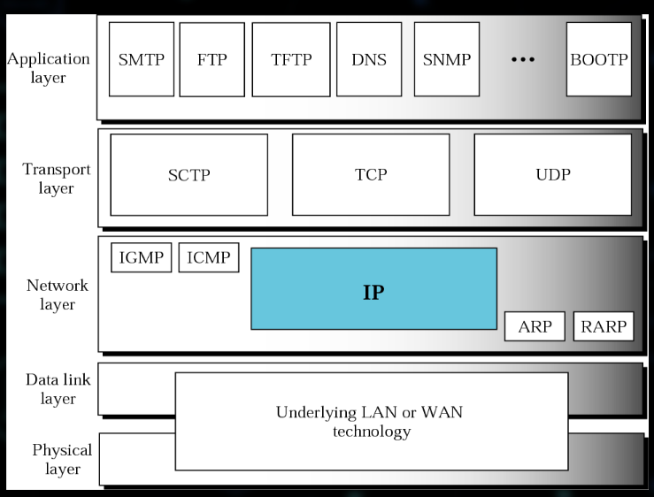

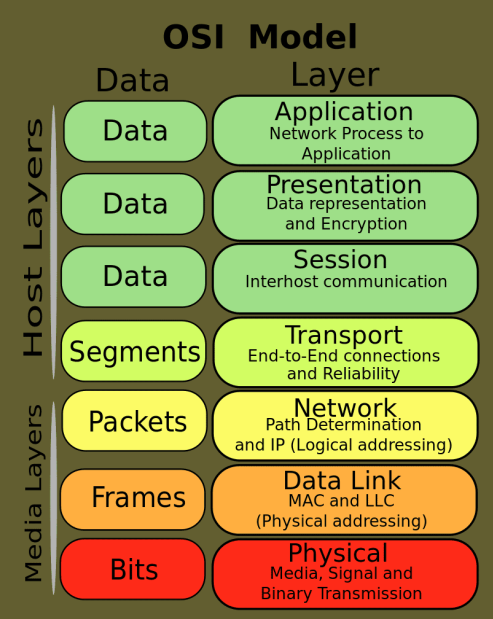

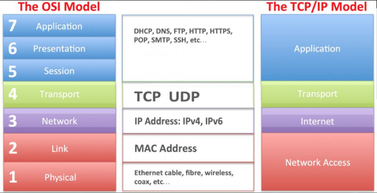

- protokoly linkove vrstvy
    - LAN - local area network
        - ethernet, logical link, WiFi, Bluetooth
    - PAN - personal area network (chytre hodinky, bluetooth, telefon, atd.)
    - dratove / bezdravoce pocitacove site
    - WAN - wide area networks
        - metalovy kabel, opticke vlakna
        - vetsi prenosove rychlosti
        - MPLS (MultiProtocol Label Switching)
            - umisten nekde mezi 2. a 3. vrstvou
            - nepouziva cilovou adresu
            - kratke labely s pevnou delkou (=> velka rychlost)
            - labely identifikuji virtualni linky (paths) mezi vzdalenymi uzly
        - bezdratove
            - GPRS - General Packet Radio Service

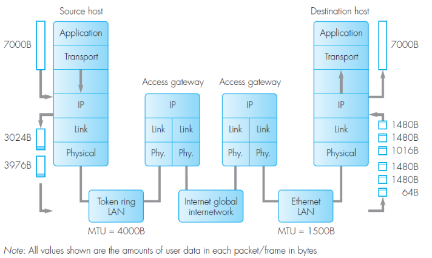

- Sitove protokoly
    - IP protokol
        - 3. vrstva
        - nezarucuje spravne poradi packetu
        - packet forwarding and routing

    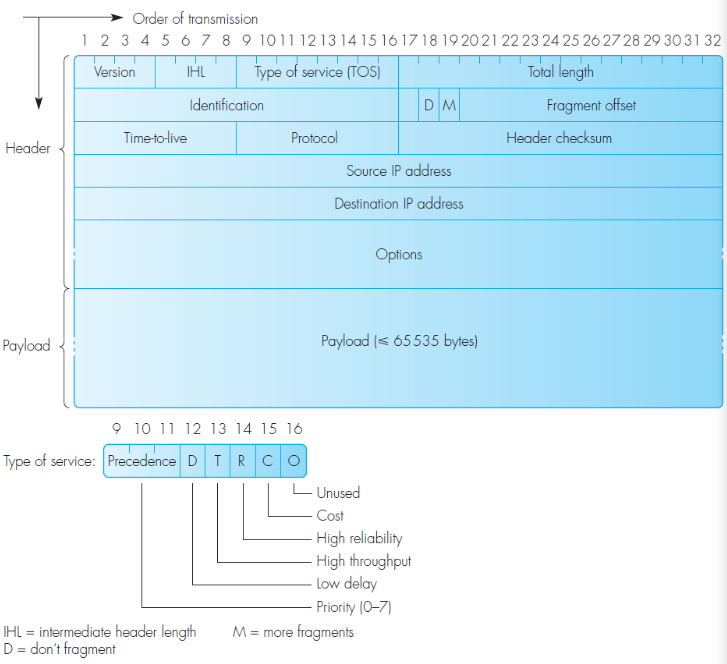

- protokoly transportni vrstvy
    - prenost dat nad sitovou vrstvou
    - TCP
        - potvrzovani, opravy chyb, spojove orientovany
    - UDP
        - nepotvrzuje se, "nespolehlivy"

- protokoly aplikacni vrstvy
    - Telnet, SSH - vzdalene terminaly
    - FTP - prenos souboru (file transfer protokol)
    - HTTP - HyperText transfer protokol (WWW)
    - DNS - domain name services

- Auxiliary protocols (pomocne protokoly)
    - routovani
        - preposilani packety
    - sprava a diagnostika pocitacove site
    - preklad adres (IP -> MAC (who has))

    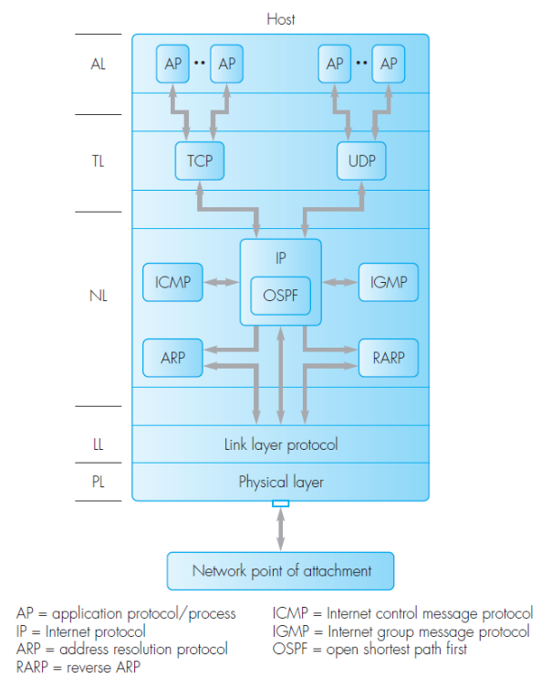

    - ARP = Address Resolution Protocol
        - preklad IP adresy na fyzickou
    - RARP = Reverse Address Resolution Protocol
        - pozdeji nahrazen BOOTP a nahonec DHCP
    - DHCP = Dynamic Host Configuration Protocol
        - nahradil BOOTP
        - poskytuje
            - dynamickou IP
            - adresu vychozi brany
            - adresu DNS servru
    - ICMP = Internet Control Message Protocol
        - sprava a diagnostika pocitacove site
        - Destination (network / host / port) unreachable
        - Echo, Timestamp, Network mask - request / reply
        - TTL (time to live)
            - s kazdym "skokem" (uzlem) je hodnota snizena o 1, posledni router packet zahodi
    - IGMP = Internet Group Management Protocol
        - sprava multikastovych skupin
        - podpora routeru (multikastovy router)
        - pouze v ramci lokalni site
        - operace
            - join
            - leave
            - query
    - routovaci protokoly
        - staticke / dynamicke routovanis
        - vramci jednoho autonomniho systemu (AS = autonomous system)
        - pouzivane routry za ucelem sdieleni informace o aktualni topologii pocitacovou site (zmeny + optimalni cesty)

- adresy & adresovani
    - identifikovani pocitacoveho uzlu
        - globalne unikatni identifikator
            - 7ce2a4f8-6922-4fea-89d9-5b4fe3285da1
        - IP verze 4
            - 32 bit / 4 byte
            - teckova (dot) notace: 147.228.57.10
            - domain name: ftp.zcu.cz
    - IPv4
        - 32 bit => 2^32 = 4,294,967,296 ruznych adres
    - IPV6
        - 128 bit / 2001:0db8:85a3:0000:0000:8a2e:0370:7334
    - duvody pro zavedeni IPv6
        - postupne vycerpani IP adres s tim jak se internet rozrusta
        - adresovy prostor s IPv6 by mel vydrzet "navzdy"
    - IPv4 - typy adres
        - Unicast
            - unikatne identifikuje dva uzle (pocitace) v pocitacove siti

            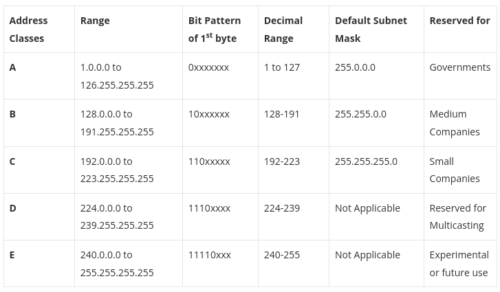

        - Multicast
            - skupina
                - definuje skupinu uzlu (pocitaci)
                - trida D - 224.0.0.0 - 239.255.255.255
                - limitovani na lokalni sit
            - broadcast
                - zprava poslana na broadcastovou adresu muze byt prijata vsemi uzly pocitacove site
                - 255.255.255.255
        - Rezervovane adresy
            - 0.0.0.0 - vychozi route (v routovacich tabulkach)
            - 127.0.0.0 - "loopback interface" - localhost
            - 192.0.2.0 - "TEST/NET" - pro priklady a manualy
            - privatni adresy
                - 10.0.0.0/24
                - 172.16.0.0/12
                - 192.168.0.0/8

    - sitova maska
        - reozdeluje IP adresu na dve castu (network + hosts)
        - logicky AND masky a adresy hosta = subnet adresa
        - 147.228.57.10 & 255.255.255.0 (class C) = 147.228.57.0

    - problemy IPv4
        - maly pocet dostupnych adres
            - skoro vsechno muze byt pripojeno k internetu (IoT)
            - problem s agregaci routovacich informaci
        - velky narust routovavich tabulek
            - velky pocet zaznamu
        - zavedeni NATu
            - NAT = Network Address Translator
            - "schovani" skupiny privatnich adres za jednu verejsou
            - pouze docasne reseni
            - uzly za NATem nejsou verejne dostupne
            - v rozporu s myslenou internetu - kazdy uzel je verejne dostupny
                - staticky NAT

                    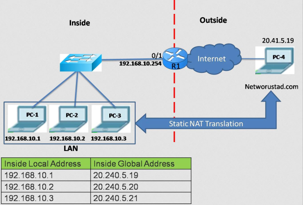

                - dynamicky NAT

                    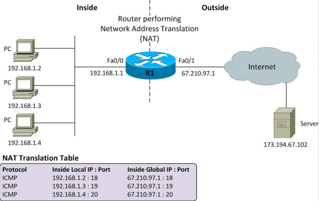
            
            - problemy NATu
                - uzel neni verejne dostupny => problem pro mnoho aplikaci (P2P network, video konference, ...)
                - pouziti "connecting servers" je nezbytny
                - "hole punching" - predikce obsazeni portu

- Domain Names and Name Services
    - jmena se lepe pamatuji (narozdil od IP adres)
    - 147.228.57.10 -> ftp.zcu.cz
    - 2001:0db8:85a3:0000:0000:8a2e:0370:7334 -> foo.bar.ab

        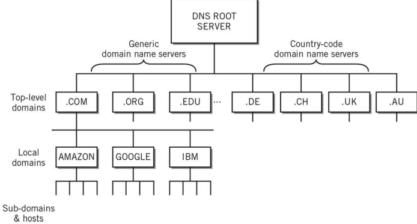

    - top-level domains: .com, .edu, .org, .int, .eu
    - top-level domains zemi: .cz, .sk, .de, .uk (2 pismena dle ISO-3166)
    - jednasa v podstate o distribuovanou databazi
    - typy DNS zaznamu
        - A - IP (v4) = domain name
        - AAAA - IP (v6) = domain name
        - CNAME = alias (www)
        - NS - nameserver domain (zodpovedny nameserver)
        - MX - mail exchanger
        - PTR - reverzni zaznam (What's the name of 147.228.64.1 ?)
    - DNS protokol
        - dotaz a odpoved = UDP 53
        - prenos zonovych souboru = TCP 53

        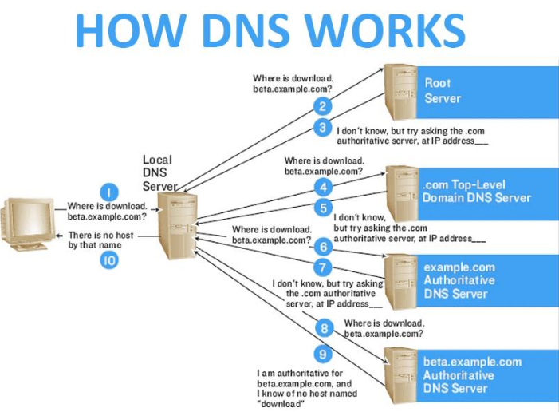