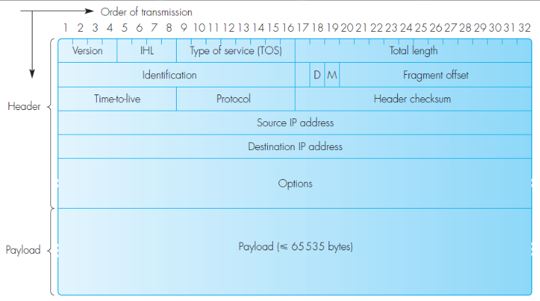
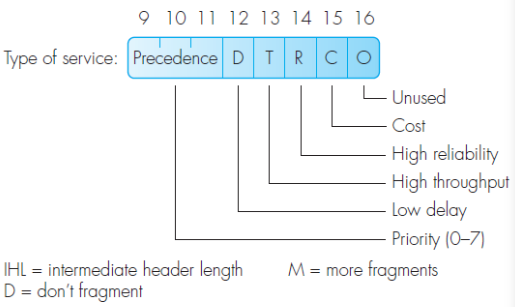
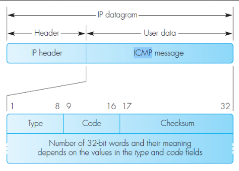
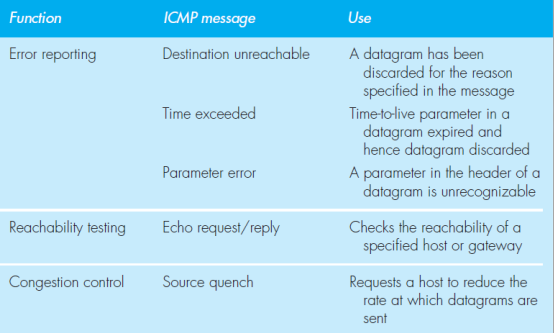
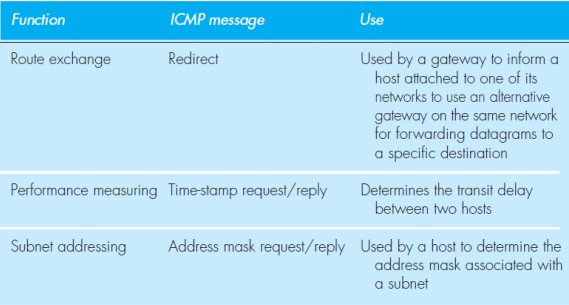
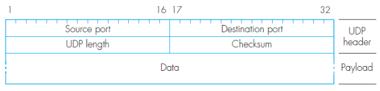
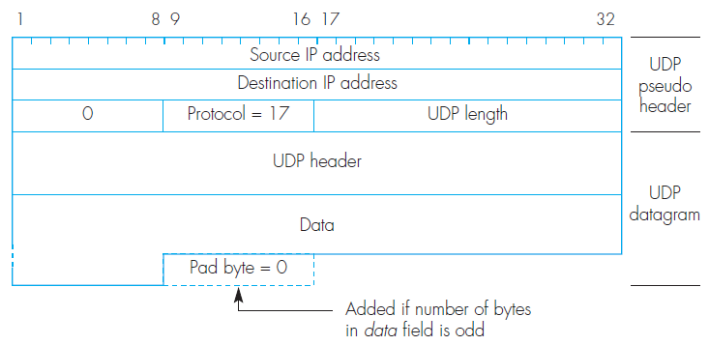
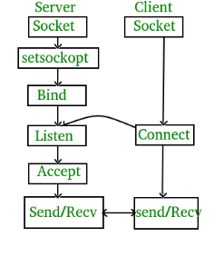

- IPv4
    - termilogie
        - frame = datova jednotka na linkove vrstve
        - packet = datova jednotka na sitove vrstve
        - segment = datova jednotka na transportni vrtsve
        - bock = datova jednotka na aplikacni vrstve 
    
    - IP packet structure
        - header 20 - 60 bytes
        - payload max 64kB - header length

        

        - version = 4 (0100)
        - IHL = intermediate header length (nasobek 32 - aligned)
        - TOS

            

            - Precendence = priority (unused)
            - D = maximalni zpozdeni
            - T = maximalni propustnost
            - R = maximalni spolehlivost
            - C = minimalni cena
        - Total length = celkova velikost packetu (max 64kB vcetne hlavicky)
        - Identification = korelacni ID vyssi vrstvy
        - D = don't fragment (nerozdeluj packet do mensich packetu)
        - M = more fragments (bude nasledovat vice fragmentu v pripade ze se pouziva fragmentovani)
        - Fragments offset = offset daneho fragmentu
        - Time-to-live = maximalne pocet "skoku" - kazdy router snizi toto cislo o 1, posledni router packet zahodi
        - Protocol = identifikator protokolu
            - 1 - ICMP
            - 2 - TCP
            - 3 - UDP
        - Header checksum = 16-bit binary complement
            - checksum je ale take soucasti hlavicky :( => pro ucely vypoctu se checksum nastavi na 0x0000
        - Source Address = IPv4 adresa odesilatele
        - Destination Address = IPv4 adresa prijemence
        - Options = indikace chyb, debugging, reporting, muze obsahovat doporucenou cestu routovani
        - Data = payload obsahujici data protokolu vyssi vrstvy (hlavicka + data)

- ICMP - Internet Control Message Protocol
    - indikace chyb
    - testovani dosazitelnosti (unreachable, ping - ICMP echo)
    - rizeni toku dat
    - informace o zmenach cesty (pri routovani)
    - mereni propustnosti
    - dotaz na mastku site

    

    

    

- UDP – User Datagram Protocol
    - nespolehlivy protokol prenasejici datagramy
    
    

    - IP adresa = identifikace uzlu v ramci site
    - Port = identifikace procesu/sluzby v ramci uzlu
        - 0 - 1023 = well-known
        - 1024 - 49151 = registrovane
        - 49152 - 65535 = dynamicke nebo privatni
        - `/etc/services`
    - Checksum = vypocitan pres pseudoheader

        

- IP Networks Programming Interface

    - BSD sokety
        - IP network programming interface
        - Unix
        - navrzeno podle puvodni myslenky Unixoveho IO pristupu = "open-read-write-close"
        - defakto standart IP sitove komunikace

    - client-server model
        - server - pasivni, ceka na prichozi pozadavky
            - musi byt schopon obsouzit nekolik pozadavku zaroven
        - klient - aktivni, posila pozadavky

        

        1) alokovani a otevreni daneho portu (bind)
        2) poslouchani prichozich spojeni
        3) prijmuti prichoziho spojeni
        4) zpracovani pozadavku
        5) odeslani odpovedi
        6) goto 2