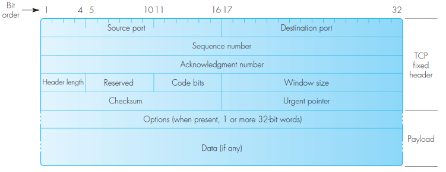
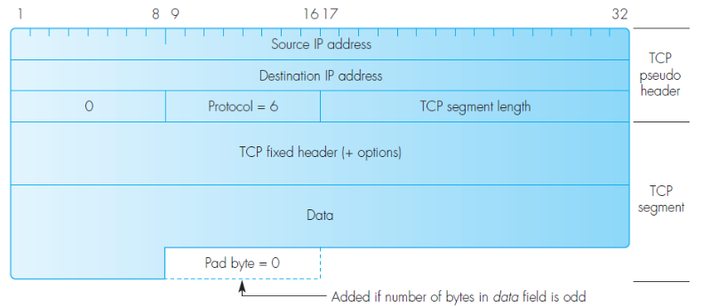
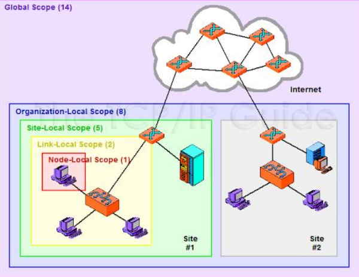

- overview 

    

    - APDU = application
    protocol data unit
    - PDU – protocol
    data unit

- Transmission Control Protocol - TCP
    - spojove orientovany protokol
    - client-server model
        - ip adresa + port
    - full duplex, spolehlivy prenost dat
        - data jsou prenasene po segmentech (datova jednotka)
        - nastaveni spojeni
        - prenos, acknowledgments, retransmissions kdyz se ztrati data
        - ukonceni spojeni 

         

         - code bits

            

        - TCP header checksum - stejne jako u UDP je spocitan pres pseudoheader pridaneho segmentu

            

    - aplikacni rozhrani

        

    - TCP API (BSD sokety)

        

    - TCP navazani spojeni  (3-way handshake)

        

        

    - rizeni toku dat

        

        - nastaveni poctu bytu tak aby prijemce nebyl prilis vytizen 
        - ACK number = cislo dalsiho bytu ktery oceva ze prijme

        

        

        

        

        

        - data nejsou prenesena do vyssi vrstvy hend; buffer je vyprazdnen az po dosazeni urcite velikosti
        - realitime aplikace 
            - data nemuzou cekat v bufferu
            - hned se preposlou (remote terminal)
            - PSH (push flag) rika prijemci ze data musi byt prenesena do vyssi vrstvy okamzite

        - TCP - ukonceni komunikace
            - 4-way

                

            - 3-way

                 

            - soucasne

                 

        - TCP connection je defakto stavovy automat
        - protokoly pres TCP
            - HTTP (80), SSH (22), SMTP (25), Telnet (23), FTP (20 - data; 21 - control)

- Internet Protocol Version 6
    - proc IPv6?
        - rozsireni adresni prostor (mel by byt dostatecne velky naporad)
        - 3 typy adres
            - Unicast - pro jedno rozhrani
            - Multicast - pro mnozinu rozhrani na stejnem fyzickem mediu (paket je poslan na vsechny interface svazane s danou IPv6 adresou)
            - Anycast - pro mnozinu rozhrani na jinem fyzikalnim mediu (paket je poslat pouze na jeden interface, ne na vsechny)
        - unifikovane schema adresovani pro internetove a privatni site
        - hierarchicke routovani 
        - zvysena bezpecnost
            - zabudovano do IPv6 (sifrovani, autentizace, data path tracing)
        - quality of service (QoS) support
        - optimilazece pro rychle switchovani / routovani
        - podpora mobilnich zarizeni
        - hladky prechoz z verze 4 na verzi 6

    - adresy
        - 128 bitu
        - reprezentace: `fedc:ba98:7654:3210:fedc:ba98:7654:3210`
        - zkracovani
            - `0123:0000:0000:0000:4567:0000:0000:0000`
            - `123::4567:0:0:0`
            - `123:0:0:0:4567::`
            - `123::4567::` - NEJEDNOZNACNE
        - reprezentace v URL
            - rozdil oproti IPv4 protoze `:` urcuje port
            - `http://[fedc:ba98::ba98:7654:3210]:8080/api`

        

        - `::1/128` - loopback; localhost 
        - `fe80::/10` - local link address
            - fe80[54 zero bits][64 bits interface ID]
            - autokonfigurace
            - neroutuje se
        - zname IPv6 adresy

            

        - multicast

            

        - Multicast addresses scopes

            

            

    - fragmentace
        - postupne eliminovana
        - nepodporovana IPv6 routry => musi resit endpointy samostatne (path MTU discovery)
        - MTU = minumal translation unit

- ICMPv6
    - narozdil oproti IPv4 neni pouzit jen pro reportovani chyb
    - nahraduje take napriklad protokoly ARP, RARP - Neighbor Discovery
    - IGMP - multicast group management

    
