- routovani v IP sitich
    - distribuovane routovani
        - nikdo nezna topologii site (neexistuje koordinator)
        - site jsou pripojene pomoci routeru
        - kazdy router je schopny objevit sve bezprostredni sousedy => vymenuji si znalosti o svych sousedech => jsou schopni zjistit aktualni topologii site
        - s pouzitim distribuovanych aloritmu se vypocita optimalni cesta mezi dvema uzly
        - routry preposilaji data na zaklade vypocitane optimalni cesty
        - kdy router detekuje a failure/recovery tak zapocne prepocitani optimalni cesty tim ze zmenu propaguje vsem svym sousedum

    - packet switching
        - vychzazi z cislove IP adresy
        - hleda nejlepsi schodu v routovaci tabulkce
        - paket je poslan ven pres interface odpovidajici zaznamu v routovaci tabulce
        - pokud neni nalezen zadny zaznam pro danou IP adresu -> pouzije se `0.0.0.0`

    - routovaci tabulka
        - linux `netstat -rn`

    - Routing vs Forwarding
        - routing = proces hledani optimalni cesty do dalsich siti a ukladani zaznamu do routovaci tabulky (optimalni cesta)
        - forwarding = proces prijimani paketu na interface a poslani je dal pres interface ktery odpovida zaznamu v routovaci tabulce (podle cilove IP adresy)
    
    - algoritmy distribuovaneho routovani
        - model site = graf = dvojice mnozin vrcholu a hran
            - vrcholy = routery
            - hrany = spojeni (interface to interface)

        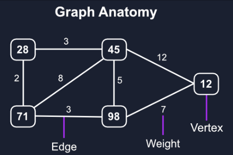

    - strategie routovani
        - staticke = manualne nastaveno
        - dynamicke = adaptivni algoritmy
            - routovani zalozeno na distance vector = Distance Vector Algorithm - DVA
            - routovani zalozeno na stavu linek = Link State Algorithm = LSA
            - routovani zalozeno na path vector = Path Vector Algorithm
            - hybridni routovani - kombinace predchozich

    - nalezeni optimalni cesty
        - vazene hrany
        - minimalni cesta
            - Bellman-Ford algorithm - funguje se zapornyma hranama
            - Dijkstra algorithm - rychlejsi ale jen pozitivne ohodnocene hrany
        - maximalni tok 
            - Ford-Fulkerson algorithm
            - vypocet maximalni propustnosti dane site
        - minimalni kostra grafu
            - napr. prim-jarnik
            - pouzito na linkove urovni (bridges)
        - router pocita optimalni cestu k ostatnim routerum v ramci jednoho autonomniho systemu (AS)

    - nalezeni optimalni cesty - metriky
        - aditivni metrika (pricitaci) - celkova  vaha cesty je suma vsech hran (napr. zpozdeni)
        - konkavni metrika - celkova vaha vesty je minimum z vah vsech jejich hran (napr MTU = minumum transmission unit)
        - muliplikativni - celkova vaha cestu je soucin vsech hran na ceste (napr ppst poruchy => n nezavyslich jevu)
    
    - hierarchicke routovani
        - neni mozne aby kazdy router vedel cesty do vsech siti v internetu
        - => routovani v internetu je hierarchicke (“the network of networks”)
            - schovani detaily o siti pred okolnim svetem
            - agregace routovacich informaci
            - snizeni poctu informaci ktery si kazdy router musi udrzovat, zpracovat a vymenovat

        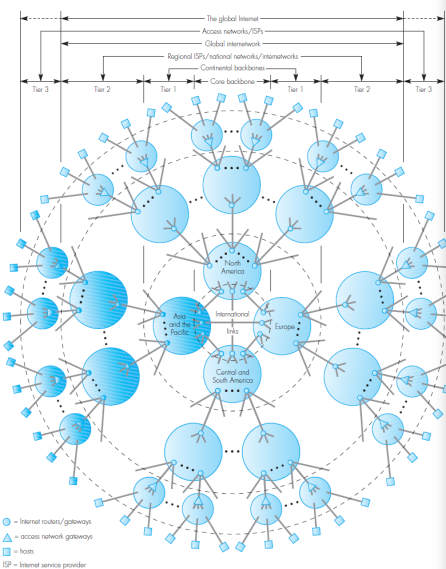

        - AS = autonomni system
        - AG = area gateway
        - 1 = interni router
        - 2 = paterni router
        - 3 = area hranicni router
        - 4 = AS hranicni router

        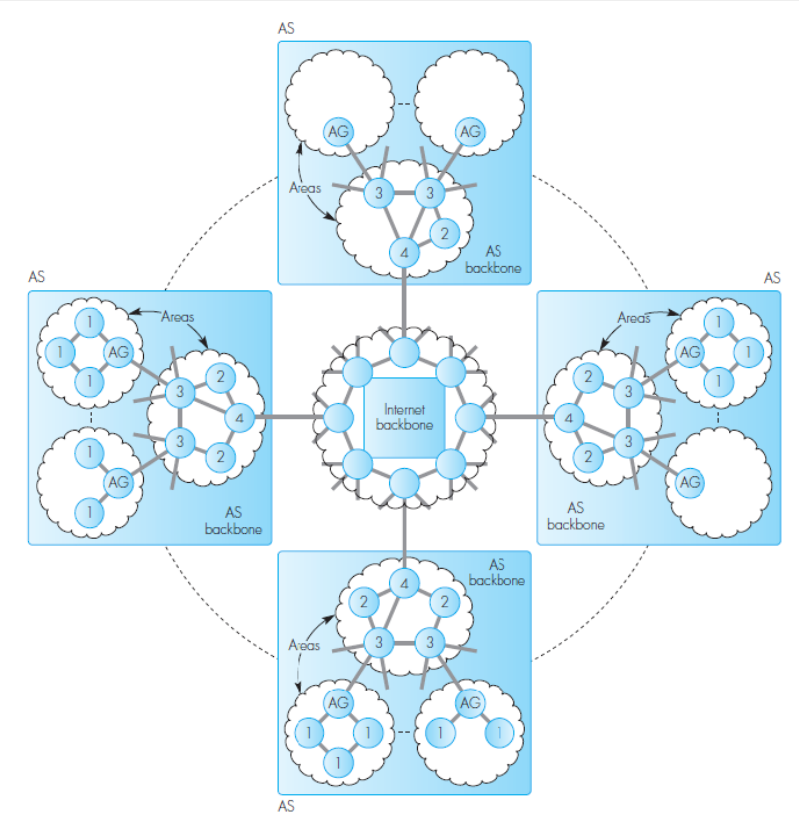

        - routovaci protokoly jsou pote optimalizovane pro intrni, hranicni a externi routovani

        - internal
            - DVA: RIP, RIPv2, RIPng
            - LSA: OSPF
            - sousedni routery jsou naprimo pripojeni do stejne site
        - hranicni
            - Path-Vector BGP (iBGP - internal)
            - sousedni routery nemusi byt pripojene naprimo
        - externi
            - Path-Vector BGP (eBGP - external)
            - sousedni routery jsou naprimo pripojeni do stejne site

    - RIP (Routing Information Protocol)
        - Distance Vector Algorithm
        - RIP, RIPv2, RIPng (next generation)
         - Distance Vector = (node ID, distance)
            - distance = pocet skoku

        - router posila kazdych 30s svoji routovaci tabulku svym sousedum
        - metrika = pocet skoku (16 = nekonecno)

        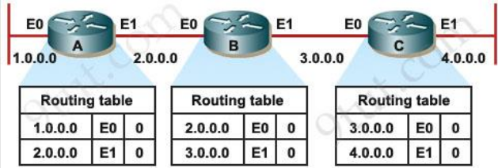

        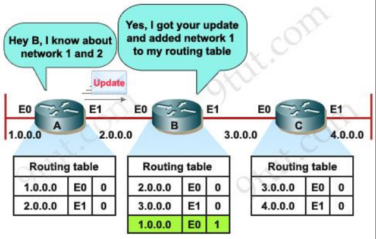

        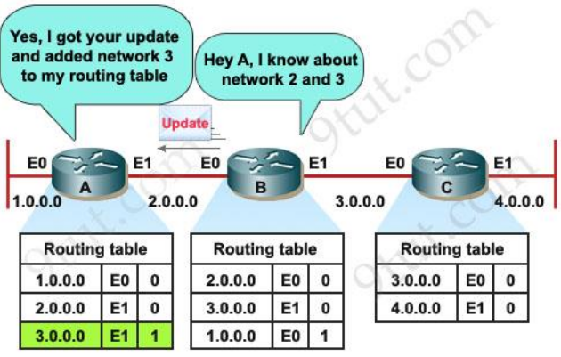

        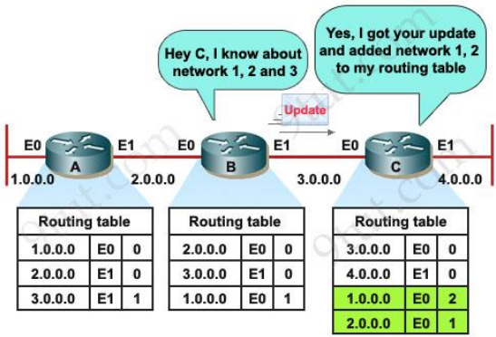

        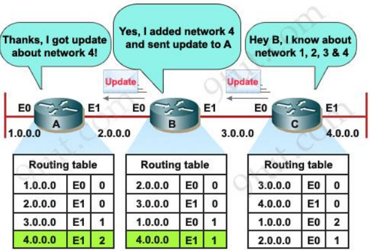

        - Destination becomes unreachable

        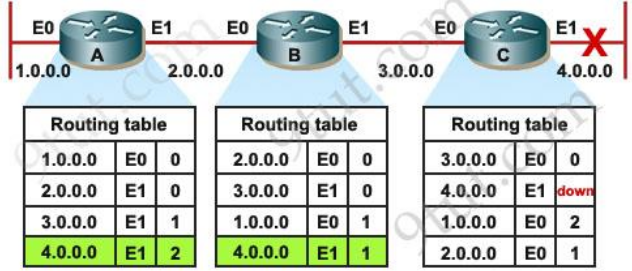

        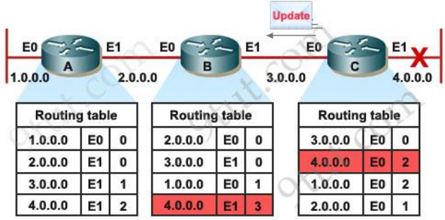

        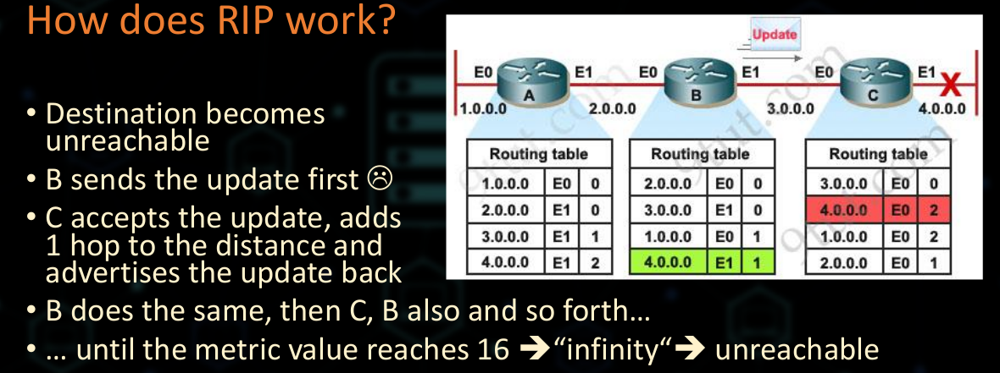

        - prevence pocitani do 16 (nekonecno)
            - split-horizon - router nepropaguje zmenu zpet do puvodni site
            - poision-reverse - router inzeruje cíl zpět do původní sítě s metrikou 16

        - protokol
            - UDP - port 520
            - broadcast 255.255.255.255
            - tridni routing (A, B, C)
            - prikazy
                - request
                - reponse (every 30s or upon request)

        - RIP version 2
            - zavedeni CIDR (maska site)
        - RIPng - Next Generation
            - IPv6
            - UDP port 521
            - MCAST to ff02::9

    - OSPF - Open Shortest Path First
        - nepropaguje celou routovaci tabulku
        - pouze zmenu stavu linky
        - posila kratke HELLO pakety kazdych 10s
        - pokus sousedoho HELLO paket neni viden ve 3 posobejdoucich intervalech => soused je povazaovat za down
        - metriky

            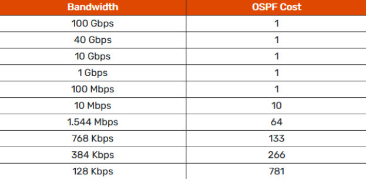

        - Směrovače na stejném segmentu sítě tvoří logiku hvězdicová topologie
        - Vybere se jeden router jako hub (DR centralni router) a jeden zalozni
        - pokud je novy router pripojeny do site -> zepta se DR routeru na jeho routovaci tabulku -> snizeni network traffic
        - vybrani DR routeru je implementovani pomoci Hello paketu

        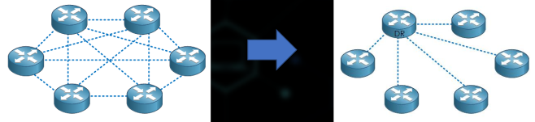

        - 2 typy preposilani informace
            - router links = seznam pripojenych siti spolu s metrikou
            - network links = seznam routeru pripojenych k dane siti (tahle metrika je vzdy 0)

            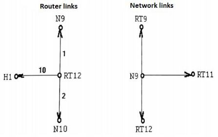

        - proc network links?
            - v sítích s více přístupem (jako je Ethernet) může každý router přímo komunikovat s ostatními => uplny graf
            - tato slozitost je snizena tim ze se sit pretvori do hvezdicove topologie se stejnou pripojenosti ale s metrikou 0
            - site je "pasivni zarizeni" => nepropaguje zmeny

            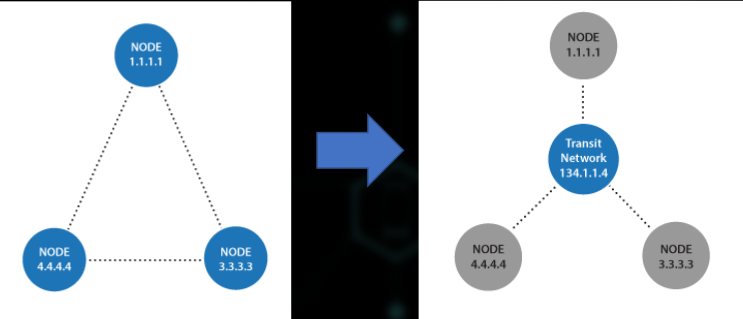

            - databaze stavu linky
                - databze o soucasnem stavu linek (router + network links)
                - router je spoji dohromady aby vytvoril graf dane site
                - s pouzitim Dijkstrova algororitmu vypocita optimalni cestu a updatuje vou routovaci tabulku
                - propagace zmen stavu linek je implementovan pomoci multicastu
                    - router -> 224.0.0.6 (OSPF DR a BDR)
                    - DR (BDR) -> 224.0.0.5
                - aktualizace databaze stavu linek
                    - pouziti spolehliveho protokolu (pouziti asknowledgment)

        - OSPF paket format
            - common header
                - hello packet
                - databse description paket
                - link state request paket
                - link state update paket
                - link state asknowledgment paket

    - BGP (Border Gateway Protocol)
        -  Protokol pro směrování výměny informací mezi hraniční směrovače autonomního systému (AS)
        - zasadni pro komunikaci pres internet
        - Path-Vector = {Destination, Path}
            - Destination = 147.228.0.0/16
            - Path = { AS701, AS6762, AS2852 }
        - pouziva TCP (port 179) za ucelem dosazeni spolehlivosti

        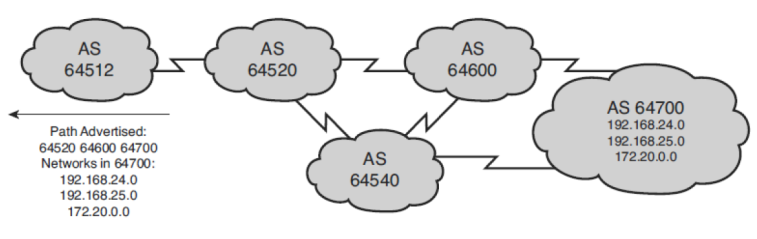

        - mozne zpusoby pripojeni AS do internetu

            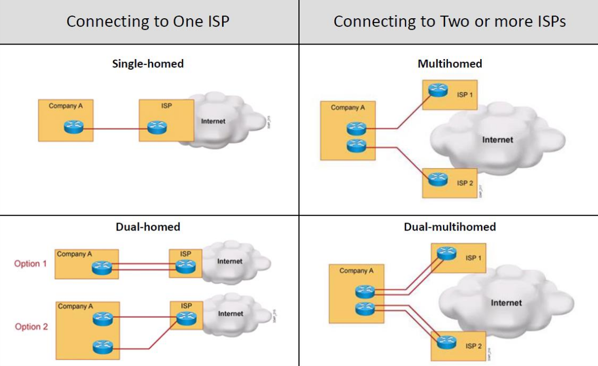

        - zakladni koncepty
            - BGP speaker - router exekujici BGP proces
            - BGP peers/neighbors - BGP routery ktere manualni navazuji TCP spojeni (port 179)
                - neighbor BGP router nemusi byt pripojeny naprimo (dano konfiguraci)
            - po navazani spojeni (OPEN) si routery zacnou vymenovat informace (UPDATE / propagace cesty)
            - drzi si otevrene TCP spojeni (KEEPALIVE - hold timer)
            - vymenuji si informace (UPDATE / propagace zmen, informovani o nedostupnych cestach)
            - hlaseni o chybach (NOTIFICATION)
            - router vidi pouze "strom" autonomnich systemu (AS)

            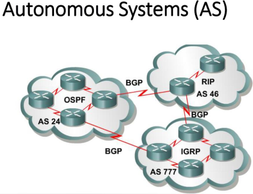

            - hledani opimalni cesty je obdobne jako u OSPF
            - preference/metrika se da nastavit administratorsky

    - BGP – Autonomous area/system
        - skupina routeru ktere patri do jedne administratorske domeny
        - obvykle patri stejne organizaci
        - BGP se nezajima o zpusob routovani v ramci AS
        - instance interniho routovacihi protokolu bezi uvnitr AS
        - na venek se propaguji pouze zmeny co se tyce adres A, B a C (ne co se tyce podsiti - CIDR)
        - 0.0.0.0 je vychozi routa do vnejsiho internetu pres hranicni router

    - EBGP (external BGP)
        - sousedni routry jsou fyzicky propojene ale jsou soucasti RUZNYCH AS

        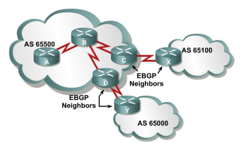

    - IBGP (internal BGP)
        -sousedni routery nejsou naprimo fyzicky pripojeny ale jsou soucasti STEJNEHO AS

        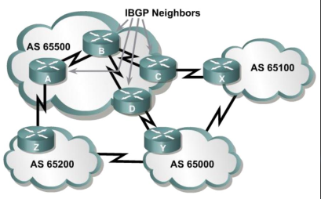

    - BGP - transit AS
        - vsechny routry v ramci jednoho AS musi vedet o vsech externich cestach

    - BGP - Troubleshooting
        - BGP "looking glass servers"
            - umoznuji se podivat do database s routovacimi informacemi externiho BGP routeru
            - administrator potrebuje vedet jestli prefix dane site je propagovan do paterni site internetu
            - presna specifikace looking glass servereru neni dana - muze byt pristupna pres Telnet, Web nebo REST API
            - muzeme napriklad zjistit cestu z Panamy na ZCU (kudy jdou pakety)