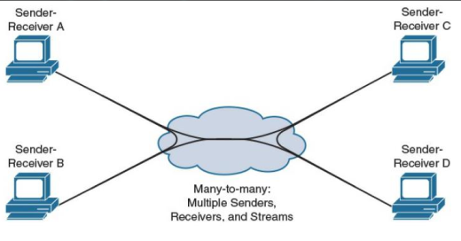
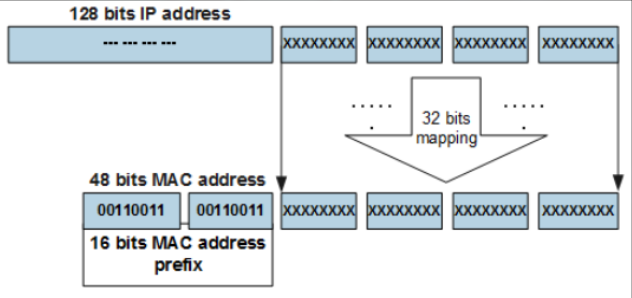

- zakladni komunikacni modely v IP sitich
    - unicast: konkretni zarizeni (adresa)
    - broadcast: vsechna zarizeni v pocitacove siti (lokalni)
    - multicast: vsechna zarizeni v jedne skupine

- duvody pro zavedeni multicastu
    - efektivni distribuce dat
        - broadcast: nadbytecna zatez pro pocitace ktere dana komunikace nezajima
        - opakovani unicast: zatez na pocitacovou sit a odesilatele
        - multicast: eliminuje duplicitni data posilane po siti

- opakovani unicast

    

- aplikace broadcastu
    - inicializace zarizeni v pocitacove siti - DHCP

    

- one-to-many multicast aplikace
    - distribuce videa
    - replikace

     

- many-to-many multicast aplikcace
    - telekonference

    

- modely sluzeb multicastu
    - Any-Source multicast (ASM)
        - promenna mnozina zdroju
        - vice komplexni distribuce
    - Single-Source multicast (SSM)
        - jeden zdroj
        - snazsi distribude

- adresovani
    - multicastove adresy
    - logicky identifikator skupiny hostu
    - pouzito na linkove vrstve (2) tak i na sitove vrstve (3)

- IPv4
    - rezervovano 224.0.0.0./4
    - 224.0.0.0 -> 224.0.0.255
        - reservovano 224.0.0.1 - AllHosts; 224.0.0.2 - AllRouters
    - 239.0.0.0 -> 239.255.255.255
        - administratorske (private use v ramci jedne site)
    - 224.0.1.0 -> 224.0.1.255
        - internet work control
    - 224.0.2.0 -> 238.255.255.255
        - verejny - streamovani medii

- IPv6

    

- Jak namapovat sitove multicastove adresy na linkovou vrstvu
    - linkova vrstva NEPODPORUJE multicast (posle N unicastovych zprav)
     - linkova vrstva PODPORUJE multicast (prevedeni multicastove adresy 3. vrstvy na multicastove adresy 2. vrstvy)

- mapovani adres treti vrstvy na adresy druhe vrstvy
    - sdilena media
    - ethernet
    - MAC adresy

    

    - IPv4

    

    - IPv6

    

- Jak to funguje na WiFi?
    - mapovani adres je stejne
    - vetsina ramcu je potrvena pomoci ACK/NACK => zvyseni spolehlivosti
    - prijemce ne vzdy posloucha pro prichozi ramce => power save mode
        - vzbuzen pouze v ramci daneho casoveho okna (jinak spi)
    - broadcast and multicast musi by odeslany v zavislosti na nepomalejsim klientu (hostu)
    - prevedeni to unikastu (multicast-to-unicast)
        - poslani N ramcu plnou rychlosti je casto rychlejsi neposlani jednoho multicastovyho ramce

- Sprava skupiny
    - IGMP v1
        - pouze QUERY (router) / REPORT (stanice)
        - router se periodicky pta pomoci posilani QUERY
        - stanice odpovi po nahodnem casovem offsetu
        - pokud stanice "vidi" odpoved, neodpovi
        - pokud se stanice prida do skupiny, posle hned REPORT

    - IGMP v2
        - pridana LEAVE zprave
        - explicitni pusteni skupiny

    - IGMP v3
        - pridana podpora pro SSM (Single-Source Multicast)

    - IPv6
        - ICMP v6 (v ramci IPv6 jsou IGMP zpravy podmnozinou ICMP zprav)
        - MLD (Multicast Listener Discovery)
            - protokol umoznujici routerum zjistit kdo a kde je prihlasen (subscribed) pro prijem zprav poslane na cilovou multicast adresu

- routovani multicastu
    - obecne
        - v ramci AS (atutonomci system) = scope
        - cilem nejsou subnety v ramci dane IP adresy ale subnety kde se nachazeji prijemci dane IP adresy => vice nez jedna destinace pro odelsany packet
        - to znamena ze router muze poslat packet na vice nez jeden interface
        - vice dynamicke - the nodes join and also leave group
    
        - strategie
            - flooding: obrovska zatez
            - reverse-path forwarding
            - distribuovane stromy: pouziti distribuovanych algoritmu

    - flooding

        

    - reverse-path

        

    - distribuovany strom

        

- multicastove routovani
    - Dense vs Sparse mode
    - Dense (opt-out) - reverse-path + prunning
    - Sparse (opt-in) - hleda cestu ke zdroji
        - Rendezvous-point: router urceny pro distribuci multicastu

        

    - prehled multicastovych routovacich protokolu

        

- MOSPF
    - multicastovy protokol z OSPF; multicastove routovani v ramci AS
    - temer stejny princip jako OSPF
    - router propaguje skupiny s lokalnimi subcribers (IGMP)
    - je mozne vytvorit optimalni distrubucni strom

- PIM - protocol independent multicast
    - Sparse Mode
    - pouzit v pripade maleho poctu ucastniku (subcribers)
    - routery posilaji JOIN "up-stream" routeru
    - RP - Rendezvous-Point
        - pro danou multicastovou skupinu

- PIM - dense mode 
    - pouzit pokud je hodne ucastniku