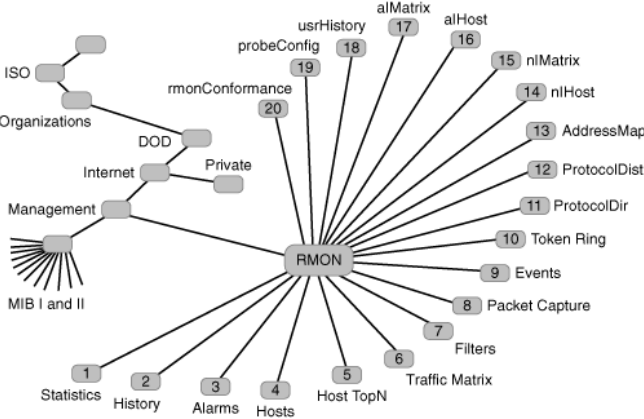

- co spravujeme?
    - routery, switche
    - vysilace, prijimace, prenosove stanice
    - firewally, gatewaye aplikaci
    - koncova zarizeni
        - notebooky, desktopy, tiskarny
        - servery (cloud)
        - IoT zarizeni (senzory, kamery)
        - prumyslove linky
        - mobilni zarizeni

- problem dneska
    - velka komplexita spravovanych infrastruktur
        - ASW
        - Electrical Power Grid
        - NASA - Deep Space Network

- jak spravujeme?
    - manualne
        - CLI (command line interface)
        - nachylka k chybam
    - automatizovane
        - skripty a nastroje pro automatizaci
        - opakovane vykonavane ukoly
        - tam kde lidska interakce nestaci (prilis pomala)
    - API
        - podpora pro polling - periodicke dotazovani (zarizeni je pasivni)
        - podpora pro alerty a notifikace

- manualni sprava site
    - fyzicky pristup k zarizenim
        - sitova zarizeni nejsou pripojena ke klavesnici ani monitoru => seriova rozhrani (console)
    - vzdaleny pristup k zarizenim
        - CLI
        - SSH (secure shell)
    
    - `ping`
        - pouziva ICMP Echo
    - `traceroute`
        - pouziva ICMP Echo + zacina s TTL = 1 a je zvysovan o 1 (bezprostredni routry odeslo ICMP TTL exceeded)
    - `ifconfig`
        - sprava sitoveho rozhrani
    - `arp -a`
        - ukaze APR cache (preklad IP adres na MAC adresy)
    - `iftop`
        - ukaze sitovy provoz na interfacu (neco jako top pro CPU zatez)
    - `netstat`
        - ukaze
            - sitova pripojeni
            - routovaci tabulku
            - statistiku o sitovem rozhrani
            - clenstvi pro multicast
    - `route`
        - ukaze a dovoluje modifikovat routovaci tabulky
    - `iptables`
        - sprava firewallovych pravidel a NATu
    - `Syslog`
        - `tail -f /var/log/syslog`
        - standart pro logovani systemovych zprav do souboru nebo na vzdaleny server
        
- zakladni komponenty spravy pocitacove site s pouzitim API
    - operace: read, write, update
    - protokol: vzdalene volani a prenos vysledku
    - reprezentace dat: { object, type, value }
    - bezpecnost: authentication, authorization, data protection

- SNMP (Simple Network Management Protocol)
    - unifikovany a standardizovany model a protokol pro vzdalenou spravu site a koncovych zarizeni v TCP/IP sitich
    - architektura klient-server

        

    - zakladni komponenty SNMP
        - protokol
            - zpravy (PDU) posilane pres UDP
            - agent posloucha na portu 161
            - manager posloucha na portu 162 - notifikace, alerty
            - operace
                - GetRequest: precte hodnotu
                - SetRequest: nastavi hodnotu (atomicky)
                - GetNextRequest: nastavi hodnotu dalsiho objektu (lexikograficky)
                - GetBulkRequest: precte nekolik hodnot najednou
                - Response: agent odpvida na dotaz (Request zprava)
                - Trap: notifikace, alert
        - reprezentace dat
            - hodnota + datovy typ
                - popis dat je nezavisly na platforme
                    - ANS.1 (Abstract Syntax Notation One)
                        
                        

                        

                - prevod do binarniho formatu
                    - BER - basic encoding rules
                    - {type, length, value} - poslane v SNMP PDU

                        

            - reprezentace dat - rizene objekty
            - MIB - Management Information Base
            - hierarchicka databaze objektu
                - objekty reprezentuji
                    - hodnoty promennych
                    - statistiky a diagnostiky
                    - configuracni parametry
                    - kazdy objekt ma unikatni identifikator (path in the MIB tree)
                    - napr.: `ipDefaultTTL` = 1.3.6.1.2.1.4.2.0
                
                

        - pouzit primarne pro sber dat
        - postrada podporu pro transakcni operace (rollback na posledni verzi konfigurace)
    
- NETCONF (Network Configuration Protocol)
    - lepsi podpora pro spravu konfiguraci
        - transakcni zpracovani, moznost rollbacku
    - NETCONF architektura

        
    
    - zalozen na RPC (Remote Procedure Call)
    - podobne operace jako SNMP
        - Get / Set / Notify
    - koncepcne rozdelen do 4 vrstev
        - Content - XML, JSON, YANG
        - Operations - operace nad konfiguraci
        - Messages - RPC request/reply a notifikace
        - Transport layer - SSH, TLC, SOAP, HTTP

        

    - zakladni komponenty jako SNMP
        - protokol - NETCONF RPC
        - reprezentace dat - YANG (Yet Another Next Generation)
            - hodnota + datovy typ
            - spravovany objekt
    
    - poskytuje CRUD operace a ulozeni konfigurace
        - implementovano prostrednictvim HTTP metod
        - pouzito primarne automatizovanymi nastroji

- automatizovane nastroje
    - Ansible
    - Python NCClient (NetConf)
        - knihovna implementujici NETCONFIG klienta

- RMON (Remote Network Monitoring)
    - sonda (hardware, software)
    - pripojena do segmentu v siti
    - monitoruje sitovy provoz
    - sbira a poskytuje (SNMP) statistiky (RMON MIB)

    

    - sbirane statistiky jsou poskytnupy pres SNMP queries
    - struktury a objekty definovane jako RMON MIB
    - RMON MIB Tree

    