- protokoly aplikacni vrsvy

    - podpurne (pomocne) protokoly
        - DHCP - dynamicke prirazeni IP adresy
        - DNS - preklad domenovych jmen na IP adresy

    - vzdaelny pristup (terminal / console)
        - obousmerna komunikace
        - texove orientovany virtualni terminal
        - Telnet - stary, plain text komunikace
        - SSH - Secure Shell

    - prenos souboru
        - TFTP
        - FTPS
        - SFTP, SSHFS
        - distribuovane systemy
            - NFS, SMB, AFS

    - distribuovane informacni systemy
        - HTTP, HTTPS
        - HTTP/2, HTTP/3
        - REST, WebDAV

    - autentizace a souborove sluzby
        - LDAP
            - OpenLDAP
            - Microsoft Active Directory

    - elektronicka posta
        - SMTP
        - IMAP
        - POP

    - real-time komunikace
        - "Chat"
            - lidi
            - boti
        - XMPP
        - WebSockets

- DHCP (Dynamic Host Configuration Protocol)
    - BOOTP - predchudce DHCP
        - staticke IP adresy prirazene MAC (manualni konfigurace)
        - BOOTP server na kazdem segmentu site
    - DHCP - vylepseni
        - automaticke prirazeni/uvolneni IP adresy z daneho rozsahu
        - DHCP relay agent umoznuje mit pouze jeden centralni DHCP server
        - zpetna kompatibilita s BOOTP
    - PDU preposlane pres UDP
    - server: port 67 (stejne jako BOOTP)
    - klient: port 68

    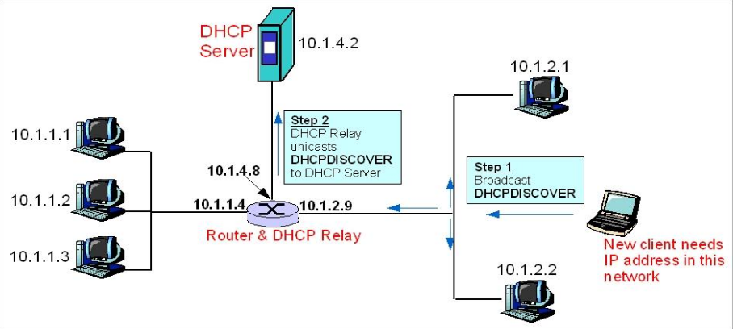

    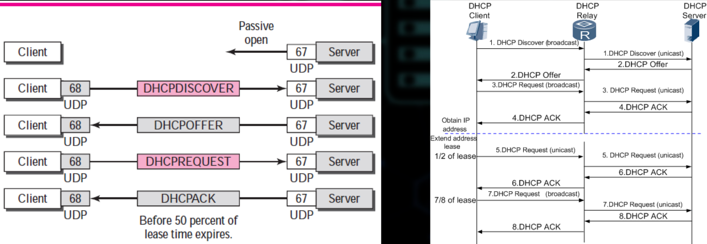

    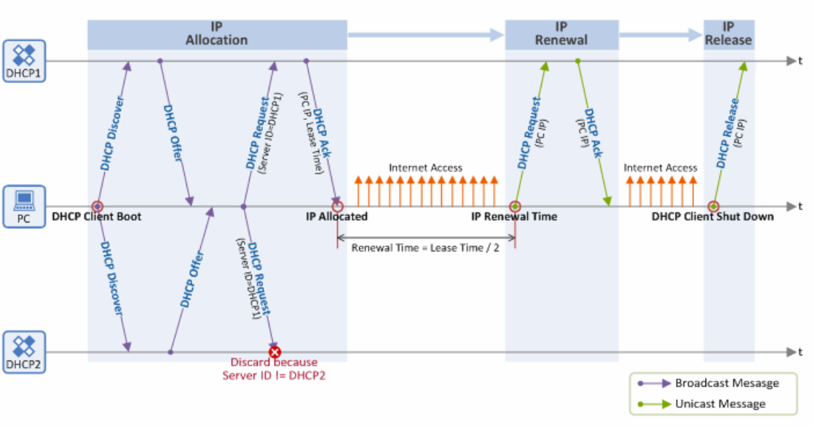

    - casovace spojene s docasnem zapujceni IP adresy
    - cas zacne odpocitavat s prijmutim DHCP ACK (obsahuje dobu na jakou je IP adresa vytavena)
    - T1 - 1/2 doby na kterou byla IP vystavena jiz uplynula => "renewing" (klient posle pozadavek na prodlouzeni)
    - T2 - 7/8 doby na kterou byla IP vystavena jiz uplynula => "rebinding" - pokud klient neprijme odpoved na prodlouzeni IP adresy, musi zacit od zacatku
    - propojeni s dalsimi sluzbami
        - svazane s DNS
        - DDNS - dynamic DNS
        - DHCP registruje jmena v DNS databazy
            - stanice muze poslat svoje jmeno

- DNS (Domain Name System)
    - Name services
        - jmeno => IPv4 a IPv6 preklad
        - domena => name server translation
        - domena => mail server translation
    - Architektura
        - distribuovana databaze (velka konzistence)
        - hierarchicke jmenne prostory
        - decentralizovana klient-server architektura

    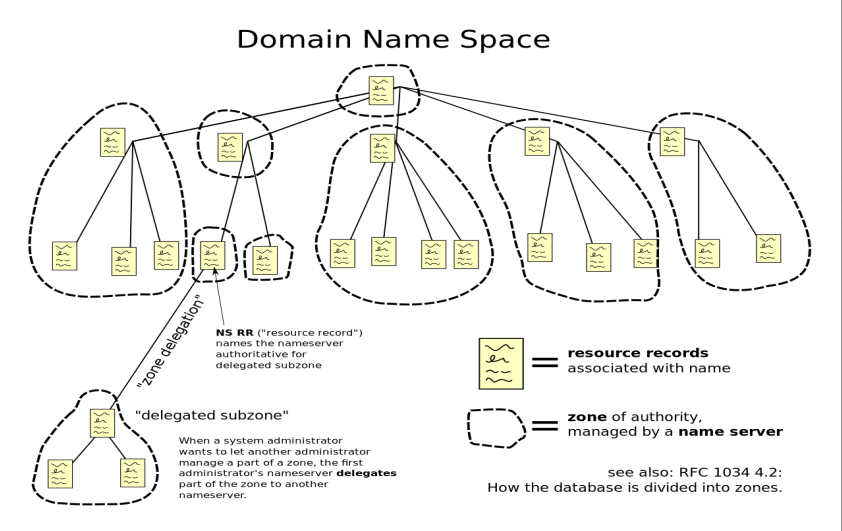

    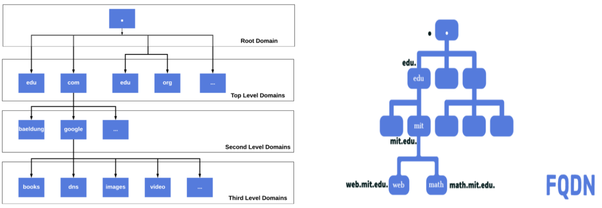

    - protokol
        - UDP port 53: dotaz klienta (iterativni nebo rekurzivni)
        - TCP port 53: "zone transfer"
            - replikace zonoveho souboru mezi master-slave DNS servery

    - iterativni a rekurzivni dotaz

    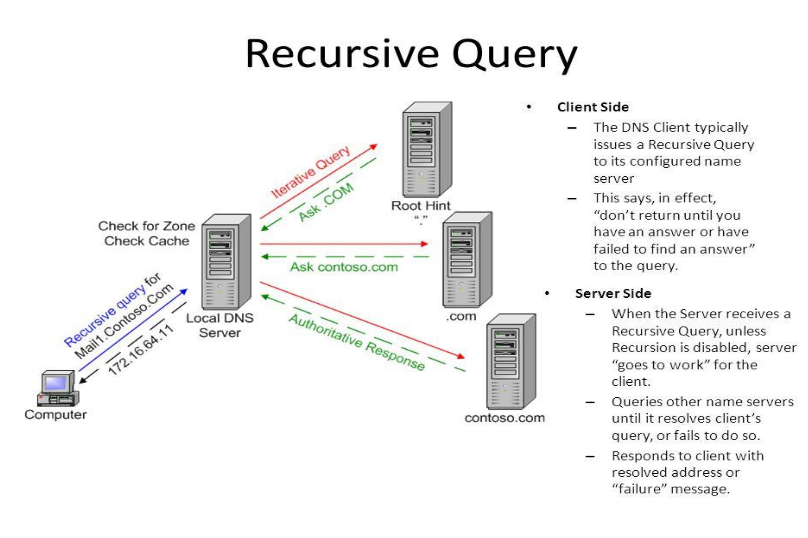

    - kompletni proces resolvovani domenoveho jmeno

        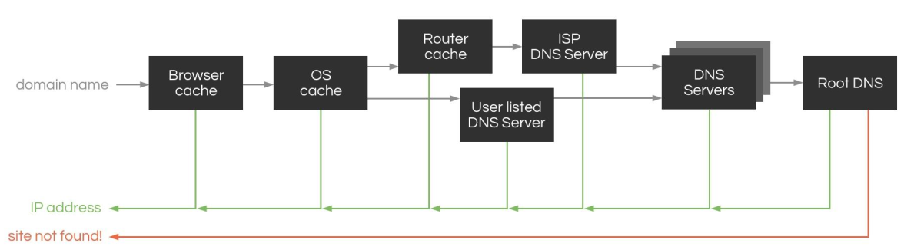
    
    - OS Linux / UNIX DNS konfigurace
        - `/etc/nsswitch.conf`
            - uruje prioritu nameserveru behem resolvovani
            - DNS neni jednina sluzba pro resolvovani IP adres
            - `hosts: files dns` (viz UPS)
            - 
                ```
                192.168.1.1 gateway.domain
                192.168.1.2 server1.domain
                192.168.1.3 server2.domain
                ```
        - `/etc/resolv.conf`
            - DNS konfigurace
            - defaultni domeny
            - IP adresy name serveru
            -
                ```
                search example.com local.test
                nameserver 1.1.1.1
                nameserver 8.8.8.8
                nameserver 9.9.9.10
                ```
        
    - reverse entries, IP adresy => preklad na jmeno
    - problem: kdo to vi?
    - existuje reverzni domena `in-addr.arpa`
        - IPv4: 132.113.56.25 => 25.56.113.132.in-addr.arpa

    - princip reverznich zaznamu

        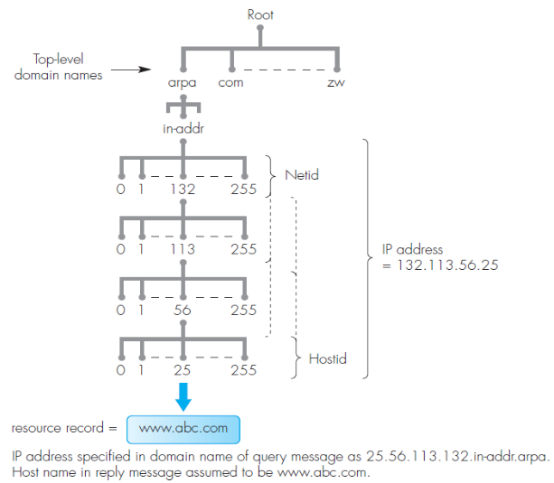

    - typy DNS zaznamu
        - A: mapovani IP adresy (IPv4)
        - AAAA: mapovani IP adresy (IPv6)
        - CMANE: alias - typicky www.google.com a google.com je to same
        - MX: mail-exchanger
        - NS: domenove jmeno name serveru
        - PTR: reverzni ukazatel
        - SOA: zacatek autority (doba platnosti zaznamu, verze souboru, ...)

    - konkretni priklady DNS zaznamu
        - A: postmaster.mydomain.com IN A 69.9.64.11
        - PTR: 11.64.9.69.in-addr.arpa IN PTR postmaster.mydomain.com
        - AAAA: server.net. IN AAAA 3ffe:1900:4545:2:02d0:09ff:fef7:6d2c
        - CNAME: www.example.com. IN CMANE server3.example.com.
        - MX: mydomain.com. 14400 IN MX 0 postmaster.mydomain.com
        - NS example.com IN NS ns1.live.secure.com
        - SOA: seriove cislo (datum), refresh v sekundach, update retry v sekundach, doba expirace, ...

    - format ramce

        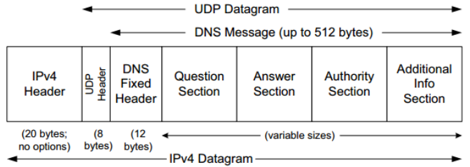

        - Resource Record (RR)

            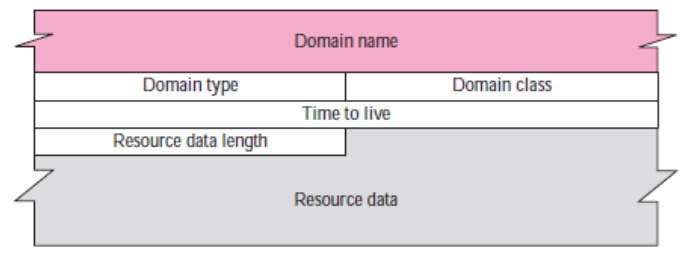

    - domain name representation

        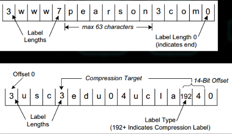
    
    - nastroje pro praci s DNS
        - IP adresa <=> domain name
        - host: vhodne pro shellove skripty, structy vystup
        - dig: velmi detailni vystup; vhodny pro DNS diagnostiku
        - nslooup: podporuje "interaktivni mod"

- vzdaleny pristup
    - Telnet - Teletype Network
        - textove orientovany
        - neni sifrovany (plain password authentication)
    - SSH - Secure Shell
        - sifrovane spojeni
        - optional assymetric key authentication

    - Telnet
        - Network Virtual Terminal - obousmerne orientovane znakove zarizeni
        - server posloucha na TCP 23

        - architektura

        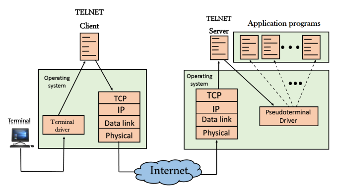

        - 7-bit ASCII reprezentace dat (preposlano na 8 bitech)
        - half-duplex zarizeni; "line-buffered mode"
        - dnes uz je kompletne nahrazen SSH; ale klient muze porad byt pouzit pro testovani a diagnostiku
            - `netcat` je ale mnohem lepsi :)
    
    - SSH
        - sifrovana prihlasovani a spojeni
        - poskytuje
            - prihlaseni a interaktivni shell na vzdalenem zarizeni (pocitaci)
            - prihlasovani bez hesla (asymetricky klice)
            - vzdalenou exekuri prikazu (nemusim se pripojovat; staci odeslat prikaz co chci vykonat na danem stroji)
            - bezpecne prenaseni souboru - `scp`
            - port forwarding (alias SSH tunneling)
        - modularita
            - volba typu prihlasovani
            - volba sifrovaciho algoritmu
            - volba algoritmu pro zachovani integrity dat
            - mozna komprese dat
        - odolny proti
            - odposlechum
            - falsofani IP adres a name servis
            - connection hijacking
                - ne uplne protoze to je chyba v TCP designu
                - schopnost ji ale detekovat (integrita dat) a okamzite 
                spojeni ukoncit
            - Man-in-the-Middle Attack
        - co SSH poskytuje oproti Telnetu
            - autentizaci: overeni identity klienta i serveru
            - sifrovani: nikdo nemuze cist danou komunikaci
            - integritu: nikdo nemuze pozmenit prenasena data

            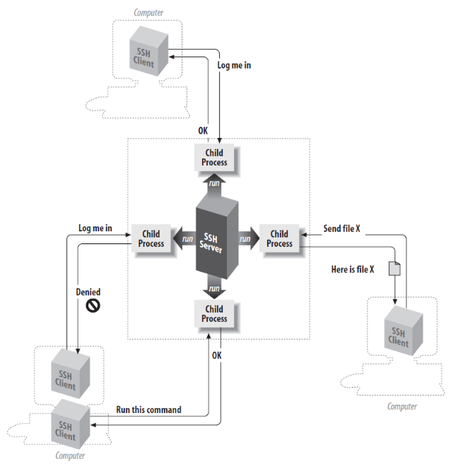

        - autentizace s pouzitim klicu

            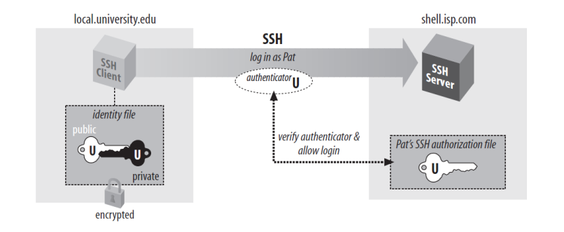

        - dalsi aplikace SSH
            - port forwarding = "ssh tunnel"
                - local: `ssh -L 80:intra.example.com:80 gw.example.com`
                - remote: `ssh -R 8080:localhost:80 public.example.com`

                    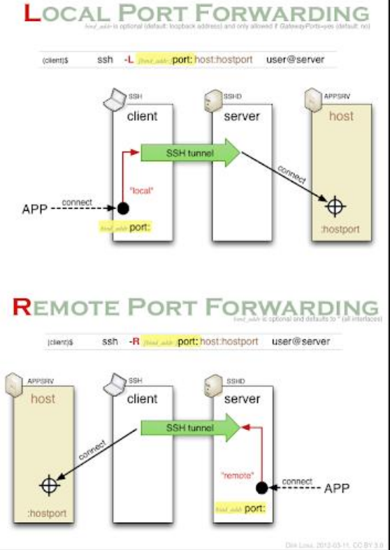

                - jak udrzet aktivni spojeni?
                    - pouzit `autossh`
                    - kontroluje spojeni kazdych 10s
                    - reconnect po 3 po sobe jdoucich selhani
                    - nastaveni `autossh` jako `sysemd` pro permanentni pripojeni (spusteno pri startu zarizeni)
            
            - secure file transfer (SCP)
                - download: `scp user@server:foo/remotefile foo/localfile`
                - upload: `scp foo/localfile user@server:foo/remotefile`

            - SSH file system (sshfs)
                - SSH + FUSE (file system in userspace), Linux
                - dovoluje uzivateli lokalne namountovat vzdalenou slozku
                - mount: `sshfs user@server:/path/to/directory`
                - umount: `fusermount -u mountpoint`

- presun souboru
    - TFTP - Trivial File Transfer Protocol
    - FTP - File Transfer Protocol
    - FTPS - FTP and SSL/TLS

    - TFTP (Trivial File Transfer Protocol)
        - navrzen pro bezdiskove stanice pro nacteni OS image pres sit
        - pouziva UDP 69 a je velmi trivialni => implementace muze byt vypaleno do Boot ROM
        - nepouziva koncept souboru -> pouze jmena souboru
        - diky pouziti UDP se muze pouzit multicast
        - klient ziska TFTP server adresu v DHCP/BOOTP odpovedi nebo posle "read request" na 255.255.255.255
        - 5 typu PDU
            - Read request - klient
            - Write request - clinet (ano, klient take muze nahrat soubor)
            - Data - client/server
            - Acknowledgment - client/server
            - Error - client/server
    
    - FTP (File Transfer Protocol)
        - protokol pro preposilani souboru po siti
        - TCP port 21 (kanal pro preposilani prikazu)
        - TCP port 20 (kanal pro preposilani dat)
        - dva zakladni mody
            - aktivni mod: klient posle serveru cislo portu na ktere se server pripoji a posle data (z portu 20)
            - pasivni mod: klient se pripoji na server, zepta se na cislo portu a necha server aby poslal data

            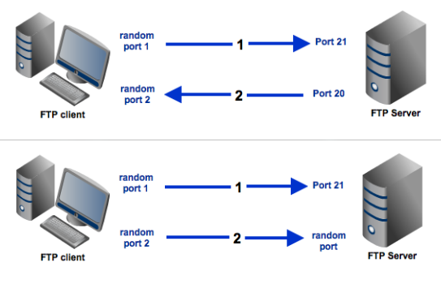

        - zakladni prikazy
            - USER <text> - username
            - PASS <text> - password (plain text!)
            - PASW <port> - passive mode
            - PORT <port> - active mode
            - RETR <filename> - file download
            - STOR <filename> - file upload
            - CWD <dirname> - change the current directory (remote)
            - LIST - obdoba prikazu ls

        - anonymous FTP
            - verejny pristup bez hesla
            - username = ftp
            - password = anonymous
            - e-mail jako heslo
            - readonly access
            - moznost nahrani souboru do /incoming slozky
    
    - FTPS (File Transfer Protocol over SSL/TLS)
        - tve moznosti jak navazat bezpecne spojeni
        - implicitni
            - spojeni je navazano pres SSL/TLS od zacatku
            - neni zpetne komatibilni
        - explicitni
            - Nejprve se vytvoří konvenční připojení (k portu 21) a poté se pomocí příkazu AUTH provede přechod na zabezpečené připojení SSL/TLS 