- elektronicka posta
    - @ odeluje username of hostname (john@gmail.com)
    - architektura elektronickeho emailu
        - Mail User Agent (MUA): emailovy klient
        - Mail Submission Agent (MSA): prijme email od MUA 
        - Mail Transfer Agent (MTA): mail server, mail exchanger
        - Mail Delivery Agent (MDA): doruci email do mailboxu klienta

        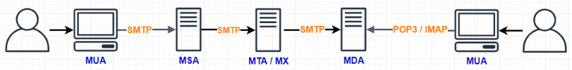

        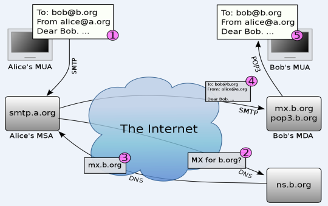

    - protokoly
        - SMTP - Simple Mail Transfer Protocol (posilani emailu)
        - POP - Post Office Protocol (pristup do mailboxu)
        - IMAP - Internet Message Access Protocol (pristup do mailboxu)
    
    - SMTP
        - TCP port 25 - komunikace mezi servery
        - TCP port 587 (465)
            - pro klienty na odesilani emailu
            - textove orientovany
        - posilani emailu
            - klient ulozi zpravu do `/var/spool/mail/username`
            - MTA precte email (directory polling), odesle ho a smaze ho
        - doruceni emailu
            - lokalni MTA prijme zpravu pres SMTP a ulozi ji obvykle do `$HOME/Mailbox` slozky
            - kdyz uzivatel spusti emailove klienta, klient se podiva do mailboxu jestli tam nejsou nejake move zpravy a zobrazi je uzivateli
        - komunikace
            - ASCII prikazy
            - vraci navratove kody
            - S: server, C: client

            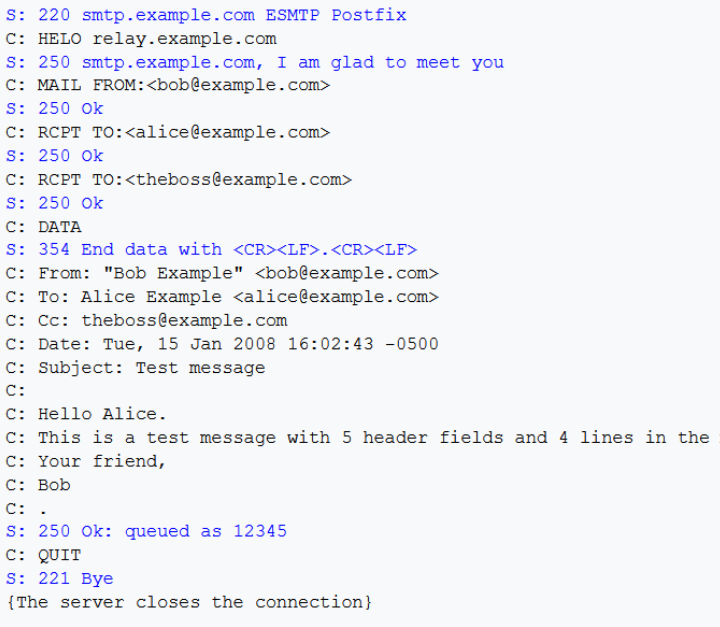
    
    - ESMTP
        - EHLO -> ESMTP klient
        - SMTP-AUTH -> user authentication
        - PIPELINING -> batch mode - dorucovani vice zprav
        - SIZE -> maximalni velikost zpravy
        - STARTTLS -> preklad do sifrovane komunikace

        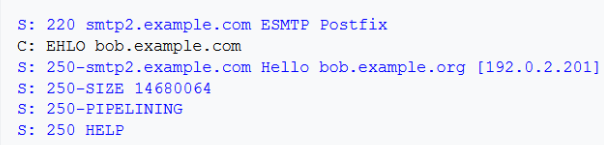

    - POP & IMAP
        - protokoly pro vzdaleny pristup ke schrance
        - MTA nebezi lokalne
        - podporuje SSL/TLS
        - pouzivan emailovymi klienty
            - desktop, laptop
            - tablet, smartphone

    - POP (Post Office Protocol)
        - Určeno pro klienty převážně offline
        - nove zpravy jsou stazene ze servru a nasledne smazany ze servery

    - POP3
        - vyhody
            - nemusi byt permanentne pripojen k siti
            - zpravy se mazou (mailbox se nezaplni)
        - nevyhody
            - neni vhodny pro pouziti zahrnujici vicero klientu (jen jeden by si zpravu mohl precist)
            - odchozi email neni ulozen na serveru
        - TCP port 110 - not secured
        - TCP port 995 - SSL/TLS (POP3S)
        - texove orientovany (stejne jako SMTP)
        - autentizace
            - plain username / password
            - APOP - zasifrovane s casovym razitkem serveru
    - IMAP
        - navrzen pro podporu vice klientu kteri mohou pristupovat ke stejne schrance
        - vsechny zpravy jsou ulozene na serveru
        - vyhody
            - podpora vice klientu (konzistenti mailbox)
            - odeslane emaily jsou viditelne na vsechn klientech
            - castecne stazeni emailu (pouze nazev / cela zprava)
        - nevyhody
            - trvale pripojeni k siti
            - mailbox na servru se muze zaplnit
        - TCP port 143 - not secured
        - TCP port 993 - SSL/TLS
        - texove orientovany (jako SMTP a POP3)
        - autentizace

    - Exchange ActiveSync
        - proprietarni protokol (Microsoft)
        - synchronizace mobilnich zarizeni
            - emaily, kontakty, kalendare, poznamky, ukoly, ...
            - sprava mobilnich zarizeni (Mobile Device Management = MDM)
        
    - "WebMail"
        - webova aplikace
        - vyhody
            - bezi kdekoliv
            - neni potreba zadna instalace
            - snadne updaty
        - nevyhody
            - spoleha na dobre pripojeni k internetu

        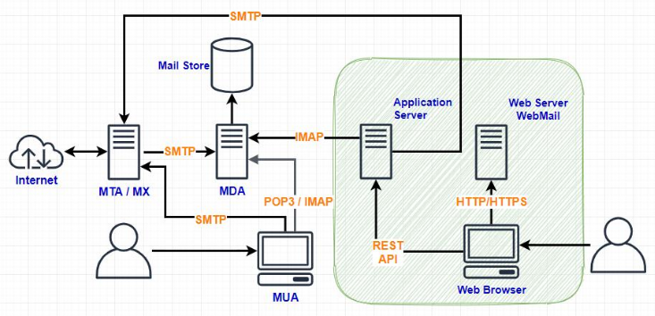

    - MIME (Multipurpose Internet Mail Extension)
        - umoznuje odeslani zprav s 8-bitovym znokovymi kody, prilohami a multimedii (obrazky, zvuk, video) pomoci 7-bitovy ASCII orientovanych protokolu
        - neni omezeno pouze na email ale i jinde (napr HTTP)

        - struktura MIME zpravy
            - hlavicka
                - MIME version
                - Content type information
                - Content-Type
                    - content/media typ v tele zpravy (auto, mp3, text, html, ...)
                - Character set
            - body
                - 8-bit ASCII encoding
                - Binary data – Base64

        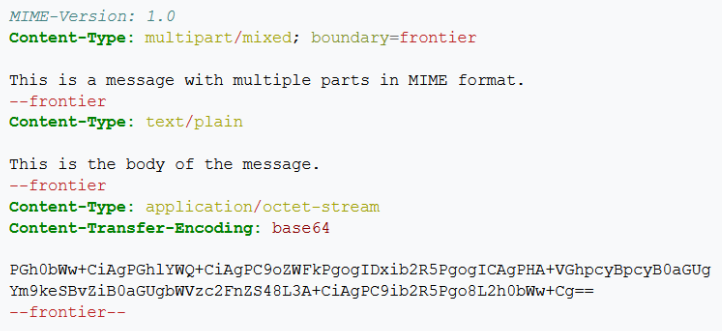    

        - MIME - HTTP / uploadovani souboru
            
        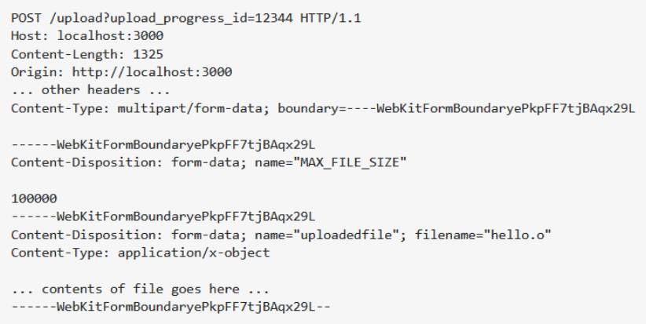    

        - HTTP / posting form data

        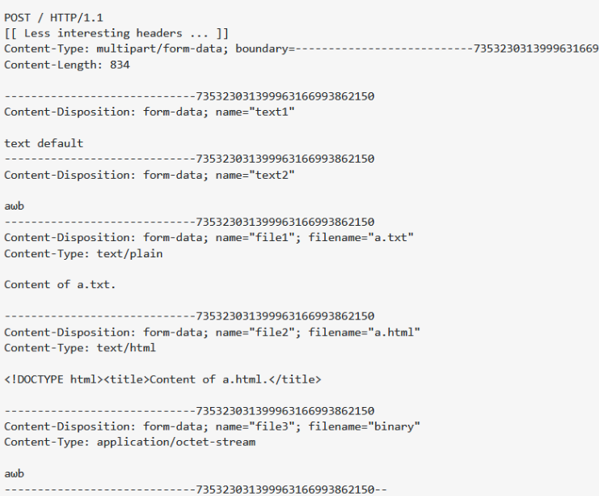

    - S/MIME
        - bezpecni/viceucelovy internet mail extension
        - standart jak zabezpecit MIME zpravy
        - zalozeno na CMS (Cryptographic Message Syntax)
        - autentizace: overeni uzivatele
        - integrita zprav: obsah zpravy nebyl zmenen
        - bezpochybny zdroj: digitalni podpis
        - soukromi a ochrana dat - sifrovani obsahu
        - jak to funguje?
            - posilani zprav
                - telo zpravy je digitalne podepsano
                    - checksum zpravy je zasifrovan odesilatelovo privatnim klicem (kazdy muze overit ze je to jeho s pouzitim jeho verejneho klice)
                - zprava je zasifrovana verejnym klicem prijemce
                - binarni data -> base64 + Content-Type=applicaiton/pkcs7-mine
            - prijimani zprav
                - Content-Type=application/pkcs7-mime?
                    - base64 -> binary data
                - rozsifrovani zpravy  (pouziti prijemcovo privatniho klice)
                - vypocet checksumu a porovnani s puvodni hodnotou

- HTTP (Hypertext Transfer Protocol)
    - myslenka je jednoduche sdileni data nasbiranych ve fyzikalnich experimentech
        - FTP neni user-friendly
    - rozvoj WWW (World Wide Web)
    - TCP port 80
    - verze
        - HTTP/1.0
        - HTTP/1.1
        - HTTP/2
        - HTTP/3 - pouziva UDP misto TCP
    - textove orientovany protokol
    - dotaz / odpoved
    - dotaz na zdroj (server)
    - identifikace zdroe - URI/URL
    - URI - Uniform Resource Identifier
    - URN - Uniform Resource Name
    - URL - Uniform Resource Locator (definuje pristup ke zdroji "jak" a "kde")
    - URL format

        

    - URL je soucasti "hyperlinku" v hypertextovem dokumentu
    - umoznuje propojit dokumenty v internetu (hence "World Wide Web")
    - Operace
        - {method} {url}
        - headers

        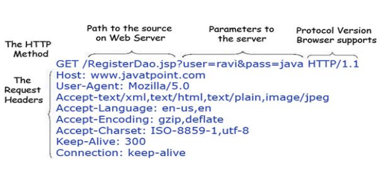

    - odpoved serveru

        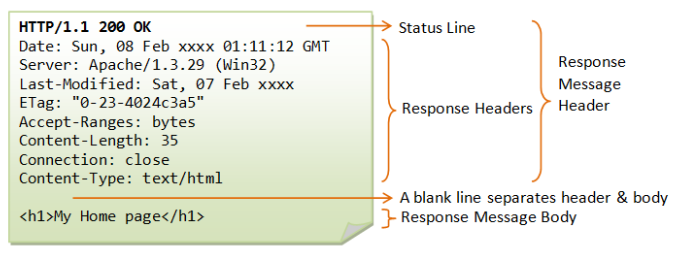

    - metody
        - GET: dotaz na dokument definovany pomoci URI
        - HEAD: vrat pouze header dokumentu (metadata pro cache)
        - POST: vytvori novy dokument na servery
        - PUT: aktualizuje dokument na serveru (perpise ho jako celek)
        - DELETE: smaze doument na serveru

    - HTTP status kody
        - 1xx - informational
        - 2xx - success
        - 3xx - redirect
        - 4xx - client error
        - 5xx - server error

    - HTTPS (Hypertext Transfer Protocol – SSL/TLS)
        - TCP port 443
        - SSL/TLS handshake
        - vsechny requesty a odpovedi jsou preneseny pres sifrovany kanal

    - HTTP cookies
        - zavadi stavovost do jinak bezstavoveho protokolu
        - problem udrzeni spojeni mezi konkretnimi dotazy (session)
        - server posle cookie v hlavicce odpovedi
        - klient ji posle zpet server s kazdym requestem
            - user tracking
        - server prijme hodnotu cookie a pouzije ji jako klic pro obnoveni stavu klienta z pameti
        - "zere" pamet na serveru
        - No load balancich (zahazovani sessions)

        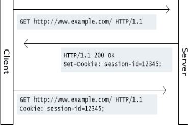

    - HTTP autentizace
        - obecny model (basic authentication)
            - klient posle pozadavek
            - server si uvedomi ze je vyzadovana autentizace a ze klient neni autorizovan -> vrati odpovidaci chybovy status code
            - klient ted vic ze je vyzadovana autentizace a vyzada si prihlasovaci udaje od uzivatele
            - klient posle pozadavek znovu s odpovidajicimi prihlasovacimi udaji

            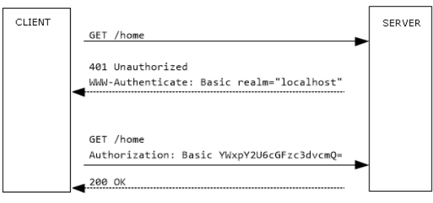

        - form-based authentication
            
            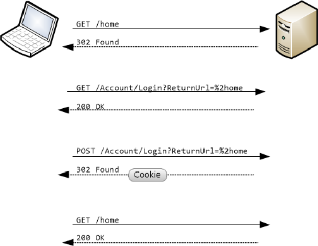

- LDAP (Lightweight Directory Access Protocol)
    - datovy model
    - Directory Information Tree - DIT
    - Record
        - directory entry
        - basic information unit

        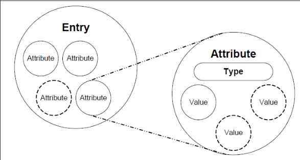

    - datovy typy
        - atribut - primitivni datovy typ (string, integer, boolean, DN, OID)
        - record - strukturalni datovy typ
            - Object Class
                - top, person, organization
    
    - Object CLass - "record schema"
        - standardizovana schemata
            - mapovani sitovych sluzeb na LDAP redords
        - OID je prirazene kazde Object CLass
            - organizationalUnit / object class = 2.5.6.8
            - emailAddress / attribute type = 1.2.840.113549.1.9.1
        - popsano prostrednictvim ASN.1
    
    - DIT

        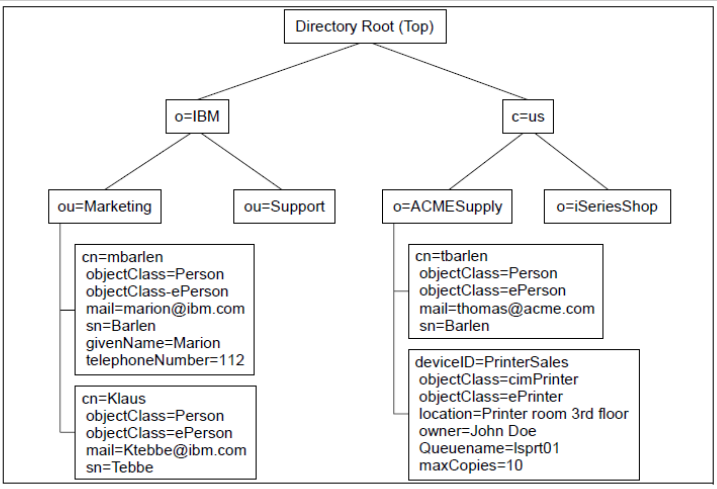

    - namespace model
        - heararchicky
        - DN = Distinguished Name
            - unikatni cislo zasznamu (recordu)
            - cn=John Smith, ou=people, o=ibm, c=us

        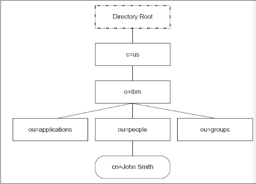
    
    - Distinguished Name (DN) syntax
        - 2 formy
            - textova reprezentace
                - cn=John Smith, ou=people, o=ibm, c=us
            - URL
                - ldap://ldap.ibm.com/cn=John%20Smith,ou=people,o=ibm,c=us
            
    - operace
        - Bind / unbind - login / logout
        - Search - hledani zaznamu (recordu) v DIT
        - Add - pridani recordu do DIT
        - Delete - odstraneni recordu z DIT
        - Modify entry - aktualizace recordu v DIT
        - Modify DN - zmena zaznamu DN -> presun
        - Compare - porovna dva recordy

    - Search 
        - vyhledani pocatecniho bodu/uzlu v DIT (specifikovani pomoci DN)
        - Search scope
            - Base Object, Single Level, Whole Subtree, Subordinate Subtree
        - seznam atributu ktere by mely byt vraceny ve vesledku
        - filtry
        - limity

    - Search scopes
        - base object

            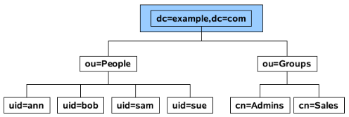

        - single level

            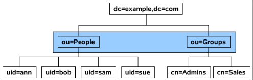

        - while subtree

            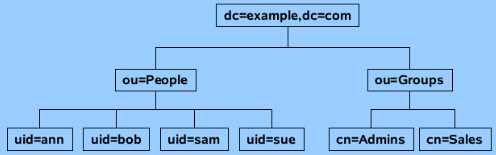

        - Subordinate Subtree

            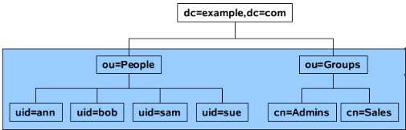
    
    - Protokol
        - TCP, UDP port 389
        - LDAPS port 636 - SSL/TLS
        - informace prenasene v BER (ANS.1) formatu

    - zname implementace LDAPu
        - OpenLDAP - open source
        - Microsoft Active Directory

    - LDAP aplikace
        - sitova informacni sluzba
        - Zpřístupňování dat z různých informací systémy standardním způsobem
        - Kazdy informacni system ma obvykle sve vlastni DIT