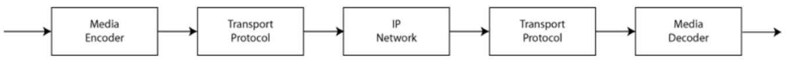
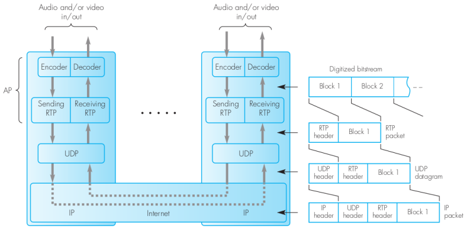
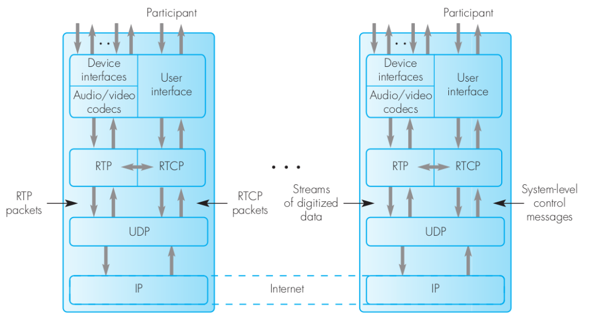
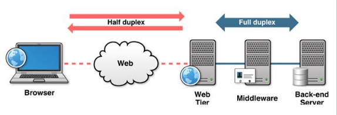
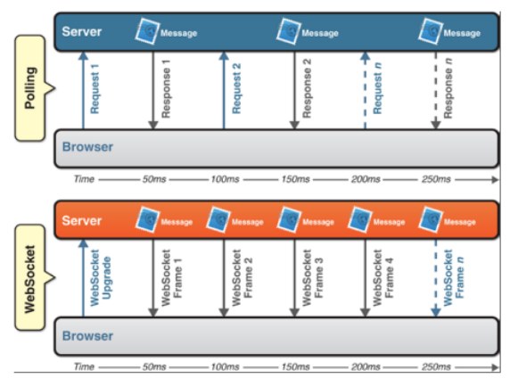
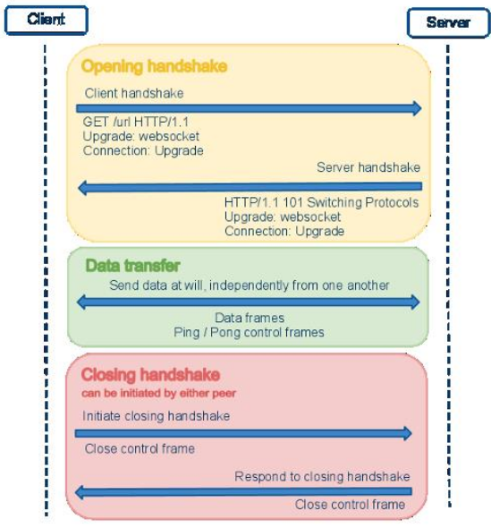
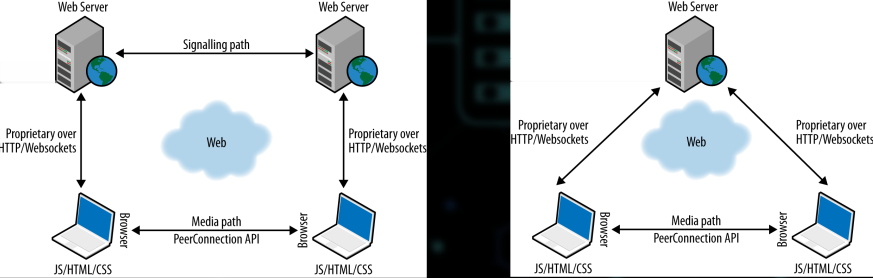
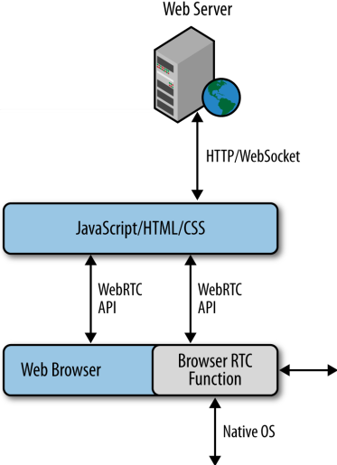
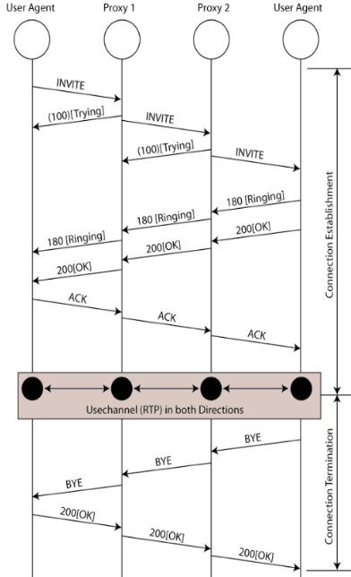
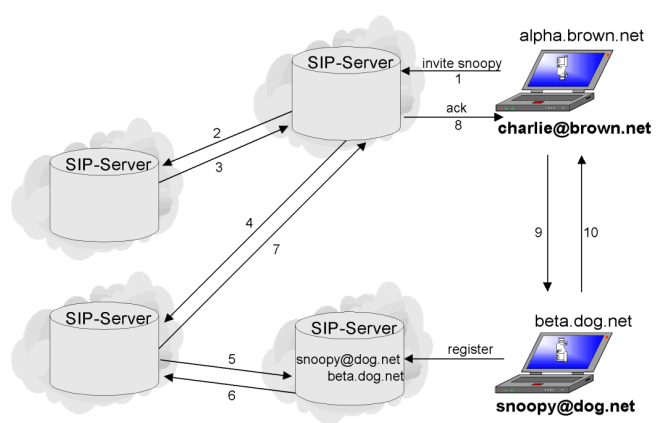

- RTP (Real-time Transport Protocol)
    - pouzivan pro real-time prenos audia a videa
    - poskytuje prijemci casove informace
    - prijemence musi outputnout prijaty packet pozadovanou rychlosti

    - obecne cesta comunikace

        

    - proc potrebujem specialni protokoly? => zpozdeni site a odchylce signalu
    - RTP je navrzen pro end-to-end real-time preno streamovanych dat
    - poskytuje techniky pro kompezance vychlky signalu, ztratu paketu a zprehazenemu poradi packetu, ktere jsou typicke, hlavne pri pouziti UDP potokolu
    - dovoluje prenos dat do vice cilovech destinaci pomoci IP multicastu
    - povazovan jako primarni standard pro audio/video prenos v IP sitich
    - pouziti

          
    
    - design RTP je zalozen archtektonickem principu znamem jako "application-layer" framing 
        - funkce protokolu implementovany primo v aplikaci

    - Application-layer framing
        - zpusob dovoleni aplikaci pouzit vlastni semantiku pri navrchu vlastniho sitoveho protokolu
        - RTP je priklad toho kde semantika real-timove aplikace je pouzita pro segmentaci dat
        - princip funkce
            - aplikace rozdeli data do vhodnych segmentu (ADUs = appliacation data units)
            - ADUs mohou byt zpracovany v libovolnem poradi
            - sprodni vrstvy udrzuji hranice ADU

- RTCP (Real-time Transport Control Protocol)
    - RTP se zabyva prenosem jednotlivych streamu digitalizovanych dat spojeny s multimedialni session
    - RTCP pote prida další funkce na systémové úrovni k souvisejícím RTP, např jako prostředek pro integraci přijímacího RTP a synchronizovat jednotlivé toky paketů dohromady a pro odesílající RTP, aby byl informován o aktuálně převažujícím síťové QoS.
    - RTCP pracuje "bok po boku" s RTP => slidleji si informace
    - nicmene kazdy RTCP pouziva jiny UDP port -> muze pracovat nezavisle na RTP

       

    - RTCP poskytuje
        - integrovanou synchrnonizaci medii
            - v aplikacich ktere zahrnuji oddelene audio a video kere se musi integrovat dohromady (pro synchronizaci se pouziva bezny systemovy casovac)
        - QoS reporty (quality of software)
            - pocet ztracenych paketu, level vychylen isignalu, zpozdeni atd jsou spocinaty s kazdym prijatym RTP packetem
        - zpravy o ucasti
            - pouzity behem konverenciho hovoru (napriklad dovoli ucastnikovi notifikovat ostatni ucastniky ze se chysta hovor opustit)
        - podrobnosti o ucasti
            - informace jako jmeno, email, adresa, telefoni cislo kazdeho ucastnika jsou poslany vsem dalsim ucastnikum v RTCP zprave

- WebSockets
    - pres TCP mame na backendu fullduplexni spojeni
    - ale halfduplex pres HTTP

    

    - backend server nemuze otevrit spojeni s prohlizecem (klientem) aby mu poslal data  
    - => tim padem musi client delat polling aby si tahal data ze serveru
    - polling vs websockets

    

    - vyhody webovych socketu
        - fullduplexni komunikace
        - zabira malou sirku pasma
        - bezpecnost
        - male zpozdeni (low latency)
        - funguje pres TCP (inicializuje je pres HTTP => eskalace)
        - podpora temer vsemi prohlizeci (vcetne mobilnich zarizeni)

    - princip funkce
        - inicializace (opening handshatke) pres HTTP (GET)
        - HTTP hlavicka indikuje zmenu protokolu (eskalace na WebSockety)
            - TCP pripojeni zustava stejne

        

        - navazeni spojeni (klient)
            ```
            GET /chat HTTP/1.1
            Host: server.example.com
            Upgrade: websocket
            Connection: Upgrade
            Sec-WebSocket-Key: x3JJHMbDL1EzLkh9GBhXDw==
            Sec-WebSocket-Protocol: chat, superchat
            Sec-WebSocket-Version: 13
            ```
        - Sec-WebSocket-Key: nahodne vygenerovany klic ktery je pouzit pro autentizaci odpovedi

        - navazani spojeni (server)
            ```
            HTTP/1.1 101 Switching Protocols
            Upgrade: websocket
            Connection: Upgrade
            Sec-WebSocket-Accept: HSmrc0sMlYUkAGmm5OPpG2HaGWk=
            Sec-WebSocket-Protocol: chat
            ```
        - Sec-WebSocket-Accept ma klic ktery je desifrovan s klicem ktery byl poslat pro potvrzeni (odpoved prisla spravnemu "puvodci" - klientovi)

- WebRTC (Web Real-Time Communication)
    - free and open source projekt ktery poskutuje webovym prohlizecum a mobilnim aplikacim realtime komunikaci (RTC) pres applikacni rozhrani (API)
    - Umožňuje audio a video komunikaci fungovat uvnitř webových stránek tím, že umožňuje přímou peer-to-peer komunikaci, čímž se eliminuje potřeba instalovat zásuvné moduly nebo stahovat nativní aplikace.

    - architektura

        

        

    - zabezpeceni
        - pouziva datagram transport layer security (DTLS)
            - zalozen na stream-oriented Transport Layer Security (TLS) protokolu ma za cil poskytnout stejne bezpecnosti featury

    - Problem s NAT
        - peer-to-peer komunikace vyzaduje aby oba uzly (stanice) mely verejne IP adresy
        - co kdyz jsou oba dva za NATem?
            - reseni: "helper protokoly" umoznujici streamum procestovat pres NAT boxy a firewally
            - STUN & TURN

    - Session Traversal Utilities for NAT - STUN
        - umoznuje hostitelske aplikaci zjistit pritomnost NAT (network address translatoru) v dane site. V takovem pripade pak ziska alokovanou verejnou IP adresu a port pro aktualni spojeni
    -   - aby toho mohl docilit vyzaduje asistenci nakonfigurovaneho STUN server ktery musi byt ve verjne siti

    - Traversal Using Relays around NAT - TURN
        - umoznuje hostielske aplikaci za NATem ziskat verejnou IP a port prenosoveho serveru ktery sedi ve verejne siti
        - diky prenosovemu serveru muze klient prijmout media od jekehokoliv peer ktery posle packety na verejny server

- Session Initiation Protocol - SIP
    - signalizujici protokol pro multimedialni sessions
        - Call setup - prozvoneni a navazani spojeni
        - Call handling - udrzovani, predavani a ukoncovani
        - User location - objeveni pritomnosti hosta
        - User availability - objeveni (zjisteni) ochoty klienta uskutecnit call
        - User capabilities - urceni parametry media pro pouziti

    - Basic SIP Session Handling

    - SIP proxy je komponenta pro call routing na zakladne informace o pritomnosti 

    

    - lokace uzivatelu nebo serveru

    

- SDP (Session Description Protocol)
    - pouzit pro obecny opis multimedialnich sessions
        - detaily o mediu
        - transportni adresy a vlastnosti
        - info o uzivateli a metdata session