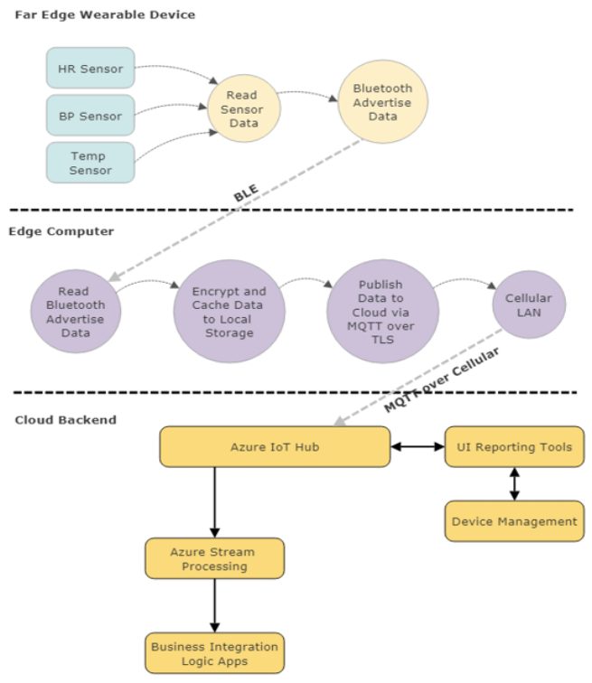
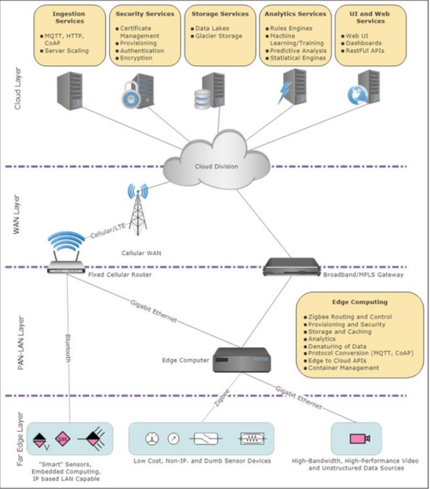
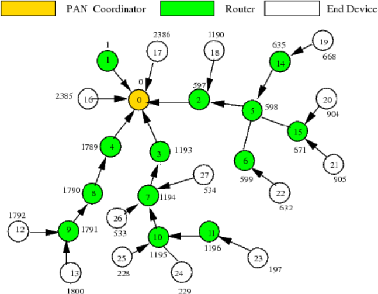
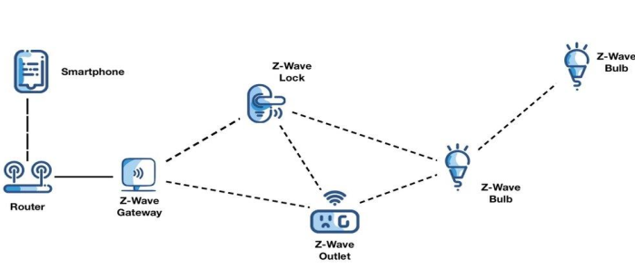
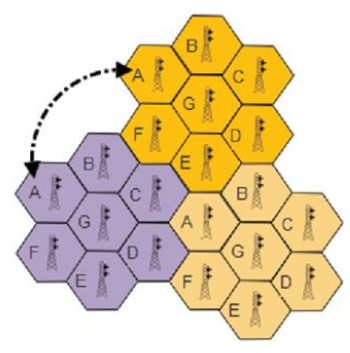

- Co je to IoT?
    - Internet of Things (IoT) popisuje fyzicke objekty (zarizeni)
    ktere maji vestavene senzory, procesovou schopnost (vypocty), software a dalsimi technologiemi ktere jim dovoluji se pripojit k siti a preposilat data bud s dalsimi takovymi zarizenimi nebo je posilat do internetu

- Co je povazovano za IoT zarizeni
    - zarizeni ktere je vypocetne schopne implementovat IP stack (HW + SW)
    - neni to tradicni sitove zarizeni jako jsou pocitace, servery, notebooky, tablety, ...

- oblast pouziti IoT
    - prumysl a vyroba
    - zdravotnictvi
    - smart cities
    - transportace a logistika
    - vojenstvi a vlada

- edge devices & edge computing
    - vypocet (mereni) ktere se odehrava fyzicky v blizkosti zdroje => male zpozdeni prenosu data a mala sirka pasma

    

- IoT vrstvy
    - far edge vrstva: senzory
    - near edge PAN-WAN vrstva: zarizeni instalovane v blizkosti lokality senzoru
    - cloudova vrstva: misto agregace (ulozeni dat)

- cloudove sluzby
    - prijimani a sprava dat
    - temer neomezena velikost uloziste
    - automaticke updaty SW

- edge sluzby
    - low-latency a real-time reakce na udalosti
    - PAN komunikace se senzorama
    - minimalni naroky na pripojeni

- "The Big Picture"

    

- typy IoT zarizeni
    - jednoduche senzory
        - binarni senzor (otevreno / zavreno)
        - skalarni senzor (teplomer, tlakomer, ...)
        - vektorovy senzor (akcelerace, pozice)
    - high-performace edpoinds
        - sledovaci systemy (kamery, ...)
    - vystupni zarizeni
        - spinace (on/ off)
        - LED, LCD displeje
        - mikrofony
        - krokove motory

- IoT a senzorove site
    - senzory a jina zarizeni potrebuji metody odesilani a prijimaji dat
    - PAN = personal area netwoek -> near-range communication
        - komunikace muze byt dratova (coper wire) nebo bezdratove (wireless = WPAN)

- PAN (personal area network)
    - pocitacova sit ktera propouje zarizeni ktera se nachazeji v ramci osobni zony dane osoby
    - chytre hodiny, telefon, tablet, osobni asistenti, ...
    - komunikace v PAN muze byt but mezi jednotlivymi zarizenimi a nebo zkrze gateway do internetu (cloudu)

- Bluetooth
    - low-power bezdratova technologie vyuzivana prevazne v mobilnich zarizenich, klavesnicich, mysich, tabletach, videohrach, senzorech, ...
    - vyuzivano extensivne v IoT
        - vzdalene rizeni
        - monitorovani (ve zdravotnictvi)
        - bezdratove senzory
        - alarmy
    - slozeno ze dvou bezdratovych technologickych systemu
        - Basic Rate (BR)
        - Low Energy (LE nebo BLE)
    - bluetooth uzly
        - advertiser
            - zarizeni preposilajici packety (propagace)
        - scanner
            - zarizeni prijimajici packety bez zameru se pripojit
        - indicator
            - zarizeni pokousejici se vytvorit spojeni
    - klasicke bluetooth je spojove orientovany
    - pokud se zarizeni pripoji, spojeni je udrzovano i kdyz se neposilaji zadna data
    - operacni mody
        - Low Energy Mode (LE)
        - Basic Rate (BR) 
        - Alernativni MAC/PHY (AMP)
    - Low energy Mode (LE)
        - za ucelem poskytnout co nejmensi spotrebu energie a cenu soucasne se zachovanim stejneho komunikacniho pasma
        - pouziva 2.4 GHz ISM sirku
        - operuje na 1M symbolu/s, 1Mbps
    - Basic Rate (BR) / Enhanced Data Rate (EDR) Mode
        - operuje v ISM 2.4GHz
        - zakladni radiova operace je nastavena na 1M symbolu/s (1Mbps)
    - Alternative MAC/PHY (AMP)
        - optinal feature kera pouziva high-speed transport az 24 MBps
    - Bluetooth beaconing
        - sekundarni efekt BLE; nicmene je to dulezita vyznamna technologie pro IoT
        - bluetoothbeacons jsou HW vysilace - trida bluetooth low energy (LE) zarizeni kere broadcastuji jejich identifikatory do prenosnych elektronickych zarizeni ktere se nachazi v jejich vzdalenosti
        - dovoluje telefonum tabletum atd provest akce kdyz jsou v tesne blizkosti beacon
        - Bluetooth beacons využívají snímání blízkosti pomocí technologie Bluetooth low energy k tomu. vysílají univerzálně jedinečný identifikátor, který zachytí kompatibilní zařízení. aplikací nebo operačním systémem. Identifikátor a několik bajtů odeslaných s lze použít k určení fyzické polohy zařízení, sledování zákazníků nebo spustit akci založenou na poloze zařízení.
        - aplikacni oblasti
            - static point of interest (POI) - distribuce zprav do specifickeho mista zajmu (obchod, autobusova zastavka, automat na kafe, ....)
            - broadcastovani telemetrickych dat
            - lokalizace zarizeni v dome (hledam ke je telefon)

- IEEE 802.15.4
    - standard WPAN
    - foruluje zaklady mnoha protokolu jako napriklad Thread, Zigbee, WirelessHART a jine

- Zigbee
    - WPAN protokol
    - pro komercni o obytne (rezidencni) IoT, kere je omezeno cenou, vykonem a prostorem
    - nazev vzniknul z konceptu letajici vcely
        - vcela lita od kytky ke kytce aby shromaznila pyl - pripomina to packet ktery leti mesh siti - zarizeni k zarizeni
    - zalozene IEEE 802.15.4 ale pridava dalsi vrstvy tak aby se vice chovalo jako TCP/IP
    - umoznuje Zigbee vytvorit site, objevit zarizeni, poskytnout zabezpeceni a spravovat danou sit
    - nepoposkytuje sluzby pro prenos dat
    - protoze je to v podstate mesh sit, je "samoopravujici" a ad hoc v jistem slova smyslu
    - proprietarni (vyzaduje licencni poplatek)     
    - hlavni 3 komponenty v Zigbee siti
        - Zigbee controller (ZC)
        - Zigbee router (ZR)
        - Zigbee end device (ZED)

    - Zigbee Controller (ZC)
        - highly capable zarizeni v Zigbee siti kere je pouzito pro vytvorit a inicializovat sitove funkce
        - kazda Zigbee ma prirazene jedno ZC
        - pote co je sit zformovana se ZC muze zacit chovat jako ZR (Zigbee Router)

    - Zigbee Router (ZR)
        - tato komponenta je volitelna ale zpracovava cast zateze a koordinaci smerovani
        - take muze zastoupit funkce ZC
        - ZR se zucastnuje multi-hop routovani zprav

    - Zigbee end device (ZED)
        - obvykle se jedna o jednoduche koncove zarizeni jako je vypinac svetla nebo termostat
        - obsahuje dostatek funkcionality na komunikaci s koordinatorem
        - nema zadnou routovaci logiku; pokud zarizeni prijde jakekoliv zpravy ktere pro nej nejsou urceny, zarizeni je pouze prenese

    

- Z-Wave
    - dalsi mesh technologie v 900 MHz pasmu
    - WPAN protokol pouzit primarni pro domaci automatizaci (vytapeni, sviceni, air conditioning, ...)
    - neni tak na spicce (popularni) jako bluetooth nebo Zigbee
    - z pohledu roli a odpovidajici cinnosti je Z-Wave slozena z ruznych uzlu s rozdilou funkcionalitou
        - Controller device
            - primary controller
            - secondary controller
        - Slave device/node

    - Controller device
        - top level zarizeni poskytujici routovaci tabulku pro mesh sit a host/mastra v ni
        - primary controller je master (poze jeden master muze v siti existovat)
        - ma schopnost udrzet topologii a hierarchii site
        - muze taktez zahrnout nebo vyradit uzly z topologie  (alokuje IDcka pro jednotlive uzly)
        - secondary controller asistuje (pomaha) primarnimu kontroleru pri routovani
    
    - Slave device/node
        - tyto zarizeni vykonaji akce na zaklade prikazu co jim prijdou
        - nemuzu komunikovat se sousednima slave uzlama (pokud jim nebyl poslan implicitni prikaz aby tak ucinili)
        - mohou si ulozit routovaci informace ale nemuzou nic pocitat ani je nijak updatovat
        - typicky se budou chovat jako opakovac v meshi

        

- IP based WPANs WLANs
    - podporuji IP vrstvu ze staku ve svem protokolu
    - nicmene existuje nekolik klicovych vyhod pri budovani IoT systemu ktery dovoluje zarizenim komunikovat pres TCP/IP
        - Všudypřítomnost: IP stak je poskutnut temer jakymkoliv operacnim systemem
        - Zivotnost: TCP byl vynaleen v 1974 a stale se pouziva
        - zalozen na standartech
        - skalovatelnost: IP ukalazo moznost skalovatelnosti (IPv6)
        - spolehlivost: TCP poskytuje spolehlive spojeni
        - spravovatelnost: existuje nekolik nastroju pro spravu IP siti

    - prenosy na dlouhou vzdalost jsou obvykle sluzby
        - ma predplaceneho poskytovatele kery postytuje mobilni veze pro vylepseni architektury
    - nejrozsirenejsi zpusob komunikace je mobilni radio a hlavne mobilni data
    - hexagonalni model zarucuje oddeleni frekvenci od blizkych sousedu
    - v jednom hexa sprostoru neexistuje 2 stejne frekvence
    - dovoluje znovu pouziti stejne frekvence (v jinam hexa prostoru)

    