- jak identifikovat co je nahodne a co ne?
    - `0101010001010`
    - `1110001110010`
    - => lidi jako generatory nahodnych cisel jsou neschopni
        - podvedome / nepodvedome hledame ve vecich vzory

- nahodnost = neschopnost odhadnout dalsi hodnotu

- vyuziti nahody
    - kryptografie (generovani SSL klicu, zabezpeceni komunikace)
    - testovani
    - hry
    - matematicke modely / simulace
    - randomizace vzorku (napr pri vyberu trenovaci mnoziny)
    - rozhodovani (viz UPS - aloha, kolize pri vysilani na L2 vrstve)

- metoda Monte Calro
    - = simulace zalozena na generovani nahodnych cisel
    - pouziti kde je tezke najit analyticke reseni
        - vypocet integralu (opsany ctverec; bod je pod / nad krivkou?)

            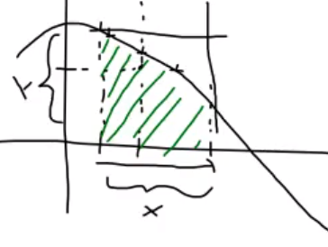

    - napr. generovani cisla PI (pomer obsahu kruhu a kruznice, hruba sila)
    - napr. odhad BMI
        - definovat jednotlive faktory a jejich ppsti rozdeleni (vyska, vaha v populaci, ...)
        - generovat random hodnoty a pocitat BMI => celkove spocitat prumer

- zdroje nahody
    - tabulky (nekdo predpocital)
    - fyzikalni generatory (fyzicke zarizeni)
    - aritmeticke metody

- fyzikalni generatory
    - napr. mereni tepeneho / elektromagnetickeho sumu; pozorovani pocasi
    - rychlost = kolik nahodnych bitu/s muzu ziskat
    - "tiche" selhavani = jak vime za po case dava zrizeni porad random hodnoty? ze nedoslo k opotrebeni?
    - pouziti v kryptografii (skutecny zdroj nahody)
    - `/dev/random`
        - blokujici (meri pohyby mysi, stisknute klavesy, audio, ...)
        - drzi si zasobnik namrenych hodnot 
            - pokud tyto hodnoty vycerpame => blokujici dokud nenameri dalsi hodnoty (omezena rychlost cteni)
    - `/dev/urandom`
        - neblokujici
        - stejny princip jako /dev/random ale pri vycerpani entropii odhaduje (aritmeticky) dalsi hodnoty
        - porad povazovan za kryptograficky bezpecny
    - `/dev/hwrnd`
        - mapovani externiho HW generatoru nahodnych cisel

- pseudo-nahodne generatory
    - algebraicke
        - definice funkci, posloupnost cisel ktera vypada nahodne
        - z vygenerovane posloupnost odhadnout vlastnosti generatoru = NP problem
    - deterministicke
        - stejny seed vede ke stejne posloupnosti
        - vhodne pro debuggovani
    - konecne
        - po jiste dobe (periode) se zacne posloupnost opakovat
    
    - dobry pseudo-nahodny generator
        - mala spotreba pameti
        - dlouha perioda
        - replikovani
            - viz generovani sveta rekurzivne (server pouze rozesle seed klientum) => netreba komprese daneho sveta (klienti ho vygeneruji sami)
        - musi projit statistickymi testy nezavislosti
        - odpovida pozadovanemu rozdeleni
            - stredni hodnota, rozptyl, histogram, ...

- trocha statistiky
    - nahodna velicina = napriklad vysledek mereni (opakovatelne; ne pokazde stejny ale pochazi ze stejneho rozdeleni)

        

    - druha mocnina u `D(X)` kvuli derivovatelnosti (vz problem s absoultni hodnotou)
    - smerodatna odchylka
        - `D(X)` ma tu nevyhodu ze neni ve stejnych jednotach (merim v `m` rozptyl v `m^2`)
        - pouziti ve fyzice, napr delka = `20cm+-2cm`
    
    - rozdeleni = pravidlo prirazujici kazdemu jevu urcitou ppst
        - lepsi charakteristika nez jen `E(X)` a `D(X)`
        - diskretni, spojite
        

- diskretni rozdeleni
    - izolovane jevy (napr pocet lidi ve fronte, hod minci, ...)
    
        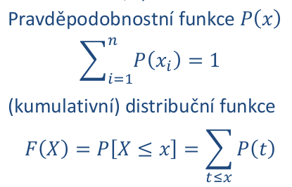

        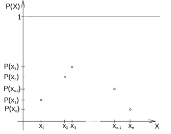

        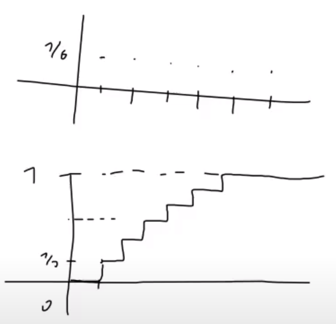

- spojite rozdeleni
    - spojite deje popsane spojitou velicinou
    - mereni doby mezi udalostmi, mereni vysky osob, mereni teploty, ...

        

    - ppst `ppst_vyska_osoby(175) = 0` (vyska je spojita velicina)
        - pocet lidi co meri 175 / nekonecno (vsechny moznosti)
    - definuji se intervaly napr `<174.5; 175.5>`
    - derivace distribucni funkce = funkce hustoty

- rovnomerne rozdeleni
    - zaklad pro ostatni generatory
    - parametry `a`, `b`; normalizovana podoba `<0; 1>`

        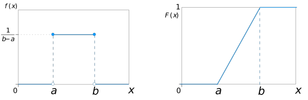

        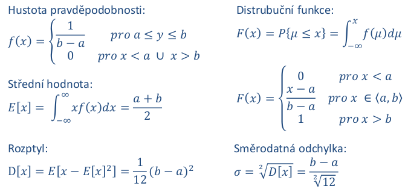

- kvazirovnomerne rozdeleni
    - rovnomerneho rozdeleni je spojite rozdeleni
    - v pocitacich se toto rozdeleni musi mapovat na omezeny pocet bitu `n`
    - pokud je `n` dostatecne velike lze ho pomerne dobre pouzit pro aproximaci rovnomerneho rozdeleni

        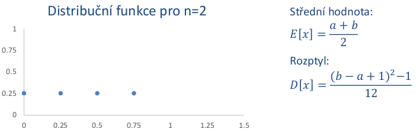

- metoda prostrednich radu
    
    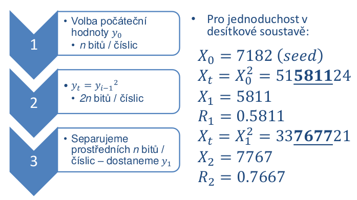

    - problem pri volbe nevhodneho seedu
        - pokud seed = 6500 -> zacyklime se
        - pokud nekde v prubehu vypoctu bude prostrednich `n` cislic < 100 => cislo^2 bude 4 mistne cislo => tim padem prostednich `n` cislic zase bude < 100

    

- LCG = linearni kongruentni generator
    - linerarni rovnice (nasobeni scitani) + modulo

        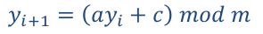

    - varianty
        - `c = 0` - multiplikativni LCG
        - `a = 0` - aditivni
    - rozsah hodnot `<0; m-1>`
    - zobrazeni do prostoru `<0; 1>` => `yi / m`
    - modulo neni potreba vubec delat pokud napr pocitame v `long` a `(a*yi + c)` pretece `max_long` => modulo mame defakto zadarmo
    - hodnoty `a` a `c` nemuzeme volit uplne nahodne
        - chceme co nejdelsi periodu
        - splneni nekolika podminek napr ze `a` a `c` musi byt nesoudelna
        - neni vhodne si volit vlastni
        - konkretni hodnoty se daji najit online pro ruzne jazyky online

    - trik pro prodlouzeni periody generatoru
        - po jiste dobe se zacne generator opakovat
        - vypocet budu delat ve vyssi aritmetice nez v jake generuji dana cisla
            - napr generuji `int`, vypocet budu delat v `long` 
            - vygeneruje random `long`, cast bitu zahodime a vratime vysledny `int`
            - prodlouzime periodu protoze pro generovani pouzivame `64b long`
            - jak generovat random `long`?
                - vyegeneruju 2 `int` po sobe a spojim je v jeden `long`

    - problemy
        - nektere hodnoty se opakuji rychleji
        - korelace mezi cisly 2^n od sebe
        - jejich hlavni vyhoda je rychlost
        - pro monte carlo simulate jsou dostacujici
        - nevhrodne pro kryptografii (nejsou bezpecne)

- smisene generatory
    - 2 LCG generatory
        - napr si vygeneruju `n` random cisel (polozek) a druhym generatorem generuji index do pole, vracim `pole[idx]`
        - prodlouzeni periody
        - nevyhoda je pamet (musim si drzet vsechny polozky v pameti)
    - existuji i dalsi predpisy generatoru
        - napr kvadraticky kongruentni generator
        - nevyhoda v rychlosti (slozity predpis)
        - mohou byt vice kryptograficky bezpecne
    - Mersenne Twister
        - velmi dlouha perioda (lepsi nez LCG)
        - rychly, prochazi vetsinou testu ale neni kryptograficky bezpecny
        - pouziti v C++, PHP, Pythonu, ...
        - nevyhoda je ze zabira hodne pameti

- kryptograficky bezpecne generatory PRNG
    - musime otestovat 2 hlavni veci
    - 1) ppst spravneho odhadu dalsiho bitu nesmi byt vetsi nez 50%
    - 2) pokud odhalim stav generatoru (vim jak bude pokracovat), nejsem schopny z nej desifrovat predchozi zpravy (odvodit predchozi stavy)

- generatovani jinych nez uniformich rozdeleni
    - LCG gnerator generuje cisla z uniformniho rozdeleni
    - zakladni metody
        - transformacni metoda (transformace distribucni funkce)
        - vylucovaci metoda (zalozeno na hustote ppsti)
        - obe tyto metody funguji pro libovolny typ rozdeleni

    - transformacni metoda
        - udelam transformaci distribucni fce `F(X)` (kvantilova fce) a generuji hodnoty `<0; 1>`
        - kdyz je `F(X)` rostouci, staci pouzit binarni vyhledavni (omezeni na presnost kroku)
        - nalezeni kvantilove fce nemusi byt trivialni
        - tam kde `F(X)` roste nejrychleji se budou generovat cisla s nejvetsi ppst 
            - vic hodnot se mapuje na vetsi interval <0; 1>

            

    - vylucovani metoda
        - defkto metoda monte calro
        - mam dva generatory `G1` a `G2` a hustotu ppsti
        - opisu funkci hustoty napr ctvercem a koukam jestli vygenerovany bod lezi nad/pod krivkou (prijmo ho nebo zamitnu)
        - nevyhoda je ze hodne cisel zahodime; jak volime interval na ose x?

            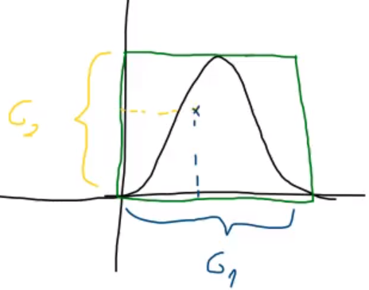

- generovani normalniho rozdeleni
    - vypocet `sqrt(x)` se dela aproximaci polynomem (na urovni CPU)    
    - funkce hustoty pro normalizovane normalni rozdeleni (𝑎 = 0, 𝜎 = 1)

        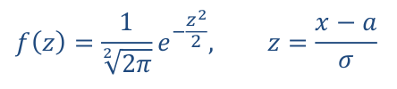

    - centralni limitni veta
        - rika ze soucet `n` nahodnych cisel z rovnomerneho rozdeleni se asymptoticky blizi normalnimu rozdeleni
        - kdyz budu mit hodne chyb mereni tak jejich soucet bude nakonec davat normalni rozdeleni
        - => generujeme a scitame `yi` z LCG (lepsi nez pouziti tranformacni nebo vylucovaci metody)

            

        - je snadne generovat normalni rozdeleni se stredni hodnotou 6 a rozptylem 1 (secteme 12 hodnot, bylo dokazano analytickou cestou)
            - 12 pokusu -> hodnoty 0 - 12 => E(X) = 6
        - jak transformovat dane parametry? 
            - `Sn -= 6` (pouze pricteme / odecteme hodnoty = posun po ose x)
            - pro zadavany rozptyl staci normalni (E(X) = 0, D(X) = 1) rozdeleni pouze vynasobit

    - Box-Mullerova transformace
        - vygenerovani dvou hodnot pomoci LCG a nasledna transformace do polarnich souradnic
        - implementovano v Jave

- generovani obecneho diskretniho rozdeleni
    - obdoba transformacni metody

    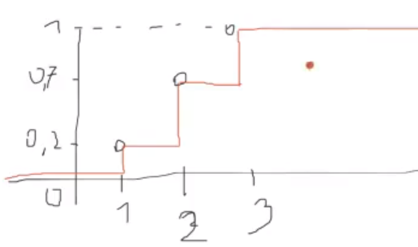

    ```c++
    size_t Pick_Event(std::vector<double> probabilities)
    {
        // Helper struct to hold the probability of an event and its index
        struct TSample
        {
            double probability;
            std::size_t index;

            bool operator<(const TSample& other) const
            {
                return probability < other.probability;
            }
        };

        // Create samples out of the probabilities.
        std::vector<TSample> samples;
        for (std::size_t i = 0; i < probabilities.size(); ++i)
        {
            samples.push_back({probabilities[i], i});
        }
        
        std::sort(samples.begin(), samples.end());
        for (size_t i = 1; i < samples.size(); ++i)
        {
            samples[i].probability += samples[i - 1].probability;
        }

        // Make sure the probabilities add up to 100%.
        static constexpr double EPSILON = 0.0001;
        if (std::abs(samples.back().probability - 1.0) > EPSILON)
        {
            spdlog::error("ERROR: Sum of all probabilities must add up to 1.0, not {}. Returning 0 as the default value.", samples.back().probability);
            return 0;
        }

        // Generate a random number <0; 1>.
        std::random_device rand_dev{};
        std::uniform_real_distribution<> uniform_dist{};
        const double value = uniform_dist(rand_dev);

        // Binary search the interval the random number falls into.
        auto it = std::upper_bound(samples.begin(), samples.end(), value, [&](double probability, const TSample& sample) -> bool {
            return probability < sample.probability;
        });

        // Make sure we do not overshoot.
        if (it == samples.end())
        {
            std::advance(it, -1);
        }

        // Return the index of the event.
        return it->index;
    }
    ```

- generovani podle histogramu
    - defakto to same jako generovani obecneho diskretniho rozdeleni
    - generujeme nahodne cisla a koukame do jakeho intervalu cisla padnou

- testovani generatoru
    - analyticke overovani generatoru (muze byt komplikovane)
    - empiricke overovani (na zaklade testu)
        - overeni spravnosti hodnot `E(X)` a `D(X)`
        - overeni na zaklade histogramu
        - overeni delky periody
    - formalne spravny testy (Chi-Square test)
        
        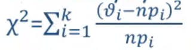