- hodi se kdyz neumime popsat system deterministicky (obsahuje nahodu)
- umoznuje modelovat slozite systemy ve kterych se deji ruzne udalosti a umi predpovidat jak se cely system bude chovat
- nezalezi na minulosti
    - na zaklade aktualniho stavu umi predpovedet jaka situace muze nastat
    - analogie aktualniho bodu a vektoru => umime predpovedet kam se budeme pohybovat

- priklady pouziti
    - modelovani systemu s nahodnymi prichody pozadavku
        - lide ve fronte, telefonni linka, doprava, router, nemocnice, ...
    - vedecke modely
        - page rank (google hodnoceni stranek)
        - generovani reci
            - s urcitou ppsti muzeme rict jake pismeno bude nasledovat pokud jsme detekovali pismeno `t` => graf markovskeho modelu
            - bigramy, trigramy
        - OCR systemy
        - bilogie (SIR modely)
            - s jakou ppsti prejdu mezi stavy mezi
            - Susceptible, Infected, Recovered

            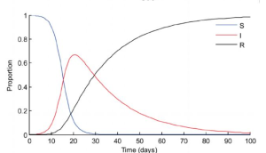

- vlastnosti
    - stavy (stejne jako u KA)
        - staci mi znat soucasnou konfiguraci (ne vsechny jak jsem se do aktualniho stavu dostal)
        - system bez pameti
    - prechody (zname intenzitu / cetnost)
    - markovska vlastnost
        - ppst prechodu ma exponencialni rozdeleni
        - ppst stavu zavisi jen na predchozim stavu a na ceste (hranach) do nej

- Poissonovo & exponencialni rozdeleni
    - poisson
        - = pocet jevu v danem casovem okamziku (napr. 5 pozadavku za hodinu)
        - parametr λ = stredni pocet udalosti za jednotku casu
        - vsechny jevy maji stejnou ppst
        - diskretni rozdeleni
    - exponencialni
        - = prumerna delka intervalu mezi 2 udalostmi (napr. doba mezi prujezdem dvou aut)
        - spojite rozdeleni (cas ne pocet udalosti)
        - parametr λ = stredni pocet udalosti za jednotkucasu
            - => 1 / λ je prumerna doba mezi dvema udalostmi

        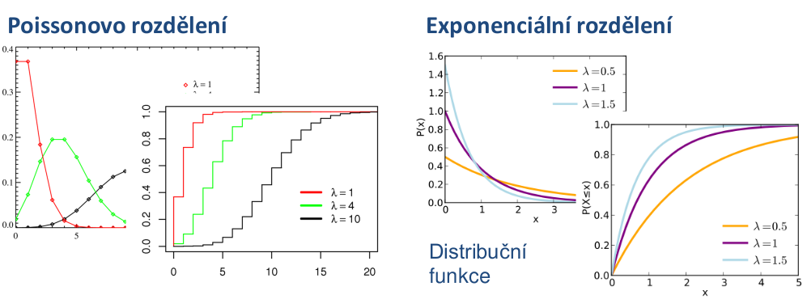

- zakladni priklad - prochazka opileho namornika

    - zacal jsem ve stavu `S`. Jak dlouho bude trvat nez se dostanu na konec ulice?

    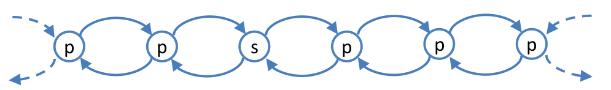

- mozne pohledy na markovsky model

    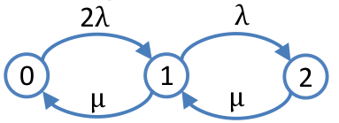

    - matice ppsti prechodu

        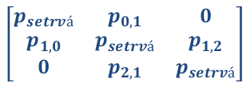

        - podminene ppsti prechodu v pevne dane dobe
        - ze stavu 0 se muzu dostat do stavu 1 (`p0,1`) ALE za predpokladu ze uz jsem ve stavu 0!
        - soucet jednotlivych radku musi byt 1 (jinak to nejsou ppsti)

    - matice intenzit prechodu

        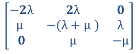

        - soucet radku muzi byt roven 0 (to co vytece = to co pritece; zakon zachovani)
            - na diagonalu se da minus souctu zbytku radku

- obecny model

    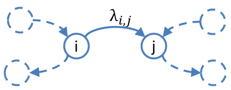

    - intenzita prechodu = λ [1/s]
        - frekvence prechodu za jednotku casu
        - MUSI BYT KONSTANTNI V CASE (jinak to nejde resit analyticky ale jen simulaci)
    - ppst prechodu v danem case
        - `pij = λ * dt (dt -> 0)` (podminena - jiz musim byt ve stavu `i`)
        - "cim dele na to koukame" tim je vetsi ppst ze se to stane (`dt`)
        - cim je vetsi intenzita tim rychleji se to stane (`λ`)

    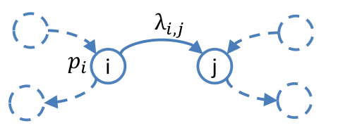

    - pokud znam ppst ze jsem ve stavu `i`
        - => `pij = λ * pi(t) * dt`
        - nepodminena ppst prechodu v case (musim znat ppst ze jsem ve stavu `pi`)

    - pokud znam nepodmineny ppsti prechodu => muzu sestavit matici ppst prechodu

- odvozeni (analyticka matematika)
    - dva zakladni predpoklady
        - `λij` je konstantni v case (jinak musime pouzit simulaci)
        - proces musi byt homogenni (= ppst ze jsem ve stavu `pi` je stejna v kazdem okamziku systemu)

    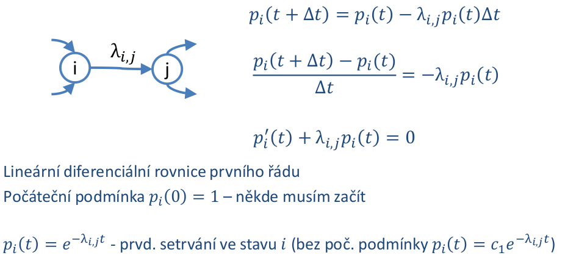

    - ppst setrvani ve stavu `i` ma tvar funkce hustoty exponencialniho rozdeleni
        - => "nahoda" ze to vyslo zrovna na exponencialni rozdelni
        - => muzu pouzit statistiku pro reseni markovskych modelu
        - s pouzitim teto funkce lze zodpovedet napr otazku:
            - jaka je ppst ze system bude fungovat po 10h letu? 

    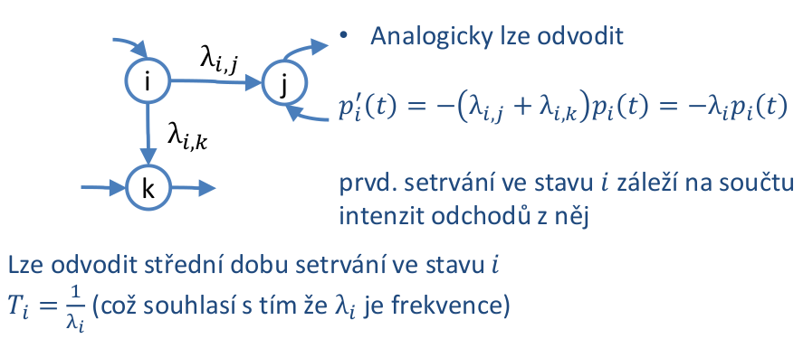

    - ppst setrvani ve stavu `i`
        - => musim odecist 2 veci (mam dva prechody jak se ze stavu mohu dostat)
        - nezajima me po jake hrane odejdu (kdyz se ptam na ppst setrvani ve stavu)

    - `Ti = 1 / λi` - prevracena hodnota souctu intenzit odchodu z daneho stavu

- Kolmogorovy rovnice
    - pokud spojime predchozi dvoje odvozeni
    - = popsani celeho systemu (markovskeho modelu)
    - ppst zmena stavu v case je ppst toho ze v tech stavech jsem krat matice intezit prechodu

        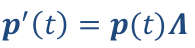

    - `p(0)` - pocatecni podminky (vektor) kde zacnu
    - vysledkem je linearni differencialni soustava prvniho radu
    - to jestli reseni bude jednoduche nebo ne zalezi jestli v systemu existuje absorpcni stav nebo ne
        - z dlouhodobeho pohledu v tom stavu skoncime vzdycky
        - nema smysl modelovat ppst setrvavani ze stavu (v dlouhodobem horizontu) ale jen ZMENY prechodu v case (ve finale budou ppst vsech stavu 0 a absorpcni stav bude mit ppst 1)

        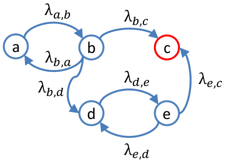

        - zmena ppst setrvani ve stavu B v case

            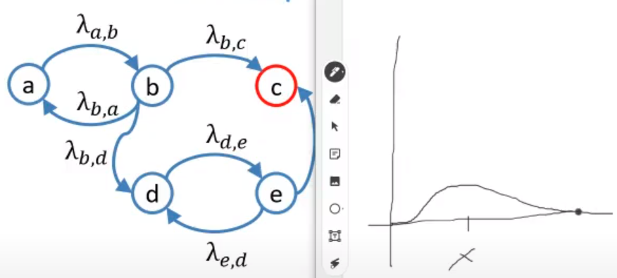

        - muzeme si klast otazky napr v jakem case my system selze (preleze hranici 95%); ve stavu C je vsechno rozbite
        - z dlouhodobeho pophledu tam skoncim 100%
        - z reseni diferencialni rovnice vyjde ze tento prubeh bude odpovidat distribucni fce exponencialniho rozdeleni

            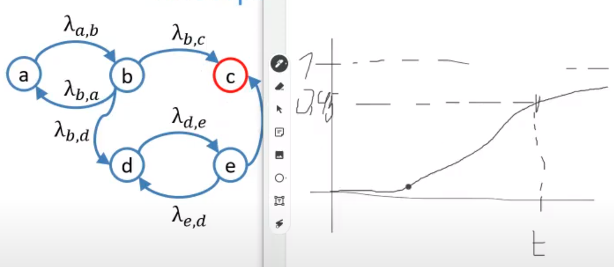

- absorpcni stavy - rovnice

    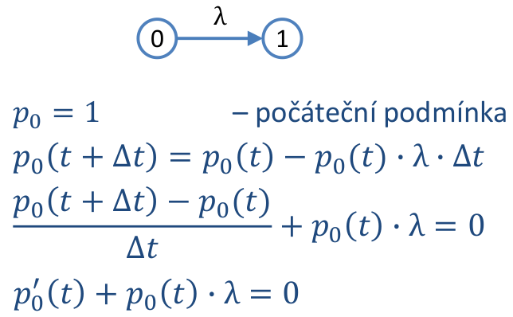

    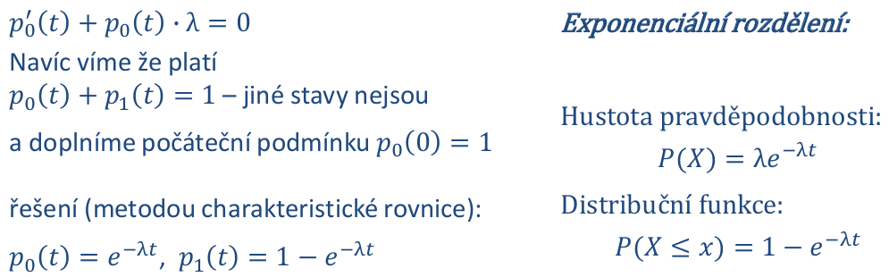

    - => markovske modely se daji pouzit tam kde se vyskytuje exponencialni rozdeleni (charakteristika)

    - zase vychazi se stredni hodnota doby ze jsem v nejakem stavu je `E(X) = 1 / λ`

    - sestaveni rovnic
        - leva stana je derivace zmena `pi'(t)`
        - prava stana jsou "prispevky"
            - `+ pk(t) * λki`
            - `- pk(t) * λik`

        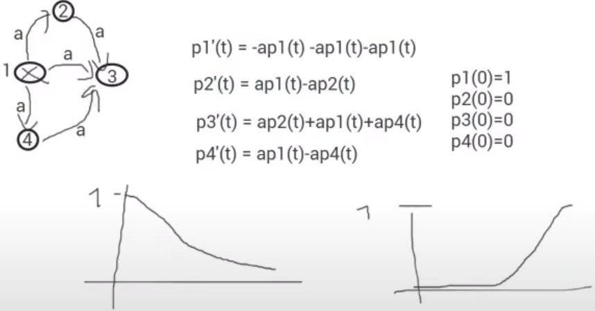

    - nahodna doba setrvani v libovolnem stavu ma exp. rozdeleni

        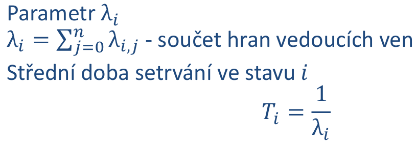

- markovske modely bez absorpcnich stavu
    - graf musi byt silne souvisly (z kazdeho stavu se musim dostat do kazdeho stavu)
        - nesmi existovat podgraf ze ktereho bych se "nedostal ven"
    - markovsky model (graf) ktery neni silne souvisly!

        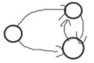

    - neexstuje stav ve kterem bych skoncil s ppsti 1
        - => ppst setrvani v jednotlivych stavech se nakonec ustali (= jsou KONSTANTNI -> derivace konstanty = 0)
            - zmena ppst v case (prava strana rovnice) je 0
        - tzv limitni ppsti
        - ppst setrvani ve stavech uz nejsou funkce casu ale jen konstanty
        - vysledna soustava rovnic je ale LINEARNE ZAVISLA => existuje nekonecne mnoho reseni (0 = 0)
            - nekde hrana vede ven -> nekde ta sama hrana musi vest dovnitr
            - => odectou se
            - resenim je ze pridame dalsi rovnici ktera musi platit v libovolne case `p(0) + p(1) + ... + p(n) = 1`
            - pote muzeme libovlnou jednu z preddchozich rovnic skrtnout a nahradit ji touhle ktera jiz neni linearne zavisla
            - resenim teto nove soustavy rovnic dostanu ustalene ppsti

        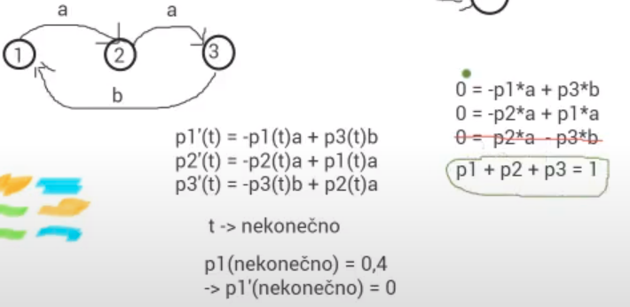

- priklad synchronizace procesu
    
    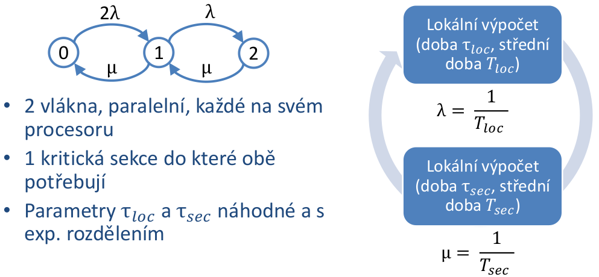

    - sestavime rovnice

    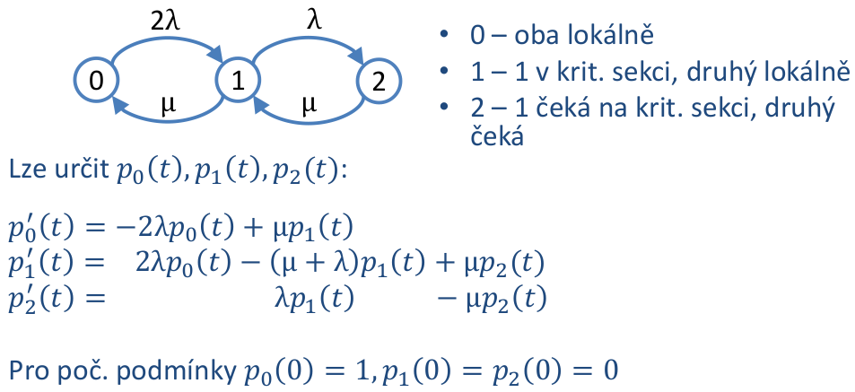

    - graf je silne souvisly -> po "nekonecne dlouhem" pozorovani se ppsti setrvani ve stavu ustali => muzeme rovnice upravit

    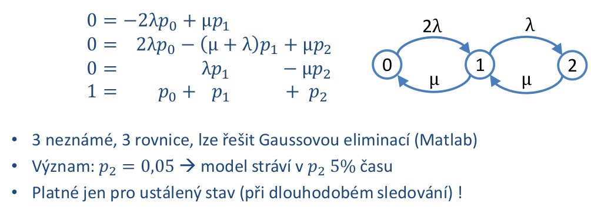

    - zajimavy je napriklad stav 2 (jak dlouho system travi cekani na barieru)
    - jednotlive ppst = % STRAVENEHO CASU (z dlouhodobeho pohledu)
    - cim vetsi p2 -> tim mensi efektivita programu
    - porad plati ze stredni doba setrvani ve stavu `Ti = 1 / λi`
    
    - dej je cyklicky -> lze urcovat frekvence prechodu mezi stavy
        - `fij = pi * λij` (stredni frekvence prechodu po dane hrane z `i` do `j`)
    - stredni fekvence pruchodu stavem
        - `fi = pi * λi` (to same akorat secteme vsechny vystupni hrany a ne jen tu jednu)
            - musi byt stejne i kdyz pouzijeme vstupni hrany (misto vystupnich) => zakon zachovani
    - stredni doba cyklu pruchodu stavem `i`
        - `Tci = 1 / fi`
        - jak casto se stav opakuje

- Pagerank
    - jadro hodnoceni stranek Google
    - co stranka to uzel (stranka obsahuje URL linky na dalsi stranky)
    - nahodna prochazka grafem (= markovsky system)
    - problem s absorpncnimi stavy => random teleportace
    - ustalene ppst = ohodnoceni dulezitosti

        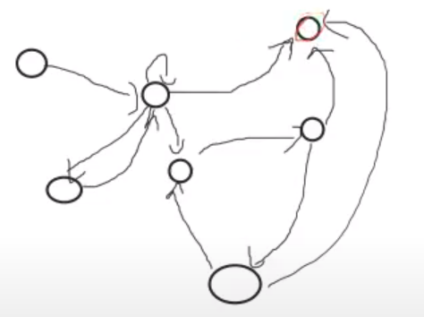

- modelovani synchronizacnich primitiv (dalsi priklad vyuziti markovskych modelu)
    - bariera

        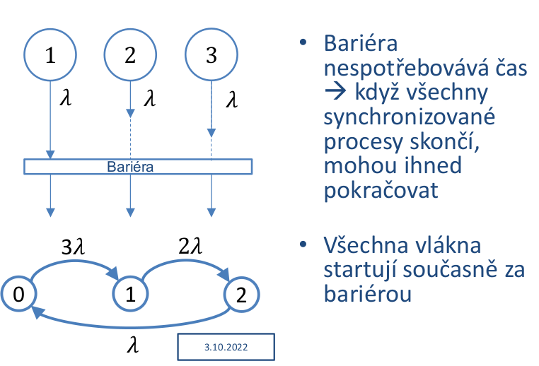

    - bariera s KS (rendez-vous Ada)
        - typicky model farmer-worker

        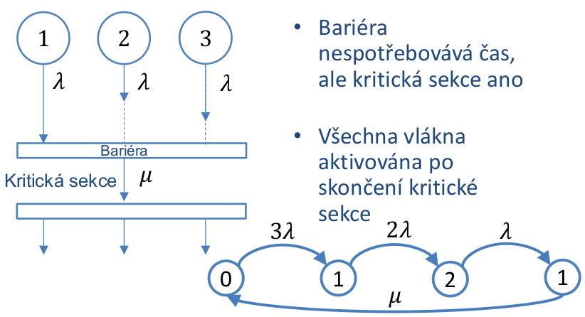

    - vlakno s KS (monitor)

        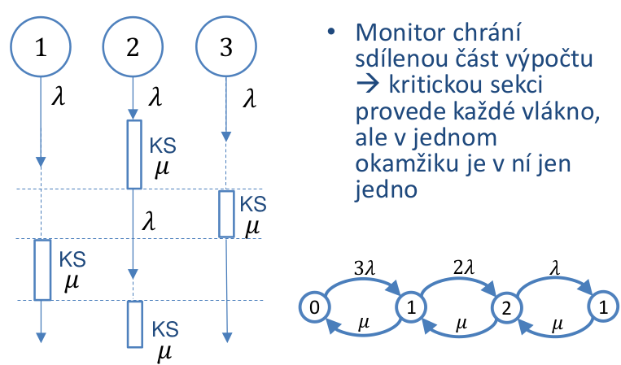

    - producent-konzument

        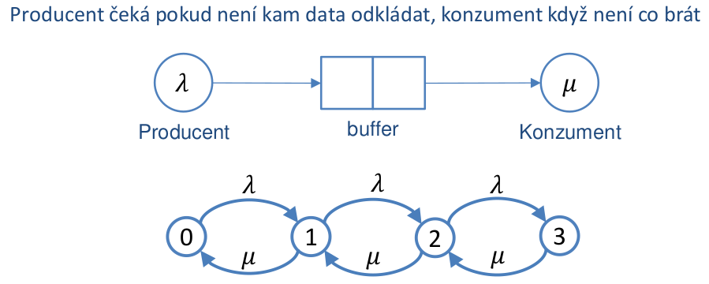

        - pocet stavu je velikost bufferu + 2
            - +2 protoze na zacatku je buffer prazdny a kdyz producent vygeneruje prvni item tak je zpracovan primo konzumentem (nevklada se do bufferu)
            - defakto pocet stavu = maximalni pocet pozadavku v systemu + 1 (zadny pozadavek) 
        - stav 0 = "nikdo nic nedela"
        - stav 1 = konzument zpracovava data
        - stav 2 = v bufferu je 1 polozka
        - stav 3 = v bufferu jsou 2 polozky

    - producent s vice konzumenty

        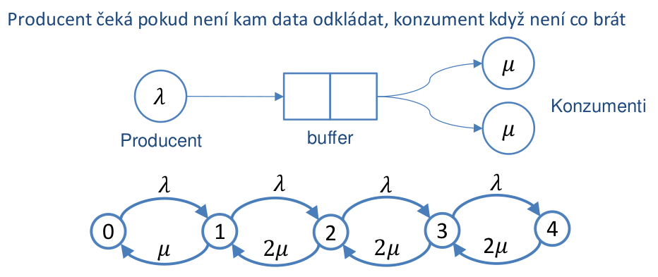

        - makrovsky model je defakto stejny
        - vice konzumentu se da realizovat pomoci dvojnasobku intenzity hrazny zpracovani pozadavku
        - stav 0 = "nikdo nic nedela"
        - stav 1 = 1. konzument zpracovava data
        - stav 2 = 1. a 2. konzument zpracovava data
        - stav 3 = v bufferu jeden pozadavek
        - stav 4 = v bufferu dva pozadavky