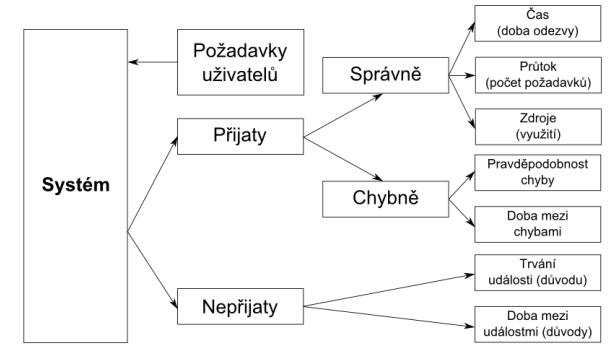
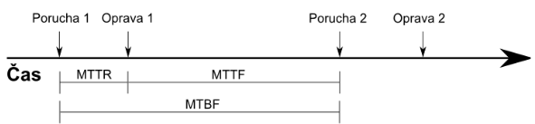
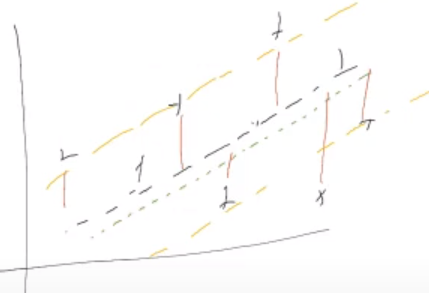

- jestli to co zmerime dava smysl nebo kdyz nam neco nabizi co to vlasnte znamena

- k cemu je to dobre?
    - porovnani systemu
    - vhodne nastaveni systemu
    - nalezeni uzkych mist (spise profiling nez benchmark)
        - uzke misto nemusi byt tam kde jsme naprogramovali nejaky slozity algoritmus ale muze to byt napriklad volani knihovni funkce
    - popis systemu
        - nalezeni klicovych vlastosti (nalezeni napr skutecneho `λ` a `μ`)
    - planovani kapacity
    - predpovidani
        - kdy system selze?

- co se da merit?
    - rychlost
        - doba odezvy; napr odpoved ze serveru nebo FPS
        - MIPS = pocet instukce za jednotku casu
        - FLOPS = to same ale obsahuje i floating-point instrukce
    - spolehlivost
        - ppst chyby (nema vyznam u SW - nema nahodne chyby)
        - MTTF (mean time to failure)
        - u SW je dulezita metrika MTTR (= restart serveru)
    - dostupnot / pruchodnost
        - napriklad pocet packetu za sekundu
    - cena
        - nakaldy na transakci (napr banky)
        - spotreba, tepelny vykon (dulezite u Low power zarizenich)

- zatez 
    - v markovskem modlu je dana hodnotami `λ` a `μ`
    - u benchmarku zalezi na tom co vlastne merime

- zakladni vlastnosti
    - opakovatelnost
        - nekdo jiny ho dokaze provest a dojde ke stejnym cislum (vysledku)
        - musime definovat vychozi stav a podminky experimentu (pomerne tezke viz HW vybaveni PC)
        - pokud mame virtual mame nad nim kontrolu? (viz sdilena sbernice)
        - pozor na benchmarkovani externich API (DOS)
    - meritelny vysledek
        - pozor na to co vlasnte merime (aktualizace, preemce, garbage kolekce)
        - pozor na optimaliztor (volatile, `-O0`)
        - hodne mereni prevadime na mereni vzdalenosti (viz teplota)

- zakladni deleni benchmarku
    1)  program kvuli kteremu testujeme (realne programy)
        - nejlepsi co muzeme udelat = odpovida tomu co chceme delat
            - kdyz chci vedet jak mi nejaka hra dobre pobezi -> nejlepsi je to vyzkouset na te samotne hre
        - problem srovnavani vice testovatelnych sytemu (nelze opakovatelne stejne nastavit)
    2) pecializovane programy
        - 3D mark
        - "napodobenina" realneho programu
        - vysledek je trochu zkresleny, da se dobre opakovat
        - delate to same jako realny program (chce ho napodobit)
        - existuji dle zamereni (banky, veda, rezervacni systemy, ...)
    3) synteticke benchamrky
        - definovana sada instrukci / operaci ktere nedelaji nic uzitecneho
        - nekdo zmeril kolik % instrukci je scitani, kolik je pristupu do pameti atd nad realnym programem
        - riziko prizpusobenych optimalizaci prekladace (vsichni ten benchmark znaji)
            - viz mereni emisii volkswagen
    4) specificke algoritmy
        - neco co dostatecne zatizi PC
        - hlavne testovani CPU (vliv cache pameti a PREKLADACE!!)

- prehled oblibenych benchmarku
    - zamereno hlavne na HW
        - pro SW se tezko navrhne OBECNY benchmark
    - Erastothenovo sito
        - hladani prvocisel
        - testuje (rychlost pristupu do pameti; jak efektivne mame implementovane pole)
    - Ackermanova funkce
        - testovani efektivity rekurze a zobrazeni velkych cisel na obrazovce
        - jednoduche podminky => ale vytari velice velky strom volani (rekurznivni)
    - Whetstone & Dhrystone
        - sada instrukci podle statistiky pro vedecke programy
        - muze byt ovlivnen prekladacem
    - CoreMark (moderni nahrada za Dhrystone)
    - LINPACK
        - knihovna pro reseni soustav linearnich rovnic
    - Debit/Credit
        - benchmark pro DB (bankovni system)
        - definovane DB schema + sada transakci
        - definice pouze high-level (podle popisu si musime udelat sami implementaci)
    - TPC-C V5
        - zohlednuje velikost DB (pocet zaznamu)
        - meti pocet transakci za sekundu
        - musme dotazy dynamicky generovat jinak hrozi ze se nacachesuje
    - SPEC Suite
        - sada ruznych realnych programu
        - testovani ruznych komponent PC (CPU, GPU, RAM, ...)
        - existuje i test co meri vykon JRE
    - existuje hromada dalsich benchmarku

- navrh experimentu
    - cilem: s minimalnim usilim zistkat maximum informace
    - potrebujeme presne definovat co na danem systemu pobezi
        - musime definovat i posloupnost kroku (tak aby byl experiment opakovatelny)
    - je nutne si urcit hranice
        - co vsechno je nas system
        - co vsechno je vnejsi svet okolo (nemame pod kontrolu, jsme na tom zavisly)
    - volba metriky
        - co nas doopravdy zajima v nasem systemu (spotreba? cena? dostupnost?)

            

        - musime si definovat co to je doba odezvy
            - system zacne odpovidat? nebo posle vsechna data? nebo jen cast? (koukani na film na Netflixu)
        - nominalni (maximalni) kapacita
            - maximum dosazitelne v idealnich podminkach
        - vyuzitelna kapacita
            - maximum dosazene se zachovanim pozadaovane doby odezvy
        - efektivita, vyuzitelnost
        - spolehlivost
            - MTTR, MTTF, MTBF

                

    - definice toho co / kdo je uzivatel
    - definice zateze
        - realna: zatez zachycena nebo odvozena od behu skutecneho systemu
        - synteticka: snadna modifikace, prenositelnost, podobna realne zatezi
        - popis zateze
            - prumer, orchylka, rozeleni, histogramy (napr casy kdy lidi koukaji ja Netflix)
            - muzeme si napsat random generator zateze dle daneho ppstniho rozdeleni
            - muzeme byt take popsan stavovym automatem (chovani uzivatele)
    - muzeme udelat analyticky model a odhadnout jak se system chova abychom dokazali overit ze vysledky davaji smysl  
        - nebo muzem odhad udelat ze simulace
    - urceni cilu: interpreteace vysledku (napr jake ze dvou CPU chci pouzit)
    - parametry vs faktory
        - parametry: charkterizuji system (vlasnosti) a nemeni se behem prace
        - faktor: parametr v systemu ktery se muze menit v case
            - defakto si zvolime jeden parameter jako faktor ktery pak menime v case a koukame jak to ovlivnuje cely system
            - napr velikost RAM, pocet uzivatelu, atd
    - pozor pokud benchmark bude generovat velke mnozstvi dat aby je bylo kam ulozit
        - je lepsi ukladat surova data a az pak delat analyzu
    - pro jeden benchmark muzu mit vice konfiguraci (ruzne typy zateze)
    - analyza vysledku (stredni hodnota, vazeny prumer, median, rozptyl, graf, histogram)
        - median lepe "ignorue" outliery (extermy)
        - prumer je extremama ovliveny
        - aritmeticky prumer
            - pro hodnoty ktere jsme merili primo (napr doby trvani)
        - harmonicky prumer
            - pokud mame metriky v prevracene hodnote (napr MIPS; v Hz) => musime pouzit harmonicky prumer
        - KORELACE NENI KAUZALITA!!!
            
            - to ze jsou data korelovane neznamena ze je mezi nimy nejaka zavislost (muze to byt jen nahoda; maji podobny tvar)

            

        - podminena ppst
            - senzitivita testu: ppst ze vysledek bude TRUE pokud je osoba fakt nakazena
            - specificita testu: ppst ze je vysledek FALSE pokud neni osoba nakazena
            - prevalence jevu: procento vyskytu chodoby (kolik lidi je nakazeno)
    - prezentace vysledku
        - nemichat vice veci v jednom gradu
        - popis os, pocatek by mel byt v 0
        - nezavisla promenna na ose x
        - pozor na meritka grafu
        - nepouzivat moc statistickych vyrazu (at je to intuitivni)
        - diskretni hodnoty nepropojovat!
        - rozdil mezi interpolaci, regresi a extrapolaci
        - popis jak jsme k vysledku dosli (co bylo zanedbano atd.)
        - dobry je pouzivat tzv spolehlivostni intervaly (dava duveru v to jak je vysledek dobry)

            

        - pozor na pomery velikosti (plocha neni dvojnasobna ale ctyrnasobna; plocha se chova jinak nez cara)

            

        - soucet hodnot v kolacovem grafu = 100%
        - pozor na vynechavani dat ve sloupcovem grafu
        - perpocitavat hodnoty na 100,000 obyvatel
            - pouzivat relativni cisla