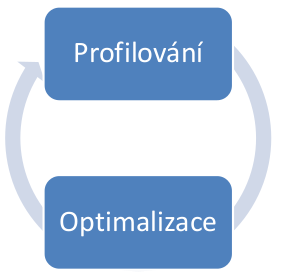
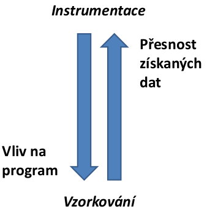
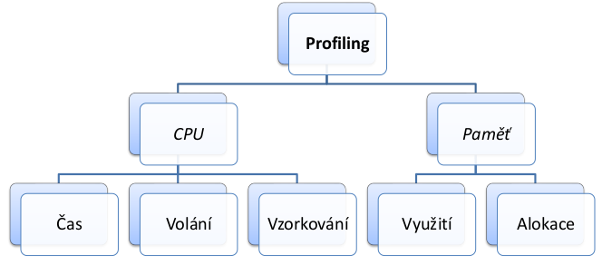

- benchmark: blackbox
    - typicky porovnavani nejakych variant
- profiling: whitebox (mame plny pristup)
    - analyza vlastniho programu
    - mame mnohem vice dat
    - zakladnim cisel je optimalizace
        - zjistit co zabyra nejvic casu, zdroju (pameti), ...

            

    - profiler se diva do nasi aplikace a jeji pameti (externi nastroj)
        - pozor na antivirus
    - casto integrovane v IDE (pro vyvoji)
    - sledovani bezici applikace (za behu; pozor abychom nerozbili produkcni prostredi)
    - dve moznosti jak delat profiling (jak to funguje)
        - instrumentace
            - pred spustenim se kouknem do binarky a pridame do nej sledovaci metody (pridame instrukce)
        - vzorkovani
            - za behu 
            - memory dump, stack trace, instrukce v CPU, ...
            - napr JRE ma API pres ktere se muzeme doptavat co prave dela
                - programek `jstack <pid>`
                - `jmap <pid>` vytvori dump
            - presnost zalezi na periode vzorkovani (muze nam neco uniknout)

            

    

    - vystupy z profileru
        - profil
            - staticky popis (souhr) informace o behu aplikace
            - napr kolik metod bezelo, jak dlouho kazda metoda bezela atd
        - trasovani
            - posloupnost sledovanych udalosti
            - defakto log soubor
            - dulezite pro vicevlaknove aplikace
        - pametove statistiky
            - struktury a jejich cetnost
        - memody dump
            - kopie cele pameti nekam ven kde ji pak muzeme dal analyzovat

    - podobny problem jako bencmarkovani
        - izolace experimentu, stanoveni cilu, soustredeni na dulezite veci (viz komplikovane algoritmy vs pristup do DB)
    - slouzi k nalezeni uzkych mist
    - best practices
        - dusledne vsechno verzovat (zmeny, testy, konfigurace)
        - porad testovat (unit testy)
    - uzivatele a vykon
        - uzivatele nemaji radi kdyz se jen toci kolecko, chteji videt progressbar
    - mozna urychleni Javy
        - zpracovani vyhjimek je drahe
        - cteni / zapisy ze souboru
        - optimalizace pristupu do DB
            - urychleni napr pomoci cache, indexy nad sloupci (implementace pomoci B stromu), ...
            - dobre je take timeoutovat sessions (problem hlavne po nasazeni aplikace)
        - uvedomit si casove / pametove slozitosti pouzitych datovych struktur
        - frameworky jsou vetsinou postavene nad reflexi -> bottleneck
    - existuji loggovaci nastroje ktere umoznuji monotirovani Java serveru