- urceni spolehlivosti HW slozeneho ze znamych modulu
    - za jak dlouho se neco rozbije?
- urceni velikosti zaloh (pocet nahradnich komponent)
- jake existuji techniky pro psani spolehliveho SW?
    - oeverene metodity viz V model, odsroubovane srouby z druzice, ...
    - SW nema nahodne poruchy; existuji pouze systematicke chyby
- matematicky model je zalozen na tom ze mame HW ktery 100% funguje a vlivem nahodnych jevu muze selhat, po dostatecne dlouhe dobe je ppst poruchy 100%
    - veli obecny model
    - dulezite je si uvedomit ze vysledek je jen ppst + rozdeleni

- zakladni ulohy
    - mereni spolehlivosti (jaka je MTTF)
    - odhadovani / predvidani spolehlivosti
        - system poskladany z vice prvku
        - vydrzi ridi system letadla bez poruchy vice jak 10h?
        - analyza / simulace
    - zlepsovani spolehlivosti
        - opatreni systemu sadou zaloh

- kazdy senzor ma meze mezi kterymy dava spravne vysledky
    - => nutnost kontrolovat
    - problem napriklad zasakavani ADC prevodniku

- problem v testovatelnosti SW
    - SW bychom museli testovat 2x tak dlouho co je jeho provozni doba
        - viz kumulace chyby v obrannych raketach
- GUI by se si vzdycky mela cist hodnoty primo z HW (reflexe realneho stavu)
- existuji spolehlivostni normy (napr MISRA, AUTOSAR)

- zakladni pojmy
    - poruchy
        - systematicke: SW
        - nahodne (radiace, pocasi, ...): HW
    - stavy
        - bezporuchovy: system pracuje jak ma
        - poruchovy: system neposkytuje pozadaovanou sluzbu
    - systemy
        - obnovovani (mohou se nejak opravit)
        - neobnovovane (po poruse jsou zniceny)

- klasifikace chyb
    - mistake: chyba operatora
    - fault: vnejsi vlivy, chyba navrhu systemu
    - error: rozdil mezi ocekavanym a realnym vysledkem
    - failure: selhani systemu

- kategorie spolehlivosti
    - nezabezpecene systemy (faul avoidance)
        - "delam vse co nejlepe" (vlaky v japonsku)
    - bezpecny stav
        - fail safe
        - po poruse prejdu do bezpecneho stavu (napr zastavim auto)
    - systemy odolne proti chybam
        - fault tolerance
        - napr letadla (NESMI dojit k poruse; redundance HW i SW)

- zajisteni odolnosti proti chybam
    - spolehlivostni normy
    - redundance (HW i SW)
        - typy zaloh
            - studena: vypnuta, zapne se az pri vypadku
                - vyhoda je ze nezere energii
                - neopotrebi se
            - tepla: zpnuta ale neaktivni (po vypadku zacne zpracovavat vstup)
            - horka: zaloha bezi paralelne s hlavnim vypoctem
    - abychom mohli vyzuzit zalohy musime byt schopny detekovat ze doslo k chybe! (jak?)
        - napr u horke zalohy musi replika davat stejny vysledek (resp shoda vetsiny)
        - u studene zalohy musime byt schopny detekovat ze nasatala chyba (pridavny obvod)
    - musim byt schopny systemy prepnout
        - zvysuje slozitost systemu => vic veci => vic veci se muze rozbit
        - zapinani zalozniho systemu muze trvat nejaky cas (kriticke u safety-critical systemu)
            - tepla zaloha toto muze omezit (ale zas zere energii)

- priklad horke zalohy (rizeni vlaku)

    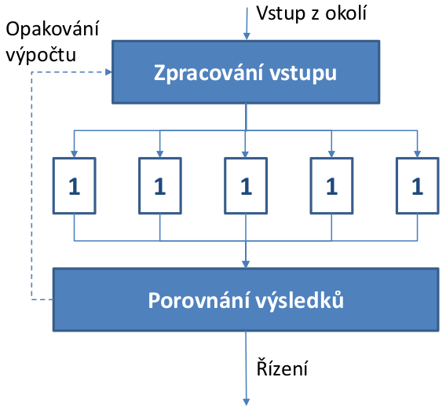

- ukazatele spolehlivosti

    - `MTTF` - stredni doba do poruchy
        - v modelech se casto udava jako intenzita `λ = 1 / MTTF`
        - nahodny jev => exponencialni rozdeleni
        - za jak dlouho se zapnuty system rozbije
    - `MTTR` - stredni doba do opravy
        - v modelech se casto udava jako intenzita `μ = 1 / MTTR`
        - jak dlouho mi zabere cele to znovu spustit (doba jakou potrebujeme na restart - u SW, u HW - jak dlouho mi trva neco vymenit)
    - `MTBF` - stredni doba mezi poruchama
        - jak casto dochazi k vypadkum
        - stredni doba cyklu

    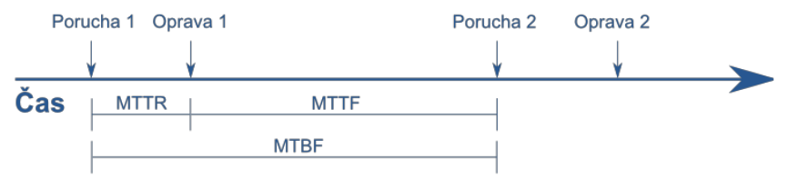

- vsechny analyticke modely predpokladaji ze je `λ` (frekvence poruch) konstantni v case

    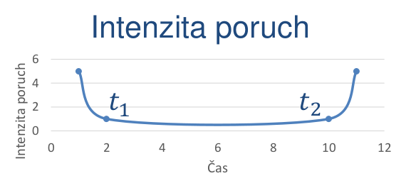

    - hodnota `t2` se odhaduje sptane (museli bychom pockat kdy se rozbije)

    - na zacatky jsou poruchy z vyroby a na konci poruchy opotrebovanim
    - bez tohohle predpokladu nemuzeme analyzu delat statisticky
    - existuje kritika toho ze takovyhle prubeh frekvence poruch v case neodpovida realite
    - to ze frekvence poruch odpovida exp rozdeleni bylo overeno empriricky
    - ppst poruchy (distribucne fce): `Q(t)`
    - ppst bezporuchove stavu (distribucni fce): `R(t) = 1 - Q(t)`
    - => rikaji s jakou ppst bude system v danem case zit nebo bude rozbity

    - exponencialita poruch
        
        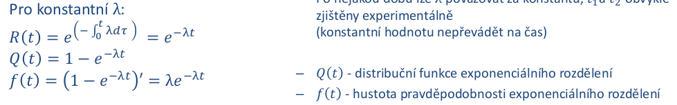

        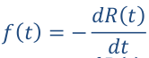

    - v praxi mamte tabulky ktere rikaji jaka bude `λ` napr pro integrovany obvod
        - pomoci tabudek pouzijeme vzoredek k vypoctu `λ` celeho cystemu
            - na zaklade poctu hradel, poctu obvodu, vlivu teploty atd.
        - tento postup je dost kritizovan protoze se nejedna o fyzikalni model ale jen statisticky model; zaroven nic lepsiho zatim nemame

- neobnovovane objekty
    - system na zacatku zije a na koneci je rozbity se 100% ppsti

    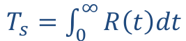

    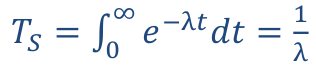

    - `MTTF = 1 / λ`
    - vezmu distribucni funci bezporuchoveho stavu a spocitam stredni hodnotu => dostanu stredni dobu do poruchy
    - jen pro konstantni `λ` (`<t1; t2>`)

- obnovovane objekty
    - vyneseme casovou radu toho kdy system fungoval / nefungoval

    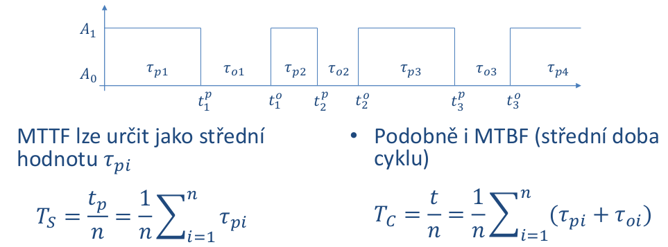

    - soucinitel pohotovosti

        - pomer doby kdy system postytuje sluzby ku celkove dobre provozu

        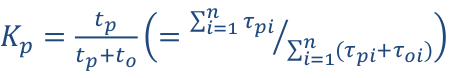

        - plati pro stacionarni rezim (kdy cas se blizi nekonecnu)

    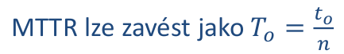

    - `To = 1 / μ`

    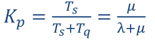

    - koeficient prostoje: `Kn(t) = 1 - Kp(t)`

- systemy s nezavislymi prvky
    - napr CPU, RAM, BUS
    - nejjednodussi pripad zavislych prvku je studena zaloha
        - musime pouzit podminenou ppst pri urcovani ppst poruchy zalohy
    - pokud jsou prvky nezavisle, muzeme poruchy chapat jako nezavisle nahodne jevy
    - pouze modelujeme zapojeni jednotlivych prvku
    - seriove zapojeni
        - porucha jednoh prvku rozbije cely system

        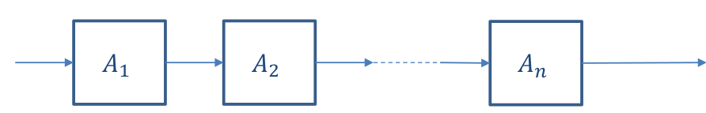

        - mame `n` nezavislych jevu jaka je ppst ze rozbije jeden z nich?
            - nasobime funkce `R(t)`

        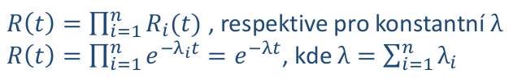

    - paralelni zapojeni
        - system se rozbije az potom co se rozbiji vsechny prvky (staci alespon jeden aby fungoval)

        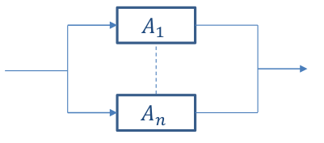

        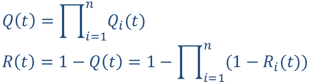

        - pokud zname napr `R1(1)` => `Q1(t) = 1 - R1(t)`
        - nasobime funkce `Q(t)`

    - kombinovane modely

        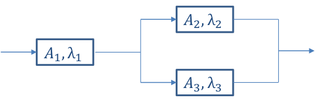

        - `Q23 = Q2 * Q3 = (1 - R2)(1 - R3)`
        - `R23 = 1 - Q23`
        - `R = R1 * R23` (ppst ze se system rozbije)

        - pro exponencialni doby poruch je `Ri(t) = e^(-λit)`

            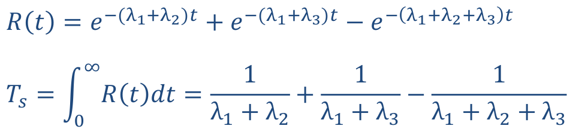

            - `Ts` je stredni doba do poruchy celeho systemu

    - toto vse funguje pro systemy ktere jsou
        - neobnovovane
        - konstantni `λ`
        - nezavisle poruchy

- stavovy graf
    - problem predhozich prikladu je ze se system nachazi bud v paralelnim nebo seriovym zapojeni (+ kompinace)
    - co kdyz mame system ktery se chova nekde mezi
    - priklad
        - mam 3 prvky `A1`, `A2`, `A3` a potrebuju aby fungovali kterykoliv 2
            - kdyby mi staci 1 bylo by to paralelni zapojeni
            - pro zapojeni 2 ze 3 uz papralelni vzorecek nebude fungovat
        - nakreslim stavovy graf (na zacatku vse funguje)

            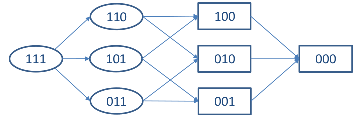

            - ppst napriklad prostredniho stavu ve tretim sloupci je `R1(t)*Q2(t)*Q3(t)`
            - => pokud zname funkce `R(t)` a `Q(t)` pro kazdy prvek -> dokazeme popsat ppst jednotlivych stavu modelu
            - celkova funkce je soucet vsech ppst stavu ve kterem system funguje

                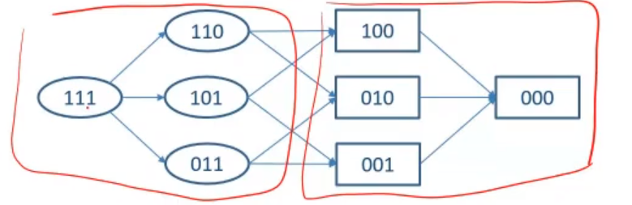

                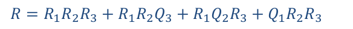

- stromy poruch
    - mame poruchy a jejich ppst 
    - muzeme sestavit strom-like strukturu ktera byde vystihovat co musi nastat soucasne a jake poruchy na sebe navazuji
    - zaciname od shora (system je rozbity), co mohlo nastat?
        - mohla se napr rozbit RAM nebo CPU atd
        - pak pokracujeme dal stromem napr proc se rozbila RAM
    - pokud mame dilci ppsti muzeme nad tim udelat nejakou analytiku
        - problem je ale jak zjistit konkretni ppst
    - pouziti napriklad v root-cause analysis
        - napr porucha raketoplanu

    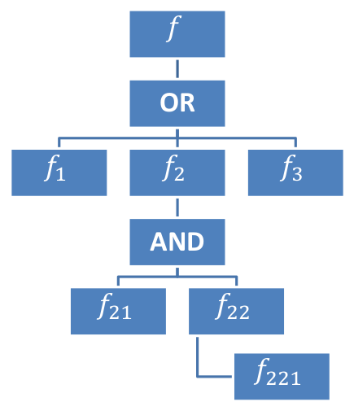

    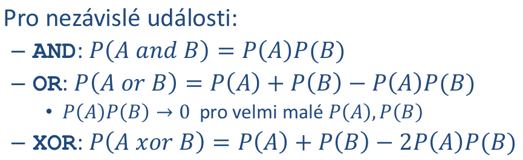

- systemy se zavislymi udalostmi
    - typicky studena zaloha
        - muze se porouchat az po zapnuti (podminena ppst)
    - muzeme pouzit markovske modely
        - poruchy maji exponencialni rozdeleni
    - neobnovovane systemy
        - mame absopcni stavy (system se 100% rozbije)

            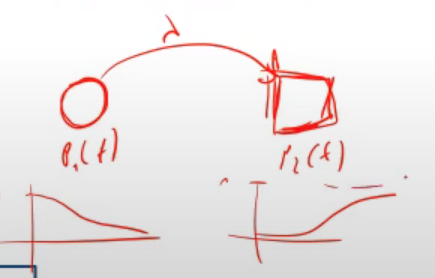

            - reseni linearni soustavy DIFERENCIALNICH rovnic (neni ustaleny stav resp 100% skocime v rozbitem stavu)

            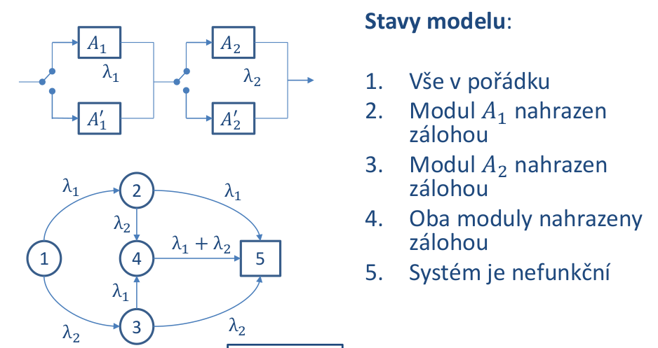
    
            - zalohy prodluzuji dobu nez se dostanu do stavu 5 (system je rozbity) ze to jsou jen 2 uzle s dvama hranama (`λ1` a `λ2`)
                - napri rizeni letadla po dobu co je ve vzduchu

            - TRICK JAK OBEJIT DIFERENCIALNI ROVNICE
                - najdeme vsechny cesty ze zdroje do stoku a spocitame jejich ppsti
                - celkem mame 4 cesty
                    - pro kazdou z nich muzeme urcit dilci dobu `Tci` jak dlouho ta cesta trvala a jeji ppst `Pci` (ppst ze tou cestou mam projit)

                - spocitame stredni dobu (prumer) jako vazeny prumer jejich delek

                    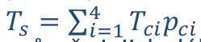

                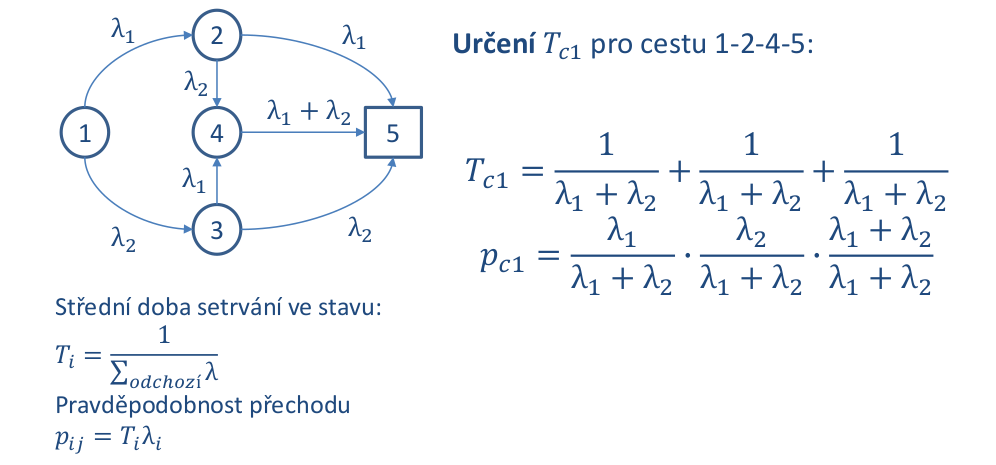

                - doba setrvani ve stavu je 1 / soucet intenzit vystupnich hran
                - ppst odchodu ze stavu po hrane ja intenzita dane hrany / soucet intenzit vystupnich hran

    - obnovitelne systemy
        - graf obsahuje cykly (rozbite prvky mohu opravovat)
        - diferencialni rovnice odpadnou
            - zbydou nam linearni rovnice (nemame absopcni stav -> silne souvisly graf)

            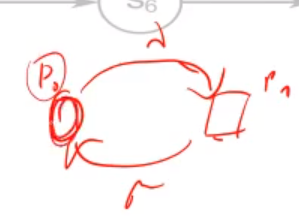

        - priklad
            - mam jednu horkou zalohu 
            - mohu si dovolit opravovat oba prvky najednou? (`2μ`)

            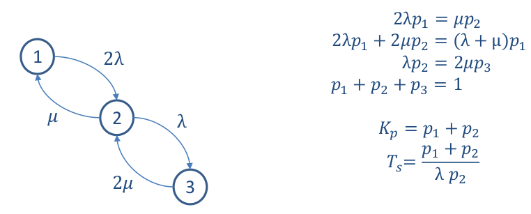

            - `Kp = p1 + p2` (soucet ppsti stavu kdy system funguje)
            - `Ts = (p1 + p2) / (λ * p2)` (MTTF) ppst toho ze to funguje lomeno ppsti ze ty stavy opustime

- take se daji na vsechny vyuzit simulace
    - napriklad system ma 2 prvky a kazdy ma studenou zalohu a chci vedet jestli se system proucha do casu `t`
        - zname intenzitu poruch (exp rozdeleni)
        - vygenerujeme 4 rand cisla z daneho rozdeleni

        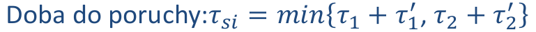

        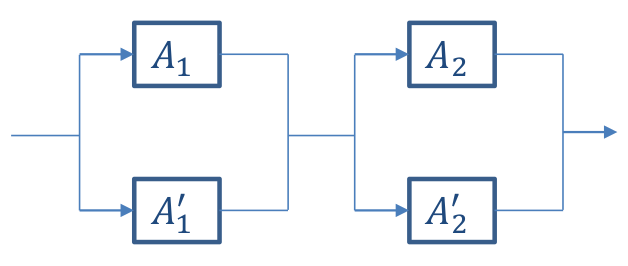

        - vyslednou hodnotu testujem oproti nasi zvolene kriticke hranici `t`
        - pokud nekolikrat opakujeme a pocitame vysledky
            - defakto monte carlo simulace

- spolehlivy SW
    - metriky (pokrity kodu testatma, pocet radku na metodu, cyklomaticka slozitost, ...)
        - 100% pokryti testy != 100% spolehlivost
        - doszeni metriky normy nerika nic o spolehlivosti (lide se prilis zameruji na dany standard a ne na to proc se to takhle ma delat)
    - metodiky praci (RUP, SCRUM, ...)
    - formalni metody dokazovani spravnosti (temporalni logika)
        - lze jen na urcite druhy programu (napr na MS Word to neumime)
    - code review zkusenymi programatory